# 1.Web基础

## 1.1.服务器和客户端的概念


### 客户端的作用

与用户进行交互，用于接收用户的输入(操作)、展示服务器端的数据以及向服务器传递数据

### 常见的客户端

* PC端网页


* 移动端


* Iot设备


### 服务器的作用

与客户端进行交互，接收客户端的数据、处理具体的业务逻辑、传递给客户端其需要的数据

### 服务器的概念

“服务器”是一个非常宽泛的概念，**从硬件而言:**服务器是计算机的一种，它比普通计算机运行更快、负载更高、价格更贵。服务器在网络中为其它客户机（如PC机、智能手机、ATM等终端甚至是火车系统等大型设备）提供计算或者应用服务。**从软件而言:**服务器其实就是安装在计算机上的一个软件，根据其作用的不同又可以分为各种不同的服务器，例如应用服务器、数据库服务器、Redis服务器、DNS服务器、ftp服务器等等

**综上所述:**用我们自己的话来总结的话，服务器其实就是一台(或者一个集群)安装了服务器软件的高性能计算机

### 常见的服务器硬件设备

* 刀片服务器


* 塔式服务器


* 机房


### 常见的服务器操作系统

服务器是一台计算机，它必须安装操作系统之后才能够安装使用服务器软件

* Linux系统: 使用最多的服务器系统，安全稳定、性能强劲、开源免费（或少许费用）。


* Unix系统: 和硬件服务器捆绑销售，版权不公开，用法和Linux一样。

* Windows Server系统: 源代码不开放，费用高昂，漏洞较多，性能较差，运维成本高。

### 常见的服务器软件

硬件服务器装好系统，就可以安装应用软件了，像我们熟知的Tomcat、MySQL、Redis、FastDFS、ElasticSearch等等都是服务器应用软件。它们分别提供自己特定的服务器功能。如果一台服务器上安装了Tomcat，我们会就会把这台服务器叫做Tomcat服务器；如果装了MySQL，就叫做MySQL服务器。很显然，开发过程中需要很多这样的服务器。

### 虚拟机服务器

* VMWare虚拟机

通常来说VMWare用于开发人员在本地电脑上搭建一个模拟的服务器环境，或自己装一些东西测试，不是团队共同使用的正式环境。


* 弹性云服务器

使用弹性云服务器最大的好处就是弹性伸缩。什么是弹性伸缩呢？我现在的服务器是20G内存，因为访问量暴涨我需要把内存扩容到80G，要是物理的硬件服务器就需要买来新的内存条插入主板上的内存插槽。而弹性云服务器只需要改一下内存容量的参数就行了，非常方便。等访问量下降了，再把内存容量调回来就可以，不仅方便，而且可以精准的在访问高峰期提高服务器配置而不是一直维持高配，节约成本。


## 1.2.服务器端应用程序

服务器端应用程序就是运行在应用服务器软件上，用于处理具体业务功能的一个应用程序，而我们学习JavaEE开发的目的就是编写服务器端应用程序。例如: 淘宝、滴滴、京东等等项目都是服务器端应用程序


## 1.3.业务

业务就是服务器应用程序中的各个功能，例如商城里面的: 注册、登录、添加购物车、提交订单、结算订单等等都称之为业务

## 1.4.请求和响应

### 请求

请求是从客户端发送给服务器，主要用于将客户端的数据传递给服务器

### 响应

响应是从服务器发送给客户端，主要用于将服务器的数据传递给客户端


## 1.5.项目的逻辑构成

### 请求响应对

请求响应对是构成项目的最基本的逻辑单元，一个项目是由非常非常多的请求响应对构成的

```
举例：点超链接跳转到注册页面
```

### 功能:  一个功能包含多个请求响应对

```
举例：注册用户功能

请求1：点超链接跳转到注册页面
请求2：发送请求获取短信验证码
请求3：检查用户名是否可用
请求4：提交表单完成注册
```

### 模块：一个模块包含很多功能

```
举例：用户信息管理模块

功能1：用户注册功能
功能2：用户登录功能
功能3：个人中心——账户安全功能
功能4：个人中心——账户绑定功能
功能5：个人中心——收货地址功能
功能6：个人中心——我的银行卡功能
```

### 子系统

根据项目规模的不同，子系统这层逻辑概念可能有也可能没有。如果设置了子系统，那么子系统中也必然包含很多模块。其实庞大项目的子系统已经相当于一个项目了，甚至比小型项目整个都大。

```
举例：认证中心子系统

模块1：用户信息管理模块
模块2：权限管理模块
模块3：授权管理模块
模块4：权限检查模块
```

### 项目

为了解决现实生活中的实际问题开发一个项目，这个项目就是为这个需求提供的一整套解决方案。

```
举例：电商项目

子系统1：认证中心子系统
子系统2：商品管理子系统
子系统3：购物车子系统
子系统4：仓储子系统
子系统5：物流子系统
子系统6：订单子系统
```


## 1.6.架构

### 架构的概念

**『架构』其实就是项目的『结构』**。只不过『结构』这个词太小了，不适合用来描述项目这么大的东西，所以换了另一个更大的词：架构。所以当我们聊一个项目的架构时，我们聊的是项目是由哪些部分组成的、每部分的作用、以及各个部分之间是怎么联系(通讯)、以及这些部分是怎么功能组成一个系统(项目)

### 架构的演进过程（了解）

#### 单一应用架构（all  in one）

当网站流量很小时，只需一个应用，将所有功能都部署在一起，以减少部署节点和成本。此时，用于简化增删改查工作量的数据访问框架(ORM)是关键。我们现在的JavaWeb阶段、SSM阶段都是学习单一架构开发技术。


* 架构优点：

  架构简单，前期开发成本低、开发周期短，适合小型项目（OA、CRM、ERP 企业内部应用）。

* 架构缺点：

  全部功能集成在一个工程中

  （1）业务代码耦合度高，不易维护。

  （2）维护成本高，不易拓展

  （3）并发量大，不易解决

  （4）技术栈受限，只能使用一种语言开发。

#### 垂直架构

当访问量逐渐增大，单一应用增加机器带来的加速度越来越小，将应用拆成互不相干的几个应用，以提升效率。此时，用于加速前端页面开发的Web框架(MVC)是关键。


- 架构优点：

  （1）业务代码相对解耦

  （2）维护成本相对易于拓展（修改一个功能，可以直接修改一个项目，单独部署）

  （3）并发量大相对易于解决（搭建集群）

  （4）技术栈可扩展（不同的系统可以用不同的编程语言编写）。

- 架构缺点：

  功能集中在一个项目中，不利于开发、扩展、维护。粒度不够细

  代码之间存在数据、方法的冗余

#### 分布式架构

当垂直应用越来越多，应用之间交互不可避免，将核心业务抽取出来，作为独立的服务，逐渐形成稳定的服务中心，使前端应用能更快速的响应多变的市场需求。此时，用于提高业务复用及整合的分布式服务框架(RPC)是关键。


- 架构优点：

  （1）业务代码完全解耦，并可实现通用

  （2）维护成本易于拓展（修改一个功能，可以直接修改一个项目，单独部署）

  （3）并发量大易于解决（搭建集群）

  （4）技术栈完全扩展（不同的系统可以用不同的编程语言编写）。

- 架构缺点：

  缺少统一管理资源调度的框架

#### 流动计算架构（SOA）

服务越来越多，容量的评估，小服务资源的浪费等问题逐渐显现，此时需增加一个调度中心基于访问压力实时管理集群容量，提高集群利用率。此时，用于提高机器利用率的资源调度和治理中心(SOA)是关键。


资源调度和治理中心的框架：dubbo、spring cloud

- 架构优点：

  （1）业务代码完全解耦，并可实现通用

  （2）维护成本易于拓展（修改一个功能，可以直接修改一个项目，单独部署）

  （3）并发量大易于解决（搭建集群）

  （4）技术栈完全扩展（不同的系统可以用不同的编程语言编写）。

    ( 5 ) 框架实现了服务治理，不去担心集群的使用情况(失败会尝试其它服务....)

### 单一架构中的技术体系

- 视图：用户的操作界面+数据的动态显示
  - 前端技术：HTML/CSS/JavaScript/vue
  - 异步交互：Ajax
  - 服务器端页面模板技术：Thymeleaf
- 控制层：处理请求+跳转页面
  - 服务器：Tomcat
  - 控制器：Servlet
  - 域对象：request、session、servletContext
  - 过滤器：Filter
  - 监听器：Listener
- 业务逻辑层：业务逻辑计算
- 持久化层：操作数据库


# 2.HTML超文本标记语言

## 2.1.HTML概念

HTML是<span style="color:blue;font-weight:bold;">H</span>yper <span style="color:blue;font-weight:bold;">T</span>ext <span style="color:blue;font-weight:bold;">M</span>arkup <span style="color:blue;font-weight:bold;">L</span>anguage的缩写。意思是<span style="color:blue;font-weight:bold;">『超文本标记语言』</span>。它的作用是搭建网页结构，在网页上展示内容

### 超文本

HTML文件本质上是文本文件，而普通的文本文件只能显示字符。但是HTML技术则通过HTML标签把其他网页、图片、音频、视频等各种多媒体资源引入到当前网页中，让网页有了非常丰富的呈现方式，这就是超文本的含义——本身是文本，但是呈现出来的最终效果超越了文本。

### 标记语言

说HTML是一种『标记语言』是因为它不是向Java这样的『编程语言』，因为它是由一系列『标签』组成的，没有常量、变量、流程控制、异常处理、IO等等这些功能。HTML很简单，每个标签都有它固定的含义和确定的页面显示效果。

标签是通过一组尖括号+标签名的方式来定义的：

```html
<p>HTML is a very popular fore-end technology.</p>
```

这个例子中使用了一个p标签来定义一个段落，&lt;p&gt;叫<span style="color:blue;font-weight:bold;">『开始标签』</span>，&lt;/p&gt;叫<span style="color:blue;font-weight:bold;">『结束标签』</span>。开始标签和结束标签一起构成了一个完整的标签。开始标签和结束标签之间的部分叫<span style="color:blue;font-weight:bold;">『文本标签体』</span>，也简称<span style="color:blue;font-weight:bold;">『标签体』</span>。

有的时候标签里还带有<span style="color:blue;font-weight:bold;">『属性』</span>：

```html
<a href="http://www.xxx.com">show detail</a>
```

href="http://www.xxx.com"就是属性，href是<span style="color:blue;font-weight:bold;">『属性名』</span>，"http://www.xxx.com"是<span style="color:blue;font-weight:bold;">『属性值』</span>。

还有一种标签是<span style="color:blue;font-weight:bold;">『单标签』</span>：

```html
<input type="text" name="username" />
```

## 2.2.HTML的入门程序

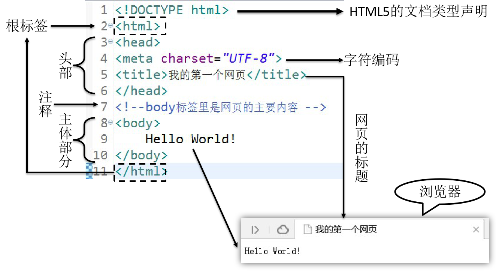

## 2.3.HTML的结构

1. **文档声明:** HTML文件中第一行的内容，用来告诉浏览器当前HTML文档的基本信息，其中最重要的就是当前HTML文档遵循的语法标准。这里我们只需要知道HTML有4和5这两个大的版本，HTML4版本的文档类型声明是：

   ```html
   <!DOCTYPE HTML PUBLIC "-//W3C//DTD HTML 4.01 Transitional//EN"
   "http://www.w3.org/TR/html4/loose.dtd">
   ```

   HTML5版本的文档类型声明是：

   ```html
   <!DOCTYPE html>
   ```

   现在主流的技术选型都是使用HTML5，之前的版本基本不用了。

2. **根标签:**html标签是整个文档的根标签，所有其他标签都必须放在html标签里面。

3. **头部:**head标签用于定义文档的头部，其他头部元素都放在head标签里。头部元素包括title标签、script标签、style标签、link标签、meta标签等等。

4. **主体:**body标签定义网页的主体内容，在浏览器窗口内显示的内容都定义到body标签内。

5. **注释:**HTML注释的写法是：

   ```html
   <!-- 注释内容 -->
   ```

   注释的内容不会显示到浏览器窗口内，是开发人员用来对代码内容进行解释说明。

## 2.4 HTML语法规则

- 根标签有且只能有一个，即\<html><\html>
- 无论是双标签还是单标签都必须正确闭合
- 标签可以嵌套但不能交叉嵌套
- 注释不能嵌套
- 属性必须有值，值必须加引号，单引号或双引号均可
- 标签名不区分大小写但建议使用小写

## 2.5.HTML的各个标签的使用

### 标题标签

**示例如下：**

```html
<!DOCTYPE html>
<html lang="en">
<head>
    <meta charset="UTF-8">
    <title>Title</title>
</head>
<body>

    <h1>这是一级标题</h1>
    <h2>这是二级标题</h2>
    <h3>这是三级标题</h3>
    <h4>这是四级标题</h4>
    <h5>这是五级标题</h5>
    <h6>这是六级标题</h6>

</body>
</html>
```

**页面效果**


### 段落标签

**示例如下：**

```html
<p>There is clearly a need for CSS to be taken seriously by graphic artists. The Zen Garden aims to excite, inspire, and encourage participation. To begin, view some of the existing designs in the list. Clicking on any one will load the style sheet into this very page. The code remains the same, the only thing that has changed is the external .css file. Yes, really.</p>
```

**页面效果**


### 换行标签

**示例如下：**

```html
We would like to see as much CSS1 as possible. CSS2 should be limited to widely-supported elements only. The css Zen Garden is about functional, practical CSS and not the latest bleeding-edge tricks viewable by 2% of the browsing public. <br/>The only real requirement we have is that your CSS validates.
```


### 无序列表标签

**示例如下：**

```html
<ul>
    <li>Apple</li>
    <li>Banana</li>
    <li>Grape</li>
</ul>
```

**页面效果**


### 超链接标签(重要)

**示例如下：**

```html
<body>
    <!--
        超链接标签a的作用: 进行资源跳转
            href: 你要跳转到的资源的路径
            target: 新页面的打开方式
    -->
    <!--
        1. 跳转到本项目的资源: 使用相对路径
            相对路径: 以当前路径作为基准，如果资源跟我说同一个目录下的则直接写资源名就行了
                    如果在不同目录下，要找上一级目录，则使用../

                    . 当前目录
                    .. 上一级目录
        2. 跳转到其它服务器的资源: 此时就要使用完整的url访问路径
    -->
    <a href="../01_html的入门/start.html">跳转到start.html页面</a><br/>

    <!--
        target属性表示新页面的打开方式，我们目前只需要掌握两种取值:
            _self 表示新页面在当前页面打开
            _blank 表示新页面会新打开一个标签页
    -->
    <a href="https://www.baidu.com" target="_blank">跳转到百度</a>
</body>
```

点击后跳转到href属性指定的页面

### 图片标签(重点)

**准备图片文件**


**代码如下：**

```html
<!--
img标签是用于显示图片的，它有如下属性
1. src: 用于指定要显示的图片的路径，建议使用相对路径
项目中的图片一般存放在一个img的文件夹中
2. width: 图片的宽度
3. height: 图片的高度
-->

```

**页面效果**


### 块标签(重点)

<span style="color:blue;font-weight:bold;">『块』</span>并不是为了显示文章内容的，而是为了方便结合CSS对页面进行布局。块有两种，div是前后有换行的块，span是前后没有换行的块。

把下面代码粘贴到HTML文件中查看他们的区别：

```html
<div style="border: 1px solid black;width: 100px;height: 100px;">This is a div block</div>
<div style="border: 1px solid black;width: 100px;height: 100px;">This is a div block</div>

<span style="border: 1px solid black;width: 100px;height: 100px;">This is a span block</span>
<span style="border: 1px solid black;width: 100px;height: 100px;">This is a span block</span>
```


### HTML实体(了解)

在HTML文件中，&lt;、&gt;等等这样的符号已经被赋予了特定含义，不会作为符号本身显示到页面上，此时如果我们想使用符号本身怎么办呢？那就是使用HTML实体来转义。


### 小结

| 标签名称 | 功能                   |
| -------- | ---------------------- |
| h1~h6    | 1级标题~6级标题        |
| p        | 段落                   |
| a        | 超链接                 |
|          | 换行                   |
| ul/li    | 无序列表               |
| img      | 图片                   |
| div      | 定义一个前后有换行的块 |
| span     | 定义一个前后无换行的块 |

## 2.6.路径介绍

在我们整个Web开发技术体系中，『路径』是一个贯穿始终的重要概念。凡是需要获取另外一个资源的时候都需要用到路径。要想理解路径这个概念，我们首先要认识一个概念：『文件系统』。

### 文件系统

我们写代码的时候通常都是在Windows系统来操作，而一个项目开发完成后想要让所有人都能够访问到就必须『部署』到服务器上，也叫『发布』。而服务器通常是Linux系统。

Windows系统和Linux系统的文件系统有很大差别，为了让我们编写的代码不会因为从Windows系统部署到了Linux系统而出现故障，实际开发时不允许使用<span style="color:blue;font-weight:bold;">物理路径</span>。

```
物理路径举例：

D:\aaa\pro01-HTML\page01-article-tag.html

D:\aaa\pro01-HTML\page02-anchor-target.html
```

幸运的是不管是Windows系统还是Linux系统环境下，目录结构都是<span style="color:blue;font-weight:bold;">树形结构</span>，编写路径的规则是一样的。


所以我们<span style="color:blue;font-weight:bold;">以项目的树形目录结构为依据</span>来编写路径就不用担心操作系统平台发生变化之后路径错误的问题了。有了这个大前提，我们具体编写路径时有两种具体写法：

- 相对路径
- 绝对路径（建议使用）

### 相对路径

<span style="color:blue;font-weight:bold;">相对路径都是以<span style="color:red;font-weight:bold;">『当前位置』</span>为基准</span>来编写的。假设我们现在正在浏览a页面，想在a页面内通过超链接跳转到z页面。


那么按照相对路径的规则，我们现在所在的位置是a.html所在的b目录：


z.html并不在b目录下，所以我们要从b目录出发，向上走，进入b的父目录——c目录：


c目录还是不行，继续向上走，进入c的父目录——d目录：


在从d目录向下经过两级子目录——e目录、f目录才能找到z.html：


所以整个路径的写法是：

```html
<a href="../../../e/f/z.html">To z.html</a>
```

可以看到使用相对路径有可能会很繁琐，而且在后面我们结合了在服务器上运行的Java程序后，相对路径的基准是有可能发生变化的，所以<span style="color:blue;font-weight:bold;">不建议使用相对路径</span>。

### 绝对路径

1. 通过IDEA服务器打开HTML文件


2. 服务器访问地址的组成


3. 绝对路径写法

绝对路径要求必须是以<span style="color:blue;font-weight:bold;">『正斜线』</span>开头。这个开头的正斜线在整个服务器访问地址中对应的位置如下图所示：


这里标注出的这个位置代表的是<span style="color:blue;font-weight:bold;">『服务器根目录』</span>，从这里开始我们就是在服务器的内部查找一个具体的Web应用。

所以我们编写绝对路径时就从这个位置开始，<span style="color:blue;font-weight:bold;">按照目录结构找到目标文件</span>即可。拿前面相对路径中的例子来说，我们想在a.html页面中通过超链接访问z.html。此时路径从正斜线开始，和a.html自身所在位置没有任何关系：


```html
<a href="/d/e/f/z.html">To z.html</a>
```

**具体例子:**


```html
<a href="/aaa/pro01-HTML/animal/cat/miao.html">Cat Page</a>
```

### 小结

==强烈建议使用绝对路径；==

## 2.7.使用表格标签展示数据(重要)

### 目标页面效果


### 第一版代码

```html
<!-- 使用table标签定义表格 -->
<table>
    <!-- 使用tr标签定义表格的行 -->
    <tr>
        <!-- 使用th标签定义表头，表头有字体加粗效果 -->
        <th>姓名</th>
        <th>属性</th>
        <th>级别</th>
        <th>忍村</th>
    </tr>
    <tr>
        <!-- 使用td标签定义单元格 -->
        <td>漩涡鸣人</td>
        <td>风</td>
        <td>下忍</td>
        <td>木叶</td>
    </tr>
    <tr>
        <td>宇智波佐助</td>
        <td>雷&火</td>
        <td>下忍</td>
        <td>木叶</td>
    </tr>
    <tr>
        <td>我爱罗</td>
        <td>沙</td>
        <td>影</td>
        <td>砂隐村</td>
    </tr>
</table>
```

如果只有上面的代码，页面显示效果是：


没有表格边框。想要显示好看的表格边框可以把下面的style标签代码复制粘贴到head标签里,CSS还没讲，不必在意语法细节，整体照搬即可。

```html
<style type="text/css">
    table,th,td {
        border-collapse: collapse;
        border: 1px solid black;
        padding: 5px;
    }
</style>
```


我们发现，相较于目标效果而言，还未实现横纵向合并单元格

### 横向合并单元格(列合并)

使用colspan属性将两个横向相邻的单元格跨列合并：

```html
<tr>
    <td>宇智波佐助</td>
    <td>雷&火</td>
    <td colspan="2">下忍</td>
</tr>
```


注意: <span style="color:blue;font-weight:bold;">『被合并』</span>的单元格要删掉。

### 纵向合并单元格(行合并)

使用rowspan属性将两个纵向相邻的单元格跨行合并：

```html
<tr>
    <td>宇智波佐助</td>
    <td rowspan="2">雷&火</td>
    <td colspan="2">下忍</td>
</tr>
<tr>
    <td>我爱罗</td>
    <td>影</td>
    <td>砂隐村</td>
</tr>
```


注意: <span style="color:blue;font-weight:bold;">『被合并』</span>的单元格要删掉。

## 2.8.表单标签(最重要)

### 表单标签的作用

在项目开发过程中，凡是需要用户填写的信息都需要用到表单。它的作用是接收用户的输入信息，并且将用户输入的信息提交给服务器

### form标签的介绍

在HTML中我们使用form标签来定义一个表单。而对于form标签来说有两个最重要的属性：action和method。

```html
<form action="/aaa/pro01-HTML/page05-form-target.html" method="post">
    
</form>
```

#### action属性

用户在表单里填写的信息需要发送到服务器端，对于Java项目来说就是交给Java代码来处理。那么在页面上我们就必须正确填写服务器端的能够接收表单数据的地址。

这个地址要写在form标签的action属性中。但是现在暂时我们还没有服务器端环境，所以先借用一个HTML页面来当作服务器端地址使用。

#### method属性

『method』这个单词的意思是『方式、方法』，在form标签中method属性用来定义提交表单的<span style="color:blue;font-weight:bold;">『请求方式』</span>。method属性只有两个可选值：get或post，没有极特殊情况的话使用post即可。

**什么是<span style="color:blue;font-weight:bold;">『请求方式』</span>？**

浏览器和服务器之间在互相通信时有大量的<span style="color:blue;font-weight:bold;">『数据』</span>需要传输。但是不论是浏览器还是服务器都有很多不同厂商提供的不同产品。

常见的浏览器有：

- Chrome
- Firefox
- Safari
- Opera
- Edge

常见的Java服务器有：

- Tomcat
- Weblogic
- WebSphere
- Glassfish
- Jetty

这么多不同厂商各自开发的应用程序怎么能保证它们彼此之间传输的<span style="color:blue;font-weight:bold;">『数据』</span>能够被对方正确理解呢？

很简单，我们给这些数据设定<span style="color:blue;font-weight:bold;">『格式』</span>，发送端按照格式发送数据，接收端按照格式解析数据，这样就能够实现数据的<span style="color:blue;font-weight:bold;">『跨平台传输』</span>了。

而这里定义的<span style="color:blue;font-weight:bold;">『数据格式』</span>就是应用程序之间的<span style="color:blue;font-weight:bold;">『通信协议』</span>。

在JavaSE阶段的网络编程章节我们接触过TCP/IP、UDP这样的协议，而我们现在使用的<span style="color:blue;font-weight:bold;">『HTTP协议』</span>的底层就是TCP/IP协议。

HTTP1.1中共定义了八种请求方式：

- ==GET==
- ==POST==
- PUT
- DELETE
- HEAD
- CONNECT
- OPTIONS
- TRACE

但是在HTML标签中，点击超链接是GET方式的请求，提交一个表单可以通过form标签的method属性指定GET或POST请求，其他请求方式无法通过HTML标签实现。除了GET、POST之外的其他请求方式暂时我们不需要涉及（到我们学习SpringMVC时会用到PUT和DELETE）。至于<span style="color:blue;font-weight:bold;">GET请求和POST请求的区别</span>我们会在讲HTTP协议的时候详细介绍，现在大家可以从表面现象来观察一下。

### 表单项标签

表单中的每一项，包括: 文本框、密码框、单选框、多选框等等，都称之为表单项，一个表单中可以包含多个表单项

#### name和value属性

在用户使用一个软件系统时，需要一次性提交很多数据是非常正常的现象。我们肯定不能要求用户一个数据一个数据的提交，而肯定是所有数据填好后一起提交。那就带来一个问题，服务器怎么从众多数据中识别出来收货人、所在地区、详细地址、手机号码……？

很简单，<span style="color:blue;font-weight:bold;">给每个数据都起一个『名字』</span>，发送数据时用<span style="color:blue;font-weight:bold;">『名字』</span>携带对应的数据，接收数据时通过<span style="color:blue;font-weight:bold;">『名字』</span>获取对应的数据。

在各个具体的表单标签中，我们通过<span style="color:blue;font-weight:bold;">『name属性』</span>来给数据起<span style="color:blue;font-weight:bold;">『名字』</span>，通过<span style="color:blue;font-weight:bold;">『value属性』</span>来保存要发送给服务器的<span style="color:blue;font-weight:bold;">『值』</span>。

但是名字和值之间既有可能是<span style="color:blue;font-weight:bold;">『一个名字对应一个值』</span>，也有可能是<span style="color:blue;font-weight:bold;">『一个名字对应多个值』</span>。

这么看来这样的关系很像我们Java中的Map，而事实上在服务器端就是使用Map类型来接收请求参数的。具体的是类型是：<span style="color:blue;font-weight:bold;">Map<String,String[]></span>。

name属性就是Map的键，value属性就是Map的值。

有了上面介绍的基础知识，下面我们就可以来看具体的表单项标签了。

**表单简述如下：**

表单项的 name 属性，就是该表单项的数据的名字，如果一个表单项它的数据需要传输给服务器，那么它就一定要有 name 属性；

表单的 value 属性: 如果表单是输入框，那么它输入的数据就是 value ,如果是单选或多选框就要手动设置 value ，如果是按钮那么 value 就是按钮上的文字；

总共有三种表单项:

- input 输入项, 根据它的 type 属性的不同，我们可以分为不同的输入项

  - text 表示文本框，这也是input的默认type
  - password 表示密码框
  - radio 表示单选框，要求同一组单选框的 name 属性值相同，它还有一个 checked 属性，表示默认选中
  - checkbox 表示多选框，要求同一组多选框的 name 属性相同，它也有 checked 属性，表示默认选中
  - button 就表示普通按钮  不具备任何功能要结合后续学习的 JavaScript 一起使用

  - submit 就表示提交按钮，点击就能将表单提交给服务器

  - reset 就表示重置按钮，点击就能够重置表单

  - hidden 就表示隐藏域, 向服务器提交数据但是不在页面上显示出来

- select 下拉框,它里面的每一个 option 标签就是一个选项
- textarea 文本域

#### 单行文本框

**代码**

```html
个性签名：<input type="text" name="signal"/><br/>
```

**显示效果**


#### 密码框

**代码**

```html
密码：<input type="password" name="secret"/><br/>
```

**显示效果**


#### 单选框

**代码**

```html
你最喜欢的季节是：
<input type="radio" name="season" value="spring" />春天
<input type="radio" name="season" value="summer" checked="checked" />夏天
<input type="radio" name="season" value="autumn" />秋天
<input type="radio" name="season" value="winter" />冬天

<br/><br/>

你最喜欢的动物是：
<input type="radio" name="animal" value="tiger" />路虎
<input type="radio" name="animal" value="horse" checked="checked" />宝马
<input type="radio" name="animal" value="cheetah" />捷豹
```

**显示效果**


**说明:**

- name属性相同的radio为一组，组内互斥
- 当用户选择了一个radio并提交表单，这个radio的name属性和value属性组成一个键值对发送给服务器
- 设置checked="checked"属性设置默认被选中的radio

#### 多选框

**代码**

```html
你最喜欢的球队是：
<input type="checkbox" name="team" value="Brazil"/>巴西
<input type="checkbox" name="team" value="German" checked="checked"/>德国
<input type="checkbox" name="team" value="France"/>法国
<input type="checkbox" name="team" value="China" checked="checked"/>中国
<input type="checkbox" name="team" value="Italian"/>意大利
```

**显示效果**


#### 下拉框

**代码**

```html
你喜欢的运动是：
<select name="interesting">
    <option value="swimming">游泳</option>
    <option value="running">跑步</option>
    <option value="shooting" selected="selected">射击</option>
    <option value="skating">溜冰</option>
</select>
```

**显示效果**


**说明:**

- 下拉列表用到了两种标签，其中select标签用来定义下拉列表，而option标签设置列表项。
- name属性在select标签中设置。
- value属性在option标签中设置。
- option标签的标签体是显示出来给用户看的，提交到服务器的是value属性的值。
- 通过在option标签中设置selected="selected"属性实现默认选中的效果。

#### 按钮

**代码**

```html
<input type="button" value="普通按钮"><br>
<button type="button">普通按钮</button><br>
<input type="reset" value="重置按钮"><br>
<button type="reset">重置按钮</button><br>
<input type="submit" value="提交按钮"><br>
<button type="submit">提交按钮</button>
```

**显示效果**


**说明:**

* 普通按钮: 点击后无效果，需要通过JavaScript绑定单击响应函数
* 重置按钮: 点击后将表单内的所有表单项都恢复为默认值  
* 提交按钮: 点击后提交表单

#### 隐藏域

**代码**

```html
<input type="hidden" name="userId" value="2233"/>
```

**说明:**

通过表单隐藏域设置的表单项不会显示到页面上，用户看不到。但是提交表单时会一起被提交。用来设置一些需要和表单一起提交但是不希望用户看到的数据，例如：用户id等等。

#### 多行文本框

**代码**

```html
自我介绍：<textarea name="desc"></textarea>
```

**显示效果**


**说明:**

textarea没有value属性，如果要设置默认值需要写在开始和结束标签之间。

# 3.CSS（了解）

## 3.1.CSS的作用

CSS是用于设置HTML页面标签的样式，用于美化HTML页面

## 3.2.CSS的引入方式

### 行内样式

也就是在要设置样式的标签中添加style属性，编写css样式; 行内样式仅对当前标签生效

```html
<!--给div设置边框-->
<div style="border: 1px solid black;width: 100px; height: 100px;">&nbsp;</div>
```

### 内部样式

一般是在当前页面的head标签中添加style标签，在style标签中编写css样式代码; 内部样式仅对当前页面生效

```html
<head>
    <meta charset="UTF-8">
    <title>Title</title>
    <style type="text/css">
        .one {
            border: 1px solid black;
            width: 100px;
            height: 100px;
            background-color: lightgreen;
            margin-top: 5px;
        }
    </style>
</head>
<body>

    <div style="border: 1px solid black;width: 100px; height: 100px;">&nbsp;</div>

    <div class="one">&nbsp;</div>
    <div class="one">&nbsp;</div>
    <div class="one">&nbsp;</div>

</body>
```


### 外部样式

1. 创建CSS文件

   

2. 编辑CSS文件

   ```css
   .two {
       border: 1px solid black;
       width: 100px;
       height: 100px;
       background-color: yellow;
       margin-top: 5px;
   }
   ```

3. 引入外部CSS文件

   在需要使用这个CSS文件的HTML页面的head标签内加入：

   ```html
   <link rel="stylesheet" type="text/css" href="/aaa/pro01-HTML/style/example.css" />
   ```

   于是下面HTML代码的显示效果是:

   ```html
   <div class="two">&nbsp;</div>
   <div class="two">&nbsp;</div>
   <div class="two">&nbsp;</div>
   ```

   

## 3.3.CSS代码语法

- CSS样式由选择器和声明组成，而声明又由属性和值组成。
- 属性和值之间用冒号隔开。
- 多条声明之间用分号隔开。
- 使用/* ... */声明注释


## 3.4.CSS选择器

### 标签选择器

HTML代码

```html
<p>Hello, this is a p tag.</p>
<p>Hello, this is a p tag.</p>
<p>Hello, this is a p tag.</p>
<p>Hello, this is a p tag.</p>
<p>Hello, this is a p tag.</p>
```

CSS代码

```css
p {
    color: blue;
    font-weight: bold;
}
```

页面效果


### id选择器

HTML代码：

```html
    <p>Hello, this is a p tag.</p>
    <p>Hello, this is a p tag.</p>
    <p id="special">Hello, this is a p tag.</p>
    <p>Hello, this is a p tag.</p>
    <p>Hello, this is a p tag.</p>
```

CSS代码：

```css
        #special {
            font-size: 20px;
            background-color: aqua;
        }
```

显示效果


### 类选择器

HTML代码：

```html
    <div class="one">&nbsp;</div>
    <div class="one">&nbsp;</div>
    <div class="one">&nbsp;</div>
```

CSS代码：

```css
        .one {
            border: 1px solid black;
            width: 100px;
            height: 100px;
            background-color: lightgreen;
            margin-top: 5px;
        }
```

显示效果


# 4.JavaScript

## 4.1.JavaScript的起源

在<span style="color:blue;font-weight:bold;">1995</span>年时，由<span style="color:blue;font-weight:bold;">Netscape</span>公司的<span style="color:blue;font-weight:bold;">Brendan Eich</span>，在网景导航者浏览器上首次设计实现而成。 Netscape 在最初将其脚本语言命名为 LiveScript，因为 Netscape 与 Sun 合作，网景公司管理层希望蹭 Java 的热度，因此取名为 JavaScript。

JavaScript 总共分成三部分：ECMAScript (基本语法)、BOM (浏览器对象模型)、DOM (文档对象模型)

## 4.2.JavaScript的特性

### 脚本语言

JavaScript是一种解释型的脚本语言。不同于C、C++、Java等语言先编译后执行,	JavaScript不会产生编译出来的字节码文件，而是在程序的运行过程中对源文件逐行进行解释。

### 基于对象

JavaScript是一种基于对象的脚本语言，它不仅可以创建对象，也能使用现有的对象。但是面向对象的三大特性：『封装』、『继承』、『多态』中，JavaScript能够实现封装，不支持继承但是可以模拟继承，不支持多态，所以它不是一门面向对象的编程语言。

### 弱类型

JavaScript中也有明确的数据类型，但是声明一个变量后它可以接收任何类型的数据，并且会在程序执行过程中根据上下文自动转换类型。

### 事件驱动

JavaScript是一种采用事件驱动的脚本语言，它不需要经过Web服务器就可以对用户的输入做出响应。

### 跨平台性

JavaScript脚本语言不依赖于操作系统，仅需要浏览器的支持。因此一个JavaScript脚本在编写后可以带到任意机器上使用，前提是机器上的浏览器支持JavaScript脚本语言。目前JavaScript已被大多数的浏览器所支持。

## 4.3.入门程序

**功能效果图**


**代码实现**

```html
<!DOCTYPE html>
<html lang="en">
<head>
    <meta charset="UTF-8">
    <title>JS的入门程序</title>
</head>
<body>
    <!-- 在HTML代码中定义一个按钮 -->
    <button type="button" id="helloBtn">SayHello</button>
    <!--
        目标: 点击按钮的时候弹出一个警告框
    -->
    <script type="text/javascript">
        //1. 通过js代码获取到按钮对象
        //document代表当前HTML文档
        var btn = document.getElementById("helloBtn");

        //2. 给获取到的btn对象绑定点击事件
        btn.onclick = function () {
            //弹出警告框
            alert("hello world")
        }
    </script>
</body>
</html>
```

## 4.4.JavaScript的基本语法

### JavaScript的引入方式

#### 内部脚本方式

- JavaScript代码要写在script标签内
- script标签可以写在文档内的任意位置
- 为了能够方便查询或操作HTML标签（元素）script标签可以写在body标签后面

在我们的入门程序中使用的就是内部脚本方式引入的JavaScript

#### 外部脚本方式

在script标签内通过src属性指定外部xxx.js文件的路径即可。但是要注意以下两点：

- 引用外部JavaScript文件的script标签里面不能写JavaScript代码
- 先引入，再使用
- script标签不能写成单标签
  

引入方式如下：

```html
<!DOCTYPE html>
<html lang="en">
<head>
    <meta charset="UTF-8">
    <title>JS的引入方式</title>
    <!--
        建议在head中引入外部的js文件
    -->
    <script src="../js/outer.js"></script>
</head>
<body>

    <!--
        第一种引入方式: 内部引入方式，在HTML文档内部，通过script标签去编写js代码
    -->
    <!--
        第二种引入方式: 外部引入方式，在当前项目中创建一个js文件，然后在需要引入的HTML里面使用script标签引入
        一个script标签要么负责编写内部的js代码，要么负责引入外部的js文件
    -->
    <script type="text/javascript">
        //调用外部js文件中的方法
        showMessage()
        alert("hello world")
    </script>
</body>
</html>
```

### 声明和使用变量

#### JavaScript数据类型

- 基本数据类型

  - 数值型number：JavaScript不区分整数、小数

  - 字符串string：JavaScript不区分字符、字符串；单引号、双引号意思一样。

  - undefined 类型

  - 布尔型boolean：true、false

    在JavaScript中，其他类型和布尔类型的自动转换。

    true：非零的数值，非空字符串，非空对象

    false：零，空字符串，null，undefined 

    ==undefined 例如 **var a;** 即不赋值==

    例如："false"放在if判断中

    ```javascript
    // "false"是一个非空字符串，直接放在if判断中会被当作『真』处理
    if("false"){
    	alert("true");
    }else{
    	alert("false");
    }
    ```

- 引用类型

  - 所有new出来的对象
  - 用[]声明的数组
  - 用{}声明的对象

#### 变量

- 关键字：var，其实ECMAScript6之后建议使用let

- 数据类型：JavaScript变量是弱类型的，可以接收任意类型的数据

- 标识符：严格区分大小写

- 变量使用规则

  - 如果使用了一个没有声明的变量，那么会在运行时报错

    Uncaught ReferenceError: b is not defined

  - 如果声明一个变量没有初始化，那么这个变量的值就是 undefined 类型

  - 所以不仅要声明变量，还要给变量赋初值

### 函数(重点)

#### 内置函数

内置函数就是JavaScript中内置好的函数，我们可以直接使用

* 弹出警告框

```javascript
alert("警告框内容");
```

* 弹出确认框

```javascript
var result = confirm("确定要删除吗？");
if(result) {
    // 执行删除
}
```

* 在控制台打印日志

```javascript
console.log("日志内容");
```


用户点击『确定』返回true，点击『取消』返回false

```javascript
var result = confirm("老板，你真的不加个钟吗？");
<!-- 将结果判断输入到日志中 -->
if(result) {
    console.log("老板点了确定，表示要加钟");
}else{
    console.log("老板点了确定，表示不加钟");
}
```

#### 声明函数

声明函数就是使用者自己定义一个函数，它有两种写法:

写法1：普通函数

```javascript
function sum(a, b) {
    return a+b;
}
```

写法2：匿名函数

```javascript
var total = function() {
    return a+b;
};
```

写法2可以这样解读：声明一个函数，相当于创建了一个『函数对象』，将这个对象的『引用』赋值给变量total。如果不给这个对象赋值，我们可以将其作为匿名函数使用(在后续学习内容中会用到)

==声明函数特点：1、没有返回值类型；2、没有参数；==

#### 调用函数

JavaScript中函数本身就是一种对象，函数名就是这个<span style="color:blue;font-weight:bold;">『对象』</span>的<span style="color:blue;font-weight:bold;">『引用』</span>。而调用函数的格式是：<span style="color:blue;font-weight:bold;">函数引用()</span>。

```javascript
function sum(a, b) {
    return a+b;
}

var result = sum(2, 3);
console.log("result="+result);
```

或：

```javascript
var total = function() {
    return a+b;
}

var totalResult = total(3,6);
console.log("totalResult="+totalResult);
```

==JavaScript 中没有方法（函数）的重载，所以一旦出现同名函数，那么就会覆盖上一个函数；==

### 对象(重点)

JavaScript中没有『类』的概念，对于系统内置的对象可以直接创建使用。

#### 使用new关键字创建对象

```javascript
// 创建对象
var obj01 = new Object();

// 给对象设置属性和属性值
obj01.stuName = "tom";
obj01.stuAge = 20;
obj01.stuSubject = "java";

// 在控制台输出对象
console.log(obj01);
```

#### 使用{}创建对象(常用)

```javascript
// 创建对象
var obj02 = {
    "soldierName":"john",
    "soldierAge":35,
    "soldierWeapon":"gun"
};

// 在控制台输出对象
console.log(obj02);
```

#### 给对象设置函数属性

```javascript
// 创建对象
var obj01 = new Object();

// 给对象设置属性和属性值
obj01.stuName = "tom";
obj01.stuAge = 20;
obj01.stuSubject = "java";

obj01.study = function() {
	console.log(this.stuName + " is studying");
};

// 在控制台输出对象
console.log(obj01);
// 调用函数
obj01.study();
```

或者

```javascript
// 创建对象
var obj02 = {
	"soldierName":"john",
	"soldierAge":35,
	"soldierWeapon":"gun",
	"soldierShoot":function(){
		console.log(this.soldierName + " is using " + this.soldierWeapon);
	}
};

// 在控制台输出对象
console.log(obj02);
// 调用函数
obj02.soldierShoot();
```

#### this关键字

this关键字只有两种情况：

- 在函数外面：this关键字指向window对象（代表当前浏览器窗口）
- 在函数里面：this关键字指向调用函数的对象

```javascript
// 直接打印this
console.log(this);

// 函数中的this
// 1.声明函数
function getName() {
	console.log(this.name);
}

// 2.创建对象
var obj01 = {
	"name":"tom",
	"getName":getName
};
var obj02 = {
	"name":"jerry",
	"getName":getName
};

// 3.调用函数
obj01.getName();
obj02.getName();
```

### 数组(重点)

#### 使用new关键字创建数组

```javascript
// 1.创建数组对象
var arr01 = new Array();

// 2.压入数据
arr01.push("apple");
arr01.push("orange");
arr01.push("banana");
arr01.push("grape");

// 3.遍历数组
for (var i = 0; i < arr01.length; i++) {
	console.log(arr01[i]);
}

// 4.数组元素反序
arr01.reverse();
for (var i = 0; i < arr01.length; i++) {
	console.log(arr01[i]);
}

// 5.数组元素拼接成字符串
var arrStr = arr01.join(",");
console.log(arrStr);

// 6.字符串拆分成数组
var arr02 = arrStr.split(",");
for (var i = 0; i < arr02.length; i++) {
	console.log(arr02[i]);
}

// 7.弹出数组中最后一个元素
var ele = arr01.pop();
console.log(ele);
```

#### 使用[]创建数组(常用)

```javascript
// 8.使用[]创建数组
var arr03 = ["cat","dog","tiger"];
console.log(arr03);
```

### JSON(最重点)

#### JSON格式的用途

在开发中凡是涉及到<span style="color:blue;font-weight:bold;">『跨平台数据传输』</span>，即前后端数据交互，JSON格式一定是首选。

#### JSON格式的说明

- JSON数据两端要么是<span style="color:blue;font-weight:bold;">{}</span>，要么是<span style="color:blue;font-weight:bold;">[]</span>
- <span style="color:blue;font-weight:bold;">{}</span>定义JSON对象
- <span style="color:blue;font-weight:bold;">[]</span>定义JSON数组，即一个数组里放多个 JSON 对象
- JSON对象的格式是：

```json
{key:value,key:value,...,key:value}
```

- JOSN数组的格式是：

```json
[value,value,...,value]
```

- key的类型固定是字符串
- value的类型可以是：
  - 基本数据类型
  - 引用类型：JSON对象或JSON数组

正因为JSON格式中value部分还可以继续使用JSON对象或JSON数组，所以JSON格式是可以<span style="color:blue;font-weight:bold;">『多层嵌套』</span>的，所以JSON格式不论多么复杂的数据类型都可以表达。

```json
//json的格式: {key:value,key:value}
var person1 = {
    "name":"张三疯",
    "age":189,
    "address":"武当山"
}
//其实JSON对于前端而言，就是一个对象
//console.log(person1.name)

var person2 = {
    "name":"张三疯",
    "age":189,
    "address":"武当山",
    "wife":{
        "name":"小花",
        "age":18,
        "address":"武当山下的小村庄"
    }
}
//console.log(person2.wife.name)

var person3 = {
    "name":"张三疯",
    "age":189,
    "address":"武当山",
    "wife":{
        "name":"小花",
        "age":18,
        "address":"武当山下的小村庄"
    },
    "sons":[
        {
            "name":"奥巴马",
            "age":1,
            "address":"武当山"
        },
        {
            "name":"奥拉夫",
            "age":2,
            "address":"少林寺"
        }
    ]
}

//json数组的格式: [{key:value,key:value},{key:value,key:value}]
//var personList = [person1,person2]
```

#### JSON对象和JSON字符串互转

* JSON对象转JSON字符串

```javascript
var jsonObj = {"stuName":"tom","stuAge":20};
var jsonStr = JSON.stringify(jsonObj);

console.log(typeof jsonObj); // object
console.log(typeof jsonStr); // string
```

* JSON字符串转JSON对象

```javascript
jsonObj = JSON.parse(jsonStr);
console.log(jsonObj); // {stuName: "tom", stuAge: 20}
```

## 4.5.JavaScript的DOM(最重点)

### DOM的概念

DOM是<span style="color:blue;font-weight:bold;">D</span>ocument <span style="color:blue;font-weight:bold;">O</span>bject  <span style="color:blue;font-weight:bold;">M</span>odel的缩写，意思是<span style="color:blue;font-weight:bold;">『文档对象模型』</span>——将HTML文档抽象成模型，再封装成对象方便用程序操作。

这是一种非常常用的编程思想：将现实世界的事物抽象成模型，这样就非常容易使用对象来量化的描述现实事物，从而把生活中的问题转化成一个程序问题，最终实现用应用软件协助解决现实问题。而在这其中<span style="color:blue;font-weight:bold;">『模型』</span>就是那个连通现实世界和代码世界的桥梁。

### DOM树的概念

浏览器把HTML文档从服务器上下载下来之后就开始按照<span style="color:blue;font-weight:bold;">『从上到下』</span>的顺序<span style="color:blue;font-weight:bold;">『读取HTML标签』</span>。每一个标签都会被封装成一个<span style="color:blue;font-weight:bold;">『对象』</span>。

而第一个读取到的肯定是根标签html，然后是它的子标签head，再然后是head标签里的子标签……所以从html标签开始，整个文档中的所有标签都会根据它们之间的<span style="color:blue;font-weight:bold;">『父子关系』</span>被放到一个<span style="color:blue;font-weight:bold;">『树形结构』</span>的对象中。


这个包含了所有标签对象的整个树形结构对象就是JavaScript中的一个<span style="color:blue;font-weight:bold;">可以直接使用的内置对象</span>：<span style="color:blue;font-weight:bold;">document</span>。

例如，下面的标签结构：


会被解析为：


### 各个组成部分的类型

整个文档中的一切都可以看做Node（节点）。各个具体组成部分的具体类型可以看做Node类型的子类。

> 其实严格来说，JavaScript并不支持真正意义上的『继承』，这里我们借用Java中的『继承』概念，从逻辑上来帮助我们理解各个类型之间的关系。

| 组成部分         | 节点类型 | 具体类型 |
| ---------------- | -------- | -------- |
| 整个文档         | 文档节点 | Document |
| HTML标签         | 元素节点 | Element  |
| HTML标签内的文本 | 文本节点 | Text     |
| HTML标签内的属性 | 属性节点 | Attr     |
| 注释             | 注释节点 | Comment  |

### 父子关系


### 先辈后代关系


### DOM操作

由于实际开发时基本上都是使用JavaScript的各种框架来操作，而框架中的操作方式和我们现在看到的原生操作完全不同，所以下面罗列的API仅供参考，不做要求。

#### 在整个文档范围内查询元素节点

| 功能               | API                                     | 返回值           |
| ------------------ | --------------------------------------- | ---------------- |
| 根据id值查询       | document.getElementById(“id值”)         | 一个具体的元素节 |
| 根据标签名查询     | document.getElementsByTagName(“标签名”) | 元素节点数组     |
| 根据name属性值查询 | document.getElementsByName(“name值”)    | 元素节点数组     |
| 根据类名查询       | document.getElementsByClassName("类名") | 元素节点数组     |

#### 在具体元素节点范围内查找子标签

| 功能               | API                                                        | 返回值         |
| ------------------ | ---------------------------------------------------------- | -------------- |
| 查找子标签         | element.children                                           | 返回子标签数组 |
| 查找第一个子标签   | element.firstElementChild<br />【W3C考虑换行，IE≤8不考虑】 | 标签对象       |
| 查找最后一个子标签 | element.lastElementChild<br />【W3C考虑换行，IE≤8不考虑】  | 节点对象       |

#### 查找指定元素节点的父标签

| 功能                     | API                   | 返回值   |
| ------------------------ | --------------------- | -------- |
| 查找指定元素节点的父标签 | element.parentElement | 标签对象 |

#### 查找指定元素节点的兄弟标签

| 功能               | API                                                          | 返回值   |
| ------------------ | ------------------------------------------------------------ | -------- |
| 查找前一个兄弟标签 | node.previousElementSibling<br />【W3C考虑换行，IE≤8不考虑】 | 标签对象 |
| 查找后一个兄弟标签 | node.nextElementSibling<br />【W3C考虑换行，IE≤8不考虑】     | 标签对象 |

#### 扩展内容(根据选择器查找标签)

| 功能                   | API                                 | 返回值   |
| ---------------------- | ----------------------------------- | -------- |
| 根据选择器查找一个标签 | document.querySelector("选择器")    | 标签对象 |
| 根据选择器查找多个标签 | document.querySelectorAll("选择器") | 标签数组 |

```html
<!DOCTYPE html>
<html lang="en">
    <head>
        <meta charset="UTF-8">
        <title>DOM查找节点</title>
    </head>
    <body>
        <input type="text" id="username">
        <input type="text" class="c1">
        <input type="text" class="c1">
        <div>
            <div></div>
            <div></div>
        </div>
        <script>
            //根据id查询标签
            var elementById = document.getElementById("username");
            //console.log(elementById)
            //根据类名查询标签
            var elementsByClassName = document.getElementsByClassName("c1");
            //console.log(elementsByClassName)
            //根据标签名查询标签
            var elementsByTagName = document.getElementsByTagName("input");
            //console.log(elementsByTagName)

            //查找子节点: 查找body的所有子标签,要注意文本也属于子节点
            /*var childNodes = document.getElementsByTagName("body")[0].childNodes;
        console.log(childNodes)*/

            //查找子标签: children
            var children = document.getElementsByTagName("body")[0].children;
            //console.log(children)

            //查找id为username的标签的父节点
            var parentNode = document.getElementById("username").parentNode;
            //console.log(parentNode)

            //查找id为username的标签的前一个兄弟标签
            var previousElementSibling = document.getElementById("username").previousElementSibling;
            //console.log(previousElementSibling)

            //查找id为username的标签的后一个兄弟标签
            var nextElementSibling = document.getElementById("username").nextElementSibling;
            //console.log(nextElementSibling)
            
            //根据选择器查找标签:document.querySelector("选择器")根据选择器查找一个标签, document.querySelectorAll("选择器")根据选择器查找多个标签
            //什么是选择器: 用于查找标签的一些表达式，其中最基本的三种选择器是:ID选择器、类选择器、标签选择器
            //选择器参考jQuery的文档
            //查找id为username的标签，使用的是id选择器
            var ipt1 = document.querySelector("#username");

            //console.log(ipt1)
            //查找body内的所有后代div，用的是层级选择器
            var ipts = document.querySelectorAll("body div");

            //查找id为username的标签的后面第一个兄弟
            var i1 = document.querySelector("#username+input");

            //查找id为username的标签的后面的所有兄弟
            var i2 = document.querySelectorAll("#username~input");

            console.log(i2)
        </script>
    </body>
</html>
```

#### 属性操作

| 需求       | 操作方式                   |
| ---------- | -------------------------- |
| 读取属性值 | 元素对象.属性名            |
| 修改属性值 | 元素对象.属性名=新的属性值 |

#### 标签体的操作

| 需求                                         | 操作方式          |
| -------------------------------------------- | ----------------- |
| 获取或者设置标签体的文本内容，并去掉首尾空格 | element.innerText |
| 获取或者设置标签体的内容                     | element.innerHTML |

```html
<!DOCTYPE html>
<html lang="en">
    <head>
        <meta charset="UTF-8">
        <title>操作标签的属性和文本</title>
    </head>
    <body>
        <input type="text" id="username" name="username" />
        <div id="d1">
            <h1>你好世界</h1>
        </div>
        <script>
            //目标: 获取id为username的输入框的value
            //1. 找到要操作的标签
            var ipt = document.getElementById("username");

            //2. 设置标签的value属性值
            ipt.value = "张三"

            //3. 获取标签的value属性的值
            var value = ipt.value;
            console.log(value)

            //获取id为d1的div中的文本内容
            //获取标签的文本: element.innerText,获取文本的时候会将左右两端的空格去掉
            var innerText = document.getElementById("d1").innerText;
            console.log(innerText)

            //获取标签体的内容: element.innerHTML,获取标签体的内容
            var innerHTML = document.getElementById("d1").innerHTML;
            console.log(innerHTML)

            //设置标签体的内容:建议使用innerHTML，如果是使用innerText的话它会将标签当做普通文本处理
            document.getElementById("d1").innerHTML = "<h1>hello world</h1>"
        </script>
    </body>
</html>
```

#### DOM增删改操作

| API                                      | 功能                                       |
| ---------------------------------------- | ------------------------------------------ |
| document.createElement(“标签名”)         | 创建元素节点并返回，但不会自动添加到文档中 |
| document.createTextNode(“文本值”)        | 创建文本节点并返回，但不会自动添加到文档中 |
| element.appendChild(ele)                 | 将ele添加到element所有子节点后面           |
| parentEle.insertBefore(newEle,targetEle) | 将newEle插入到targetEle前面                |
| parentEle.replaceChild(newEle, oldEle)   | 用新节点替换原有的旧子节点                 |
| element.remove()                         | 删除某个标签                               |
| element.innerHTML                        | 读写HTML代码                               |

```html
<!DOCTYPE html>
<html lang="en">
    <head>
        <meta charset="UTF-8">
        <title>创建和删除标签</title>
    </head>
    <body>
        <ul id="city">
            <li id="bj">北京</li>
            <li id="sh">上海</li>
            <li id="sz">深圳</li>
            <li id="gz">广州</li>
        </ul>
        <script>
            //目标1: 在城市列表的最后添加一个子标签 <li id="cs">长沙</li>
            //1. 创建一个li标签  <li></li>
            var liElement = document.createElement("li");
            //2. 给创建的li标签设置id属性和文本 <li id="cs">长沙</li>
            liElement.id = "cs"
            liElement.innerText = "长沙"
            //3. 将创建的li标签添加到城市列表中（ul）
            var cityUl = document.getElementById("city");

            //父.appendChild(子)将子标签添加到父标签的最后面
            //cityUl.appendChild(liElement)

            //目标2:在城市列表的深圳之前添加一个子标签 <li id="cs">长沙</li>
            //获取到深圳这个标签
            var szElement = document.getElementById("sz");
            //父.insertBefore(新标签,参照标签)
            //cityUl.insertBefore(liElement,szElement)

            //目标3: 在城市列表中添加一个子标签替换深圳 <li id="cs">长沙</li>
            //父.replaceChild(新标签,被替换的标签)
            //cityUl.replaceChild(liElement,szElement)

            //目标4: 在城市列表中删除深圳
            //szElement.remove()

            //目标5: 清除城市列表中的所有城市,保留城市列表标签ul
            cityUl.innerHTML = ""
        </script>
    </body>
</html>
```

### JavaScript的事件驱动(很重要)

#### 事件的概念

* HTML 事件是发生在 HTML 元素上的“事情”， 是浏览器或用户做的某些事情
* 事件通常与函数配合使用，这样就可以通过发生的事件来驱动函数执行。

#### 事件驱动中的要素

- 事件源：事件发生在哪？
- 事件类型：用户的交互动作是什么？
- 事件源与事件类型进行绑定，要给谁绑定一个什么事件？
- 绑定之后，当事件触发，我们要指定执行的函数；

#### 常见事件

| 属性        | 此事件发生在何时...                  |
| ----------- | ------------------------------------ |
| onclick     | 当用户点击某个对象时调用的事件句柄。 |
| ondblclick  | 当用户双击某个对象时调用的事件句柄。 |
| onchange    | 域的内容被改变。                     |
| onblur      | 元素失去焦点。                       |
| onfocus     | 元素获得焦点。                       |
| onload      | 一张页面或一幅图像完成加载。         |
| onsubmit    | 确认按钮被点击；表单被提交。         |
| onkeydown   | 某个键盘按键被按下。                 |
| onkeypress  | 某个键盘按键被按住。                 |
| onkeyup     | 某个键盘按键被松开。                 |
| onmousedown | 鼠标按钮被按下。                     |
| onmouseup   | 鼠标按键被松开。                     |
| onmouseout  | 鼠标从某元素移开。                   |
| onmouseover | 鼠标移到某元素之上。                 |
| onmousemove | 鼠标被移动。                         |

#### 事件绑定的方式

##### 普通函数方式

说白了设置标签的属性

```html
<标签 属性="js代码，调用函数"></标签>
```

##### 匿名函数方式

```html
<script>
    标签对象.事件属性 = function(){
        //执行一段代码
    }
</script>
```

#### 事件的使用介绍

+ 点击事件

  需求: 每点击一次按钮 弹出hello...

```js
<input type="button" value="按钮" onclick="fn1()">

    <input type="button" value="另一个按钮" id="btn">
        <script>
        //当点击的时候要调用的函数
        function fn1() {
        alert("我被点击了...")
    }

//给另外一个按钮，绑定点击事件:
//1.先根据id获取标签
let btn = document.getElementById("btn");
//2. 设置btn的onclick属性(绑定事件)
//绑定命名函数
//btn.onclick = fn1

//绑定匿名函数
btn.onclick = function () {
    console.log("点击了另外一个按钮")
}
</script>
```

+ 获得焦点(onfocus)和失去焦点(onblur)

  需求:给输入框设置获得和失去焦点

```js
var ipt = document.getElementById("ipt");

//绑定获取焦点事件
ipt.onfocus = function () {
    console.log("获取焦点了...")
}

//绑定失去焦点事件
ipt.onblur = function () {
    console.log("失去焦点了...")
}
```

+ 内容改变(onchange)

  需求: 给select设置内容改变事件

```javascript
<body>
    <!--内容改变(onchange)-->
    <select onchange="changeCity(this)">
        <option value="bj">北京</option>
        <option value="sh">上海</option>
        <option value="sz">深圳</option>
    </select>

</body>
<script>
    function changeCity(obj) {
        console.log("城市改变了"+obj.value);
    }
</script>
```

+ 键盘相关的, 键盘按下(onkeydown)  键盘抬起(onkeyup)

```java
//给输入框绑定键盘按键按下和抬起事件
ipt.onkeydown = function () {
    //当按键按下的时候，数据并没有到达输入框
    //输出输入框里面的内容
    //console.log(ipt.value)
}

ipt.onkeyup = function () {
    //输出输入框的内容:当键盘按键抬起的时候，数据已经到达了输入框
    console.log(ipt.value)
}
```

+ 鼠标相关的, 鼠标在xx之上(onmouseover ), 鼠标按下(onmousedown),鼠标离开(onmouseout)

````java
//给输入框绑定鼠标移入事件
ipt.onmouseover = function () {
    console.log("鼠标移入了...")
}
//给输入框绑定鼠标移出事件
ipt.onmouseout = function () {
    console.log("鼠标移出了...")
}
````

#### 综合案例

**需求**


**代码实现**

```html
<!DOCTYPE html>
<html lang="en">
    <head>
        <meta charset="UTF-8">
        <title>综合案例</title>
        <style>
            table,tr,td,th{
                border: 1px solid black;
                width: 500px;
                text-align: center;
                margin: auto;
            }

            div{
                text-align: center;
            }
        </style>
    </head>
    <body>
        <table cellspacing="0" id="tb">
            <tr>
                <th>序号</th>
                <th>用户名</th>
                <th>性别</th>
                <th>操作</th>
            </tr>
            <tr>
                <td>1</td>
                <td>张三</td>
                <td>男</td>
                <td>
                    <button onclick="deletePerson(this)">删除</button>
                </td>
            </tr>
            <tr>
                <td>2</td>
                <td>李四</td>
                <td>女</td>
                <td>
                    <button onclick="deletePerson(this)">删除</button>
                </td>
            </tr>
            <tr>
                <td>3</td>
                <td>王五</td>
                <td>男</td>
                <td>
                    <button onclick="deletePerson(this)">删除</button>
                </td>
            </tr>
        </table>
        <div>
            <form action="#">
                序号<input type="text" name="num" id="num"><br/>
                用户<input type="text" name="username" id="username"/><br/>
                性别<input type="text" name="gender" id="gender"/><br/>
                <input type="button" value="添加用户" onclick="addPerson()"/>
            </form>
        </div>
        <script>
            //目标1:点击删除按钮，删除当前行
            //给所有按钮绑定点击事件
            function deletePerson(obj) {
                //此时obj就是你点击的那个按钮
                //我们要删除的就是obj的爷爷
                obj.parentElement.parentElement.remove()
            }

            function addPerson() {
                //添加用户
                //1. 获取序号、用户名、性别
                var numElement = document.getElementById("num");
                var num = numElement.value;

                var usernameElement = document.getElementById("username");
                var username = usernameElement.value;

                var genderElement = document.getElementById("gender");
                var gender = genderElement.value;

                //2. 将获取到的序号、用户名、性别添加到td中，td放到tr中，tr添加到table中
                //2.1 创建一行  <tr></tr>
                var trElement = document.createElement("tr");
                //2.2 往tr中添加标签体内容
                trElement.innerHTML = "<td>"+num+"</td>\n" +
                    "            <td>"+username+"</td>\n" +
                    "            <td>"+gender+"</td>\n" +
                    "            <td>\n" +
                    "                <button onclick=\"deletePerson(this)\">删除</button>\n" +
                    "            </td>"
                //2.3 将tr添加到表格中
                var tb = document.getElementById("tb");
                tb.appendChild(trElement)

                //3. 清空序号、用户名、性别
                numElement.value = ""
                usernameElement.value = ""
                genderElement.value = ""
            }
        </script>
    </body>
</html>
```

# 5.正则表达式

## 5.1.正则表达式的概念

正则表达式是对==字符串==操作的一种逻辑公式，就是用事先定义好的一些特定字符、及这些特定字符的组合，组成一个“规则字符串”，这个“规则字符串”用来表达对字符串的一种过滤逻辑。用我们自己的话来说: **正则表达式用来校验字符串是否满足一定的规则的公式**

## 5.2.正则表达式的用途

所以正则表达式有三个主要用途：

- 模式验证: 检测某个字符串是否符合规则，例如检测手机号、身份证号等等是否符合规范
- 匹配读取:  将目标字符串中满足规则的部分**读取**出来，例如将整段文本中的邮箱地址读取出来
- 匹配替换:  将目标字符串中满足标准的部分**替换**为其他字符串,例如将整段文本中的"hello"替换成"haha"

## 5.3.正则表达式的语法

### 创建正则表达式对象

* 对象形式：`var reg = new RegExp("正则表达式")`当正则表达式中有"/"那么就使用这种
* 直接量形式：`var reg = /正则表达式/`一般使用这种声明方式 

### 正则表达式入门案例

#### 模式验证: 校验字符串中是否包含'o'字母

**注意**：这里是使用**正则表达式对象**来**调用**方法。

```javascript
// 创建一个最简单的正则表达式对象
var reg = /o/;

// 创建一个字符串对象作为目标字符串
var str = 'Hello World!';

// 调用正则表达式对象的test()方法验证目标字符串是否满足我们指定的这个模式，返回结果true
console.log("字符串中是否包含'o'="+reg.test(str));
```

#### 匹配读取: 读取字符串中的所有'o'

```javascript
// 创建一个最简单的正则表达式对象
var reg = /o/;
// 创建一个字符串对象作为目标字符串
var str = 'Hello World!';
// 在目标字符串中查找匹配的字符，返回匹配结果组成的数组
var resultArr = str.match(reg);
// 数组长度为1
console.log("resultArr.length="+resultArr.length);
// 数组内容是o
console.log("resultArr[0]="+resultArr[0]);
```

#### 匹配替换: 将字符串中的第一个'0'替换成'@'

```javascript
// 创建一个最简单的正则表达式对象
var reg = /o/;
// 创建一个字符串对象作为目标字符串
var str = 'Hello World!';
var newStr = str.replace(reg,'@');
// 只有第一个o被替换了，说明我们这个正则表达式只能匹配第一个满足的字符串
console.log("str.replace(reg)="+newStr);//Hell@ World!
// 原字符串并没有变化，只是返回了一个新字符串
console.log("str="+str);//str=Hello World!
```

### 正则表达式的匹配模式

#### 全文查找

如果不使用g对正则表达式对象进行修饰，则使用正则表达式进行查找时，仅返回第一个匹配；使用g后，返回所有匹配。

```javascript
// 目标字符串
var targetStr = 'Hello World!';

// 没有使用全局匹配的正则表达式
var reg = /[A-Z]/;
// 获取全部匹配
var resultArr = targetStr.match(reg);
// 数组长度为1
console.log("resultArr.length="+resultArr.length);

// 遍历数组，发现只能得到'H'
for(var i = 0; i < resultArr.length; i++){
    console.log("resultArr["+i+"]="+resultArr[i]);
}
```

对比代码：

```javascript
// 目标字符串
var targetStr = 'Hello World!';

// 使用了全局匹配的正则表达式
var reg = /[A-Z]/g;
// 获取全部匹配
var resultArr = targetStr.match(reg);
// 数组长度为2
console.log("resultArr.length="+resultArr.length);

// 遍历数组，发现可以获取到“H”和“W”
for(var i = 0; i < resultArr.length; i++){
    console.log("resultArr["+i+"]="+resultArr[i]);
}
```

#### 忽略大小写

```javascript
//目标字符串
var targetStr = 'Hello WORLD!';

//没有使用忽略大小写的正则表达式
var reg = /o/g;
//获取全部匹配
var resultArr = targetStr.match(reg);
//数组长度为1
console.log("resultArr.length="+resultArr.length);
//遍历数组，仅得到'o'
for(var i = 0; i < resultArr.length; i++){
    console.log("resultArr["+i+"]="+resultArr[i]);
}
```

对比代码：

```javascript
//目标字符串
var targetStr = 'Hello WORLD!';

//使用了忽略大小写的正则表达式
var reg = /o/gi;
//获取全部匹配
var resultArr = targetStr.match(reg);
//数组长度为2
console.log("resultArr.length="+resultArr.length);
//遍历数组，得到'o'和'O'
for(var i = 0; i < resultArr.length; i++){
    console.log("resultArr["+i+"]="+resultArr[i]);
}
```

#### 多行查找

不使用多行查找模式，目标字符串中不管有没有换行符都会被当作一行。

```javascript
//目标字符串1
var targetStr01 = 'Hello\nWorld!';
//目标字符串2
var targetStr02 = 'Hello';

//匹配以'Hello'结尾的正则表达式，没有使用多行匹配
var reg = /Hello$/;
console.log(reg.test(targetStr01));//false

console.log(reg.test(targetStr02));//true
```

对比代码：

```javascript
//目标字符串1
var targetStr01 = 'Hello\nWorld!';
//目标字符串2
var targetStr02 = 'Hello';

//匹配以'Hello'结尾的正则表达式，使用了多行匹配
var reg = /Hello$/m;
console.log(reg.test(targetStr01));//true

console.log(reg.test(targetStr02));//true
```

### 元字符

 在正则表达式中被赋予特殊含义的字符，不能被直接当做普通字符使用。如果要匹配元字符本身，需要对元字符进行转义，转义的方式是在元字符前面加上“\”，例如：\^ 

#### 常用的元字符

| 代码 | 说明                                                         |
| ---- | ------------------------------------------------------------ |
| .    | 匹配除换行字符以外的任意字符。                               |
| \w   | 匹配字母或数字或下划线等价于[a-zA-Z0-9_]。                   |
| \W   | 匹配任何非单词字符。                                         |
| \s   | 匹配任意的空白符，包括空格、制表符、换页符等等。等价于[\f\n\r\t\v]。 |
| \S   | 匹配任何非空白字符。等价于。                                 |
| \d   | 匹配数字。等价于[0-9]。                                      |
| \D   | 匹配一个非数字字符。                                         |
| \b   | 匹配单词的开始或结束                                         |
| ^    | 匹配字符串的开始，但在[]中使用表示取反                       |
| $    | 匹配字符串的结束                                             |

#### 例子一

```javascript
var str = 'one two three four';
// 匹配全部空格
var reg = /\s/g;
// 将空格替换为@
var newStr = str.replace(reg,'@'); // one@two@three@four
console.log("newStr="+newStr);
```

#### 例子二

```javascript
var str = '今年是2014年';
// 匹配至少一个数字
var reg = /\d+/g;
str = str.replace(reg,'abcd');
console.log('str='+str); // 今年是abcd年
```

#### 例子三

```javascript
var str01 = 'I love Java';
var str02 = 'Java love me';
// 匹配以Java开头
var reg = /^Java/g;
console.log('reg.test(str01)='+reg.test(str01)); // flase
console.log("<br />");
console.log('reg.test(str02)='+reg.test(str02)); // true
```

#### 例子四

```javascript
var str01 = 'I love Java';
var str02 = 'Java love me';
// 匹配以Java结尾
var reg = /Java$/g;
console.log('reg.test(str01)='+reg.test(str01)); // true
console.log("<br />");
console.log('reg.test(str02)='+reg.test(str02)); // flase
```

### 字符集合

| 语法格式    | 示例                                                         | 说明                                               |
| ----------- | ------------------------------------------------------------ | -------------------------------------------------- |
| [字符列表]  | 正则表达式：[abc] 含义：目标字符串包含abc中的任何一个字符 目标字符串：plain 是否匹配：是 原因：plain中的“a”在列表“abc”中 | 目标字符串中任何一个字符出现在字符列表中就算匹配。 |
| [^字符列表] | [^abc] 含义：目标字符串包含abc以外的任何一个字符 目标字符串：plain 是否匹配：是 原因：plain中包含“p”、“l”、“i”、“n” | 匹配字符列表中未包含的任意字符。                   |
| [字符范围]  | 正则表达式：[a-z] 含义：所有小写英文字符组成的字符列表 正则表达式：[A-Z] 含义：所有大写英文字符组成的字符列表 | 匹配指定范围内的任意字符。                         |

```javascript
var str01 = 'Hello World';
var str02 = 'I am Tom';
//匹配abc中的任何一个
var reg = /[abc]/g;
console.log('reg.test(str01)='+reg.test(str01));//flase
console.log('reg.test(str02)='+reg.test(str02));//true
```

### 出现次数

| 代码  | 说明           |
| ----- | -------------- |
| *     | 出现零次或多次 |
| +     | 出现一次或多次 |
| ?     | 出现零次或一次 |
| {n}   | 出现n次        |
| {n,}  | 出现n次或多次  |
| {n,m} | 出现n到m次     |

```javascript
console.log("/[a]{3}/.test('aa')="+/[a]{3}/g.test('aa')); // flase
console.log("/[a]{3}/.test('aaa')="+/[a]{3}/g.test('aaa')); // true
console.log("/[a]{3}/.test('aaaa')="+/[a]{3}/g.test('aaaa')); // true
```

### 在正则表达式中表达『或者』

使用符号：|

```javascript
// 目标字符串
var str01 = 'Hello World!';
var str02 = 'I love Java';
// 匹配'World'或'Java'
var reg = /World|Java/g;
console.log("str01.match(reg)[0]="+str01.match(reg)[0]);//World
console.log("str02.match(reg)[0]="+str02.match(reg)[0]);//Java
```

## 5.4.常用正则表达式

| 需求     | 正则表达式                                            |
| -------- | ----------------------------------------------------- |
| 用户名   | /^\[a-zA-Z\_][a-zA-Z_\-0-9]{5,9}$/                    |
| 密码     | /^[a-zA-Z0-9_\-\@\#\&\*]{6,12}$/                      |
| 前后空格 | /^\s+\|\s+$/g                                         |
| 电子邮箱 | /^[a-zA-Z0-9_\.-]+@([a-zA-Z0-9-]+[\.]{1})+[a-zA-Z]+$/ |

# 6.Vue框架

## 6.1.什么是框架

任何编程语言在最初的时候都是没有框架的，后来随着在实际开发过程中不断总结<span style="color:blue;font-weight:bold;">『经验』</span>，积累<span style="color:blue;font-weight:bold;">『最佳实践』</span>，慢慢的人们发现很多<span style="color:blue;font-weight:bold;">『特定场景』</span>下的<span style="color:blue;font-weight:bold;">『特定问题』</span>总是可以<span style="color:blue;font-weight:bold;">『套用固定解决方案』</span>。

于是有人把成熟的<span style="color:blue;font-weight:bold;">『固定解决方案』</span>收集起来，整合在一起，就成了<span style="color:blue;font-weight:bold;">『框架』</span>。

在使用框架的过程中，我们往往只需要告诉框架<span style="color:blue;font-weight:bold;">『做什么（声明）』</span>，而不需要关心框架<span style="color:blue;font-weight:bold;">『怎么做（编程）』</span>。

对于Java程序来说，我们使用框架就是导入那些封装了<span style="color:blue;font-weight:bold;">『固定解决方案』</span>的jar包，然后通过<span style="color:blue;font-weight:bold;">『配置文件』</span>告诉框架做什么，就能够大大简化编码，提高开发效率。我们使用过的junit其实就是一款单元测试框架。

而对于JavaScript程序来说，我们使用框架就是导入那些封装了<span style="color:blue;font-weight:bold;">『固定解决方案』</span>的<span style="color:blue;font-weight:bold;">『js文件』</span>，然后在框架的基础上编码。

> 用洗衣服来类比框架：
>
> 典型应用场景：洗衣服
>
> 输入数据：衣服、洗衣液、水
>
> 不使用框架：手洗
>
> 使用框架：使用洗衣机，对人来说，只需要按键，具体操作是洗衣机完成的。人只是告诉洗衣机做什么，具体的操作是洗衣机完成的。

实际开发中使用框架时，我们也主要是告诉框架要做什么，具体操作是框架完成的。

## 6.2.Vue的简介

### Vue的作者介绍

在为AngularJS工作之后，Vue的作者<span style="color:blue;font-weight:bold;">尤雨溪</span>开Vue.js。他声称自己的思路是提取Angular中自己喜欢的部分，构建出一款相当轻量的框架。

Vue最早发布于2014年2月。作者在Hacker News、Echo JS与 Reddit的JavaScript版块发布了最早的版本。一天之内，Vue 就登上了这三个网站的首页。

Vue是Github上最受欢迎的开源项目之一。同时，在JavaScript框架/函数库中， Vue所获得的星标数已超过React，并高于Backbone.js、Angular 2、jQuery等项目。

### Vue的官网介绍

Vue (读音 /vjuː/，类似于**view**) 是一套用于构建用户界面的**渐进式框架**。与其它大型框架不同的是，Vue 被设计为可以自底向上逐层应用。Vue 的核心库只关注视图层，不仅易于上手，还便于与第三方库或既有项目整合。另一方面，当与[现代化的工具链](https://cn.vuejs.org/v2/guide/single-file-components.html)以及各种[支持类库](https://github.com/vuejs/awesome-vue#libraries--plugins)结合使用时，Vue 也完全能够为复杂的单页应用提供驱动。

**官网地址:**https://cn.vuejs.org/

## 6.3.准备Vue.js环境

1. Vue框架的js文件获取

   官网提供的下载地址：https://cn.vuejs.org/v2/guide/installation.html

2. 创建空vue.js文件,将官网提供的vue.js文件的内容复制粘贴到本地vue.js文件中

## 6.4.Vue的入门案例

1. 创建工程,导入vue.js文件放入工程的js文件夹中

2. 创建demo01.html(引入vuejs,定义div,创建vue实例)

```html
<!DOCTYPE html>
<html lang="en">
    <head>
        <meta charset="UTF-8">
        <title>Vue的入门</title>
        <script src="../js/vue.js"></script>
    </head>
    <body>
        <div id="app">
            <div>{{message}}</div>
        </div>
        <!--
使用vue获取div中的内容，以及设置div中的内容
使用vue的具体步骤:
1. 指定一个区域，在该区域中使用vue
2. 在该区域下方编写一个script标签，在script标签中创建Vue对象
3. 以json格式给Vue对象传入需要传入的参数
1. "el" 表示哪块区域可以使用vue
2. "data" 表示你需要定义的数据模型
4. 将message这个数据模型绑定给div的标签体: 使用插值表达式进行绑定
-->
        <script>
            var vue = new Vue({
                "el":"#app",
                "data":{
                    "message":"hello vue" //定义了一个数据模型，该数据模型的名字叫"message"
                }
            });
        </script>
    </body>
</html>
```

## 6.5.声明式渲染

### 概念

#### 声明式

<span style="color:blue;font-weight:bold;">『声明式』</span>是相对于<span style="color:blue;font-weight:bold;">『编程式』</span>而言的。

- 声明式：告诉框架做什么，具体操作由框架完成
- 编程式：自己编写代码完成具体操作

#### 渲染

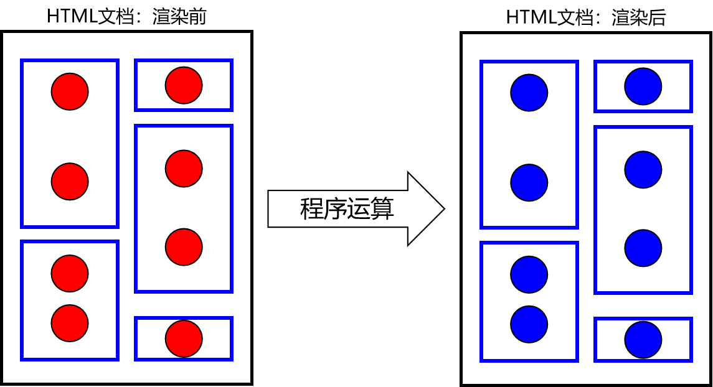

上图含义解释：

- 蓝色方框：HTML标签
- 红色圆形：动态、尚未确定的数据
- 蓝色圆形：经过程序运算以后，计算得到的具体的，可以直接在页面上显示的数据、
- 渲染：程序计算动态数据得到具体数据的过程

### 案例讲解

**HTML代码**

```html
		<!-- 使用{{}}格式，指定要被渲染的数据 -->
		<div id="app">{{message}}</div>
```

**vue代码**

```javascript
// 1.创建一个JSON对象，作为new Vue时要使用的参数
var argumentJson = {
	
	// el用于指定Vue对象要关联的HTML元素。el就是element的缩写
	// 通过id属性值指定HTML元素时，语法格式是：#id
	"el":"#app",
	
	// data属性设置了Vue对象中保存的数据
	"data":{
		"message":"Hello Vue!"
	}
};

// 2.创建Vue对象，传入上面准备好的参数
var app = new Vue(argumentJson);
```


### 查看声明式渲染的响应式效果


通过验证Vue对象的『响应式』效果，我们看到Vue对象和页面上的HTML标签确实是始终保持着关联的关系，同时看到Vue在背后确实是做了大量的工作。

## 6.6.绑定元素属性

### 基本语法

v-bind:HTML标签的原始属性名

### 案例代码

**HTML代码**

```html
<div id="app">
	<!-- v-bind:value表示将value属性交给Vue来进行管理，也就是绑定到Vue对象 -->
	<!-- vueValue是一个用来渲染属性值的表达式，相当于标签体中加{{}}的表达式 -->
	<input type="text" v-bind:value="vueValue" />
	
	<!-- 同样的表达式，在标签体内通过{{}}告诉Vue这里需要渲染； -->
	<!-- 在HTML标签的属性中，通过v-bind:属性名="表达式"的方式告诉Vue这里要渲染 -->
	<p>{{vueValue}}</p>
</div>

```

**Vue代码**

```javascript
// 创建Vue对象，挂载#app这个div标签
var app = new Vue({
	"el":"#app",
	"data":{
		"vueValue":"太阳当空照"
	}
});
```

**扩展:**

v-bind:属性名="属性值"可以简写成 :属性名="属性值"

## 6.7.双向数据绑定

### 提出问题


而使用了双向绑定后，就可以实现：页面上数据被修改后，Vue对象中的数据属性也跟着被修改,==适合绑定表单的输入框 value==；

### 案例代码

**HTML代码**

```html
<div id="app">
	<!-- v-bind:属性名 效果是从Vue对象渲染到页面 -->
	<!-- v-model:属性名 效果不仅是从Vue对象渲染到页面，而且能够在页面上数据修改后反向修改Vue对象中的数据属性 -->
	<input type="text" v-model:value="vueValue" />
	<!-- 也可以简写为 v-model="数据模型名" -->
	<p>{{vueValue}}</p>
</div>
```

**Vue代码**

```javascript
// 创建Vue对象，挂载#app这个div标签
var app = new Vue({
	"el":"#app",
	"data":{
		"vueValue":"太阳当空照"
	}
});
```

**页面效果**

p标签内的数据能够和文本框中的数据实现同步修改：


**扩展:**

1. v-model:value="值" 可以简写成 v-model="值"

2. trim修饰符

实际开发中，要考虑到用户在输入数据时，有可能会包含前后空格。而这些前后的空格对我们程序运行来说都是干扰因素，要去掉。在v-model后面加上.trim修饰符即可实现。

```html
<input type="text" v-model.trim="vueValue" />
```

Vue会帮助我们在文本框失去焦点时自动去除前后空格。

## 6.8.条件渲染

根据Vue对象中，数据属性的值来判断是否对HTML页面内容进行渲染。

### v-if

如果值为 false 就直接用注释代替源代码，如果为 true 就渲染源代码；

**HTML代码**

```html
<div id="app">
	<h3>if</h3>
	
	
</div>
```

**Vue代码**

```javascript
var app = new Vue({
    "el":"#app",
    "data":{
        "flag":true
    }
});
```

### v-if和v-else

**HTML代码**

```html
<div id="app02">
	<h3>if/else</h3>
	
	
</div>
```

**Vue代码**

```javascript
var app02 = new Vue({
    "el":"#app02",
    "data":{
        "flag":true
    }
});
```

### v-show

如果值为 false 就将 css 中的 display 属性来掩盖内容，但并不会注释掉源代码，如果值为 true ，那么就渲染源代码；

**HTML代码**

```html
<div id="app03">
	<h3>v-show</h3>
	
</div>
```

**Vue代码**

```javascript
var app03 = new Vue({
    "el":"#app03",
    "data":{
        "flag":true
    }
});
```

## 6.9.列表渲染

### 迭代一个简单的数组

**HTML代码**

```html
<div id="app01">
	<ul>
		<!-- 使用v-for语法遍历数组 -->
		<!-- v-for的值是语法格式是：(引用数组元素的变量名,下表变量) in Vue对象中的数组属性名 -->
		<!-- 在文本标签体中使用{{引用数组元素的变量名}}渲染每一个数组元素 -->
		<li v-for="(fruit,index) in fruitList" value="index">{{fruit}}</li>
	</ul>
</div>
```

**Vue代码**

```javascript
var app01 = new Vue({
	"el":"#app01",
	"data":{
		"fruitList": [
			"apple",
			"banana",
			"orange",
			"grape",
			"dragonfruit"
		]
	}
});
```

### 迭代一个对象数组

**HTML代码**

```html
<div id="app">
	<table>
		<tr>
			<th>编号</th>
			<th>姓名</th>
			<th>年龄</th>
			<th>专业</th>
		</tr>
		<tr v-for="(employee,index) in employeeList">
			<td>{{employee.empId}}</td>
			<td>{{employee.empName}}</td>
			<td>{{employee.empAge}}</td>
			<td>{{employee.empSubject}}</td>
		</tr>
	</table>
</div>
```

**Vue代码**

```javascript
var app = new Vue({
	"el":"#app",
	"data":{
		"employeeList":[
			{
				"empId":11,
				"empName":"tom",
				"empAge":111,
				"empSubject":"java"
			},
			{
				"empId":22,
				"empName":"jerry",
				"empAge":222,
				"empSubject":"php"
			},
			{
				"empId":33,
				"empName":"bob",
				"empAge":333,
				"empSubject":"python"
			}
		]
	}
});
```

## 6.10.事件驱动

### 案例一: 字符串顺序反转

**HTML代码**

```html
<div id="app">
	<p>{{message}}</p>
	
	<!-- v-on:事件类型="事件响应函数的函数名" -->
	<button v-on:click="reverseMessage">Click me,reverse message</button>
</div>
```

**Vue代码**

==Vue框架内的函数是写在methods属性内的，而且函数可以简写成**函数名(参数名){函数体}**==

```javascript
var app = new Vue({
	"el":"#app",
	"data":{
		"message":"Hello Vue!"				
	},
	"methods":{
		"reverseMessage":function(){
			this.message = this.message.split("").reverse().join("");
		}
	}
});
```

### 案例二:获取鼠标移动时的坐标信息

**HTML代码**

```html
<div id="app">
    <!-- 当只需要传入当前事件时，可以忽略参数，直接用参数名调用函数 -->
	<div id="area" v-on:mousemove="recordPosition"></div>
	<p id="showPosition">{{position}}</p>
</div>
```

**Vue代码**

```javascript
var app = new Vue({
	"el":"#app",
	"data":{
		"position":"暂时没有获取到鼠标的位置信息"
	},
	"methods":{
		"recordPosition":function(event){
			this.position = event.clientX + " " + event.clientY;
		}
	}
});
```

**扩展:**

v-on:事件名="函数"可以简写成@事件名="函数"

### 取消控件的默认行为

#### 控件默认行为

- 点超链接会跳转页面
- 点表单提交按钮会提交表单

本来控件的默认行为是天经地义就该如此的，但是如果我们希望点击之后根据我们判断的结果再看是否要跳转，此时默认行为无脑跳转的做法就不符合我们的预期了。

#### 取消方式

调用**事件对象**的**preventDefault()**方法。

**超链接举例**

HTML代码：

```javascript
<a id="anchor" href="http://www.baidu.com">超链接</a>
```

JavaScript代码：

```javascript
document.getElementById("anchor").onclick = function() {
    console.log("我点击了一个超链接");
    //event.preventDefault();
}
```

**表单提交按钮举例**

HTML代码：

```
<form action="http://www.baidu.com" method="post">
    <button id="submitBtn" type="submit">提交表单</button>
</form>
```

JavaScript代码：

```
document.getElementById("submitBtn").onclick = function() {
    console.log("我点击了一个表单提交按钮");
    event.preventDefault();
}
```

###  阻止事件冒泡


图中的两个div，他们的HTML标签是：

```html
<div id="outterDiv">
	<div id="innerDiv"></div>
</div>
```

点击里面的div同时也等于点击了外层的div，此时如果两个div上都绑定了单击响应函数那么就都会被触发：

```javascript
document.getElementById("outterDiv").onclick = function() {
	console.log("外层div的事件触发了");
}

document.getElementById("innerDiv").onclick = function() {
	console.log("内层div的事件触发了");
}

```

所以事件冒泡就是一个事件会不断向父元素传递，直到window对象。

如果这不是我们想要的效果那么可以使用<span style="color:blue;font-weight:bold;">事件对象</span>的<span style="color:blue;font-weight:bold;">stopPropagation()</span>函数阻止。

```javascript
document.getElementById("innerDiv").onclick = function() {
	console.log("内层div的事件触发了");
	
	event.stopPropagation();
}
```

### Vue事件修饰符

对于事件修饰符，Vue官网的描述是：

> 在事件处理程序中调用 `event.preventDefault()` 或 `event.stopPropagation()` 是非常常见的需求。尽管我们可以在方法中轻松实现这点，但更好的方式是：<span style="color:blue;font-weight:bold;">方法只有纯粹的数据逻辑，而不是去处理 DOM 事件细节</span>。

#### 取消控件的默认行为

==一般运用在异步请求中，暂时用不上；==

控件的默认行为指的是：

- 点击超链接跳转页面
- 点击表单提交按钮提交表单

实现这个需求使用的Vue事件修饰符是：<span style="color:blue;font-weight:bold;">.prevent</span>

```html
<a href="http://www.baidu.com" @click.prevent="clickAnchor">超链接</a>

<form action="http://www.baidu.com" method="post">
	<button type="submit" @click.prevent="clickSubmitBtn">提交表单</button>
</form>
```

#### 取消事件冒泡

实现这个需求使用的Vue事件修饰符是：<span style="color:blue;font-weight:bold;">.stop</span>

```html
<div id="outterDiv" @click="clickOutterDiv">
	<div id="innerDiv" @click.stop="clickInnerDiv"></div>
</div>
```

## 6.11.监听属性

### 提出需求

```html
<div id="app">
	<p>尊姓：{{firstName}}</p>
	<p>大名：{{lastName}}</p>
	尊姓：<input type="text" v-model="firstName" /><br/>
	大名：<input type="text" v-model="lastName" /><br/>
	<p>全名：{{fullName}}</p>
</div>
```

在上面代码的基础上，我们希望firstName或lastName属性发生变化时，修改fullName属性。此时需要对firstName或lastName属性进行<span style="color:blue;font-weight:bold;">『侦听』</span>。

具体来说，所谓<span style="color:blue;font-weight:bold;">『侦听』</span>就是对message属性进行监控，当firstName或lastName属性的值发生变化时，调用我们准备好的函数。

### Vue代码

在watch属性中声明对firstName和lastName属性进行<span style="color:blue;font-weight:bold;">『侦听』</span>的函数：

```javascript
var app = new Vue({
	"el":"#app",
	"data":{
		"firstName":"jim",
		"lastName":"green",
		"fullName":"jim green"
	},
	"watch":{
		"firstName":function(inputValue){
			this.fullName = inputValue + " " + this.lastName;
		},
		"lastName":function(inputValue){
			this.fullName = this.firstName + " " + inputValue;
		}
	}
});
```

## 6.12.案例练习

### 功能效果演示


### 任务拆解

- 第一步：显示表格
- 第二步：显示四个文本框
- 第三步：创建一个p标签用来显示用户在文本框中实时输入的内容
- 第四步：点击添加记录按钮实现记录的添加

### 第一步：显示表格

**HTML标签**

```html
<div id="app">
    <table border="1" cellspacing="0" width="500px">
        <tr>
            <th>编号</th>
            <th>姓名</th>
            <th>年龄</th>
            <th>专业</th>
            <th>操作</th>
        </tr>
        <tr v-for="(user,index) in userList">
            <td>{{user.empId}}</td>
            <td>{{user.empName}}</td>
            <td>{{user.empAge}}</td>
            <td>{{user.empSubject}}</td>
            <td><button>删除</button></td>
        </tr>
    </table>
</div>
```

**Vue代码**

```javascript
var vue = new Vue({
    "el":"#app",
    "data":{
        "userList":[
            {
                "empId":11,
                "empName":"张三",
                "empAge":20,
                "empSubject":"Java"
            },{
                "empId":22,
                "empName":"李四",
                "empAge":21,
                "empSubject":"PHP"
            },{
                "empId":33,
                "empName":"王五",
                "empAge":22,
                "empSubject":"C++"
            }
        ]
    }
});
</script>
```

### 第二步：显示四个文本框

**HTML标签**

```html
<div id="app">
    <table border="1" cellspacing="0" width="500px">
        <tr>
            <th>编号</th>
            <th>姓名</th>
            <th>年龄</th>
            <th>专业</th>
            <th>操作</th>
        </tr>
        <tr v-for="(user,index) in userList">
            <td>{{user.empId}}</td>
            <td>{{user.empName}}</td>
            <td>{{user.empAge}}</td>
            <td>{{user.empSubject}}</td>
            <td><button>删除</button></td>
        </tr>
    </table>

    <form action="https://www.baidu.com" method="post">
        编号<input type="text" v-model="user.empId" name="empId"/><br/>
        姓名<input type="text" v-model="user.empName" name="empName"/><br/>
        年龄<input type="text" v-model="user.empAge" name="empAge"/><br/>
        专业<input type="text" v-model="user.empSubject" name="empSubject"/><br/>
        <input type="submit" value="添加数据"/>
    </form>
</div>
```

**Vue代码**

```javascript
<script>
    var vue = new Vue({
        "el":"#app",
        "data":{
            "user":{}
            ,
            "userList":[
                {
                    "empId":11,
                    "empName":"张三",
                    "empAge":20,
                    "empSubject":"Java"
                },{
                    "empId":22,
                    "empName":"李四",
                    "empAge":21,
                    "empSubject":"PHP"
                },{
                    "empId":33,
                    "empName":"王五",
                    "empAge":22,
                    "empSubject":"C++"
                }
            ]
        }
    });
</script>
```

测试是否正确的方式是：在控制台尝试修改Vue对象的数据属性值：


### 第四步：点击添加记录按钮

往表格中添加数据其实就是将表单上输入的数据`this.user`加入到数组`this.userList`中

添加完之后清空表单数据，其实就是设置`this.user = {}`

**HTML标签**

```html
<div id="app">
    <table border="1" cellspacing="0" width="500px">
        <tr>
            <th>编号</th>
            <th>姓名</th>
            <th>年龄</th>
            <th>专业</th>
            <th>操作</th>
        </tr>
        <tr v-for="(user,index) in userList">
            <td>{{user.empId}}</td>
            <td>{{user.empName}}</td>
            <td>{{user.empAge}}</td>
            <td>{{user.empSubject}}</td>
            <td><button>删除</button></td>
        </tr>
    </table>

    <form action="https://www.baidu.com" method="post">
        编号<input type="text" v-model="user.empId" name="empId"/><br/>
        姓名<input type="text" v-model="user.empName" name="empName"/><br/>
        年龄<input type="text" v-model="user.empAge" name="empAge"/><br/>
        专业<input type="text" v-model="user.empSubject" name="empSubject"/><br/>
        <input type="submit" value="添加数据" @click.prevent="addUser"/>
    </form>
</div>
```

**Vue代码**

```javascript
<script>
    var vue = new Vue({
        "el":"#app",
        "data":{
            "user":{}
            ,
            "userList":[
                {
                    "empId":11,
                    "empName":"张三",
                    "empAge":20,
                    "empSubject":"Java"
                },{
                    "empId":22,
                    "empName":"李四",
                    "empAge":21,
                    "empSubject":"PHP"
                },{
                    "empId":33,
                    "empName":"王五",
                    "empAge":22,
                    "empSubject":"C++"
                }
            ]
        },
        "methods":{
            addUser(){
                //1. 获取输入框中的用户信息  就是this.user
                //2. 将用户信息加入到数组中
                this.userList.push(this.user)
                //添加完要清空表单内容
                this.user = {}
            }
        }
    });
</script>
```

### 第五步: 点击每行的删除按钮删除该行数据

删除该行数据其实就是根据下标从数组`this.userList`中移除元素

**HTML代码**

```html
<div id="app">
    <table border="1" cellspacing="0" width="500px">
        <tr>
            <th>编号</th>
            <th>姓名</th>
            <th>年龄</th>
            <th>专业</th>
            <th>操作</th>
        </tr>
        <tr v-for="(user,index) in userList">
            <td>{{user.empId}}</td>
            <td>{{user.empName}}</td>
            <td>{{user.empAge}}</td>
            <td>{{user.empSubject}}</td>
            <td><button @click="deleteUser(index)">删除</button></td>
        </tr>
    </table>

    <form action="https://www.baidu.com" method="post">
        编号<input type="text" v-model="user.empId" name="empId"/><br/>
        姓名<input type="text" v-model="user.empName" name="empName"/><br/>
        年龄<input type="text" v-model="user.empAge" name="empAge"/><br/>
        专业<input type="text" v-model="user.empSubject" name="empSubject"/><br/>
        <input type="submit" value="添加数据" @click.prevent="addUser"/>
    </form>
</div>
```

**Vue代码**

```javascript
<script>
    var vue = new Vue({
        "el":"#app",
        "data":{
            "user":{}
            ,
            "userList":[
                {
                    "empId":11,
                    "empName":"张三",
                    "empAge":20,
                    "empSubject":"Java"
                },{
                    "empId":22,
                    "empName":"李四",
                    "empAge":21,
                    "empSubject":"PHP"
                },{
                    "empId":33,
                    "empName":"王五",
                    "empAge":22,
                    "empSubject":"C++"
                }
            ]
        },
        "methods":{
            addUser(){
                //1. 获取输入框中的用户信息  就是this.user
                //2. 将用户信息加入到数组中
                this.userList.push(this.user)
                //添加完要清空表单内容
                this.user = {}
            },
            deleteUser(i){
                //删除其实是从数组中根据下标移除一个元素
                //splice(i,num)表示从下标为i的地方开始删除，一共删除num个元素
                this.userList.splice(i,1)
            }
        }
    });
</script>
```

## 6.13.Vue的生命周期

### 概念

在我们各种语言的编程领域中，<span style="color:blue;font-weight:bold;">『生命周期』</span>都是一个非常常见的概念。一个对象从创建、初始化、工作再到释放、清理和销毁，会经历很多环节的演变。比如我们在 JavaSE 阶段学习过线程的生命周期，今天学习 Vue 对象的生命周期，将来还要学习 Servlet 、Filter 等 Web 组件的生命周期。

### Vue对象的生命周期


### 生命周期钩子函数

Vue允许我们在特定的生命周期环节中通过钩子函数来加入我们的代码。

```html
<div id="app">
	<p id="content">{{message}}</p>
	<button @click="changeValue">点我</button>
</div>
```

```javascript
new Vue({
	"el":"#app",
	"data":{
		"message":"hello"
	},
	"methods":{
		"changeValue":function(){
			this.message = "new hello";
		}
	},
	
	// 1.实例创建之前
	"beforeCreate":function(){
		console.log("beforeCreate:"+this.message);
	},
	
	// 2.实例创建完成
	"created":function(){
		console.log("created:"+this.message);
	},
	
	// 3.数据挂载前
	"beforeMount":function(){
		console.log("beforeMount:"+document.getElementById("content").innerText);
	},
	
	// 4.数据已经挂载
	"mounted":function(){
		console.log("mounted:"+document.getElementById("content").innerText);
	},
	
	// 5.数据更新前
	"beforeUpdate":function(){
		console.log("beforeUpdate:"+document.getElementById("content").innerText);
	},
	
	// 6.数据更新之后
	"updated":function(){
		console.log("updated:"+document.getElementById("content").innerText);
	}
});
```

# 7.XML

## 7.1.配置文件

### 配置文件的作用

配置文件是用于给应用程序提供配置参数以及初始化设置的一些有特殊格式的文件

### 常见的配置文件类型

1. properties文件，例如druid连接池就是使用properties文件作为配置文件
2. XML文件，例如Tomcat就是使用XML文件作为配置文件
3. YAML文件，例如SpringBoot就是使用YAML作为配置文件
4. json文件，通常用来做文件传输，也可以用来做前端或者移动端的配置文件

## 7.2 properties文件

### 文件示例

```properties
jdbc.url=jdbc:mysql://192.168.198.100:3306/mybatis1026
jdbc.driver=com.mysql.jdbc.Driver
jdbc.username=root
jdbc.password=12345678
```

### 语法规范

- 由键值对组成
- 键和值之间的符号是等号
- 每一行都必须顶格写，前面不能有空格之类的其他符号

## 7.3 XML文件

### 文件示例

```xml
<?xml version="1.0" encoding="UTF-8"?>
<web-app xmlns="http://xmlns.jcp.org/xml/ns/javaee"
         xmlns:xsi="http://www.w3.org/2001/XMLSchema-instance"
         xsi:schemaLocation="http://xmlns.jcp.org/xml/ns/javaee http://xmlns.jcp.org/xml/ns/javaee/web-app_4_0.xsd"
         version="4.0">

    <!-- 配置SpringMVC前端控制器 -->
    <servlet>
        <servlet-name>dispatcherServlet</servlet-name>
        <servlet-class>org.springframework.web.servlet.DispatcherServlet</servlet-class>

        <!-- 在初始化参数中指定SpringMVC配置文件位置 -->
        <init-param>
            <param-name>contextConfigLocation</param-name>
            <param-value>classpath:spring-mvc.xml</param-value>
        </init-param>

        <!-- 设置当前Servlet创建对象的时机是在Web应用启动时 -->
        <load-on-startup>1</load-on-startup>

    </servlet>
    <servlet-mapping>
        <servlet-name>dispatcherServlet</servlet-name>

        <!-- url-pattern配置斜杠表示匹配所有请求 -->
        <!-- 两种可选的配置方式：
                1、斜杠开头：/
                2、包含星号：*.1900sharehome
             不允许的配置方式：前面有斜杠，中间有星号
                /*.app
         -->
        <url-pattern>/</url-pattern>
    </servlet-mapping>
</web-app>
```

### 概念介绍

XML是e<span style="color:blue;font-weight:bold;">X</span>tensible <span style="color:blue;font-weight:bold;">M</span>arkup <span style="color:blue;font-weight:bold;">L</span>anguage的缩写，翻译过来就是<span style="color:blue;font-weight:bold;">可扩展标记语言</span>。所以很明显，XML和HTML一样都是标记语言，也就是说它们的基本语法都是标签。

**可扩展**

<span style="color:blue;font-weight:bold;">可扩展</span>三个字<span style="color:blue;font-weight:bold;">表面上</span>的意思是XML允许<span style="color:blue;font-weight:bold;">自定义格式</span>。但是别美，这<span style="color:blue;font-weight:bold;">不代表</span>你<span style="color:blue;font-weight:bold;">可以随便写</span>。


在XML基本语法规范的基础上，你使用的那些第三方应用程序、框架会通过设计<span style="color:blue;font-weight:bold;">『XML约束』</span>的方式<span style="color:blue;font-weight:bold;">『强制规定』</span>配置文件中可以写什么和怎么写，规定之外的都不可以写。

XML基本语法这个知识点的定位是：我们不需要从零开始，从头到尾的一行一行编写XML文档，而是在第三方应用程序、框架<span style="color:blue;font-weight:bold;">已提供的配置文件</span>的基础上<span style="color:blue;font-weight:bold;">修改</span>。要改成什么样取决于你的需求，而怎么改取决于<span style="color:blue;font-weight:bold;">XML基本语法</span>和<span style="color:blue;font-weight:bold;">具体的XML约束</span>。

### XML的基本语法

- XML文档声明

这部分基本上就是固定格式，要注意的是文档声明一定要从第一行第一列开始写

```xml
<?xml version="1.0" encoding="UTF-8"?>
```

- 根标签

根标签有且只能有一个，且自定义。

- 标签关闭
  - 双标签：开始标签和结束标签必须成对出现。
  - 单标签：单标签在标签内关闭。
- 标签嵌套
  - 可以嵌套，但是不能交叉嵌套。
- 注释不能嵌套
- 标签名、属性名建议使用小写字母
- 属性
  - 属性必须有值
  - 属性值必须加引号，单双都行

看到这里大家一定会发现XML的基本语法和HTML的基本语法简直如出一辙。其实这不是偶然的，XML基本语法+HTML约束=HTML语法。在逻辑上HTML确实是XML的子集。

```html
<!DOCTYPE HTML PUBLIC "-//W3C//DTD HTML 4.01 Transitional//EN"
"http://www.w3.org/TR/html4/loose.dtd">
```

从HTML4.01版本的文档类型声明中可以看出，这里使用的DTD类型的XML约束。也就是说http://www.w3.org/TR/html4/loose.dtd这个文件定义了HTML文档中可以写哪些标签，标签内可以写哪些属性，某个标签可以有什么样的子标签。

### XML的约束(稍微了解)

将来我们主要就是根据XML约束中的规定来编写XML配置文件，而且会在我们编写XML的时候根据约束来提示我们编写, 而XML约束主要包括DTD和Schema两种。

- DTD

将来在IDEA中有代码提示的协助，在DTD文档的约束下进行配置非常简单。

```dtd
<!ENTITY % fontstyle
 "TT | I | B | U | S | STRIKE | BIG | SMALL">

<!ENTITY % phrase "EM | STRONG | DFN | CODE |
                   SAMP | KBD | VAR | CITE | ABBR | ACRONYM" >

<!ENTITY % special
   "A | IMG | APPLET | OBJECT | FONT | BASEFONT | BR | SCRIPT |
    MAP | Q | SUB | SUP | SPAN | BDO | IFRAME">

<!ENTITY % formctrl "INPUT | SELECT | TEXTAREA | LABEL | BUTTON">

<!-- %inline; covers inline or "text-level" elements -->
<!ENTITY % inline "#PCDATA | %fontstyle; | %phrase; | %special; | %formctrl;">

<!ELEMENT (%fontstyle;|%phrase;) - - (%inline;)*>
<!ATTLIST (%fontstyle;|%phrase;)
  %attrs;                              -- %coreattrs, %i18n, %events --
  >
```

- Schema

我们将来使用SSM框架中的Spring、SpringMVC框架时，会涉及到一点点对Schema约束的设置。不过不必紧张，有IDEA的支持操作会非常简单，我们现在只需要理解基本概念即可。

首先我们要理解一个概念：<span style="color:blue;font-weight:bold;">『名称空间』</span>，英文：name space


Schema约束要求我们一个XML文档中，所有标签，所有属性都必须在约束中有明确的定义。

下面我们以web.xml的约束声明为例来做个说明：

```xml
<web-app xmlns="http://xmlns.jcp.org/xml/ns/javaee"
         xmlns:xsi="http://www.w3.org/2001/XMLSchema-instance"
         xsi:schemaLocation="http://xmlns.jcp.org/xml/ns/javaee http://xmlns.jcp.org/xml/ns/javaee/web-app_4_0.xsd"
         version="4.0">
```

| 属性名             | 作用                                                         |
| ------------------ | ------------------------------------------------------------ |
| xmlns              | 指出当前XML文档约束规则的名称空间在哪里<br />我们就是通过这个属性来引用一个具体的名称空间 |
| xmlns:xsi          | 指出xmlns这个属性是在哪个约束文档中被定义的                  |
| xsi:schemaLocation | 语法格式：在xsi名称空间下引用schemaLocation属性<br />配置含义：指定当前XML文档中所用到的约束文档本身的文件的地址 |

xmlns和xsi:schemaLocation对应关系如下图：


引入多个名称空间的例子如下：

```xml
<?xml version="1.0" encoding="UTF-8"?>
<beans xmlns="http://www.springframework.org/schema/beans"
	xmlns:xsi="http://www.w3.org/2001/XMLSchema-instance"
	xmlns:context="http://www.springframework.org/schema/context"
	xmlns:mvc="http://www.springframework.org/schema/mvc"
	xsi:schemaLocation="http://www.springframework.org/schema/mvc http://www.springframework.org/schema/mvc/spring-mvc-4.0.xsd
		http://www.springframework.org/schema/beans http://www.springframework.org/schema/beans/spring-beans.xsd
		http://www.springframework.org/schema/context http://www.springframework.org/schema/context/spring-context-4.0.xsd">

	<context:component-scan base-package="com.atguigu.crud.component"/>
	
	<bean id="viewResolver" class="org.springframework.web.servlet.view.InternalResourceViewResolver">
		<property name="prefix" value="/WEB-INF/pages/"/>
		<property name="suffix" value=".jsp"/>
	</bean>
	
	<mvc:default-servlet-handler/>
	<mvc:annotation-driven/>

</beans>
```


看到这么复杂，这么长的名称空间字符串，我们会觉得很担心，根本记不住。但是其实不需要记，在IDEA中编写配置文件时，IDEA会协助我们导入，会有提示。我们<span style="color:blue;font-weight:bold;">理解各个部分的含义能够调整</span>即可。

### XML解析(重点)

#### XML解析的作用

用Java代码读取xml中的数据

#### XML的两种解析方式

1. DOM解析:将文档加载进内存，形成一颗dom树(document对象)，将文档的各个组成部分封装为一些对象。
   * 优点:因为在内存中会形成dom树，程序员可以以面向对象的方式操作XML文件，写代码就非常方便，可以对dom树进行增删改查。
   * 缺点:dom树非常占内存，解析速度慢。所以一般解析体积较大的XML文件的时候不会采用DOM解析
2. SAX解析:逐行读取，基于事件驱动，解析一行释放一行，内存占用非常小

**建议:一般会采用DOM解析方式来解析XML，除非是解析体积很大的XML文件才会采用SAX解析**

#### 常见的XML解析器

在使用Java代码解析XML的时候，我们通常不会直接使用JDK内置的原生的DOM或者SAX解析XML，因为代码实在是太复杂了。一些公司和组织已经封装好了优秀的XML解析器，我们通常会使用第三方XML解析器来解析XML

1. JAXP: sun公司提供的解析。支持dom和sax。（不常用）

2. JDOM

3. DOM4J（常用） 

#### DOM4J的使用步骤

1. 导入jar包 dom4j.jar
2. 创建解析器对象(SAXReader)
3. 解析xml 获得Document对象
4. 获取根节点RootElement
5. 获取根节点下的子节点

#### DOM4J的API介绍

1. 创建SAXReader对象

```java
SAXReader saxReader = new SAXReader();
```

2. 解析XML获取Document对象: 需要传入要解析的XML文件的字节输入流

```java
Document document = reader.read(inputStream);
```

3. 获取文档的根标签

```java
Element rootElement = documen.getRootElement()
```

4. 获取标签的子标签

```java
//获取所有子标签
List<Element> sonElementList = rootElement.elements();
//获取指定标签名的子标签
List<Element> sonElementList = rootElement.elements("标签名");
```

5. 获取标签体内的文本

```java
String text = element.getText();
```

6. 获取标签的某个属性的值

```java
String value = element.AttributeValue("属性名");
```

#### XPATH的使用介绍

1. XPATH的作用: 使用规则匹配直接查找xml文件中的指定节点
2. XPATH的使用步骤:
   1. 引入dom4j和xpath的jar包
   2. 创建解析器对象
   3. 解析xml 获得document对象
   4. 使用document对象调用方法，根据路径规则查找节点
3. XPATH的API:
   * selectSingleNode("路径规则"): 根据路径规则，查找满足条件的第一个节点
   * selectNodes("路径规则"): 根据路径规则，查找满足条件的所有节点
4. 路径规则需要自行百度查询；

## 7.4 YAML配置文件(暂时了解)

YAML配置文件会在我们以后学习的SpringBoot框架中使用

### 文件示例

```yaml
spring:
  profiles:
    active: fc
  datasource:
    name: mydb
    type: com.alibaba.druid.pool.DruidDataSource
    url: jdbc:mysql://192.168.41.100:3306/spring_boot?serverTimezone=UTC
    username: root
    password: atguigu
    driver-class-name: com.mysql.cj.jdbc.Driver
mybatis:
  mapper-locations: classpath*:/mybatis-mapper/*Mapper.xml
logging:
  level:
    com.atguigu.function.compute.mapper: debug
```

## 7.5 Json配置文件

json配置文件一般使用在前端或者移动端

### 文件示例

```json
{
    "username":"aobama",
    "password":"123456",
    "nickname":"圣枪游侠"
}
```

# 8.Tomcat

## 8.1.Tomcat的介绍

### Tomcat的简介

Tomcat 服务器是一个开源的轻量级Web应用服务器，在中小型系统和并发量小的场合下被普遍使用，是开发和调试Servlet、JSP 程序的首选。也是绝大多数JavaEE开发工程师所必用的

### Tomcat的作用

Tomcat的作用是作为Web服务器部署Web项目，从而让客户端能够访问，在这个过程中它扮演者两个角色: Web服务器和Servlet容器

#### Web服务器


#### Servlet容器


## 8.2.Tomcat的安装和启动

1. 配置JAVA_HOME和java环境变量: 因为Tomcat是Java代码编写的，所以必须要配置JAVA_HOME和java环境变量之后才能运行，我们可以通过下面的命令检测：

   > C:\Users\Administrator><span style="color:blue;font-weight:bold;">java -version</span>
   > java version "1.8.0_141"
   > Java(TM) SE Runtime Environment (build 1.8.0_141-b15)
   > Java HotSpot(TM) 64-Bit Server VM (build 25.141-b15, mixed mode)
   >
   > C:\Users\Administrator><span style="color:blue;font-weight:bold;">echo %JAVA_HOME%</span>
   > D:\software\Java
   >
   > C:\Users\Administrator><span style="color:blue;font-weight:bold;">echo %PATH%</span>
   > D:\software\xftp\;C:\WINDOWS\system32;C:\WINDOWS;C:\WINDOWS\System32\Wbem;C:\WINDOWS\System32\WindowsPowerShell\v1.0\;D:\software\Java\bin;D:\software\apache-maven-3.5.4\bin;C:\Users\Administrator\AppData\Local\Microsoft\WindowsApps;

2. 将Tomcat压缩包解压到一个<span style="color:blue;font-weight:bold;">非中文无空格</span>的目录下


3. 启动Tomcat并访问首页

   运行Tomcat解压后根目录下\bin\startup.bat即可启动Tomcat服务器，然后打开谷歌浏览器，在地址栏输入“http://localhost:8080”就可以访问Tomcat了


## 8.3.Tomcat的目录结构

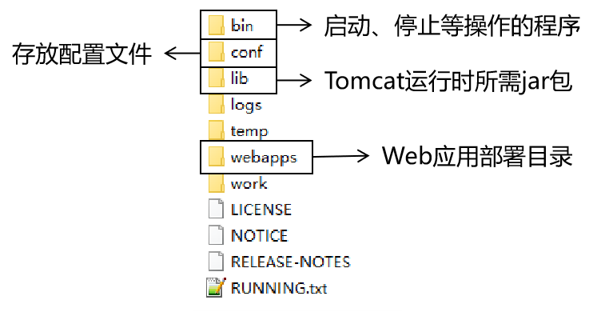

## 8.4.Tomcat部署Web项目

我们编写完Web项目之后，通常是将Web项目打包成war包，然后将war包放入Tomcat的webapps目录中即可。

**注意:怎么将Web项目打包成war包，我们以后的内容中会讲**

在 Tomcat 启动过程中，会将 war 包进行解压，然后运行解压后的项目

在浏览器访问我们刚刚部署的项目"http://localhost:8080/项目文件夹名/要访问的文件名"

## 8.5.Tomcat的端口

在Tomcat安装目录下的conf目录中，可以看到一个server.xml文件，这个xml文件中就配置了Tomcat的端口号；

==在第二个Connector标签中配置一个URIEncoding属性是为了获取GET请求时由Tomcat为我们处理乱码问题；==

```xml
……
<Server port="8005" shutdown="SHUTDOWN">
……
<Connector port="8080" protocol="HTTP/1.1"
               connectionTimeout="20000"
               redirectPort="8443" 
			   URIEncoding="UTF-8" />
……
<Connector port="8009" protocol="AJP/1.3" redirectPort="8443" />
……
```

三个位置共定义了3个端口号，Tomcat启动后，这个三个端口号都会被占用。

## 8.6.在Idea中集成Tomcat


## 8.7.创建动态Web工程

**1. 第一步:**创建Empty Project

**2. 第二步:**创建动态Web的Module


**创建好的工程目录结构:**


## 8.8.动态工程目录结构

| 目录或文件名            | 功能                                                         |
| ----------------------- | ------------------------------------------------------------ |
| src目录                 | 存放Java源文件                                               |
| web目录                 | 存放Web开发相关资源                                          |
| web/WEB-INF目录         | 存放web.xml文件、classes目录、lib目录                        |
| web/WEB-INF/web.xml文件 | 别名：部署描述符deployment descriptor<br />作用：Web工程的核心配置文件 |
| web/WEB-INF/classes目录 | 存放编译得到的*.class字节码文件                              |
| web/WEB-INF/lib目录     | 存放第三方jar包                                              |

## 8.9.创建用来部署Web工程的Tomcat实例

### 编辑Tomcat实例

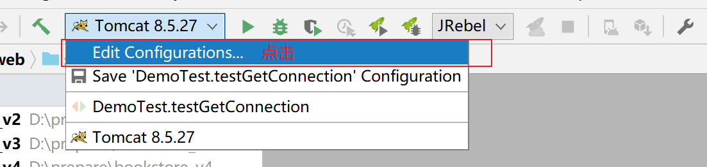

### 配置Tomcat实例


### 部署项目


### 部署好之后的效果


### 启动服务器


### Idea运行时的界面布局


## 8.10.在IDEA中重新部署运行

### 为什么需要重新部署？

对于已经运行过的Web项目，如果我们增加了目录和文件，那么部署目录有可能不会自动同步过来，从而造成实际运行的效果和我们期望的不同。

如下图中，我们在工程目录已经新增了images目录和两个图片：


但是在部署目录并没有出现：


哪怕我们执行了重新部署也没有起作用。

### 怎么重新部署

#### 清理部署目录


#### 构建

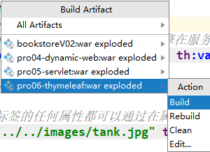

#### 效果


## 8.11.导入现有的Module

> 做下面操作前，需要把要导入的module复制到project目录下。


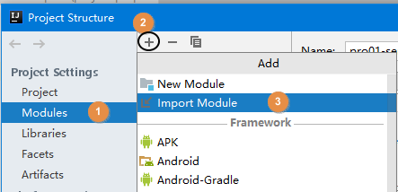


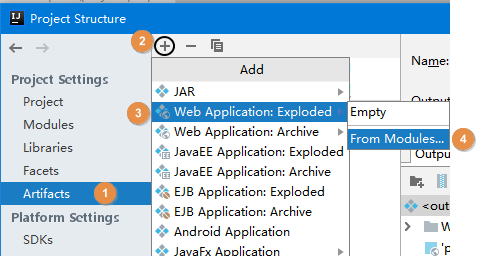


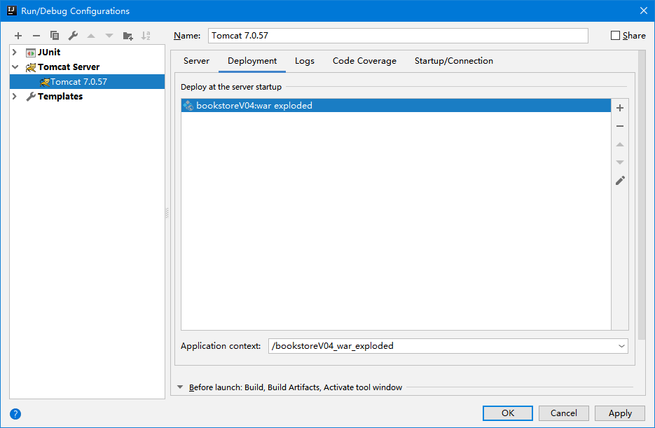

# 9.HTTP协议

## 9.1.HTTP协议概念

### 什么是HTTP协议

HTTP：<span style="color:blue;font-weight:bold;">H</span>yper <span style="color:blue;font-weight:bold;">T</span>ext <span style="color:blue;font-weight:bold;">T</span>ransfer <span style="color:blue;font-weight:bold;">P</span>rotocol超文本传输协议。

### HTTP协议的作用

HTTP最大的作用就是确定了请求和响应数据的格式。浏览器发送给服务器的数据：请求报文；服务器返回给浏览器的数据：响应报文。

### HTTP协议的组成

HTTP协议由请求和响应两部分构成，请求是由客户端往服务器传输数据，响应是由服务器往客户端传输数据。

## 9.2.请求报文

### 在开发者工具中浏览报文源码


### 请求报文的三个部分


### 请求行

作用: 展示当前请求的最基本信息

> POST /dynamic/target.jsp HTTP/1.1

- 请求方式
- 访问地址
- HTTP协议的版本

### 请求消息头

作用: 通过具体的参数对本次请求进行详细的说明

格式: 键值对，键和值之间使用冒号隔开

相对比较重要的请求消息头：

| 名称           | 功能                                                 |
| -------------- | ---------------------------------------------------- |
| Host           | 服务器的主机地址                                     |
| Accept         | 声明当前请求能够接受的『媒体类型』                   |
| Referer        | 当前请求来源页面的地址                               |
| Content-Length | 请求体内容的长度                                     |
| Content-Type   | 请求体的内容类型，这一项的具体值是媒体类型中的某一种 |
| Cookie         | 浏览器访问服务器时携带的Cookie数据                   |

### 请求体

作用：作为请求的主体，发送数据给服务器。具体来说其实就是POST请求方式下的请求参数，==GET请求方式无请求头，因为它的请求参数在 url 地址中；==

格式：

**1. form data**

含义：当前请求体是一个表单提交的请求参数。


查看源码后，发现格式如下：

> username=tom&password=123456

- 每一组请求参数是一个键值对
- 键和值中间是等号
- 键值对之间是&号

**2.Request Payload**

含义：整个请求体以某种特定格式来组织数据，例如JSON格式。


## 9.3.请求方式

### HTTP协议已定义的请求方式

HTTP1.1中共定义了八种请求方式：

- <span style="color:red;font-weight:bold;">GET</span>：从服务器端获取数据
- <span style="color:red;font-weight:bold;">POST</span>：将数据保存到服务器端
- <span style="color:blue;font-weight:bold;">PUT</span>：命令服务器对数据执行更新
- <span style="color:blue;font-weight:bold;">DELETE</span>：命令服务器删除数据
- HEAD
- CONNECT
- OPTIONS
- TRACE

### GET请求

- 特征1：没有请求体
- 特征2：请求参数附着在URL地址后面
- 特征3：请求参数在浏览器地址栏能够直接被看到，存在安全隐患
- 特征4：在URL地址后面携带请求参数，数据容量非常有限。如果数据量大，那么超出容量的数据会丢失
- 特征5：从报文角度分析，请求参数是在请求行中携带的，因为访问地址在请求行
- 特征6：适用于上传文本类文件，不适用于上传图片，视频等；

### POST请求

- 特征1：有请求体
- 特征2：请求参数放在请求体中
- 特征3：请求体发送数据的大小理论上没有限制
- 特征4：可以发送各种不同类型的数据
- 特征5：从报文角度分析，请求参数是在请求体中携带的
- 特征6：由于请求参数是放在请求体中，所以浏览器地址栏看不到

## 9.4.媒体类型

### HTTP协议中的MIME类型

Multipurpose Internet Mail Extensions

### 用途

为了让用户通过浏览器和服务器端交互的过程中有更好、更丰富的体验，HTTP协议需要支持丰富的数据类型。

### MIME类型定义参考

我们可以通过查看Tomcat解压目录下conf/web.xml配置文件，了解HTTP协议中定义的MIME类型。

```xml
<mime-mapping>
	<extension>mp4</extension>
	<mime-type>video/mp4</mime-type>
</mime-mapping>
<mime-mapping>
	<extension>doc</extension>
	<mime-type>application/msword</mime-type>
</mime-mapping>
<mime-mapping>
	<extension>json</extension>
	<mime-type>application/json</mime-type>
</mime-mapping>
<mime-mapping>
	<extension>html</extension>
	<mime-type>text/html</mime-type>
</mime-mapping>
```

从上面的例子中可以看出：MIME的基本格式是

> 大类/具体类型

MIME类型在HTTP报文中对应的是内容类型：Content-type

## 9.5.响应报文


### 响应状态行

> HTTP/1.1 200 OK

- HTTP协议版本
- <span style="color:blue;font-weight:bold;">响应状态码</span>
- 响应状态的说明文字

### 响应消息头

- 响应体的说明书。
- 服务器端对浏览器端设置数据，例如：服务器端返回Cookie信息。

| 名称           | 功能                                                         |
| -------------- | ------------------------------------------------------------ |
| Content-Type   | 响应体的内容类型                                             |
| Content-Length | 响应体的内容长度                                             |
| Set-Cookie     | 服务器返回新的Cookie信息给浏览器                             |
| location       | 在<span style="color:blue;font-weight:bold;">重定向</span>的情况下，告诉浏览器访问下一个资源的地址 |

### 响应体

服务器返回的数据主体，有可能是各种数据类型。

- HTML页面
- 图片
- 视频
- 以下载形式返回的文件
- CSS文件
- JavaScript文件

### 响应状态码

作用：以编码的形式告诉浏览器当前请求处理的结果

| 状态码 | 含义                                                      |
| ------ | --------------------------------------------------------- |
| 200    | 服务器成功处理了当前请求，成功返回响应                    |
| 302    | 重定向                                                    |
| 400    | [SpringMVC特定环境]请求参数问题                           |
| 403    | 没有权限                                                  |
| 404    | 找不到目标资源                                            |
| 405    | 请求方式和服务器端对应的处理方式不一致                    |
| 406    | [SpringMVC特定环境]请求扩展名和实际返回的响应体类型不一致 |
| 50X    | 服务器端内部错误，通常都是服务器端抛异常了                |

404产生的具体原因：

- 访问地址写错了，确实是没有这个资源
- 访问了WEB-INF目录下的资源
- Web应用启动的时候，控制台已经抛出异常，导致整个Web应用不可用，访问任何资源都是404
- 服务器端缓存

# 10.Servlet基础

## 10.1.Web资源的概念

Web资源就是运行在服务器上的资源，它一共分为两类: 静态资源以及动态资源

### 静态资源

静态资源就是web页面中供人们浏览的数据始终是不变，例如我们之前所学习的html、css、js、图片、音视频等等都属于静态资源

### 动态资源

动态资源就是web页面中供人们浏览的数据是由程序产生的，不同的用户或者不同时间点访问web页面看到的内容各不相同，例如我们后续要学习的Servlet、JSP(不学)、Thymeleaf等等都是动态资源

## 10.2.Servlet的概念

### 什么是Servlet

Servlet 是运行在服务端(tomcat)的Java小程序，是sun公司提供一套定义动态资源规范; 从代码层面上来讲Servlet就是一个接口

### Servlet的作用

用来接收、处理客户端请求、响应给浏览器的动态资源。在整个Web应用中，Servlet主要负责处理请求、协调调度功能。我们可以把Servlet称为Web应用中的<span style="color:blue;font-weight:bold;">『控制器』</span>

### Servlet的作用的图示

**要实现的效果**


**使用Servlet实现的具体细节**


## 10.3.Servlet的入门案例

### 目标

在页面上点击超链接，由Servlet处理这个请求，并返回一个响应字符串：Hello,I am Servlet

### 思路


### 实现步骤

#### 第一步: 创建动态Web module

#### 第二步：创建html页面

```html
<!-- /Web应用地址/Servlet地址 -->
<a href="/app/helloServlet">Servlet Hello World</a>
```

#### 第三步：创建HelloServlet类

```java
public class HelloServlet implements Servlet {
    @Override
    public void init(ServletConfig servletConfig) throws ServletException {

    }

    @Override
    public ServletConfig getServletConfig() {
        return null;
    }

    @Override
    public void service(ServletRequest servletRequest, ServletResponse servletResponse) throws ServletException, IOException {

        // 控制台打印，证明这个方法被调用了
        System.out.println("我是HelloServlet，我执行了！");

        // 返回响应字符串
        // 1、获取能够返回响应数据的字符流对象
        PrintWriter writer = servletResponse.getWriter();

        // 2、向字符流对象写入数据
        writer.write("Hello,I am Servlet");
    }

    @Override
    public String getServletInfo() {
        return null;
    }

    @Override
    public void destroy() {

    }
}
```

#### 第四步：在web.xml中配置HelloServlet

配置文件位置：WEB-INF/web.xml


```xml
<!-- 配置Servlet本身 -->
<servlet>
    <!-- 全类名太长，给Servlet设置一个简短名称 -->
    <servlet-name>HelloServlet</servlet-name>

    <!-- 配置Servlet的全类名 -->
    <servlet-class>com.atguigu.servlet.HelloServlet</servlet-class>
</servlet>

<!-- 将Servlet和访问地址关联起来 -->
<servlet-mapping>
    <servlet-name>HelloServlet</servlet-name>
    <url-pattern>/helloServlet</url-pattern>
</servlet-mapping>
```

<span style="color:blue;font-weight:bold;">『映射路径』</span>：Servlet并<span style="color:blue;font-weight:bold;">不是</span>文件系统中<span style="color:blue;font-weight:bold;">实际存在</span>的<span style="color:blue;font-weight:bold;">目录或文件</span>，所以为了方便浏览器访问，我们创建了<span style="color:blue;font-weight:bold;">映射路径</span>来访问它。

### 小结

需求：在浏览器上点超链接能够访问Java程序


## 10.4.概念梳理

### 原生Tomcat

安装在电脑上的实实在在的Tomcat软件

### IDEA中的Tomcat实例

通过idea的配置在idea上集成的Tomcat实例，其实还是使用的原生的Tomcat软件

### IDEA中的Web工程

程序员使用IDEA编写的动态Web工程，该工程只是用于程序员编码，实际上部署运行在Tomcat服务器中的并不是这个工程

### 根据Web工程生成的war包

根据程序员创建的动态Web工程，IDEA会将其打包成一个war包，而真正部署运行在Tomcat服务器中的其实是war包

### 访问资源的地址

#### 访问静态资源

/Web应用名称/静态资源本身的路径

#### 访问动态资源

/Web应用名称/映射路径

### Web应用名称

注意Web应用名不是你工程或者Module的名字，而是你在部署时候的ApplicationContext的内容


### 总体的逻辑结构


## 10.5.Servlet的注解方式配置(了解)

注意: 一个Servlet要么使用配置文件方式配置，要么使用注解方式配置，不能两者都使用

使用注解方式配置的优势: 代码更加简单

使用注解方式配置的劣势: 耦合度高

我们一般更推荐使用配置文件方式配置Servlet，尤其是配置第三方框架中的Servlet:例如SpringMVC中的DispatcherServlet，我们只能够使用配置文件方式进行配置

### 使用注解方式配置的代码实现

```java
在要进行配置的Servlet类上添加注解@WebServlet("/映射路径")
```

# 11.Servlet的进阶

## 11.1.Servlet的生命周期和生命周期方法

### 什么是Servlet的生命周期

Servlet的生命周期就是servlet从创建到销毁的过程，我们所要去探讨的就是Servlet对象在什么时候创建出来以及在什么时候销毁。当然创建和销毁Servlet对象的工作是不需要我们去做的

### Servlet对象什么时候创建

默认情况下是在第一次有请求访问该Servlet实例的时候才会创建该Servlet对象

### Servlet对象什么时候销毁

在服务器关闭，或者当前项目从服务器中移除的时候会销毁当前项目中的所有Servlet对象

## 11.2.Servlet的生命周期方法

### 什么是Servlet的生命周期方法

在Servlet的生命周期中必然会经历的方法我们称之为Servlet的生命周期方法，总共包含三个方法:init、service、destroy

### init方法

该方法会在Servlet实例对象被创建出来之后执行，我们可以在该方法中获取当前Servlet的初始化参数，以及进行一些读取配置文件之类的操作

### service方法

该方法会在Servlet实例对象每次接收到请求的时候均执行，我们可以在该方法中接收、处理请求，以及将客户端需要的数据响应给客户端

### destroy方法

该方法会在Servlet实例对象销毁之前执行，我们可以在该方法中做一些资源回收、释放、关闭等等操作

## 11.3.配置Servlet提前创建

有时候我们需要在Servlet创建的时候做一些资源加载等等耗时操作，所以如果Servlet在第一次接收请求的时候才创建的话必然会影响用户的访问速度，所以此时我们需要让Servlet提前创建，将Servlet的创建提前到服务器启动的时候。

通过修改web.xml中Servlet的配置可以实现:

```xml
<!-- 配置Servlet本身 -->
<servlet>
    <!-- 全类名太长，给Servlet设置一个简短名称 -->
    <servlet-name>HelloServlet</servlet-name>

    <!-- 配置Servlet的全类名 -->
    <servlet-class>com.atguigu.servlet.HelloServlet</servlet-class>

    <!-- 配置Servlet启动顺序 -->
    <load-on-startup>1</load-on-startup>
    <!-- 1仅仅代表优先级，所以这里写任何数据，都会ti'qi'a -->
</servlet>
```

## 11.4ServletConfig的介绍

### 接口概览


### 接口方法介绍

| 方法名                  | 作用                                                         |
| ----------------------- | ------------------------------------------------------------ |
| getServletName()        | 获取&lt;servlet-name&gt;HelloServlet&lt;/servlet-name&gt;定义的Servlet名称 |
| getServletContext()     | 获取ServletContext对象                                       |
| **getInitParameter()**  | 获取配置Servlet时设置的『初始化参数』，根据名字获取值        |
| getInitParameterNames() | 获取所有初始化参数名组成的Enumeration对象                    |

### 获取Servlet的初始化参数

我们可以在web.xml中对Servlet配置初始化参数，接下来可以在Servlet的init方法中获取配置的初始化参数的值

**web.xml代码**

==该顺序不能调换；==

```xml
<!-- 配置Servlet本身 -->
<servlet>
    <!-- 全类名太长，给Servlet设置一个简短名称 -->
    <servlet-name>HelloServlet</servlet-name>

    <!-- 配置Servlet的全类名 -->
    <servlet-class>com.atguigu.servlet.HelloServlet</servlet-class>

    <!-- 配置初始化参数 -->
    <init-param>
        <param-name>goodMan</param-name>
        <param-value>me</param-value>
    </init-param>

    <!-- 配置Servlet启动顺序 -->
    <load-on-startup>1</load-on-startup>
</servlet>
```

**HelloServlet代码**

```java
public class HelloServlet implements Servlet {
    @Override
    public void init(ServletConfig servletConfig) throws ServletException {

        System.out.println("HelloServlet对象初始化");

        // 测试ServletConfig对象的使用
        // 1.获取ServletConfig对象：在init()方法中完成
        System.out.println("servletConfig = " + servletConfig.getClass().getName());

        // 2.通过servletConfig对象获取初始化参数
        Enumeration<String> enumeration = this.servletConfig.getInitParameterNames();
        while (enumeration.hasMoreElements()) {
            String name = enumeration.nextElement();
            System.out.println("name = " + name);

            String value = this.servletConfig.getInitParameter(name);
            System.out.println("value = " + value);
        }

    }

    @Override
    public void service(ServletRequest servletRequest, ServletResponse servletResponse) throws ServletException, IOException {

        // 控制台打印，证明这个方法被调用了
        System.out.println("我是HelloServlet，我执行了！");

        // 返回响应字符串
        // 1、获取能够返回响应数据的字符流对象
        PrintWriter writer = servletResponse.getWriter();

        // 2、向字符流对象写入数据
        writer.write("Hello,I am Servlet");
    }

    @Override
    public String getServletInfo() {
        return null;
    }

    @Override
    public void destroy() {
        System.out.println("HelloServlet对象即将销毁，现在执行清理操作");
    }
}
```

## 11.5.Servlet的体系结构(了解)

### 类型关系


Servlet接口有一个实现类是GenericServlet，而GenericServlet有一个子类是HttpServlet，我们创建Servlet的时候会选择继承HttpServlet，因为它里面相当于也实现了Servlet接口，并且对一些方法做了默认实现；而且子类的功能会比父类的更加强大

### 方法关系


我们编写Servlet类继承HttpServlet的时候，只需要重写doGet()和doPost()方法就行了，因为HttpServlet重写了service()方法，在service()方法中判断请求方式，根据不同的请求方式执行doXXX()方法

## 11.6.使用Idea直接创建Servlet

### 创建步骤


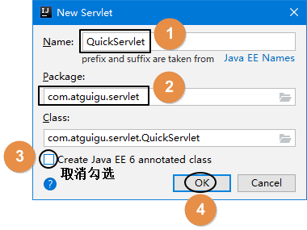

### 创建后的代码

**web.xml代码**

```xml
<!-- IDEA会自动生成servlet标签 -->
<servlet>
    <servlet-name>QuickServlet</servlet-name>
    <servlet-class>com.atguigu.servlet.QuickServlet</servlet-class>
</servlet>

<!-- 我们自己补充servlet-mapping标签 -->
<servlet-mapping>
    <servlet-name>QuickServlet</servlet-name>
    <url-pattern>/QuickServlet</url-pattern>
</servlet-mapping>
```

**Servlet代码**

```java
public class QuickServlet extends HttpServlet {
    protected void doPost(HttpServletRequest request, HttpServletResponse response) throws ServletException, IOException {
        //在doPost()方法中调用doGet(),这样的话就只需要重写doGet()方法就能处理post和get请求
		doGet(request,response);
    }

    protected void doGet(HttpServletRequest request, HttpServletResponse response) throws ServletException, IOException {
		
    }
}
```

## 11.7.Servlet的三种映射路径的配置

### 映射路径的作用

Servlet的映射路径是提供一个让别人能够访问该Servlet的路径，例如Servlet的映射路径是"/hello",那么在浏览器上访问该Servlet的路径是`http://localhost:8080/项目部署名/hello`

**注意:一个Servlet可以配置多个映射路径，但是多个Servlet不能配置相同的映射路径**

### 映射路径的分类

#### 完全路径匹配

访问当前Servlet的路径需要和配置的映射路径完全一致，例如Servlet的配置是`/demo01`，那么访问该Servlet的时候的路径也必须是`http://localhost:8080/项目部署名/demo01`才可以访问到

#### 目录匹配

以 `/` 开始需要以 `*` 结束，**注**: Servlet里面用的不多, 但是过滤器里面通常就使用目录匹配

```
例如:  配置/* 访问的路径可写成/任意字符串,比方: /aa, /aaa; 配置 /aa/*  访问的路径可写成/aa/任意字符串,比方: /aa/b , /aa/cc
```

#### 扩展名匹配

以`*`开头，以`.扩展名`结束，能够匹配所有以`.相同扩展名`结尾的请求路径

```
例如:  *.action;  访问路径可以是 任意字符串.action,比方: aa.action, bb.action, c.action;
```

# 12.动态Web工程内编写路径

## 12.1.为什么要写路径

- 整个系统要根据功能拆分成许许多多<span style="color:blue;font-weight:bold;">独立</span>的<span style="color:blue;font-weight:bold;">资源</span>
- 资源之间既要完成自身的功能又要和其他资源<span style="color:blue;font-weight:bold;">配合</span>
- 写路径就是为了从一个资源<span style="color:blue;font-weight:bold;">跳转</span>到下一个资源

## 12.2.工程目录和部署目录的结构对比


### 工程目录

我们写代码的地方，但是在服务器上运行的不是这个

### 部署目录

经过Java源文件<span style="color:blue;font-weight:bold;">编译</span>和<span style="color:blue;font-weight:bold;">目录重组</span>后，IDEA就替我们准备好了可以在服务器上运行的部署目录

### 编写路径的基准

用户通过浏览器访问服务器，而服务器上运行的是部署目录，所以写路径的时候<span style="color:blue;font-weight:bold;">参考部署目录</span>而不是工程目录

### 工程目录和部署目录的对应关系

<span style="color:blue;font-weight:bold;">工程目录下的web目录对应部署目录的根目录</span>，同时部署目录的根目录也是路径中的<span style="color:blue;font-weight:bold;">Web应用根目录</span>

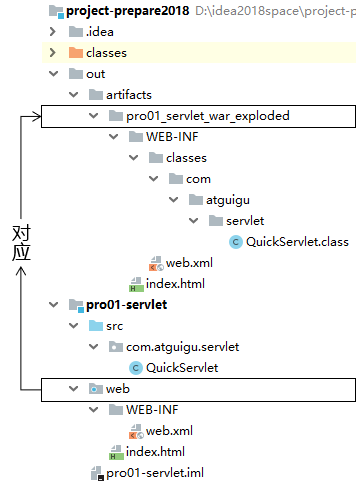

## 12.3.url的介绍

### url的概念

url是`uniform Resource Locater`的简写，中文翻译为`统一资源定位符`，它是某个互联网资源的唯一访问地址，客户端可以通过url访问到具体的互联网资源

### url的组成


### url的使用场景

客户端访问服务器的资源，或者一台服务器中要访问另外一台服务器的资源都是通过url访问

## 12.4.uri的介绍

### uri的概念

uri是`Uniform Resource identifier`的缩写，中文翻译为`统一资源标识符`, 它是服务器中某个资源的唯一标识，通过uri可以实现同一项目中的某个资源中访问另一个资源

### uri的组成

uri的写法是`/项目部署名/资源路径`


### uri的使用场景

在同一个项目的某个资源中访问该项目中的另一个资源

## 12.5.相对路径的使用(不建议使用)

### 目标

目标: 在A资源中访问B资源

A资源的uri路径: `/app/pages/a.html`

B资源的uri路径:`/app/static/vue.js`

### 相对路径的概念

相对路径是不以`/`开头的路径写法，编写相对路径的原则是以目标资源的uri路径相对当前资源的uri路径

### 相对路径实例

那么要实现在A资源中访问B资源的相对路径写法是`../static/vue.js`,其中`../static`表示找到当前资源的上一级目录下的static目录

## 12.6.绝对路径的使用(建议使用)

### 目标

目标: 在A资源中访问B资源

A资源的uri路径: `/app/pages/a.html`

B资源的uri路径:`/app/static/vue.js`

### 绝对路径的概念

绝对路径是以`/`开头的路径写法，编写绝对路径的原则是通过目标资源的uri访问目标资源，但是特殊情况是**请求转发**，如果是请求转发访问目标资源的话，那么绝对路径是在uri的基础之上省略`/项目部署名`

### 绝对路径实例

那么要实现在A资源中访问B资源的绝对路径写法是`/app/static/vue.js`

### 在请求转发的时候使用绝对路径

请求转发在后续内容中会讲解，现在我们只需要搞懂在请求转发的时候绝对路径的写法是`/资源名`，其实就是在uri的基础上省略`/项目部署名`

## 12.7.动态获取上下文路径

### 上下文路径的概念

上下文路径（context path）=/Web应用名称

### 为什么要动态获取上下文路径

因为我们使用绝对路径的时候需要用到资源的uri路径，而uri路径中是包含上下文路径的，所以如果采用静态方式写绝对路径，那么就会将上下文路径写死在绝对路径中；而我们在部署项目的时候，上下文路径是可变的，所以这样就会因为部署时设置的上下文路径不同从而导致绝对路径出错的问题

### 动态获取上下文路径的API

```java
request.getContextPath()
```

使用上述API可以动态获取项目的上下文路径，每一次获取的都是当前环境下实际的上下文路径的值

# 13.ServletContext

## 13.1.ServletContext的概念

服务器为其部署的每一个应用(项目)都创建了一个ServletContext对象。ServletContext属于整个项目的，该项目中的所有Servlet都可以共享同一个ServletContext对象

## 13.2.获取ServletContext的API

### 调用Servlet自身的getServletContext方法获取

```
ServletContext ServletContext = getServletContext()
```

### 调用ServletConfig接口的getServletContext方法

```java
ServletContext ServletContext = servletConfig.getServletContext();
//HttpServletRequest对象也实现了ServletConfig接口，所以也有getServletContext()方法
ServletContext ServletContext = request.getServletContext();
```

## 13.3.ServletContext获取全局的初始化参数

### 在web.xml中配置Web应用级别的初始化参数

```xml
<context-param>
    <param-name>username</param-name>
    <param-value>hahahaha</param-value>
</context-param>
```

### 在Servlet的doGet方法中获取全局参数

```java
String username = servletContext.getInitParameter("username");
System.out.println("在ServletDemo04中获取全局的初始化参数username=" + username);
```

## 13.4.ServletContext作为全局的域对象

### 什么是域对象

域对象就是在一定的作用域范围内进行数据共享的对象，ServletContext作为全局域对象可以在整个项目的所有动态资源(包含所有Servlet)中进行数据共享

### ServletContext作为域对象的API

#### 往全局域对象中存入数据

```java
servletContext.setAttribute("key",value)
```

#### 从全局域对象中取出数据

```
Object value = ServletContext.getAttribute("key");
```

### 案例

#### 目标

在ServletDemo01中往全局域对象中存入"username"为"aobama"的键值对，然后在ServletDemo02中从全局域对象中根据"username"获取对应的值

#### 代码

**ServletDemo01中的代码**

```java
//1. 获取ServletContext对象
ServletContext ServletContext = getServletContext();
//2. 存入数据
servletContext.setAttribute("username","aobama");
```

**ServletDemo02中的代码**

```java
//1. 获取ServletContext对象
ServletContext ServletContext = getServletContext();
//2. 取出数据
String username = (String)servletContext.getAttribute("username");
//3. 打印数据
System.out.println(username)
```

## 13.5.获取资源的真实路径

### 为什么需要用代码获取资源的真实路径

例如我们的目标是需要获取项目中某个静态资源的路径，不是工程目录中的路径，而是部署目录中的路径；我们如果直接拷贝其在我们电脑中的完整路径的话其实是有问题的，因为如果该项目以后部署到公司服务器上的话，路径肯定是会发生改变的，所以我们需要使用代码动态获取资源的真实路径

### 获取资源真实路径的API

```
String realPath = servletContext.getRealPath("资源在web目录中的路径");
```

### 动态获取真实路径的优势

只要使用了servletContext动态获取资源的真实路径，那么无论项目的部署路径发生什么变化，都会动态获取项目运行时候的实际路径，所以就不会发生由于写死真实路径而导致项目部署位置改变引发的路径错误问题

# 14.Request

## 14.1.Request概述

### Request的概念

在Servlet API中，定义了一个HttpServletRequest接口，它继承自ServletRequest接口，专门用来封装HTTP请求消息。由于HTTP请求消息分为请求行、请求头和请求体三部分，因此，在HttpServletRequest接口中定义了获取请求行、请求头和请求消息体的相关方法.

用我们自己的话来理解: Request就是服务器中的一个对象，该对象中封装了HTTP请求的请求行、请求头和请求体的内容

### Request的组成

1. 请求行: 包含请求方式、请求的url地址、所使用的HTTP协议的版本
2. 请求头: 一个个的键值对，每一个键值对都表示一种含义，用于客户端传递相关的信息给服务器
3. 请求体: POST请求有请求体，里面携带的是POST请求的参数，而GET请求没有请求体

### Request的作用

1. 获取HTTP请求三部分内容(行,头,体)

2. 进行请求转发跳转

3. 作为请求域对象进行存取数据

## 14.2.Request获取HTTP请求的内容

### 获取请求行的API

- **getMethod()**;获取请求方式  
- **getContextPath()**;    获得当前应用上下文路径 
- **getRequestURI();获得请求地址，不带主机名**    
- **getRequestURL()；获得请求地址，带主机名** 

```java
public class ServletDemo01 extends HttpServlet {
    @Override
    protected void doPost(HttpServletRequest request, HttpServletResponse response) throws ServletException, IOException {
        doGet(request, response);
    }

    @Override
    protected void doGet(HttpServletRequest request, HttpServletResponse response) throws ServletException, IOException {
        //使用request对象获取请求行的信息:
        //1. 获取请求的方式(可能会用)
        String method = request.getMethod();
        //System.out.println("请求方式为:" + method);;

        //2. 获取请求的url: 统一资源定位符 http://localhost:8080/requestDemo/demo01
        String url = request.getRequestURL().toString();
        //System.out.println("此次请求的url是：" + url);

        //3. 获取请求的uri: 统一资源标识符,在url的基础上省略了服务器路径"http://loaclhost:8080"
        String uri = request.getRequestURI();
        System.out.println(uri);
    }
}
```

### 获取请求头的API

* getHeader(String name), 根据请求头的name获取请求头的值

```java
public class ServletDemo02 extends HttpServlet {
    @Override
    protected void doPost(HttpServletRequest request, HttpServletResponse response) throws ServletException, IOException {
        doGet(request, response);
    }

    @Override
    protected void doGet(HttpServletRequest request, HttpServletResponse response) throws ServletException, IOException {
        //根据请求头的name获取value
        //目标:获取name为user-agent的请求头的信息
        //user-agent请求头中包含的是客户端浏览器信息
        String header = request.getHeader("user-agent");
        System.out.println("获取的请求头agent为:" + header);
    }
}
```

### 获取请求参数

#### 请求参数的概念

请求参数是客户端携带给服务器的由键值对组成的数据，例如"username=aobama&password=123456"这种类型的数据

#### 客户端携带请求参数的形式

1. URL地址后面附着的请求参数，例如`http://localhost:8080/app/hellServlet?username=汤姆`

2. 表单携带请求参数
3. Ajax请求携带请求参数(后续会学习)

#### 获取请求参数的API

| 方法名                                           | 返回值类型            | 方法描述                                          |
| ------------------------------------------------ | --------------------- | ------------------------------------------------- |
| **request.getParameterMap()**                    | Map<String, String[]> | 获取当前请求的所有参数，以键值对的方式存储到Map中 |
| **request.getParameter("请求参数的名字")**       | String                | 根据一个参数名获取一个参数值                      |
| **request.getParameterValues("请求参数的名字")** | String []             | 根据一个参数名获取多个参数值                      |
| request.getParameterNames()                      | Enumeration<String>   | 获取当前请求的所有参数的参数名                    |

#### 实例代码

**HTML代码**

```html
<!-- 测试请求参数的表单 -->
<form action="/orange/ParamServlet" method="post">

    <!-- 单行文本框 -->
    <!-- input标签配合type="text"属性生成单行文本框 -->
    <!-- name属性定义的是请求参数的名字 -->
    <!-- 如果设置了value属性，那么这个值就是单行文本框的默认值 -->
    个性签名：<input type="text" name="signal" value="单行文本框的默认值" /><br/>

    <!-- 密码框 -->
    <!-- input标签配合type="password"属性生成密码框 -->
    <!-- 用户在密码框中填写的内容不会被一明文形式显示 -->
    密码：<input type="password" name="secret" /><br/>

    <!-- 单选框 -->
    <!-- input标签配合type="radio"属性生成单选框 -->
    <!-- name属性一致的radio会被浏览器识别为同一组单选框，同一组内只能选择一个 -->
    <!-- 提交表单后，真正发送给服务器的是name属性和value属性的值 -->
    <!-- 使用checked="checked"属性设置默认被选中 -->
    请选择你最喜欢的季节：
    <input type="radio" name="season" value="spring" />春天
    <input type="radio" name="season" value="summer" checked="checked" />夏天
    <input type="radio" name="season" value="autumn" />秋天
    <input type="radio" name="season" value="winter" />冬天

    <br/><br/>

    你最喜欢的动物是：
    <input type="radio" name="animal" value="tiger" />路虎
    <input type="radio" name="animal" value="horse" checked="checked" />宝马
    <input type="radio" name="animal" value="cheetah" />捷豹

    <br/>

    <!-- 多选框 -->
    <!-- input标签和type="checkbox"配合生成多选框 -->
    <!-- 多选框被用户选择多个并提交表单后会产生『一个名字携带多个值』的情况 -->
    你最喜欢的球队是：
    <input type="checkbox" name="team" value="Brazil"/>巴西
    <input type="checkbox" name="team" value="German" checked="checked"/>德国
    <input type="checkbox" name="team" value="France"/>法国
    <input type="checkbox" name="team" value="China" checked="checked"/>中国
    <input type="checkbox" name="team" value="Italian"/>意大利

    <br/>

    <!-- 下拉列表 -->
    <!-- 使用select标签定义下拉列表整体，在select标签内设置name属性 -->
    你最喜欢的运动是：
    <select name="sport">
        <!-- 使用option属性定义下拉列表的列表项 -->
        <!-- 使用option标签的value属性设置提交给服务器的值，在option标签的标签体中设置给用户看的值 -->
        <option value="swimming">游泳</option>
        <option value="running">跑步</option>

        <!-- 使用option标签的selected="selected"属性设置这个列表项默认被选中 -->
        <option value="shooting" selected="selected">射击</option>
        <option value="skating">溜冰</option>
    </select>

    <br/>

    <br/><br/>

    <!-- 表单隐藏域 -->
    <!-- input标签和type="hidden"配合生成表单隐藏域 -->
    <!-- 表单隐藏域在页面上不会有任何显示，用来保存要提交到服务器但是又不想让用户看到的数据 -->
    <input type="hidden" name="userId" value="234654745" />

    <!-- 多行文本框 -->
    自我介绍：<textarea name="desc">多行文本框的默认值</textarea>

    <br/>

    <!-- 普通按钮 -->
    <button type="button">普通按钮</button>

    <!-- 重置按钮 -->
    <button type="reset">重置按钮</button>

    <!-- 表单提交按钮 -->
    <button type="submit">提交按钮</button>
</form>
```

**Java代码**

```java
protected void doGet(HttpServletRequest request, HttpServletResponse response) throws ServletException, IOException {
    doPost(request,response);
}
protected void doGet(HttpServletRequest request, HttpServletResponse response) throws ServletException, IOException {
    // 获取包含全部请求参数的Map
    Map<String, String[]> parameterMap = request.getParameterMap();

    // 遍历这个包含全部请求参数的Map
    Set<String> keySet = parameterMap.keySet();

    for (String key : keySet) {

        String[] values = parameterMap.get(key);

        System.out.println(key + "=" + Arrays.asList(values));
    }

    System.out.println("---------------------------");

    // 根据请求参数名称获取指定的请求参数值
    // getParameter()方法：获取单选框的请求参数
    String season = request.getParameter("season");
    System.out.println("season = " + season);

    // getParameter()方法：获取多选框的请求参数
    // 只能获取到多个值中的第一个
    String team = request.getParameter("team");
    System.out.println("team = " + team);

    // getParameterValues()方法：取单选框的请求参数
    String[] seasons = request.getParameterValues("season");
    System.out.println("Arrays.asList(seasons) = " + Arrays.asList(seasons));

    // getParameterValues()方法：取多选框的请求参数
    String[] teams = request.getParameterValues("team");
    System.out.println("Arrays.asList(teams) = " + Arrays.asList(teams));
}
```

## 14.3.解决获取请求参数乱码

### 为什么会发生请求参数乱码

因为客户端发送给请求参数给服务器的时候需要进行编码，将字符串编码成二进制才能够在网络中传输，而服务器在接收到二进制之后需要进行解码才能够获取真正的请求参数；在这个过程中如果保证客户端编码使用的字符集和服务器解码使用的字符集相同的话，基本上(只要采用正确的够用的字符集)就不会发生乱码了；而发生乱码的原因是因为使用了错误的字符集，或者是客户端与服务器端所采用的字符集不一致。

### 怎么解决请求参数乱码

我们当前使用的Tomcat的版本是Tomcat8以上，所以我们不需要考虑GET方式乱码的问题，因为Tomcat8及以上版本已经在配置中解决了GET请求乱码的问题。我们只需要解决POST请求乱码问题

解决POST请求的参数乱码只需要在获取请求参数前调用`request.setCharacterEncoding("UTF-8")`就行了

## 14.4.请求转发

### 什么是请求转发

请求转发是从本项目的一个资源跳转到本项目的另一个资源，在这个过程中客户端不会发起新的请求，且请求转发的方式可以用来访问 WEB-INF 文件夹中的文件；


### 请求转发的入门案例

#### 案例目标

从ServletDemo01使用请求转发的方式跳转到ServletDemo02

#### 请求转发的API

```java
request.getRequestDispatcher("路径").forward(request,response);
//这里的路径是不需要项目名的uri
```

#### 案例代码

**ServletDemo01的代码**

```java
public class ServletDemo01 extends HttpServlet {
    @Override
    protected void doPost(HttpServletRequest request, HttpServletResponse response) throws ServletException, IOException {
        doGet(request, response);
    }

    @Override
    protected void doGet(HttpServletRequest request, HttpServletResponse response) throws ServletException, IOException {
        System.out.println("ServletDemo01执行了...")
        //请求转发跳转到ServletDemo02
        request.getRequestDispatcher("/demo02").forward(request, response);
    }
}
```

**ServletDemo02的代码**

```java
public class ServletDemo02 extends HttpServlet {
    @Override
    protected void doPost(HttpServletRequest request, HttpServletResponse response) throws ServletException, IOException {
        doGet(request, response);
    }

    @Override
    protected void doGet(HttpServletRequest request, HttpServletResponse response) throws ServletException, IOException {
        System.out.println("ServletDemo02执行了...")
    }
}
```

### 请求转发的特征

1. 请求转发的跳转是由服务器发起的，在这个过程中浏览器只会发起一次请求
2. 请求转发只能跳转到本项目的资源，但是可以跳转到WEB-INF中的资源
3. 请求转发不会改变地址栏的地址

## 14.5.请求域对象

### 请求域范围

我们之前学过全局域的范围，全局域是整个项目范围的所有动态资源都能够共享的一个范围；而请求域的范围只是在**一次请求**中的动态资源能够共享的一个范围

### 请求域对象的API

* 往请求域中存入数据:`request.setAttribute(key,value)`
* 从请求域中取出数据:`request.getAttribute(key)`

### 请求域对象案例

#### 案例目标

在ServletDemo01中往请求域中存入"username"作为key，"aobama"作为值的键值对；然后在ServletDemo02中从请求域中根据"username"取出对应的值

#### 使用请求域的前提

请求域对象一定要和请求转发一起使用，因为请求域的范围是一次请求范围内，所以要在两个动态资源中使用请求域必须要进行请求转发跳转

#### 案例代码

**ServletDemo01的代码**

```java
public class ServletDemo01 extends HttpServlet {
    @Override
    protected void doPost(HttpServletRequest request, HttpServletResponse response) throws ServletException, IOException {
        doGet(request, response);
    }

    @Override
    protected void doGet(HttpServletRequest request, HttpServletResponse response) throws ServletException, IOException {
        System.out.println("ServletDemo01执行了...")
        String username = "aobama";

        //将username存储到request域对象中
        request.setAttribute("name",username);
        //请求转发跳转到ServletDemo02
        request.getRequestDispatcher("/demo02").forward(request, response);
    }
}
```

**ServletDemo02的代码**

```java
public class ServletDemo02 extends HttpServlet {
    @Override
    protected void doPost(HttpServletRequest request, HttpServletResponse response) throws ServletException, IOException {
        doGet(request, response);
    }

    @Override
    protected void doGet(HttpServletRequest request, HttpServletResponse response) throws ServletException, IOException {
        String username = (String)request.getAttribute("name");
        System.out.println("在ServletDemo02中获取username:"+username)
    }
}
```

## 14.6.JavaBean

### 什么是JavaBean

JavaBean是使用Java语言编写的可重用组件，在我们的项目中JavaBean主要用于存储内存中的数据，以及提供方法便于使用者获取数据

### JavaBean的编写要求

1. 类必须是公有的
2. 必须有无参构造函数
3. 属性私有，使用private修饰
4. 针对所有的私有属性，提供对应的set和get方法
5. 建议重写toString()方法，便于打印对象
6. 基本类型简写使用包装类型

### JavaBean的示例

```Java
public class User {
    private Integer id;
    private String username;

    public User() {
    }

    public Integer getId() {
        return id;
    }

    public void setId(Integer id) {
        this.id = id;
    }

    public String getUsername() {
        return username;
    }

    public void setUsername(String username) {
        this.username = username;
    }

    @Override
    public String toString() {
        return "User{" +
                "id=" + id +
                ", username='" + username + '\'' +
                '}';
    }
}
```

## 14.7.使用BeanUtils将Map中的数据封装到JavaBean对象中

### 使用JavaBean存储数据和使用Map存储数据的优缺点对比

#### 使用Map存储数据的优缺点

**优点:**

1. 灵活性强于javabean，易扩展，耦合度低。
2. 写起来简单，代码量少。

 **缺点:**

1. javabean在数据输入编译期就会对一些数据类型进行校验，如果出错会直接提示。而map的数据类型则需要到sql层，才会进行处理判断。
2. map的参数名称如果写错，也是需要到sql层，才能判断出是不是字段写错，不利于调试等。相对而言javabean会在编译期间发现错误
3. map的参数值如果多传、乱传，也是需要到sql层，才能判断出是不是字段写错，不利于调试等。相对而言javabean会在编译期间发现错误
4. 仅仅看方法签名，你不清楚Map中所拥有的参数个数、类型、每个参数代表的含义。 后期人员去维护，例如需要加一个参数等，如果项目层次较多，就需要把每一层的代码都了解清楚才能知道传递了哪些参数

#### 使用JavaBean存储数据的优缺点

**优点:**

1. 面向对象的良好诠释、
2. 数据结构清晰，便于团队开发 & 后期维护
3. 代码足够健壮，可以排除掉编译期错误
4. Map存储数据的缺点都是JavaBean存储数据的优点

**缺点:**

代码量增多，需要花时间去封装JavaBean类

### 我们存储数据时候的选择

通常情况下，我们会选择使用JavaBean来存储内存中的数据，除非是非常简单的数据没有必要多编写一个JavaBean类的时候才会选择使用Map进行存储

### BeanUtils的使用

#### 作用

将Map中的数据填充到JavaBean对象中

#### API方法介绍

```java
BeanUtils.populate(map对象,JavaBean.class);
```

#### 使用步骤

1. 导入对应的jar包
2. 调用BeanUtils类的populate方法，传入对应的参数就可以了

# 15.Response

## 15.1.Response的概述

### Response的概念

在Servlet API中，定义了一个HttpServletResponse接口(doGet,doPost方法的参数)，它继承自ServletResponse接口，专门用来封装HTTP响应消息。由于HTTP响应消息分为响应行、响应头、响应体三部分，因此，在HttpServletResponse接口中定义了向客户端发送响应状态码、响应头、响应体的方法

用我们自己的话说: Response就是服务器端一个对象，它里面可以封装要响应给客户端的响应行、头、体的信息

### Response的组成部分

1. 响应行: 包含响应状态码、状态码描述信息、HTTP协议的版本
2. 响应头: 一个个的键值对，每一个键值对都包含了具有各自含义的发送给客户端的信息
3. 响应体: 用于展示在客户端的文本、图片，或者供客户端下载或播放的内容

### Response的作用

1. 设置响应行的信息，主要是设置响应状态码

   ```java
   response.setStatus(404);
   //404可以换成其他的状态码
   ```

2. 设置响应头的信息

   ```java
   response.setHeader("name","value");
   ```

3. 设置响应体的信息

## 15.2.使用Response向客户端输出字符串

### 输出字符串的API

```java
//1. 获取字符输出流
PrintWriter writer = response.getWriter();
//2. 输出内容
writer.write("hello world");
```

### 响应数据乱码问题

由于服务器端在输出内容的时候进行编码使用的字符集和客户端进行解码的时候使用的字符集不一致，所以会发生响应数据乱码问题。
我们解决响应数据乱码问题只需要在获取字符输出流之前，执行如下代码就可以了:

```java
response.setContentType("text/html;charset=UTF-8");
```

## 15.3.使用response向客户端响应一个文件

### 使用字节输出流的API

`ServletOutputStream os = response.getOutputStream();`

### 案例目标

在ServletDemo01中使用response向浏览器输出一张图片

### 案例代码

```java
package com.atguigu.servlet;

import javax.servlet.ServletException;
import javax.servlet.ServletOutputStream;
import javax.servlet.http.HttpServlet;
import javax.servlet.http.HttpServletRequest;
import javax.servlet.http.HttpServletResponse;
import java.io.FileInputStream;
import java.io.IOException;
import java.io.InputStream;

/**
 * @author Leevi
 * 日期2021-05-11  11:19
 */
public class ServletDemo01 extends HttpServlet {
    @Override
    protected void doPost(HttpServletRequest request, HttpServletResponse response) throws ServletException, IOException {
        doGet(request, response);
    }

    @Override
    protected void doGet(HttpServletRequest request, HttpServletResponse response) throws ServletException, IOException {
        //解决响应内容的乱码问题
        //response.setContentType("text/html;charset=UTF-8");

        //System.out.println("hello world");
        //response就是服务器端要发送给客户端的响应内容，它里面包含三部分: 响应行、头、体
        //1. 设置响应行的内容：
        //设置响应的状态码，但是一般情况下我们不需要设置状态码，因为服务器会自动设置状态码
        //response.setStatus(404);

        //2. 设置响应头信息: setHeader("name","value");

        //3. 设置响应体的信息: 响应体就是显示在浏览器的数据
        //3.1 通过字符流往浏览器输出文本内容
        //response.getWriter().write("<h1>你好世界...</h1>");

        //3.2 使用字节流往浏览器输出一张图片
        //首先设置响应数据的mime-type
		String mimeType = getServletContext().getMimeType("/img/safe.png");
        response.setContextType("mimeType");
        //第一步: 使用字节输入流读取那张图片
        //使用ServletContext获取资源的真实路径
        String realPath = getServletContext().getRealPath("img/safe.jpg");
        InputStream is = new FileInputStream(realPath);
        //第二步: 使用字节输出流，将图片输出到浏览器
        ServletOutputStream os = response.getOutputStream();
        //边读编写
        int len = 0;
        byte[] buffer = new byte[1024];
        while ((len = is.read(buffer)) != -1){
            os.write(buffer,0,len);
        }
        os.close();
        is.close();
    }
}
```

## 15.4.重定向

### 什么是重定向

重定向是由项目中的一个资源跳转到另一个资源，在这个过程中客户端会发起新的请求

### 重定向的入门案例

#### 案例目标

从ServletDemo01重定向跳转到ServletDemo02

#### 重定向的API

```java
response.sendRedirect("路径");
```

#### 案例代码

**ServletDemo01的代码**

```java
public class ServletDemo01 extends HttpServlet {
    @Override
    protected void doPost(HttpServletRequest request, HttpServletResponse response) throws ServletException, IOException {
        doGet(request, response);
    }

    @Override
    protected void doGet(HttpServletRequest request, HttpServletResponse response) throws ServletException, IOException {
        System.out.println("ServletDemo01执行了...")
        //请求转发跳转到ServletDemo02
        response.sendRedirect("/app/demo02");
    }
}
```

**ServletDemo02的代码**

```java
public class ServletDemo02 extends HttpServlet {
    @Override
    protected void doPost(HttpServletRequest request, HttpServletResponse response) throws ServletException, IOException {
        doGet(request, response);
    }

    @Override
    protected void doGet(HttpServletRequest request, HttpServletResponse response) throws ServletException, IOException {
        System.out.println("在ServletDemo02执行了.....")
    }
}
```

### 重定向的特征

1. 重定向的跳转是由浏览器发起的，在这个过程中浏览器会发起两次请求
2. 重定向跳转可以跳转到任意服务器的资源，但是无法访问WEB-INF中的资源
3. 重定向跳转浏览器的地址栏中的地址会变成跳转到的路径

## 15.5.重定向和请求转发的对比

1. 重定向会由浏览器发起新的请求，而请求转发不会发起新的请求
2. 重定向可以访问任意互联网资源，但不能访问WEB-INF资源，而请求转发只能访问本项目资源
3. 重定向不能访问本项目的WEB-INF内的资源，而请求转发可以访问本项目的WEB-INF内的资源
4. 发起**重定向**的资源和跳转到的目标资源没在同一次请求中，所以重定向不能在请求域中使用；
   发起**请求转发**的资源和跳转到的目标资源在同一次请求中，所以请求转发可以在请求域中使用；

## 15.6.综合案例

### 案例目标


### 案例实现步骤

1. 新建module
2. 拷贝内容
   1. 三个jar包:mysql驱动、druid连接池、dbutils
   2. 工具类
   3. 配置文件
3. 编写html页面

```html
<!DOCTYPE html>
<html lang="en">
    <head>
        <meta charset="UTF-8">
        <title>登录页面</title>
    </head>
    <body>
        <form action="/web0603/login" method="post">
            用户名<input type="text" name="username"/><br/>
            密码<input type="text" name="password"/><br/>
            <input type="submit" value="登录">
        </form>
    </body>
</html>
```

4. 准备数据

```mysql
CREATE TABLE `t_user` (
  `id` int(11) NOT NULL AUTO_INCREMENT,
  `username` varchar(50) DEFAULT NULL,
  `password` varchar(50) DEFAULT NULL,
  `nickname` varchar(50) DEFAULT NULL,
  PRIMARY KEY (`id`)
) ENGINE=InnoDB AUTO_INCREMENT=2 DEFAULT CHARSET=utf8;

insert  into `t_user`(`id`,`username`,`password`,`nickname`) values (1,'jay','123456','周杰棍');
```

5. 编写LoginServlet代码

```java
package com.atguigu.servlet;

import com.atguigu.bean.User;
import com.atguigu.utils.JDBCTools;
import org.apache.commons.dbutils.QueryRunner;
import org.apache.commons.dbutils.handlers.BeanHandler;

import javax.servlet.ServletException;
import javax.servlet.http.HttpServlet;
import javax.servlet.http.HttpServletRequest;
import javax.servlet.http.HttpServletResponse;
import java.io.IOException;

/**
 * @author Leevi
 * 日期2021-05-11  14:30
 */
public class LoginServlet extends HttpServlet {
    @Override
    protected void doPost(HttpServletRequest request, HttpServletResponse response) throws ServletException, IOException {
        doGet(request, response);
    }

    @Override
    protected void doGet(HttpServletRequest request, HttpServletResponse response) throws ServletException, IOException {
        //解决请求参数和响应数据的乱码问题
        request.setCharacterEncoding("UTF-8");
        response.setContentType("text/html;charset=UTF-8");
        //获取请求参数
        String username = request.getParameter("username");
        String password = request.getParameter("password");

        //使用DBUtils连接数据库执行查询的SQL语句
        String sql = "select * from t_user where username=? and password=?";
        QueryRunner queryRunner = new QueryRunner(JDBCTools.getDataSource());
        try {
            User user = queryRunner.query(sql, new BeanHandler<>(User.class), username, password);
            if (user != null) {
                //说明查询到数据
                //向浏览器响应查询到数据了
                response.getWriter().write("登录成功!!!");
                return;
            }
            //说明登录失败
            throw new RuntimeException();
        } catch (Exception e) {
            e.printStackTrace();
            response.getWriter().write("登录失败!!!");
        }
    }
}
```

6. 配置LoginServlet的映射路径
7. 部署Module

# 16.字符集

## 16.1.为什么需要字符集

我们在计算机屏幕上看到的是实体化的文字，而在计算机存储介质中存放的实际是二进制的比特(byte)流。简单来说字符集就规定了某个文字对应的二进制数值存放方式（编码）和某串二进制数值代表了哪个文字（解码）的转换关系。正因为字符和字节之间有着这种固定的对应关系，所以我们的文件在以相同的字符集传递的情况之下才不会出现乱码。

## 16.2.为什么有各种各样的字符集标准

很多规范和标准在最初制定时并不会意识到这将会是以后全球普适的准则，或者处于组织本身利益就想从本质上区别于现有标准。于是，就产生了那么多具有相同效果但又不相互兼容的标准了。

最早是美国人使用电脑，所以最初的字符集是ASCII,使用7位bit表示一个字符，总共能表示128种字符。后来，随着欧洲各个国家的计算机普及，人们发现ASCI码I对应的128个字符不能够满足需求了，因为欧洲各个国家都有一些特殊的字符。所以ASCII进行了扩容，使用8位bit表示一个字符，总共就能表示256种字符。

而当中国开始普及计算机后，发现256中字符根本没办法满足咱们中国人的日常需求，中华文化上下五千年，汉字的数量多了去了，一个字节根本没法对应一个字符。所以只能继续扩容，两个字节对应一个字符，所以后续的GB2312、GBK等等字符集就都被提出来了。

正因为世界上有各种各样的国家、民族需要使用计算机，各个国家地区都会根据自己的文化特色创造出相对应的字符集标准。

## 16.3.同一个字在多种字符集下对应的16进制和二进制对比

| 字符集 | 16进制编码 | 对应的二进制数据              |
| :----- | :--------- | :---------------------------- |
| UTF-8  | 0xE5B18C   | 1110 0101 1011 0001 1000 1100 |
| UTF-16 | 0x5C4C     | 1011 1000 1001 1000           |
| GBK    | 0x8CC5     | 1000 1100 1100 0101           |

上述是同一个字在三种字符集下所对应的16进制和2进制数据，我们可以发现同样的一个字，在不同的字符集下对应的16进制和2进制数据完全不同。这个字就是我们平常用来形容一个人特别厉害的一个字--------"屌"!

## 16.4.为什么会发生乱码？

简单的说乱码的出现是因为：编码和解码时用了不同或者不兼容的字符集。对应到真实生活中，就好比是一个英国人为了表示祝福在纸上写了bless（编码过程）。而一个法国人拿到了这张纸，由于在法语中bless表示受伤的意思，所以认为他想表达的是受伤（解码过程）。这个就是一个现实生活中的乱码情况。在计算机科学中一样，一个用UTF-8编码后的字符，用GBK去解码。由于两个字符集的字库表不一样，同一个汉字在两个字符表的位置也不同，最终就会出现乱码。

在UTF-8字符编码下（一个汉字对应三个字节），"很屌"这两个字对应的16进制字符串

| 字符 | UTF-8编码后的十六进制 | UTF-8编码后对应的二进制              |
| :--- | :-------------------- | :----------------------------------- |
| 很   | E5BE88                | 1110 0101   1011 1110    1000 1000   |
| 屌   | E5B18C                | 1110 0101    1011 0001     1000 1100 |

于是我们得到了`E5BE88E5B18C`这么一串数值。而显示时我们用GBK解码进行展示（一个汉字对应两个字节），通过查表我们获得以下信息：

| 两个字节的十六进制数值 | GBK解码后对应的字符 |
| :--------------------- | :------------------ |
| E5BE                   | 寰                  |
| 88E5                   | 堝                  |
| B18C                   | 睂                  |

以上就是"很屌"这两个字在UTF-8字符集下进行编码，然后在GBK下进行解码，就变成了"寰堝睂"。不仅字符变得不认识了，甚至连字数都发生了变化。有没有觉得很屌的样子？

## 16.5.如何将乱码后的字符串还原成它本来的样子

要从乱码字符中反解出原来的正确文字需要对各个字符集编码规则有较为深刻的掌握。但是原理很简单，这里用最常见的UTF-8被错误用GBK展示时的乱码为例，来说明具体反解和识别过程。

### 编码

假设我们在页面上看到`寰堝睂`这样的乱码，而又得知我们的服务器当前使用GBK编码。那么第一步我们就能先通过GBK把乱码编码成二进制表达式。

### 解码

由于乱码之前的编码字符集是UTF-8，所以我们再使用UTF-8将二进制字节数组解码成字符串，这时候我们就能够得到这串字符串原本的样子`很屌`

## 16.6.几个常见名词的介绍

### ASCII码表

一开始最多只能表示128个字符，经过拓展后最多能表示256个字符。

### Unicode

Unicode是国际组织制定的可以容纳世界上所有文字和符号的字符编码方案，相当于一个最大的字库。Unicode用数字0-0x10FFFF来映射这些字符，最多可以容纳1114112个字符。

既然Unicode包含全世界所有的文字和字符的话，那么为什么全世界不统一使用Unicode字库表来进行编码和解码呢?而非要弄出这么多各种各样的字符集出来呢?

因为如果全世界都统一使用Unicode的话，一个字符就要对应三个字节，对于美国人和欧洲人来说，他们使用ASCII的话每个字符只需要对应一个字节。这样所造成的后果就是，本来美国人使用ASCII的时候一个U盘能存放1500篇文章，而改成使用Unicode之后U盘只能存放500篇文章了。所以全世界统一使用Unicode字库表并不现实。

### UTF-8

UTF-8是一个当今接受度最广的字符集编码,但是它只涵盖了Unicode字库中的一小部分，Unicode的编号从`0000`开始一直到`10FFFF`共分为16个Plane，每个Plane中有65536个字符。而UTF-8则只实现了第一个Plane，所以这也造成了它在某些场景下对于特殊字符的处理困难。

## 16.7.总结

Unicode：包容万国，优点是字符->数字的转换速度快，缺点是占用空间大。

UTF-8：精准，对不同的字符用不同的长度表示，优点是节省空间，缺点是：字符->数字的转换速度慢，因为每次都需要计算出字符需要多长的Bytes才能够准确表示。

所以一般在内存中使用的编码是unicode，用空间换时间，为了快。因为程序都需要加载到内存才能运行，因而内存应该是尽可能的保证快。但硬盘中或者网络传输用utf-8，网络I/O延迟或磁盘I/O延迟要远大与utf-8的转换延迟，而且I/O应该是尽可能地节省带宽，保证数据传输的稳定性。因为数据的传输，追求的是稳定，高效，数据量越小数据传输就越靠谱，于是都转成utf－8格式的，而不是unicode。

# 17.Thymeleaf入门

## 17.1.MVC

### 为什么需要MVC

我们之前在书城项目第二阶段做登录的时候，曾经提出过**优化登录失败后的处理**，曾经编写过下面这段代码


这段代码虽然说可以实现在登录失败之后跳转回到登录页面，并且展示失败信息，但是代码实在是太恶心了，根本没法维护，所以我们需要将视图展示抽取出来，单独作为一个View视图层

但是我们如果只使用HTML作为视图的话，它是无法展示动态数据的，所以我们对HTML的新的期待：既能够正常显示页面，又能在页面中包含动态数据部分。而动态数据单靠HTML本身是无法做到的，所以此时我们需要引入服务器端动态视图模板技术。

### MVC概念

M：Model模型

V：View视图

C：Controller控制器

MVC是在表述层开发中运用的一种设计理念。主张把**封装数据的『模型』**、**显示用户界面的『视图』**、**协调调度的『控制器』**分开。

好处：

- 进一步实现各个组件之间的解耦
- 让各个组件可以单独维护
- 将视图分离出来以后，我们后端工程师和前端工程师的对接更方便

### MVC和三层架构之间关系


## 17.2.Thymeleaf的简介

### Thymeleaf的概念

Thymeleaf是一款用于渲染XML/XHTML/HTML5内容的模板引擎。类似JSP，Velocity，FreeMaker等， 它也可以轻易的与Spring MVC等Web框架进行集成作为Web应用的模板引擎。它的主要作用是在静态页面上渲染显示动态数据

### Thymeleaf的优势

- SpringBoot官方推荐使用的视图模板技术，和SpringBoot完美整合。

- 不经过服务器运算仍然可以直接查看原始值，对前端工程师更友好。

```html
<!DOCTYPE html>
<html lang="en" xmlns:th="http://www.thymeleaf.org">
<head>
    <meta charset="UTF-8">
    <title>Title</title>
</head>
<body>

    <p th:text="${username}">Original Value</p>

</body>
</html>
```

### 物理视图和逻辑视图

#### 物理视图

在Servlet中，将请求转发到一个HTML页面文件时，使用的完整的转发路径就是<span style="color:blue;font-weight:bold;">物理视图</span>。


> /pages/user/login_success.html

如果我们把所有的HTML页面都放在某个统一的目录下，那么转发地址就会呈现出明显的规律：

> /pages/user/login.html
> /pages/user/login_success.html
> /pages/user/regist.html
> /pages/user/regist_success.html
>
> ……

路径的开头都是：/pages/user/

路径的结尾都是：.html

所以，路径开头的部分我们称之为<span style="color:blue;font-weight:bold;">视图前缀</span>，路径结尾的部分我们称之为<span style="color:blue;font-weight:bold;">视图后缀</span>。

#### 逻辑视图

物理视图=视图前缀+逻辑视图+视图后缀

上面的例子中：

| 视图前缀     | 逻辑视图      | 视图后缀 | 物理视图                       |
| ------------ | ------------- | -------- | ------------------------------ |
| /pages/user/ | login         | .html    | /pages/user/login.html         |
| /pages/user/ | login_success | .html    | /pages/user/login_success.html |

## 17.3.Thymeleaf的入门案例

### 加入jar包


### 配置上下文参数


物理视图=视图前缀+逻辑视图+视图后缀

```xml
<!-- 在上下文参数中配置视图前缀和视图后缀 -->
<context-param>
    <param-name>view-prefix</param-name>
    <param-value>/WEB-INF/view/</param-value>
</context-param>
<context-param>
    <param-name>view-suffix</param-name>
    <param-value>.html</param-value>
</context-param>
```

说明：param-value中设置的前缀、后缀的值不是必须叫这个名字，可以根据实际情况和需求进行修改。

> 为什么要放在WEB-INF目录下？
>
> 原因：WEB-INF目录不允许浏览器直接访问，所以我们的视图模板文件放在这个目录下，是一种保护。以免外界可以随意访问视图模板文件。
>
> 访问WEB-INF目录下的页面，都必须通过Servlet转发过来，简单说就是：不经过Servlet访问不了。
>
> 这样就方便我们在Servlet中检查当前用户是否有权限访问。
>
> 那放在WEB-INF目录下之后，重定向进不去怎么办？
>
> 重定向到Servlet，再通过Servlet转发到WEB-INF下。

### 创建Servlet基类

这个类大家直接<span style="color:blue;font-weight:bold;">复制粘贴</span>即可，将来使用框架后，这些代码都将被取代。

```java
import org.thymeleaf.TemplateEngine;
import org.thymeleaf.context.WebContext;
import org.thymeleaf.templatemode.TemplateMode;
import org.thymeleaf.templateresolver.ServletContextTemplateResolver;

import javax.servlet.ServletContext;
import javax.servlet.ServletException;
import javax.servlet.http.HttpServlet;
import javax.servlet.http.HttpServletRequest;
import javax.servlet.http.HttpServletResponse;
import java.io.IOException;

public class ViewBaseServlet extends HttpServlet {

    private TemplateEngine templateEngine;

    @Override
    public void init() throws ServletException {

        // 1.获取ServletContext对象
        ServletContext servletContext = this.getServletContext();

        // 2.创建Thymeleaf解析器对象
        ServletContextTemplateResolver templateResolver = new ServletContextTemplateResolver(servletContext);

        // 3.给解析器对象设置参数
        // ①HTML是默认模式，明确设置是为了代码更容易理解
        templateResolver.setTemplateMode(TemplateMode.HTML);

        // ②设置前缀
        String viewPrefix = servletContext.getInitParameter("view-prefix");

        templateResolver.setPrefix(viewPrefix);

        // ③设置后缀
        String viewSuffix = servletContext.getInitParameter("view-suffix");

        templateResolver.setSuffix(viewSuffix);

        // ④设置缓存过期时间（毫秒）
        templateResolver.setCacheTTLMs(60000L);

        // ⑤设置是否缓存
        templateResolver.setCacheable(true);

        // ⑥设置服务器端编码方式
        templateResolver.setCharacterEncoding("utf-8");

        // 4.创建模板引擎对象
        templateEngine = new TemplateEngine();

        // 5.给模板引擎对象设置模板解析器
        templateEngine.setTemplateResolver(templateResolver);

    }

    protected void processTemplate(String templateName, HttpServletRequest req, HttpServletResponse resp) throws IOException {
        // 1.设置响应体内容类型和字符集
        resp.setContentType("text/html;charset=UTF-8");

        // 2.创建WebContext对象
        WebContext webContext = new WebContext(req, resp, getServletContext());

        // 3.处理模板数据
        templateEngine.process(templateName, webContext, resp.getWriter());
    }
}
```

### 入门案例代码

#### 创建index.html文件


#### index.html编写超链接访问Servlet

```html
<a href="/webday08/TestThymeleafServlet">初步测试Thymeleaf</a>
```

#### 创建Servlet


```xml
<servlet>
    <servlet-name>testThymeleafServlet</servlet-name>
    <servlet-class>com.atguigu.servlet.TestThymeleafServlet</servlet-class>
</servlet>
<servlet-mapping>
    <servlet-name>testThymeleafServlet</servlet-name>
    <url-pattern>/testThymeleaf</url-pattern>
</servlet-mapping>
```

#### 修改Servlet让其继承ViewBaseServlet


#### 在doPost()方法中跳转到Thymeleaf页面

```java
package com.atguigu.servlet;

import javax.servlet.ServletException;
import javax.servlet.http.HttpServletRequest;
import javax.servlet.http.HttpServletResponse;
import java.io.IOException;

/**
 * @author Leevi
 * 日期2021-05-13  09:15
 */
public class TestThymeleafServlet extends ViewBaseServlet {
    @Override
    protected void doPost(HttpServletRequest request, HttpServletResponse response) throws ServletException, IOException {
        doGet(request, response);
    }

    @Override
    protected void doGet(HttpServletRequest request, HttpServletResponse response) throws ServletException, IOException {
        request.setAttribute("username","奥巴马");
        //请求转发跳转到/WEB-INF/view/target.html
        processTemplate("target",request,response);
    }
}
```

#### Thymeleaf页面代码

```html
<!DOCTYPE html>
<html lang="en" xmlns:th="http://www.thymeleaf.org">
    <head>
        <meta charset="UTF-8">
        <title>目标页面</title>
    </head>
    <body>
        <h1 th:text="${username}">这里要显示一个动态的username</h1>
    </body>
</html>
```

# 18.Thymeleaf的基本语法

## 18.1.th名称空间


## 18.2.表达式语法

### 直接使用

==不使用任何标签作为数值辅助容器，直接以文本形式使用；==

代码示例：

```html
可以直接像这样用双中括号将域对象的值包裹起来，达到直接使用的目的：[[${requestScopeMessageModel}]]<br>
```

### 修改标签文本值

代码示例：

```html
<p th:text="标签体新值">标签体原始值</p>
```

#### th:text作用

- 不经过服务器解析，直接用浏览器打开HTML文件，看到的是『标签体原始值』
- 经过服务器解析，Thymeleaf引擎根据th:text属性指定的『标签体新值』去<span style="color:blue;font-weight:bold;">替换</span>『标签体原始值』

#### 字面量和变量

『字面量』是一个经常会遇到的概念，我们可以对照『变量』来理解它的含义。

```java
// a是变量，100是字面量
int a = 100;
System.out.println("a = " + a);
```

- 变量：变量名字符串本身不是它的值，它指向的才是它的值
- 字面量：它就是字面上的含义，我们从『字面』上看到的直接就是它的值

现在我们在th:text属性中使用的就是『字面量』，它<span style="color:blue;font-weight:bold;">不指代任何其他值</span>。

### 修改指定属性值

代码示例：

```html
<input type="text" name="username" th:value="文本框新值" value="文本框旧值" />
```

语法：任何HTML标签原有的属性，前面加上『th:』就都可以通过Thymeleaf来设定新值。

### 解析URL地址

代码示例：

```html
<!--
使用Thymeleaf解析url地址
-->
<a th:href="@{/index.html}">访问index.html</a>
```

经过解析后得到：

> /webday08/index.html

所以@{}的作用是<span style="color:blue;font-weight:bold;">在字符串前附加『上下文路径』</span>

>  这个语法的好处是：实际开发过程中，项目在不同环境部署时，Web应用的名字有可能发生变化。所以上下文路径不能写死。而通过@{}动态获取上下文路径后，不管怎么变都不怕啦！

#### 首页使用URL地址解析


如果我们直接访问index.html本身，那么index.html是不需要通过Servlet，当然也不经过模板引擎，所以index.html上的Thymeleaf的任何表达式都不会被解析。

解决办法：通过Servlet访问index.html，这样就可以让模板引擎渲染页面了：


> 进一步的好处：
>
> 通过上面的例子我们看到，所有和业务功能相关的请求都能够确保它们通过Servlet来处理，这样就方便我们统一对这些请求进行特定规则的限定。

#### 给URL地址后面附加请求参数

参照官方文档说明：


### DOM树在Thymeleaf中的注意事项

在使用 Thymeleaf 时，我们经常会遇见调用 JavaBean 对象中的成员变量或者 get 方法，当调用变量时，格式与以前DOM树中的使用方式一样，但是调用 get 方法时，只需要调用除 get 以外的小写开头方法名，例如Book对象中的 **getBookName()** ，thymeleaf 写出来就是 **th:text="${book.bookName}"**

## 18.3.域对象在Thymeleaf中的使用

### 回顾域对象

域对象是在服务器中有一定作用域范围的对象，在这个范围内的所有动态资源都能够共享域对象中保存的数据

### 回顾域对象的类型

#### 请求域

在请求转发的场景下，我们可以借助HttpServletRequest对象内部给我们提供的存储空间，帮助我们携带数据，把数据发送给转发的目标资源。

请求域：HttpServletRequest对象内部给我们提供的存储空间

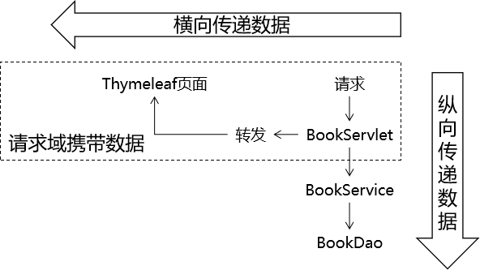

#### 会话域(还没学)

会话域的范围是一次会话


#### 应用域(全局域)

应用域的范围是整个项目全局


### 在Thymeleaf中操作域对象

我们通常的做法是，在Servlet中将数据存储到域对象中，而在使用了Thymeleaf的前端页面中取出域对象中的数据并展示

#### 操作请求域

Servlet中代码：

```java
String requestAttrName = "helloRequestAttr";
String requestAttrValue = "helloRequestAttr-VALUE";

request.setAttribute(requestAttrName, requestAttrValue);
```

Thymeleaf表达式：

```html
<p th:text="${helloRequestAttr}">request field value</p>
```

#### 操作会话域

Servlet中代码：

```java
// ①通过request对象获取session对象
HttpSession session = request.getSession();

// ②存入数据
session.setAttribute("helloSessionAttr", "helloSessionAttr-VALUE");
```

Thymeleaf表达式：

```html
<p th:text="${session.helloSessionAttr}">这里显示会话域数据</p>
```

#### 操作应用域

Servlet中代码：

```java
// ①通过调用父类的方法获取ServletContext对象
ServletContext servletContext = getServletContext();

// ②存入数据
servletContext.setAttribute("helloAppAttr", "helloAppAttr-VALUE");
```

Thymeleaf表达式：

```html
<p th:text="${application.helloAppAttr}">这里显示应用域数据</p>
```

## 18.4.获取请求参数

### 获取请求参数的语法

```html
${param.参数名}
```

### 根据一个参数名获取一个参数值

页面代码：

```html
<p th:text="${param.username}">这里替换为请求参数的值</p>
```

页面显示效果：


### 根据一个参数名获取多个参数值

页面代码：

```html
<p th:text="${param.team}">这里替换为请求参数的值</p>
```

页面显示效果：


如果想要精确获取某一个值，可以使用数组下标。页面代码：

```html
<p th:text="${param.team[0]}">这里替换为请求参数的值</p>
<p th:text="${param.team[1]}">这里替换为请求参数的值</p>
```

页面显示效果：


## 18.5.内置对象

### 内置对象的概念

所谓内置对象其实就是在Thymeleaf的表达式中<span style="color:blue;font-weight:bold;">可以直接使用</span>的对象

### 基本内置对象


用法举例：

```html
<h3>表达式的基本内置对象</h3>
<p th:text="${#request.getContextPath()}">调用#request对象的getContextPath()方法</p>
<p th:text="${#request.getAttribute('helloRequestAttr')}">调用#request对象的getAttribute()方法，读取属性域</p>
```

基本思路：

- 如果不清楚这个对象有哪些方法可以使用，那么就通过getClass().getName()获取全类名，再回到Java环境查看这个对象有哪些方法
- 内置对象的方法可以直接调用
- 调用方法时需要传参的也可以直接传入参数

### 公共内置对象


Servlet中将List集合数据存入请求域：

```java
request.setAttribute("aNotEmptyList", Arrays.asList("aaa","bbb","ccc"));
request.setAttribute("anEmptyList", new ArrayList<>());
```

页面代码：

```html
<p>#list对象isEmpty方法判断集合整体是否为空aNotEmptyList：<span th:text="${#lists.isEmpty(aNotEmptyList)}">测试#lists</span></p>
<p>#list对象isEmpty方法判断集合整体是否为空anEmptyList：<span th:text="${#lists.isEmpty(anEmptyList)}">测试#lists</span></p>
```

公共内置对象对应的源码位置：


## 18.6.OGNL

### OGNL的概念

OGNL：Object-Graph Navigation Language对象-图 导航语言

### 对象图的概念

从根对象触发，通过特定的语法，逐层访问对象的各种属性。


### OGNL语法

#### 起点

在Thymeleaf环境下，${}中的表达式可以从下列元素开始：

- 访问属性域的起点
  - 请求域属性名
  - session
  - application
- param
- 内置对象
  - request
  - session
  - lists
  - strings

#### 属性访问语法

- 访问对象属性：使用getXxx()、setXxx()方法定义的属性
  - 对象.属性名
- 访问List集合或数组
  - 集合或数组[下标]
- 访问Map集合
  - Map集合.key
  - Map集合['key']

## 18.7.分支与迭代

### 分支

#### if和unless

让标记了th:if、th:unless的标签根据条件决定是否显示。

示例的实体类：

```java
package com.atguigu.bean;

/**
 * 包名:com.atguigu.bean
 *
 * @author Leevi
 * 日期2021-05-13  10:58
 */
public class Teacher {
    private String teacherName;

    public Teacher() {
    }

    public Teacher(String teacherName) {
        this.teacherName = teacherName;
    }

    public String getTeacherName() {
        return teacherName;
    }

    public void setTeacherName(String teacherName) {
        this.teacherName = teacherName;
    }
}
```

示例的Servlet代码：

```java
protected void doGet(HttpServletRequest request, HttpServletResponse response) throws ServletException, IOException {

    // 1.创建ArrayList对象并填充
    List<Employee> employeeList = new ArrayList<>();

    employeeList.add(new Employee(1, "tom", 500.00));
    employeeList.add(new Employee(2, "jerry", 600.00));
    employeeList.add(new Employee(3, "harry", 700.00));

    // 2.将集合数据存入请求域
    request.setAttribute("employeeList", employeeList);

    // 3.调用父类方法渲染视图
    super.processTemplate("list", request, response);
}
```

示例的HTML代码：

```html
<table>
    <tr>
        <th>员工编号</th>
        <th>员工姓名</th>
        <th>员工工资</th>
    </tr>
    <tr th:if="${#lists.isEmpty(employeeList)}">
        <td colspan="3">抱歉！没有查询到你搜索的数据！</td>
    </tr>
    <tr th:if="${not #lists.isEmpty(employeeList)}">
        <td colspan="3">有数据！</td>
    </tr>
    <tr th:unless="${#lists.isEmpty(employeeList)}">
        <td colspan="3">有数据！</td>
    </tr>
</table>
```

if配合not关键词和unless配合原表达式效果是一样的，看自己的喜好。

#### switch

```html
<h3>测试switch</h3>
<div th:switch="${user.memberLevel}">
    <p th:case="level-1">银牌会员</p>
    <p th:case="level-2">金牌会员</p>
    <p th:case="level-3">白金会员</p>
    <p th:case="level-4">钻石会员</p>
</div>
```

### 迭代

在迭代过程中，可以参考下面的说明使用迭代状态：

```html
<!--遍历显示请求域中的teacherList-->
<table border="1" cellspacing="0" width="500">
    <tr>
        <th>编号</th>
        <th>姓名</th>
    </tr>
    <tbody th:if="${#lists.isEmpty(teacherList)}">
        <tr>
            <td colspan="2">教师的集合是空的!!!</td>
        </tr>
    </tbody>

    <!--
集合不为空，遍历展示数据
-->
    <tbody th:unless="${#lists.isEmpty(teacherList)}">
        <!--
使用th:each遍历
用法:
1. th:each写在什么标签上？ 每次遍历出来一条数据就要添加一个什么标签，那么th:each就写在这个标签上
2. th:each的语法    th:each="遍历出来的数据,数据的状态 : 要遍历的数据"
3. status表示遍历的状态，它包含如下属性:
3.1 index 遍历出来的每一个元素的下标
3.2 count 遍历出来的每一个元素的计数
3.3 size 遍历的集合的长度
3.4 current 遍历出来的当前元素
3.5 even/odd 表示遍历出来的元素是否是奇数或者是否是偶数
3.6 first 表示遍历出来的元素是否是第一个
3.7 last 表示遍历出来的元素是否是最后一个
-->
        <tr th:each="teacher,status : ${teacherList}">
            <td th:text="${status.count}">这里显示编号</td>
            <td th:text="${teacher.teacherName}">这里显示老师的名字</td>
        </tr>
    </tbody>
</table>
```

## 18.8.Thymeleaf包含其他模板文件

### 应用场景

抽取各个页面的公共部分：


### 操作步骤

#### 创建页面的公共代码片段

使用th:fragment来给这个片段命名：

```html
<div th:fragment="header">
    <p>被抽取出来的头部内容</p>
</div>
```

#### 在需要的页面中进行包含

| 语法       | 效果                                                     | 特点                                       |
| ---------- | -------------------------------------------------------- | ------------------------------------------ |
| th:insert  | 把目标的代码片段整个插入到当前标签内部                   | 它会保留页面自身的标签                     |
| th:replace | 用目标的代码替换当前标签                                 | 它不会保留页面自身的标签                   |
| th:include | 把目标的代码片段去除最外层标签，然后再插入到当前标签内部 | 它会去掉片段外层标记，同时保留页面自身标记 |

页面代码举例：

```html
<!-- 代码片段所在页面的逻辑视图 :: 代码片段的名称 -->
<div id="badBoy" th:insert="segment :: header">
    div标签的原始内容
</div>

<div id="worseBoy" th:replace="segment :: header">
    div标签的原始内容
</div>

<div id="worstBoy" th:include="segment :: header">
    div标签的原始内容
</div>
```

# 19.CRUD练习

## 19.1.数据建模

### 物理建模

```sql
CREATE DATABASE `view-demo`CHARACTER SET utf8;
USE `view-demo`;
CREATE TABLE t_soldier(
    soldier_id INT PRIMARY KEY AUTO_INCREMENT,
    soldier_name CHAR(100),
    soldier_weapon CHAR(100)
);
```

### 逻辑建模

```java
public class Soldier {
    
    private Integer soldierId;
    private String soldierName;
    private String soldierWeapon;
    ... 
```

## 19.2.总体架构


## 19.3.搭建环境

### 搭建持久层环境

1. 拷贝持久层的jar包: mysql驱动、druid、dbutils、junit、BeanUtils
2. 拷贝JDBCUtils工具类、jdbc.properties文件、BaseDao类

### 搭建Thymeleaf环境

1. 拷贝Thymeleaf所需的jar包

2. 拷贝ViewBaseServlet类

3. 配置web.xml

   ```xml
   <!-- 在上下文参数中配置视图前缀和视图后缀 -->
   <context-param>
       <param-name>view-prefix</param-name>
       <param-value>/WEB-INF/view/</param-value>
   </context-param>
   <context-param>
       <param-name>view-suffix</param-name>
       <param-value>.html</param-value>
   </context-param>
   ```

4. 创建view目录

   

## 19.4.需要实现的功能列表

- 显示首页：浏览器通过index.html访问首页Servlet，然后再解析对应的模板视图
- 显示列表：在首页点击超链接，跳转到目标页面把所有士兵的信息列表显示出来
- 删除信息：在列表上点击删除超链接，执行信息的删除操作
- 新增信息：
  - 在列表页面点击超链接跳转到新增士兵信息的表单页面
  - 在新增信息的表单页面点击提交按钮执行保存
- 更新信息：
  - 在列表上点击更新超链接，跳转到更新士兵信息的表单页面：表单回显
  - 在更新信息的表单页面点击提交按钮执行更新

## 19.5.显示首页功能

### 目标

浏览器访问index.html，通过首页Servlet，渲染视图，显示首页。

### 思路


### 代码

#### 创建PortalServlet

```xml
<servlet>
    <servlet-name>PortalServlet</servlet-name>
    <servlet-class>com.atguigu.servlet.PortalServlet</servlet-class>
</servlet>
<servlet-mapping>
    <servlet-name>PortalServlet</servlet-name>
    <url-pattern>/portal</url-pattern>
</servlet-mapping>
```

Servlet代码：

```java
package com.atguigu.servlet;

import javax.servlet.ServletException;
import javax.servlet.http.HttpServletRequest;
import javax.servlet.http.HttpServletResponse;
import java.io.IOException;

/**
 * @author Leevi
 * 日期2021-05-13  14:07
 */
public class PortalServlet extends ViewBaseServlet {
    @Override
    protected void doPost(HttpServletRequest request, HttpServletResponse response) throws ServletException, IOException {
        doGet(request, response);
    }

    @Override
    protected void doGet(HttpServletRequest request, HttpServletResponse response) throws ServletException, IOException {
        //跳转到首页
        processTemplate("index",request,response);
    }
}
```

#### 创建portal.html


```html
<!DOCTYPE html>
<html lang="en" xmlns:th="http://www.thymeleaf.org">
    <head>
        <meta charset="UTF-8">
        <title>首页</title>
    </head>
    <body>
        <!--
查询士兵列表
-->
        <a th:href="@{/soldier(method='showAll')}">查看士兵列表</a>
    </body>
</html>
```

## 19.6.显示列表

### 目标

在目标页面显示所有士兵信息，士兵信息是从数据库查询出来的

### 思路


### 代码

#### ModelBaseServlet

创建这个基类的原因是：我们希望每一个模块能够对应同一个Servlet，这个模块所需要调用的所有方法都集中在同一个Servlet中。如果没有这个ModelBaseServlet基类，我们doGet()、doPost()方法可以用来处理请求，这样一来，每一个方法都需要专门创建一个Servlet（就好比咱们之前的LoginServlet、RegisterServlet其实都应该合并为UserServlet）。

```java
package com.atguigu.servlet;

import javax.servlet.ServletException;
import javax.servlet.http.HttpServletRequest;
import javax.servlet.http.HttpServletResponse;
import java.io.IOException;
import java.lang.reflect.Method;

/**
 * @author Leevi
 * 日期2021-05-13  16:31
 */
public class ModelBaseServlet extends ViewBaseServlet {
    @Override
    protected void doPost(HttpServletRequest request, HttpServletResponse response) throws ServletException, IOException {
        doGet(request, response);
    }

    @Override
    protected void doGet(HttpServletRequest request, HttpServletResponse response) throws ServletException, IOException {
        request.setCharacterEncoding("UTF-8");
        response.setContentType("text/html;charset=UTF-8");
        //获取请求参数method的值
        String method = request.getParameter("method");
        //method参数的值就是要调用的方法的方法名，那就是已知方法名要去查找调用本对象的方法
        try {
            Method declaredMethod = this.getClass().getDeclaredMethod(method, HttpServletRequest.class, HttpServletResponse.class);

            //暴力反射
            declaredMethod.setAccessible(true);
            //调用方法
            declaredMethod.invoke(this,request,response);
        } catch (Exception e) {
            e.printStackTrace();
        }
    }
}
```

#### SoldierDao.selectSoldierList()


接口方法：

```java
public interface SoldierDao {
   /**
     * 查询所有士兵
     * @return
     */
    List<Soldier> findAll() throws SQLException;
}
```

实现类方法：

```java
public class SoldierDaoImpl extends BaseDao<Soldier> implements SoldierDao {
    @Override
    public List<Soldier> findAll() throws SQLException {
        String sql = "select soldier_id soldierId,soldier_name soldierName,soldier_weapon soldierWeapon from t_soldier";
        return getBeanList(Soldier.class,sql);
    }
}
```

#### SoldierService.getSoldierList()


接口方法：

```java
public interface SoldierService {

    /**
     * 查询所有士兵信息
     * @return
     */
    List<Soldier> findAllSoldier() throws Exception;

}
```

实现类方法：

```java
public class SoldierServiceImpl implements SoldierService {

    private SoldierDao soldierDao = new SoldierDaoImpl();

    @Override
    public List<Soldier> findAllSoldier() throws Exception {
        return soldierDao.findAll();
    }
}
```

#### SoldierServlet.showList()

```java
/**
     * 处理查询所有士兵信息的请求
     * @param request
     * @param response
     */
public void showAll(HttpServletRequest request,HttpServletResponse response){
    try {
        //调用业务层的方法查询士兵列表
        List<Soldier> soldierList = soldierService.findAllSoldier();
        //将soldierList存储到域对象
        request.setAttribute("soldierList",soldierList);
        //跳转到展示页面进行展示
        processTemplate("list",request,response);
    } catch (Exception e) {
        e.printStackTrace();
    }
}
```

#### 显示士兵列表的list.html页面

```html
<!DOCTYPE html>
<html lang="en" xmlns:th="http://www.thymeleaf.org">
<head>
    <meta charset="UTF-8">
    <title>士兵列表展示页面</title>
</head>
<body>
    <table border="1" cellspacing="0" width="800">
        <tr>
            <th>士兵的编号</th>
            <th>士兵的姓名</th>
            <th>士兵的武器</th>
            <th>删除信息</th>
            <th>修改信息</th>
        </tr>
        <tbody th:if="${#lists.isEmpty(soldierList)}">
            <tr>
                <td th:colspan="5">没有士兵数据，请添加士兵</td>
            </tr>
        </tbody>

        <tbody th:unless="${#lists.isEmpty(soldierList)}">
            <tr th:each="soldier : ${soldierList}">
                <td th:text="${soldier.soldierId}">士兵的编号</td>
                <td th:text="${soldier.soldierName}">士兵的姓名</td>
                <td th:text="${soldier.soldierWeapon}">士兵的武器</td>
                <td><a th:href="@{/soldier(method='deleteSoldier',id=${soldier.soldierId})}">删除信息</a></td>
                <td><a th:href="@{/soldier(method='toUpdatePage',id=${soldier.soldierId})}">修改信息</a></td>
            </tr>
        </tbody>
        <tfoot>
            <tr>
                <td th:colspan="5" align="center">
                    <a th:href="@{/soldier(method='toAddPage')}">添加士兵信息</a>
                </td>
            </tr>
        </tfoot>
    </table>
</body>
</html>
```

## 19.7.删除功能

### 目标

点击页面上的超链接，把数据库表中的记录删除。

### 思路


### 代码

#### 完成删除超链接


```html
<td><a th:href="@{/soldier(method='deleteSoldier',id=${soldier.soldierId})}">删除信息</a></td>
```

关于@{地址}附加请求参数的语法格式：

- 只有一个请求参数：@{地址(请求参数名=普通字符串)}或@{地址(请求参数名=${需要解析的表达式})}
- 多个请求参数：@{地址(名=值,名=值)}

官方文档中的说明如下：


#### Servlet方法

```java
/**
     * 删除士兵信息
     * @param request
     * @param response
     * @throws IOException
     */
public void deleteSoldier(HttpServletRequest request,HttpServletResponse response) throws IOException {
    //1. 获取请求参数：id
    Integer id = Integer.valueOf(request.getParameter("id"));
    //2. 调用业务层的方法，根据id删除士兵
    try {
        soldierService.deleteSoldierById(id);
        //3. 删除成功,重新查询所有
        response.sendRedirect(request.getContextPath()+"/soldier?method=showAll");
    } catch (Exception e) {
        e.printStackTrace();
    }
}
```

#### Service方法

```java
@Override
public void deleteSoldierById(Integer id) throws Exception{
    soldierDao.deleteSoldierById(id);
}
```

#### Dao方法

```java
@Override
public void deleteSoldierById(Integer id) throws SQLException {
    String sql = "delete from t_soldier where soldier_id=?";
    update(sql,id);
}
```

## 19.8.前往新增信息的表单页面

### 创建超链接

```html
<a th:href="@{/soldier(method='toAddPage')}">添加士兵信息</a>
```

### Servlet

```java
/**
     * 跳转到添加页面
     * @param request
     * @param response
     */
public void toAddPage(HttpServletRequest request,HttpServletResponse response) throws IOException {
    processTemplate("add",request,response);
}
```

### 创建表单页面


```html
<!DOCTYPE html>
<html lang="en" xmlns:th="http://www.thymeleaf.org">
    <head>
        <meta charset="UTF-8">
        <title>添加士兵的页面</title>
    </head>
    <body>
        <form th:action="@{/soldier(method='addSoldier')}" method="post">
            士兵姓名<input name="soldierName"/><br/>
            士兵武器<input name="soldierWeapon"/><br/>
            <input type="submit" value="添加">
        </form>
    </body>
</html>
```

## 19.9.执行保存

### 目标

提交表单后，将表单数据封装为Soldier对象，然后将Soldier对象保存到数据库。

### 思路


### 代码

#### Servlet方法

```java
/**
     * 添加士兵信息
     * @param request
     * @param response
     * @throws IOException
     */
public void addSoldier(HttpServletRequest request,HttpServletResponse response) throws IOException {
    //1. 获取请求参数
    Map<String, String[]> parameterMap = request.getParameterMap();
    //2. 将请求参数封装到Soldier对象
    Soldier soldier = new Soldier();
    try {
        BeanUtils.populate(soldier,parameterMap);
        //3. 调用业务层的方法处理添加士兵的功能
        soldierService.addSoldier(soldier);

        //4. 跳转到查看所有士兵信息列表
        response.sendRedirect(request.getContextPath()+"/soldier?method=showAll");
    } catch (Exception e) {
        e.printStackTrace();
    }
}
```

#### Service方法

```java
@Override
public void addSoldier(Soldier soldier) throws Exception {
    soldierDao.addSoldier(soldier);
}
```

#### Dao方法

```java
@Override
public void addSoldier(Soldier soldier) throws SQLException {
    String sql = "insert into t_soldier (soldier_name,soldier_weapon) values (?,?)";
    update(sql,soldier.getSoldierName(),soldier.getSoldierWeapon());
}
```

## 19.10.前往修改信息的表单页面


### 创建超链接

```html
<a th:href="@{/soldier(method='toUpdatePage',id=${soldier.soldierId})}">修改信息</a>
```

### Servlet方法

```java
/**
     * 跳转到修改页面
     * @param request
     * @param response
     * @throws IOException
     */
public void toUpdatePage(HttpServletRequest request,HttpServletResponse response) throws IOException {
    //获取要修改的士兵的id
    Integer id = Integer.valueOf(request.getParameter("id"));
    //查询出当前士兵的信息
    try {
        Soldier soldier = soldierService.findSoldierById(id);
        //将soldier存储到请求域中
        request.setAttribute("soldier",soldier);

        //跳转到修改页面
        processTemplate("update",request,response);
    } catch (Exception e) {
        e.printStackTrace();
    }
}
```

### Service方法

```java
@Override
public Soldier findSoldierById(Integer id) throws Exception {

    return soldierDao.findSoldierById(id);
}
```

### Dao方法

```java
@Override
public Soldier findSoldierById(Integer id) throws SQLException {
    String sql = "select soldier_id soldierId,soldier_name soldierName,soldier_weapon soldierWeapon from t_soldier where soldier_id=?";

    return getBean(Soldier.class,sql,id);
}
```

### 表单页面

```html
<!DOCTYPE html>
<html lang="en" xmlns:th="http://www.thymeleaf.org">
    <head>
        <meta charset="UTF-8">
        <title>修改页面</title>
    </head>
    <body>
        <form th:action="@{/soldier(method='updateSoldier')}" method="post">
            <input type="hidden" name="soldierId" th:value="${soldier.soldierId}"/>
            士兵姓名<input type="text" th:value="${soldier.soldierName}" name="soldierName"/><br/>
            士兵武器<input type="text" th:value="${soldier.soldierWeapon}" name="soldierWeapon"/><br/>
            <input type="submit" value="修改"/>
        </form>
    </body>
</html>
```

## 19.11.执行更新


### Servlet方法

```java
/**
     * 修改士兵信息
     * @param request
     * @param response
     * @throws IOException
     */
public void updateSoldier(HttpServletRequest request,HttpServletResponse response) throws IOException {
    //1. 获取请求参数
    Map<String, String[]> parameterMap = request.getParameterMap();
    //2. 将请求参数封装到Soldier对象
    Soldier soldier = new Soldier();
    try {
        BeanUtils.populate(soldier,parameterMap);
        //3. 调用业务层的方法执行修改
        soldierService.updateSoldier(soldier);
        //4. 修改成功之后重新查询所有
        response.sendRedirect(request.getContextPath()+"/soldier?method=showAll");
    } catch (Exception e) {
        e.printStackTrace();
    }
}
```

### Service方法

```java
@Override
public void updateSoldier(Soldier soldier) throws Exception {
    soldierDao.updateSoldier(soldier);
}
```

### Dao方法

```java
@Override
public void updateSoldier(Soldier soldier) throws SQLException {
    String sql = "update t_soldier set soldier_name=?, soldier_weapon=? where soldier_id=?";
    update(sql,soldier.getSoldierName(),soldier.getSoldierWeapon(),soldier.getSoldierId());
}s
```

# 20.会话

## 20.1.为什么需要会话控制


保持用户登录状态，就是当用户在登录之后，会在服务器中保存该用户的登录状态，当该用户后续访问该项目中的其它动态资源(Servlet或者Thymeleaf)的时候，能够判断当前是否是已经登录过的。而从用户登录到用户退出登录这个过程中所发生的所有请求，其实都是在一次会话范围之内

## 20.2.域对象的范围

### 应用域的范围


整个项目部署之后，只会有一个应用域对象，所有客户端都是共同访问同一个应用域对象，在该项目的所有动态资源中也是共用一个应用域对象

### 请求域的范围


每一次请求都有一个请求域对象，当请求结束的时候对应的请求域对象也就销毁了

## 20.3.会话域的范围


会话域是从客户端连接上服务器开始，一直到客户端关闭，这一整个过程中发生的所有请求都在同一个会话域中；而不同的客户端是不能共用会话域的

## 20.4.Cookie技术

### Cookie的概念

Cookie是一种客户端的会话技术,它是服务器存放在浏览器的一小份数据,浏览器以后每次访问该服务器的时候都会将这小份数据携带到服务器去。


### Cookie的作用

1. 在浏览器中存放数据
2. 将浏览器中存放的数据携带到服务器

### Cookie的应用场景

1.记住用户名
当我们在用户名的输入框中输入完用户名后,浏览器记录用户名,下一次再访问登录页面时,用户名自动填充到用户名的输入框.

2.保存电影的播放进度  

在网页上播放电影的时候,如果中途退出浏览器了,下载再打开浏览器播放同一部电影的时候,会自动跳转到上次退出时候的进度,因为在播放的时候会将播放进度保存到cookie中

### Cookie的入门案例

#### 目标

实现在ServletDemo01和ServletDemo02之间共享数据，要求在会话域范围内共享

#### Cookie相关的API

+ 创建一个Cookie对象(cookie只能保存字符串数据。且不能保存中文)

```java
new Cookie(String name,String value);
```

+  把cookie写回浏览器

```java
response.addCookie(cookie); 
```

+ 获得浏览器带过来的所有Cookie:

```java
request.getCookies() ; //得到所有的cookie对象。是一个数组，开发中根据key得到目标cookie
```

+ cookie的 API

```java
cookie.getName() ; //返回cookie中设置的key
cookie.getValue(); //返回cookie中设置的value
```

#### ServletDemo01代码

在ServletDemo01中创建Cookie数据并响应给客户端

```java
public class ServletDemo01 extends HttpServlet {
    @Override
    protected void doPost(HttpServletRequest request, HttpServletResponse response) throws ServletException, IOException {
        doGet(request, response);
    }

    @Override
    protected void doGet(HttpServletRequest request, HttpServletResponse response) throws ServletException, IOException {
        //1. 创建一个cookie对象，用于存放键值对
        Cookie cookie = new Cookie("cookie-message","hello-cookie");

        //2. 将cookie添加到response中
        //底层是通过一个名为"Set-Cookie"的响应头携带到浏览器的
        response.addCookie(cookie);
    }
}
```


#### 浏览器发送请求携带Cookie

这里不需要我们操作，浏览器会在给服务器发送请求的时候，将cookie通过请求头自动携带到服务器


#### ServletDemo02获取Cookie数据的代码

```java
public class ServletDemo02 extends HttpServlet {
    @Override
    protected void doPost(HttpServletRequest request, HttpServletResponse response) throws ServletException, IOException {
        doGet(request, response);
    }

    @Override
    protected void doGet(HttpServletRequest request, HttpServletResponse response) throws ServletException, IOException {
        //1. 从请求中取出cookie
        //底层是由名为"Cookie"的请求头携带的
        Cookie[] cookies = request.getCookies();

        //2. 遍历出每一个cookie
        if (cookies != null) {
            for (Cookie cookie : cookies) {
                //匹配cookie的name
                if (cookie.getName().equals("cookie-message")) {
                    //它就是我们想要的那个cookie
                    //我们就获取它的value
                    String value = cookie.getValue();
                    System.out.println("在ServletDemo02中获取str的值为：" + value);
                }
            }
        }
    }
}
```

### Cookie的时效性

如果我们不设置Cookie的时效性，默认情况下Cookie的有效期是一次会话范围内，我们可以通过cookie的setMaxAge()方法让Cookie持久化保存到浏览器上

- 会话级Cookie
  - 服务器端并没有明确指定Cookie的存在时间
  - 在浏览器端，Cookie数据存在于内存中
  - 只要浏览器还开着，Cookie数据就一直都在
  - 浏览器关闭，内存中的Cookie数据就会被释放
- 持久化Cookie
  - 服务器端明确设置了Cookie的存在时间
  - 在浏览器端，Cookie数据会被保存到硬盘上
  - Cookie在硬盘上存在的时间根据服务器端限定的时间来管控，不受浏览器关闭的影响
  - 持久化Cookie到达了预设的时间会被释放

`cookie.setMaxAge(int expiry)`参数单位是秒，表示cookie的持久化时间，如果设置参数为0，表示将浏览器中保存的该cookie删除

### Cookie的domain和path

上网时间长了，本地会保存很多Cookie。对浏览器来说，访问互联网资源时不能每次都把所有Cookie带上。浏览器会使用Cookie的domain和path属性值来和当前访问的地址进行比较，从而决定是否携带这个Cookie。

我们可以通过调用cookie的setPath()和setDomain()方法来设置cookie的domain和path


目前不会涉及到域名以及不深入到复杂的路径，所以仅需要知道设置路径为当前项目即可，即：

```java
cookie.setPath(request.getContextPath());
```

## 20.5.Session技术

### session概述 

session是服务器端的技术。服务器为每一个浏览器开辟一块内存空间，即session对象。由于session对象是每一个浏览器特有的，所以用户的记录可以存放在session对象中

### Session的入门案例

#### 目标

实现在ServletDemo01和ServletDemo02之间共享数据，要求在会话域范围内共享

#### Session的API介绍

- request.getSession(); 获得session(如果第一次调用的时候其实是创建session,第一次之后通过sessionId找到session进行使用)
- Object getAttribute(String name) ;获取值
- void setAttribute(String name, Object value) ;存储值
- void removeAttribute(String name)  ;移除值

#### 在ServletDemo01中往Session域对象存储数据

```java
public class ServletDemo01 extends HttpServlet {
    @Override
    protected void doPost(HttpServletRequest request, HttpServletResponse response) throws ServletException, IOException {
        doGet(request, response);
    }

    @Override
    protected void doGet(HttpServletRequest request, HttpServletResponse response) throws ServletException, IOException {
        //1. 获取Session对象
        HttpSession session = request.getSession();
        //2. 往Session对象中存入数据
        session.setAttribute("session-message","hello-session");
    }
}
```

#### 在ServletDemo02中从Session域对象中获取数据

```java
public class ServletDemo02 extends HttpServlet {
    @Override
    protected void doPost(HttpServletRequest request, HttpServletResponse response) throws ServletException, IOException {
        doGet(request, response);
    }

    @Override
    protected void doGet(HttpServletRequest request, HttpServletResponse response) throws ServletException, IOException {
        //1. 获取Session对象
        HttpSession session = request.getSession();
        //2. 往Session对象中存入数据
        String message = (String)session.getAttribute("session-message");
        System.out.println(message);
    }
}
```

### Session的工作机制

前提：浏览器正常访问服务器

- 服务器端没调用request.getSession()方法：什么都不会发生
- 服务器端调用了request.getSession()方法
  - 服务器端检查当前请求中是否携带了JSESSIONID的Cookie
    - 有：根据JSESSIONID在服务器端查找对应的HttpSession对象
      - 能找到：将找到的HttpSession对象作为request.getSession()方法的返回值返回
      - 找不到：服务器端新建一个HttpSession对象作为request.getSession()方法的返回值返回
    - 无：服务器端新建一个HttpSession对象作为request.getSession()方法的返回值返回


**代码验证**

```java
// 1.调用request对象的方法尝试获取HttpSession对象
HttpSession session = request.getSession();

// 2.调用HttpSession对象的isNew()方法
boolean wetherNew = session.isNew();

// 3.打印HttpSession对象是否为新对象
System.out.println("wetherNew = " + (wetherNew?"HttpSession对象是新的":"HttpSession对象是旧的"));

// 4.调用HttpSession对象的getId()方法
String id = session.getId();

// 5.打印JSESSIONID的值
System.out.println("JSESSIONID = " + id);
```

### Session的时效性

#### 为什么Session要设置时限

用户量很大之后，Session对象相应的也要创建很多。如果一味创建不释放，那么服务器端的内存迟早要被耗尽。

#### 设置时限的难点

从服务器端的角度，很难精确得知类似浏览器关闭的动作。而且即使浏览器一直没有关闭，也不代表用户仍然在使用。

#### 服务器端给Session对象设置最大闲置时间

- 默认值：1800秒

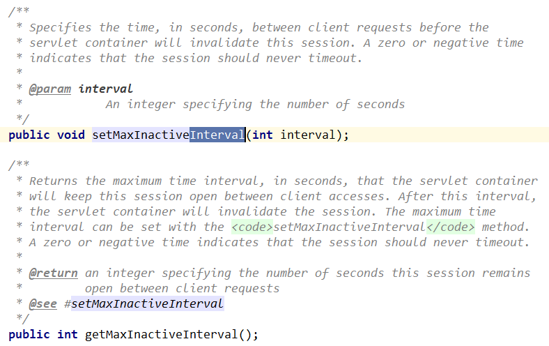

最大闲置时间生效的机制如下：

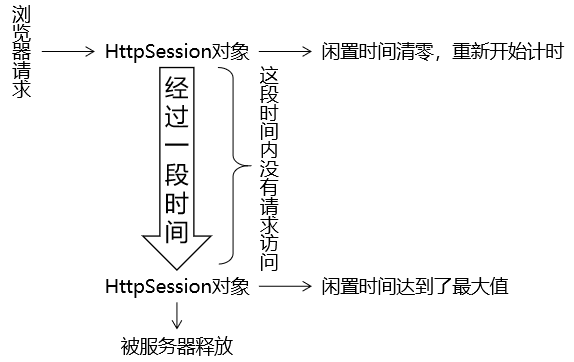

**代码验证：**

```java
// ※测试时效性
// 获取默认的最大闲置时间
int maxInactiveIntervalSecond = session.getMaxInactiveInterval();
System.out.println("maxInactiveIntervalSecond = " + maxInactiveIntervalSecond);

// 设置默认的最大闲置时间
session.setMaxInactiveInterval(15);
```

#### 强制Session立即失效

```java
session.invalidate();
```

# 21.Filter

## 21.1.Filter的概念

Filter：一个实现了特殊接口(Filter)的Java类. 实现对请求资源(jsp,servlet,html,)的过滤的功能.  过滤器是一个运行在服务器的程序, 优先于请求资源(Servlet或者jsp,html)之前执行. 过滤器是javaweb技术中**最为实用**的技术之一

## 21.2.Filter的作用

Filter的作用是对目标资源(Servlet,jsp)进行过滤，其应用场景有: 登录权限检查,解决网站乱码,过滤敏感字符等等

## 21.3.Filter的入门案例

### 案例目标

实现在请求到达ServletDemo01之前解决请求参数的中文乱码

### 代码实现

#### 创建ServletDemo01

web.xml代码

```xml
<servlet>
    <servlet-name>servletDemo01</servlet-name>
    <servlet-class>com.atguigu.ServletDemo01</servlet-class>
</servlet>
<servlet-mapping>
    <servlet-name>servletDemo01</servlet-name>
    <url-pattern>/ServletDemo01</url-pattern>
</servlet-mapping>
```

ServletDemo01代码

```java
package com.atguigu.servlet;

import javax.servlet.ServletException;
import javax.servlet.http.HttpServlet;
import javax.servlet.http.HttpServletRequest;
import javax.servlet.http.HttpServletResponse;
import java.io.IOException;

/**
 * @author Leevi
 * 日期2021-05-18  08:53
 */
public class ServletDemo01 extends HttpServlet {
    @Override
    protected void doPost(HttpServletRequest request, HttpServletResponse response) throws ServletException, IOException {
        doGet(request, response);
    }

    @Override
    protected void doGet(HttpServletRequest request, HttpServletResponse response) throws ServletException, IOException {
        String username = request.getParameter("username");
        System.out.println("ServletDemo01接收到了一个请求..."+username);
    }
}
```

前端页面代码

```html
<!DOCTYPE html>
<html lang="en">
<head>
    <meta charset="UTF-8">
    <title>首页</title>
</head>
<body>
    <form action="/webday12/demo01" method="post">
        用户名<input type="text" name="username"/><br/>
        <input type="submit"/>
    </form>
</body>
</html>
```

如果此时没有Filter，那么客户端发送的请求直接到达ServletDemo01,中文请求参数就会发生乱码

#### 创建EncodingFilter

web.xml代码

```xml
<filter>
    <filter-name>encodingFilter</filter-name>
    <filter-class>com.atguigu.filter.EncodingFilter</filter-class>
</filter>
<filter-mapping>
    <filter-name>encodingFilter</filter-name>
    <!--url-pattern表示指定拦截哪些资源-->
    <url-pattern>/demo01</url-pattern>
</filter-mapping>
```

EncodingFilter代码

```java
package com.atguigu.filter;

import javax.servlet.*;
import javax.servlet.http.HttpServletRequest;
import java.io.IOException;

/**
 * @author Leevi
 * 日期2021-05-18  08:56
 * 编写过滤器的步骤:
 * 1. 写一个类实现Filter接口，并且重写方法
 * 2. 在web.xml中配置该过滤器的拦截路径
 */
public class EncodingFilter implements Filter {
    @Override
    public void destroy() {
        
    }

    @Override
    public void doFilter(ServletRequest req, ServletResponse resp, FilterChain chain) throws ServletException, IOException {
        //解决请求参数的乱码
        HttpServletRequest request = (HttpServletRequest) req;
        request.setCharacterEncoding("UTF-8");

        //每次有请求被当前filter接收到的时候，就会执行doFilter进行过滤处理
        System.out.println("EncodingFilter接收到了一个请求...");

        //这句代码表示放行
        chain.doFilter(req, resp);
    }

    @Override
    public void init(FilterConfig config) throws ServletException {
        
    }

}
```

## 21.4.Filter的生命周期

### 回顾Servlet生命周期

#### Servlet的创建时机

Servlet默认在第一次接收请求的时候创建，我们可以通过`<load-on-startup>`标签配置Servlet在服务器启动的时候创建

#### Servlet的销毁时机

Servlet会在服务器关闭或者将项目从服务器上移除的时候销毁

### Filter的生命周期和生命周期方法

| 生命周期阶段 | 执行时机         | 生命周期方法                             |
| ------------ | ---------------- | ---------------------------------------- |
| 创建对象     | Web应用启动时    | init方法，通常在该方法中做初始化工作     |
| 拦截请求     | 接收到匹配的请求 | doFilter方法，通常在该方法中执行拦截过滤 |
| 销毁         | Web应用卸载前    | destroy方法，通常在该方法中执行资源释放  |

## 21.5.过滤器匹配规则

### 过滤器匹配的目的

过滤器匹配的目的是指定当前过滤器要拦截哪些资源

### 四种匹配规则

#### 精确匹配

指定被拦截资源的完整路径：

```xml
<!-- 配置Filter要拦截的目标资源 -->
<filter-mapping>
    <!-- 指定这个mapping对应的Filter名称 -->
    <filter-name>FilterDemo01</filter-name>

    <!-- 通过请求地址模式来设置要拦截的资源 -->
    <url-pattern>/demo01</url-pattern>
</filter-mapping>
```

上述例子表示要拦截映射路径为`/demo01`的这个资源

#### 模糊匹配

相比较精确匹配，使用模糊匹配可以让我们创建一个Filter就能够覆盖很多目标资源，不必专门为每一个目标资源都创建Filter，提高开发效率。

在我们配置了url-pattern为/user/*之后，请求地址只要是/user开头的那么就会被匹配。

```xml
<filter-mapping>
    <filter-name>Target02Filter</filter-name>

    <!-- 模糊匹配：前杠后星 -->
    <!--
        /user/demo01
        /user/demo02
        /user/demo03
		/demo04
    -->
    <url-pattern>/user/*</url-pattern>
</filter-mapping>
```

<span style="color:blue;font-weight:bold;">极端情况：/*匹配所有请求</span>

#### 扩展名匹配

```xml
<filter>
    <filter-name>Target04Filter</filter-name>
    <filter-class>com.atguigu.filter.filter.Target04Filter</filter-class>
</filter>
<filter-mapping>
    <filter-name>Target04Filter</filter-name>
    <url-pattern>*.png</url-pattern>
</filter-mapping>
```

上述例子表示拦截所有以`.png`结尾的请求

#### 匹配Servlet名称

```xml
<filter-mapping>
    <filter-name>Target05Filter</filter-name>

    <!-- 根据Servlet名称匹配 -->
    <servlet-name>Target01Servlet</servlet-name>
</filter-mapping>
```

## 21.6.过滤器链

### 过滤链的概念

一个请求可能被多个过滤器所过滤，只有当所有过滤器都放行，请求才能到达目标资源，如果有某一个过滤器没有放行，那么请求则无法到达后续过滤器以及目标资源，多个过滤器组成的链路就是过滤器链


### 过滤器链的顺序

过滤器链中每一个Filter执行的<span style="color:blue;font-weight:bold;">顺序是由web.xml中filter-mapping配置的顺序决定</span>的。

### 过滤器链案例

#### 创建ServletDemo01

web.xml代码

```xml
<servlet>
    <servlet-name>servletDemo01</servlet-name>
    <servlet-class>com.atguigu.ServletDemo01</servlet-class>
</servlet>
<servlet-mapping>
    <servlet-name>servletDemo01</servlet-name>
    <url-pattern>/ServletDemo01</url-pattern>
</servlet-mapping>
```

ServletDemo01代码

```java
public class ServletDemo01 extends HttpServlet {
    @Override
    protected void doPost(HttpServletRequest request, HttpServletResponse response) throws ServletException, IOException {
        doGet(request, response);
    }

    @Override
    protected void doGet(HttpServletRequest request, HttpServletResponse response) throws ServletException, IOException {
        System.out.println("ServletDemo01接收到了请求...");
    }
}
```

#### 创建多个Filter拦截Servlet

```xml
<filter-mapping>
    <filter-name>TargetChain03Filter</filter-name>
    <url-pattern>/Target05Servlet</url-pattern>
</filter-mapping>
<filter-mapping>
    <filter-name>TargetChain02Filter</filter-name>
    <url-pattern>/Target05Servlet</url-pattern>
</filter-mapping>
<filter-mapping>
    <filter-name>TargetChain01Filter</filter-name>
    <url-pattern>/Target05Servlet</url-pattern>
</filter-mapping>
```

# 22.扩展案例: 使用Filter过滤非法字符

## 22.1.非法字符过滤案例V1版本

### 目标

判断评论内容中是否包含某个固定的非法字符串，如果包含则请求无法到达CommentServlet

### 代码实现

前端页面代码

```html
<!DOCTYPE html>
<html lang="en">
<head>
    <meta charset="UTF-8">
    <title>评论页面</title>
</head>
<body>
    <form action="/webday12/illegal/comment" method="post">
        评论内容<input type="text" name="content"/>
        <input type="submit"/>
    </form>
</body>
</html>
```

EncodingFilter的代码，用于解决乱码

```java
package com.atguigu.filter;

import javax.servlet.*;
import java.io.IOException;

/**
 * @author Leevi
 * 日期2021-05-18  10:19
 */
public class EncodingFilter implements Filter {
    @Override
    public void destroy() {
    }

    @Override
    public void doFilter(ServletRequest req, ServletResponse resp, FilterChain chain) throws ServletException, IOException {
        //解决乱码
        req.setCharacterEncoding("UTF-8");
        resp.setContentType("text/html;charset=UTF-8");

        chain.doFilter(req, resp);
    }

    @Override
    public void init(FilterConfig config) throws ServletException {

    }

}

```

IllegalFilter的代码，用于过滤非法字符

```java
package com.atguigu.filter;

import javax.servlet.*;
import java.io.IOException;

/**
 * @author Leevi
 * 日期2021-05-18  10:22
 */
public class IllegalCharFilter implements Filter {
    @Override
    public void destroy() {
    }

    @Override
    public void doFilter(ServletRequest req, ServletResponse resp, FilterChain chain) throws ServletException, IOException {
        //1. 获取客户端提交的评论内容
        String content = req.getParameter("content");
        if (content != null) {
            //2. 判断content中是否包含非法字符
            if (content.contains("你大爷的")) {
                resp.getWriter().write("评论内容中包含非法字符，评论发布失败!!!");
                return;
            }
        }
        chain.doFilter(req, resp);
    }

    @Override
    public void init(FilterConfig config) throws ServletException {

    }

}
```

CommentServlet的代码，用于发表评论

```java
package com.atguigu.servlet;

import javax.servlet.ServletException;
import javax.servlet.http.HttpServlet;
import javax.servlet.http.HttpServletRequest;
import javax.servlet.http.HttpServletResponse;
import java.io.IOException;

/**
 * @author Leevi
 * 日期2021-05-18  10:17
 */
public class CommentServlet extends HttpServlet {
    @Override
    protected void doPost(HttpServletRequest request, HttpServletResponse response) throws ServletException, IOException {
        doGet(request, response);
    }

    @Override
    protected void doGet(HttpServletRequest request, HttpServletResponse response) throws ServletException, IOException {
        //1. 获取评论内容
        String content = request.getParameter("content");
        //2. 向客户端输出评论内容
        response.getWriter().write("恭喜你评论成功，评论内容是:"+content);
    }
}
```

web.xml中的配置

```xml
<?xml version="1.0" encoding="UTF-8"?>
<web-app xmlns="http://xmlns.jcp.org/xml/ns/javaee"
         xmlns:xsi="http://www.w3.org/2001/XMLSchema-instance"
         xsi:schemaLocation="http://xmlns.jcp.org/xml/ns/javaee http://xmlns.jcp.org/xml/ns/javaee/web-app_4_0.xsd"
         version="4.0">
    <filter>
        <filter-name>EncodingFilter</filter-name>
        <filter-class>com.atguigu.filter.EncodingFilter</filter-class>
    </filter>
    <filter-mapping>
        <filter-name>EncodingFilter</filter-name>
        <url-pattern>/*</url-pattern>
    </filter-mapping>

    <filter>
        <filter-name>IllegalCharFilter</filter-name>
        <filter-class>com.atguigu.filter.IllegalCharFilter</filter-class>
    </filter>
    <filter-mapping>
        <filter-name>IllegalCharFilter</filter-name>
        <url-pattern>/illegal/*</url-pattern>
    </filter-mapping>

    <servlet>
        <servlet-name>CommentServlet</servlet-name>
        <servlet-class>com.atguigu.servlet.CommentServlet</servlet-class>
    </servlet>
    <servlet-mapping>
        <servlet-name>CommentServlet</servlet-name>
        <url-pattern>/illegal/comment</url-pattern>
    </servlet-mapping>
</web-app>
```

## 22.2.非法字符过滤案例V2版本

### 目标

在第一个版本的基础之上，将固定的非法字符串替换成从illegal.txt文件中读取非法字符串

### 代码实现

IllegalFilter的代码

```java
package com.atguigu.filter;

import javax.servlet.*;
import java.io.BufferedReader;
import java.io.IOException;
import java.io.InputStreamReader;
import java.util.ArrayList;
import java.util.List;

/**
 * @author Leevi
 * 日期2021-05-18  10:22
 */
public class IllegalCharFilter implements Filter {
    private List<String> illegalTextList = new ArrayList<>();
    @Override
    public void destroy() {
    }

    @Override
    public void doFilter(ServletRequest req, ServletResponse resp, FilterChain chain) throws ServletException, IOException {
        //1. 获取客户端提交的评论内容
        String content = req.getParameter("content");
        if (content != null) {
            //3. 判断content中是否包含非法字符
            for (String illegalText : illegalTextList) {
                if (content.contains(illegalText)) {
                    resp.getWriter().write("评论内容中包含非法字符，评论发布失败!!!");
                    return;
                }
            }
        }
        chain.doFilter(req, resp);
    }

    @Override
    public void init(FilterConfig config) throws ServletException {
        //在这里读取illegal.txt文件,就只需要在项目部署的时候读取一次
        //将字节输入流进行包装--->InputStreamReader()----->BufferedReader()---->readLine
        BufferedReader bufferedReader = null;
        try {
            bufferedReader = new BufferedReader(new InputStreamReader(IllegalCharFilter.class.getClassLoader().getResourceAsStream("illegal.txt"), "UTF-8"));
            String illegalText = null;
            while ((illegalText = bufferedReader.readLine()) != null) {
                //将读到的那个字符串存储到集合中
                illegalTextList.add(illegalText);
            }
        }catch (Exception e){
            e.printStackTrace();
        }finally {
            try {
                bufferedReader.close();
            } catch (IOException e) {
                e.printStackTrace();
            }
        }
    }
}

```

其它的代码和V1版本相同

## 22.3.非法字符过滤案例V3版本

### 动态代理的初次介绍

**动态代理这个方法的思想了解即可，学习阶段不需要深究；**

代码如下：

```java
package top.sharehome;

import java.lang.reflect.InvocationHandler;
import java.lang.reflect.Method;
import java.lang.reflect.Proxy;
import java.util.ArrayList;
import java.util.List;

public class TestDynamicProxy {
    /**
     * 我们的一个目标就是，一个集合中只有张三，李四，王五，但是我们打印的时候需要打印出来一个赵六
     * 此时就要用到动态代理的方法，改变List集合中的方法
     *
     * @param args
     */
    public static void main(String[] args) {
        //使用动态代理改变List的方法
        //names就是要被代理对象
        List<String> names = new ArrayList<>();
        names.add("张三");
        names.add("李四");
        names.add("王五");
        //使用动态代理需要三个参数，第一个是被代理类的类加载器，第二个是被代理对象实现的接口的数组，第三个是InvocationHandler接口的实现类对象
        //首先找到被代理类
        Class<? extends List> clazz = names.getClass();
        //然后通过Proxy.newProxyInstance()方法获取代理对象
        List<String> proxyInstance = (List<String>) Proxy.newProxyInstance(clazz.getClassLoader(), clazz.getInterfaces(), new InvocationHandler() {
            @Override
            public Object invoke(Object proxy, Method method, Object[] args) throws Throwable {
                //这里就改变了List中的toString方法
                if (method.getName().equals("toString")) {
                    return "[赵六]";
                }
                //若要改变List中的add方法呢？
                if (method.getName().equals("add")){
                    //返回之后每次调用就是添加了"你好"
                    return method.invoke(names,"你好");
                }
                return method.invoke(names, args);
            }
        });
        //add()方法调用
        names.add("hello");
        proxyInstance.add("hello");
        //分别打印动态代理前后的代理对象
        System.out.println("动态代理前的对象（names）打印如下："+names);
        System.out.println("动态代理后的对象（proxyInstance）打印如下："+proxyInstance);
    }
}
```

打印效果如下：


**动态代理能够让我们在不重写方法的情况下，程序运行时改变原有的方法，这个思想经常在一些框架和源码中用到，比如连接池中的close()方法，原本的含义是关闭连接，但是在连接池中的含义是归还连接；**

### 目标

在第二版本的基础上，实现CommentServlet发布评论内容的时候将评论内容中的非法字符替换成*

### 代码实现

IllegalFilter的代码

```java
package com.atguigu.filter;

import javax.servlet.*;
import javax.servlet.http.HttpServletRequest;
import java.io.BufferedReader;
import java.io.IOException;
import java.io.InputStreamReader;
import java.lang.reflect.InvocationHandler;
import java.lang.reflect.Method;
import java.lang.reflect.Proxy;
import java.util.ArrayList;
import java.util.List;

/**
 * @author Leevi
 * 日期2021-05-18  10:22
 */
public class IllegalCharFilter implements Filter {
    private List<String> illegalTextList = new ArrayList<>();
    @Override
    public void destroy() {
    }

    @Override
    public void doFilter(ServletRequest req, ServletResponse resp, FilterChain chain) throws ServletException, IOException {
        //使用动态代理改变req对象的getParameter方法
        HttpServletRequest request = (HttpServletRequest) req;
        Class<? extends HttpServletRequest> clazz = request.getClass();
        HttpServletRequest proxyRequest = (HttpServletRequest) Proxy.newProxyInstance(clazz.getClassLoader(), clazz.getInterfaces(), new InvocationHandler() {
            @Override
            public Object invoke(Object proxy, Method method, Object[] args) throws Throwable {
                //改变getParameter()方法
                if(method.getName().equals("getParameter")){
                    //1. 调用原本的getParameter()方法，先获取到请求参数
                    String oldValue = (String) method.invoke(request, args);
                    //2. 判断oldValue中是否包含非法字符，如果包含则将非法字符替换成*
                    for (String illegalText : illegalTextList) {
                        if(oldValue.contains(illegalText)){
                            //非法字符串有几个字符就生成几个*
                            String star = "";
                            for (int i = 0; i < illegalText.length(); i++) {
                                star += "*";
                            }
                            //然后使用star替换oldValue中的非法字符串
                            oldValue = oldValue.replace(illegalText,star);
                        }
                    }
                    return oldValue;
                }
                return method.invoke(request,args);
            }
        });

        //放行过去的请求，一定要是代理请求
        chain.doFilter(proxyRequest, resp);
    }

    @Override
    public void init(FilterConfig config) throws ServletException {
        //在这里读取illegal.txt文件,就只需要在项目部署的时候读取一次
        //将字节输入流进行包装--->InputStreamReader()----->BufferedReader()---->readLine
        BufferedReader bufferedReader = null;
        try {
            bufferedReader = new BufferedReader(new InputStreamReader(IllegalCharFilter.class.getClassLoader().getResourceAsStream("illegal.txt"), "UTF-8"));
            String illegalText = null;
            while ((illegalText = bufferedReader.readLine()) != null) {
                //将读到的那个字符串存储到集合中
                illegalTextList.add(illegalText);
            }
        }catch (Exception e){
            e.printStackTrace();
        }finally {
            try {
                bufferedReader.close();
            } catch (IOException e) {
                e.printStackTrace();
            }
        }
    }
}
```

其它代码和V2版本相同

# 23.Listener

## 23.1.观察者模式简介

观察者模式是二十三中设计模式之一，它是指多个对象间存在一对多的依赖关系，当一个对象的状态发生改变时，所有依赖于它的对象都得到通知并被自动更新。这种模式有时又称作发布-订阅模式


- 观察者：监控『被观察者』的行为，一旦发现『被观察者』触发了事件，就会调用事先准备好的方法执行操作。
- 被观察者：『被观察者』一旦触发了被监控的事件，就会被『观察者』发现。

## 23.2.监听器的简介

### 监听器的概念

监听器：专门用于对其他对象身上发生的事件或状态改变进行监听和相应处理的对象，当被监视的对象发生情况时，立即采取相应的行动。
<span style="color:blue;font-weight:bold;">Servlet监听器</span>：Servlet规范中定义的一种特殊类，它用于监听Web应用程序中的ServletContext，HttpSession 和HttpServletRequest等域对象的创建与销毁事件，以及监听这些域对象中的属性发生修改的事件。

### Servlet监听器的分类(了解)

#### ServletContextListener

作用：监听ServletContext对象的创建与销毁

| 方法名                                      | 作用                     |
| ------------------------------------------- | ------------------------ |
| contextInitialized(ServletContextEvent sce) | ServletContext创建时调用 |
| contextDestroyed(ServletContextEvent sce)   | ServletContext销毁时调用 |

ServletContextEvent对象代表从ServletContext对象身上捕获到的事件，通过这个事件对象我们可以获取到ServletContext对象。

#### HttpSessionListener

作用：监听HttpSession对象的创建与销毁

| 方法名                                 | 作用                      |
| -------------------------------------- | ------------------------- |
| sessionCreated(HttpSessionEvent hse)   | HttpSession对象创建时调用 |
| sessionDestroyed(HttpSessionEvent hse) | HttpSession对象销毁时调用 |

HttpSessionEvent对象代表从HttpSession对象身上捕获到的事件，通过这个事件对象我们可以获取到触发事件的HttpSession对象。

#### ServletRequestListener

作用：监听ServletRequest对象的创建与销毁

| 方法名                                      | 作用                         |
| ------------------------------------------- | ---------------------------- |
| requestInitialized(ServletRequestEvent sre) | ServletRequest对象创建时调用 |
| requestDestroyed(ServletRequestEvent sre)   | ServletRequest对象销毁时调用 |

ServletRequestEvent对象代表从HttpServletRequest对象身上捕获到的事件，通过这个事件对象我们可以获取到触发事件的HttpServletRequest对象。另外还有一个方法可以获取到当前Web应用的ServletContext对象。

#### ServletContextAttributeListener

作用：监听ServletContext中属性的创建、修改和销毁

| 方法名                                               | 作用                                 |
| ---------------------------------------------------- | ------------------------------------ |
| attributeAdded(ServletContextAttributeEvent scab)    | 向ServletContext中添加属性时调用     |
| attributeRemoved(ServletContextAttributeEvent scab)  | 从ServletContext中移除属性时调用     |
| attributeReplaced(ServletContextAttributeEvent scab) | 当ServletContext中的属性被修改时调用 |

ServletContextAttributeEvent对象代表属性变化事件，它包含的方法如下：

| 方法名              | 作用                     |
| ------------------- | ------------------------ |
| getName()           | 获取修改或添加的属性名   |
| getValue()          | 获取被修改或添加的属性值 |
| getServletContext() | 获取ServletContext对象   |

#### HttpSessionAttributeListener

作用：监听HttpSession中属性的创建、修改和销毁

| 方法名                                        | 作用                              |
| --------------------------------------------- | --------------------------------- |
| attributeAdded(HttpSessionBindingEvent se)    | 向HttpSession中添加属性时调用     |
| attributeRemoved(HttpSessionBindingEvent se)  | 从HttpSession中移除属性时调用     |
| attributeReplaced(HttpSessionBindingEvent se) | 当HttpSession中的属性被修改时调用 |

HttpSessionBindingEvent对象代表属性变化事件，它包含的方法如下：

| 方法名       | 作用                          |
| ------------ | ----------------------------- |
| getName()    | 获取修改或添加的属性名        |
| getValue()   | 获取被修改或添加的属性值      |
| getSession() | 获取触发事件的HttpSession对象 |

#### ServletRequestAttributeListener

作用：监听ServletRequest中属性的创建、修改和销毁

| 方法名                                               | 作用                                 |
| ---------------------------------------------------- | ------------------------------------ |
| attributeAdded(ServletRequestAttributeEvent srae)    | 向ServletRequest中添加属性时调用     |
| attributeRemoved(ServletRequestAttributeEvent srae)  | 从ServletRequest中移除属性时调用     |
| attributeReplaced(ServletRequestAttributeEvent srae) | 当ServletRequest中的属性被修改时调用 |

ServletRequestAttributeEvent对象代表属性变化事件，它包含的方法如下：

| 方法名               | 作用                             |
| -------------------- | -------------------------------- |
| getName()            | 获取修改或添加的属性名           |
| getValue()           | 获取被修改或添加的属性值         |
| getServletRequest () | 获取触发事件的ServletRequest对象 |

#### HttpSessionBindingListener

作用：监听某个对象在Session域中的创建与移除

| 方法名                                      | 作用                              |
| ------------------------------------------- | --------------------------------- |
| valueBound(HttpSessionBindingEvent event)   | 该类的实例被放到Session域中时调用 |
| valueUnbound(HttpSessionBindingEvent event) | 该类的实例从Session中移除时调用   |

HttpSessionBindingEvent对象代表属性变化事件，它包含的方法如下：

| 方法名       | 作用                          |
| ------------ | ----------------------------- |
| getName()    | 获取当前事件涉及的属性名      |
| getValue()   | 获取当前事件涉及的属性值      |
| getSession() | 获取触发事件的HttpSession对象 |

#### HttpSessionActivationListener

作用：监听某个对象在Session中的序列化与反序列化。

| 方法名                                    | 作用                                  |
| ----------------------------------------- | ------------------------------------- |
| sessionWillPassivate(HttpSessionEvent se) | 该类实例和Session一起钝化到硬盘时调用 |
| sessionDidActivate(HttpSessionEvent se)   | 该类实例和Session一起活化到内存时调用 |

HttpSessionEvent对象代表事件对象，通过getSession()方法获取事件涉及的HttpSession对象。

## 23.3.ServletContextListener的使用

### 作用

ServletContextListener是监听ServletContext对象的创建和销毁的，因为ServletContext对象是在服务器启动的时候创建、在服务器关闭的时候销毁，所以ServletContextListener也可以监听服务器的启动和关闭

### 使用场景

将来学习SpringMVC的时候，会用到一个ContextLoaderListener，这个监听器就实现了ServletContextListener接口，表示对ServletContext对象本身的生命周期进行监控。

### 代码实现

#### 创建监听器类

```java
package com.atguigu.listener;

import javax.servlet.ServletContextEvent;
import javax.servlet.ServletContextListener;

/**
 * 包名:com.atguigu.listener
 *
 * @author Leevi
 * 日期2021-05-18  14:10
 * ServletContextLisneter监听器可以监听服务器的启动和关闭
 * 1. contextInitialized()方法可以监听服务器的启动
 * 2. contextDestroyed()方法可以监听服务器的关闭
 */
public class MyContextListener implements ServletContextListener {

    @Override
    public void contextInitialized(ServletContextEvent sce) {
        System.out.println("服务器启动了...");
    }

    @Override
    public void contextDestroyed(ServletContextEvent sce) {
        System.out.println("服务器关闭了...");
    }
}

```

#### 注册监听器

```xml
<!--配置Listener-->
<listener>
    <listener-class>com.atguigu.listener.MyContextListener</listener-class>
</listener>
```

# 24.Ajax

## 24.1.服务器端渲染


## 24.2.Ajax渲染（局部更新）

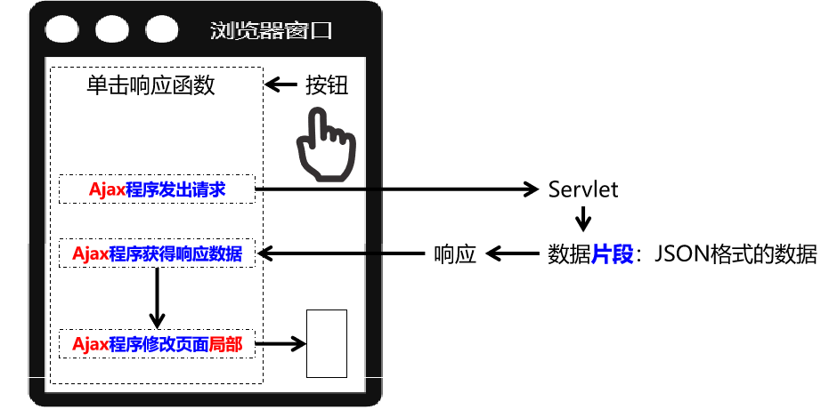

## 24.3.前后端分离

真正的前后端分离是前端项目和后端项目分服务器部署，在我们这里我们先理解为彻底舍弃服务器端渲染，数据全部通过Ajax方式以JSON格式来传递

## 24.4.同步与异步

Ajax本身就是Asynchronous JavaScript And XML的缩写，直译为：异步的JavaScript和XML。在实际应用中Ajax指的是：<span style="color:blue;font-weight:bold;">不刷新浏览器窗口</span>，<span style="color:blue;font-weight:bold;">不做页面跳转</span>，<span style="color:blue;font-weight:bold;">局部更新页面内容</span>的技术。

<span style="color:blue;font-weight:bold;">『同步』</span>和<span style="color:blue;font-weight:bold;">『异步』</span>是一对相对的概念，那么什么是同步，什么是异步呢？

### 同步

多个操作<span style="color:blue;font-weight:bold;">按顺序执行</span>，前面的操作没有完成，后面的操作就必须<span style="color:blue;font-weight:bold;">等待</span>。所以同步操作通常是<span style="color:blue;font-weight:bold;">串行</span>的。


### 异步

多个操作相继开始<span style="color:blue;font-weight:bold;">并发执行</span>，即使开始的先后顺序不同，但是由于它们各自是<span style="color:blue;font-weight:bold;">在自己独立的进程或线程中</span>完成，所以<span style="color:blue;font-weight:bold;">互不干扰</span>，<span style="color:blue;font-weight:bold;">谁也<span style="color:red;font-weight:bold;">不用等</span>谁</span>。


# 25.Axios

## 25.1.Axios简介

使用原生的JavaScript程序执行Ajax极其繁琐，所以一定要使用框架来完成。而Axios就是目前最流行的前端Ajax框架。

Axios官网：http://www.axios-js.com/


使用Axios和使用Vue一样，导入对应的*.js文件即可。官方提供的script标签引入方式为：

```html
<script src="https://unpkg.com/axios/dist/axios.min.js"></script>
```

我们可以把这个axios.min.js文件下载下来保存到本地来使用。

## 25.2.Axios基本用法

### 在前端页面引入开发环境

```html
<script type="text/javascript" src="/demo/static/vue.js"></script>
<script type="text/javascript" src="/demo/static/axios.min.js"></script>
```

### 发送普通请求参数

#### 前端代码

HTML标签：

```javascript
    <div id="app">
        <button @click="commonParam">普通请求参数</button>
    </div>
```

Vue+axios代码：

```javascript
new Vue({
    "el":"#app",
    "data":{},
    "methods":{
        "commonParam":function () {
            axios({
                "method":"post",
                "url":"/demo/AjaxServlet?method=commonParam",
                "params":{
                    "userName":"tom",
                    "userPwd":"123456"
                }
            }).then(function (response) {
                console.log(response);
            }).catch(function (error) {
                console.log(error);
            });
        }
    }
});
```

效果：所有请求参数都被放到URL地址后面了，哪怕我们现在用的是POST请求方式。


#### 后端代码

```java
public class AjaxServlet extends ModelBaseServlet {
    protected void commonParam(HttpServletRequest request, HttpServletResponse response) throws ServletException, IOException {

        String userName = request.getParameter("userName");
        String userPwd = request.getParameter("userPwd");

        System.out.println("userName = " + userName);
        System.out.println("userPwd = " + userPwd);

        response.setContentType("text/html;charset=UTF-8");
        response.getWriter().write("服务器端返回普通文本字符串作为响应");

    }
}
```

> P.S.：由于我们不需要Thymeleaf了，所以ModelBaseServlet可以跳过ViewBaseServlet直接继承HttpServlet。


#### axios程序接收到的响应对象结构


| 属性名     | 作用                                             |
| ---------- | ------------------------------------------------ |
| config     | 调用axios(config对象)方法时传入的JSON对象        |
| data       | 服务器端返回的响应体数据                         |
| headers    | 响应消息头                                       |
| request    | 原生JavaScript执行Ajax操作时使用的XMLHttpRequest |
| status     | 响应状态码                                       |
| statusText | 响应状态码的说明文本                             |

#### 服务器端处理请求失败后

```javascript
catch(function (error) {     // catch()服务器端处理请求出错后，会调用

    console.log(error);         // error就是出错时服务器端返回的响应数据
    console.log(error.response);        // 在服务器端处理请求失败后，获取axios封装的JSON格式的响应数据对象
    console.log(error.response.status); // 在服务器端处理请求失败后，获取响应状态码
    console.log(error.response.statusText); // 在服务器端处理请求失败后，获取响应状态说明文本
    console.log(error.response.data);   // 在服务器端处理请求失败后，获取响应体数据

});
```

在给catch()函数传入的回调函数中，error对象封装了服务器端处理请求失败后相应的错误信息。其中，axios封装的响应数据对象，是error对象的response属性。response属性对象的结构如下图所示：

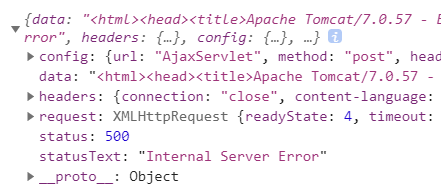

可以看到，response对象的结构还是和then()函数传入的回调函数中的response是一样的：


> 回调函数：开发人员声明，但是调用时交给系统来调用。像单击响应函数、then()、catch()里面传入的都是回调函数。回调函数是相对于普通函数来说的，普通函数就是开发人员自己声明，自己调用：
>
> ```javascript
> function sum(a, b) {
> return a+b;
> }
> 
> var result = sum(3, 2);
> console.log("result="+result);
> ```

## 25.3.发送请求体JSON

### 前端代码

HTML代码：

```html
<button @click="requestBodyJSON">请求体JSON</button>
```

Vue+axios代码：

```javascript
……
"methods":{
    "requestBodyJSON":function () {
        axios({
            "method":"post",
            "url":"/demo/AjaxServlet?method=requestBodyJSON",
            "data":{
                "stuId": 55,
                "stuName": "tom",
                "subjectList": [
                    {
                        "subjectName": "java",
                        "subjectScore": 50.55
                    },
                    {
                        "subjectName": "php",
                        "subjectScore": 30.26
                    }
                ],
                "teacherMap": {
                    "one": {
                        "teacherName":"tom",
                        "tearcherAge":23
                    },
                    "two": {
                        "teacherName":"jerry",
                        "tearcherAge":31
                    },
                },
                "school": {
                    "schoolId": 23,
                    "schoolName": "atguigu"
                }
            }
        }).then(function (response) {
            console.log(response);
        }).catch(function (error) {
            console.log(error);
        });
    }
}
……
```

效果：

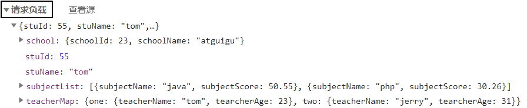

> P.S.：Chrome浏览器中将『请求负载』显示为英文：『Request Payload』。

### 后端代码

#### 加入Gson包

Gson是Google研发的一款非常优秀的<span style="color:blue;font-weight:bold;">JSON数据解析和生成工具</span>，它可以帮助我们将数据在JSON字符串和Java对象之间互相转换。


#### Servlet代码

```java
protected void requestBodyJSON(HttpServletRequest request, HttpServletResponse response) throws ServletException, IOException {

    // 1.由于请求体数据有可能很大，所以Servlet标准在设计API的时候要求我们通过输入流来读取
    BufferedReader reader = request.getReader();

    // 2.创建StringBuilder对象来累加存储从请求体中读取到的每一行
    StringBuilder builder = new StringBuilder();

    // 3.声明临时变量
    String bufferStr = null;

    // 4.循环读取
    while((bufferStr = reader.readLine()) != null) {
        builder.append(bufferStr);
    }

    // 5.关闭流
    reader.close();

    // 6.累加的结果就是整个请求体
    String requestBody = builder.toString();

    // 7.创建Gson对象用于解析JSON字符串
    Gson gson = new Gson();

    // 8.将JSON字符串还原为Java对象
    Student student = gson.fromJson(requestBody, Student.class);
    System.out.println("student = " + student);

    System.out.println("requestBody = " + requestBody);

    response.setContentType("text/html;charset=UTF-8");
    response.getWriter().write("服务器端返回普通文本字符串作为响应");
}
```

> P.S.：看着很麻烦是吧？别担心，将来我们有了<span style="color:blue;font-weight:bold;">SpringMVC</span>之后，一个<span style="color:blue;font-weight:bold;">@RequestBody</span>注解就能够搞定，非常方便！

## 25.4.服务器端返回JSON数据

### 前端代码

```javascript
axios({
    "method":"post",
    "url":"/demo/AjaxServlet?method=responseBodyJSON"
}).then(function (response) {
    console.log(response);
}).catch(function (error) {
    console.log(error);
});
```

then()中获取到的response在控制台打印效果如下：我们需要通过data属性获取响应体数据


### 后端代码

#### 加入Gson包

仍然需要Gson支持，不用多说


#### Servlet代码

```java
protected void responseBodyJSON(HttpServletRequest request, HttpServletResponse response) throws ServletException, IOException {

    // 1.准备数据对象
    Student student = new Student();
    student.setStuId(10);
    student.setStuName("tom");
    student.setSchool(new School(11,"atguigu"));
    student.setSubjectList(Arrays.asList(new Subject("java", 95.5), new Subject("php", 93.3)));

    Map<String, Teacher> teacherMap = new HashMap<>();
    teacherMap.put("t1", new Teacher("lili", 25));
    teacherMap.put("t2", new Teacher("mary", 26));
    teacherMap.put("t3", new Teacher("katty", 27));

    student.setTeacherMap(teacherMap);

    // 2.创建Gson对象
    Gson gson = new Gson();

    // 3.将Java对象转换为JSON对象
    String json = gson.toJson(student);

    // 4.设置响应体的内容类型
    response.setContentType("application/json;charset=UTF-8");
    response.getWriter().write(json);

}
```

# 26.Web技术体系大纲


