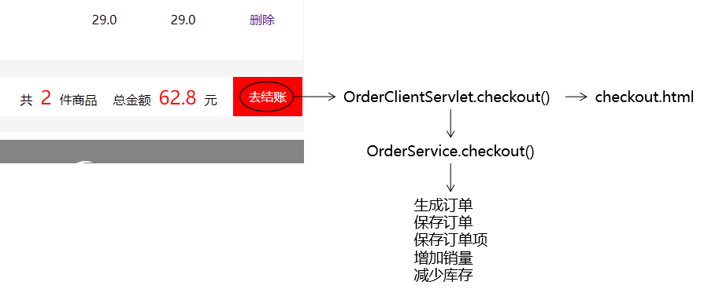
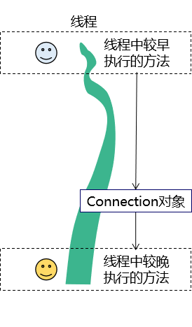

# 书城项目

* [1.书城项目第一阶段](#1书城项目第一阶段)
  * [1.1.学习目标](#11学习目标)
  * [2.2.内容讲解](#22内容讲解)
    * [准备工作](#准备工作)
    * [登录页面的表单验证](#登录页面的表单验证)
      * [规则设定](#规则设定)
      * [在login.html页面中加入Vue的环境](#在loginhtml页面中加入vue的环境)
      * [案例思路](#案例思路)
      * [代码实现](#代码实现)
    * [注册页面的表单验证](#注册页面的表单验证)
      * [在注册页面(register.html)中引入vue](#在注册页面registerhtml中引入vue)
* [2.书城项目第二阶段](#2书城项目第二阶段)
  * [2.1.不带数据库的注册登录](#21不带数据库的注册登录)
    * [实现步骤](#实现步骤)
    * [内容讲解](#内容讲解)
      * [创建动态Web工程](#创建动态web工程)
      * [拷贝静态资源](#拷贝静态资源)
      * [在HTML中使用base标签统一页面基础访问路径](#在html中使用base标签统一页面基础访问路径)
        * [为什么要使用base标签统一页面基础访问路径](#为什么要使用base标签统一页面基础访问路径)
        * [base标签的语法规则](#base标签的语法规则)
        * [base标签使用举例](#base标签使用举例)
        * [基于base标签调整整个页面的路径](#基于base标签调整整个页面的路径)
          * [base标签的代码](#base标签的代码)
          * [对需要统一调整的路径执行替换](#对需要统一调整的路径执行替换)
      * [使用静态数据实现登录校验](#使用静态数据实现登录校验)
        * [假定静态数据](#假定静态数据)
        * [目标](#目标)
        * [思路](#思路)
        * [代码实现](#代码实现-1)
          * [创建LoginServlet](#创建loginservlet)
          * [重写doGet方法](#重写doget方法)
          * [HTML页面设置表单提交地址](#html页面设置表单提交地址)
          * [提示消息改进探索(仅供参考，实际开发不会这样做)](#提示消息改进探索仅供参考实际开发不会这样做)
      * [使用静态数据校验注册时候的用户名](#使用静态数据校验注册时候的用户名)
        * [目标](#目标-1)
        * [思路](#思路-1)
        * [代码实现](#代码实现-2)
          * [创建RegisterServlet](#创建registerservlet)
          * [重写doPost()方法](#重写dopost方法)
          * [HTML页面调整表单中的设置](#html页面调整表单中的设置)
  * [2.2.完成带数据库的注册登录](#22完成带数据库的注册登录)
    * [学习目标](#学习目标)
    * [内容讲解](#内容讲解-1)
      * [三层架构](#三层架构)
        * [为什么要使用三层架构](#为什么要使用三层架构)
        * [三层架构的划分](#三层架构的划分)
        * [三层架构和数据模型的关系](#三层架构和数据模型的关系)
      * [持久层](#持久层)
        * [数据建模](#数据建模)
          * [创建数据库和表](#创建数据库和表)
          * [创建JavaBean](#创建javabean)
        * [加入所需jar包](#加入所需jar包)
        * [创建外部属性文件](#创建外部属性文件)
          * [创建资源目录](#创建资源目录)
        * [创建连接数据库的工具类](#创建连接数据库的工具类)
        * [Dao的概念](#dao的概念)
        * [编写BaseDao类作为所有Dao类的基类(父类)](#编写basedao类作为所有dao类的基类父类)
        * [创建UserDao](#创建userdao)
          * [用户登录注册功能中的组件关系图](#用户登录注册功能中的组件关系图)
          * [创建UserDao接口](#创建userdao接口)
          * [创建UserDaoImpl实现类](#创建userdaoimpl实现类)
          * [测试代码](#测试代码)
      * [加密方式介绍](#加密方式介绍)
        * [加密方式介绍](#加密方式介绍-1)
        * [封装执行加密的工具类](#封装执行加密的工具类)
      * [注册功能](#注册功能)
        * [目标](#目标-2)
        * [思路](#思路-2)
        * [代码](#代码)
          * [创建UserService接口](#创建userservice接口)
          * [创建UserServiceImpl实现类](#创建userserviceimpl实现类)
          * [修改RegisterServlet的代码](#修改registerservlet的代码)
      * [登录功能](#登录功能)
        * [目标](#目标-3)
        * [思路](#思路-3)
        * [代码实现](#代码实现-3)
          * [UserService接口添加doLogin()方法](#userservice接口添加dologin方法)
          * [UserServiceImpl类的doLogin()](#userserviceimpl类的dologin)
          * [修改LoginServlet的doPost方法](#修改loginservlet的dopost方法)
* [3.书城项目第三阶段](#3书城项目第三阶段)
  * [3.1.项目准备工作](#31项目准备工作-)
    * [创建Module](#创建module)
    * [拷贝jar包](#拷贝jar包)
    * [从V2版本项目迁移代码](#从v2版本项目迁移代码)
      * [迁移src目录下的Java源代码](#迁移src目录下的java源代码)
      * [迁移前端代码](#迁移前端代码)
    * [显示首页](#显示首页)
      * [修改web.xml](#修改webxml)
      * [创建PortalServlet](#创建portalservlet)
      * [调整index.html](#调整indexhtml)
  * [3.2.完成用户模块](#32完成用户模块)
    * [重构登录功能](#重构登录功能)
      * [思路](#思路-4)
      * [代码](#代码-1)
        * [创建UserServlet](#创建userservlet)
        * [前往登录页面功能](#前往登录页面功能)
          * [修改首页中登录超链接](#修改首页中登录超链接)
          * [完成UserServlet.toLoginPage()方法](#完成userservlettologinpage方法)
          * [调整登录页面代码](#调整登录页面代码)
        * [登录校验功能](#登录校验功能)
          * [回显表单中的用户名](#回显表单中的用户名)
          * [修改login_success.html页面](#修改login_successhtml页面)
    * [重构注册功能](#重构注册功能)
      * [思路](#思路-5)
      * [代码](#代码-2)
        * [前往注册页面功能](#前往注册页面功能)
          * [修改首页中注册超链接](#修改首页中注册超链接)
          * [完成UserServlet.toRegisterPage()方法](#完成userservlettoregisterpage方法)
          * [调整注册页面代码](#调整注册页面代码)
        * [注册功能](#注册功能-1)
          * [修改regist_success.html页面](#修改regist_successhtml页面)
  * [3.3.书城后台CRUD](#33书城后台crud)
    * [进入后台页面](#进入后台页面)
      * [概念辨析](#概念辨析)
      * [访问后台首页](#访问后台首页)
        * [思路](#思路-6)
        * [代码](#代码-3)
          * [创建AdminServlet](#创建adminservlet)
          * [调整manager.html](#调整managerhtml)
          * [抽取页面公共部分](#抽取页面公共部分)
    * [后台图书CRUD](#后台图书crud)
      * [数据建模](#数据建模-1)
        * [物理建模](#物理建模)
        * [逻辑建模](#逻辑建模)
      * [创建并组装组件](#创建并组装组件)
        * [创建Servlet](#创建servlet)
        * [创建BookService](#创建bookservice)
        * [创建BookDao](#创建bookdao)
        * [组装](#组装)
      * [图书列表显示功能](#图书列表显示功能)
        * [思路](#思路-7)
        * [修改图书管理超链接](#修改图书管理超链接)
        * [BookManagerServlet.showBookList()](#bookmanagerservletshowbooklist)
        * [BookService.getBookList()](#bookservicegetbooklist)
        * [BookDao.selectBookList()](#bookdaoselectbooklist)
        * [调整book_manager.html](#调整book_managerhtml)
        * [在book_manager.html中迭代显示图书列表](#在book_managerhtml中迭代显示图书列表)
      * [图书删除功能](#图书删除功能)
        * [思路](#思路-8)
        * [删除超链接](#删除超链接)
        * [BookManagerServlet.removeBook()](#bookmanagerservletremovebook)
        * [BookService.removeBook()](#bookserviceremovebook)
        * [BookDao.deleteBook()](#bookdaodeletebook)
      * [新增图书功能](#新增图书功能)
        * [思路](#思路-9)
        * [添加图书超链接](#添加图书超链接)
        * [实现：BookManagerServlet.toAddPage()](#实现bookmanagerservlettoaddpage)
        * [book_edit.html](#book_edithtml)
        * [BookManagerServlet.saveOrUpdateBook()](#bookmanagerservletsaveorupdatebook)
        * [BookService.saveBook()](#bookservicesavebook)
        * [BookDao.insertBook()](#bookdaoinsertbook)
      * [修改图书功能](#修改图书功能)
        * [思路](#思路-10)
        * [修改图书超链接](#修改图书超链接)
        * [BookManagerServlet.toEditPage()](#bookmanagerservlettoeditpage)
        * [BookService.getBookById()](#bookservicegetbookbyid)
        * [BookDao.selectBookByPrimaryKey()](#bookdaoselectbookbyprimarykey)
        * [book_edit.html（表单回显）](#book_edithtml表单回显)
        * [BookManagerServlet.saveOrUpdateBook()](#bookmanagerservletsaveorupdatebook-1)
        * [BookService.editBook()](#bookserviceeditbook)
        * [BookDao.updateBook()](#bookdaoupdatebook)
  * [3.4.前台图书展示](#34前台图书展示)
    * [思路](#思路-11)
    * [代码](#代码-4)
      * [PortalServlet.doPost()](#portalservletdopost)
      * [页面迭代显示图书数据](#页面迭代显示图书数据)
* [4.书城项目第四阶段](#4书城项目第四阶段)
  * [4.1.保持登录状态](#41保持登录状态)
    * [迁移项目](#迁移项目)
    * [将登录成功的User存入Session中](#将登录成功的user存入session中)
    * [修改欢迎信息](#修改欢迎信息)
      * [登录成功页面](#登录成功页面)
      * [首页](#首页)
  * [4.2.退出登录功能](#42退出登录功能)
    * [目标](#目标-4)
    * [页面超链接](#页面超链接)
    * [UserServlet.logout()](#userservletlogout)
  * [4.3.验证码](#43验证码)
    * [目标](#目标-5)
    * [思路](#思路-12)
    * [操作](#操作)
      * [导入jar包](#导入jar包)
      * [配置KaptchaServlet](#配置kaptchaservlet)
      * [通过页面访问测试](#通过页面访问测试)
      * [在注册页面显示验证码图片](#在注册页面显示验证码图片)
      * [调整验证码图片的显示效果](#调整验证码图片的显示效果)
        * [去掉边框](#去掉边框)
        * [设置图片大小](#设置图片大小)
      * [点击图片刷新](#点击图片刷新)
        * [目的](#目的)
        * [实现的代码](#实现的代码)
      * [执行注册前检查验证码](#执行注册前检查验证码)
        * [确认KaptchaServlet将验证码存入Session域时使用的属性名](#确认kaptchaservlet将验证码存入session域时使用的属性名)
        * [在执行注册的方法中添加新的代码](#在执行注册的方法中添加新的代码)
  * [4.4.添加商品进购物车](#44添加商品进购物车)
    * [创建购物车模型](#创建购物车模型)
      * [购物项详情类](#购物项详情类)
      * [购物车类：Cart](#购物车类cart)
    * [目标](#目标-6)
    * [思路](#思路-13)
    * [代码实现](#代码实现-4)
      * [创建CartServlet](#创建cartservlet)
      * [index.html页面](#indexhtml页面)
      * [CSS样式](#css样式)
  * [4.5.显示购物车页面](#45显示购物车页面)
    * [目标](#目标-7)
    * [思路](#思路-14)
    * [代码实现](#代码实现-5)
      * [购物车超链接](#购物车超链接)
      * [CartServlet](#cartservlet)
      * [cart.html](#carthtml)
  * [4.6.清空购物车](#46清空购物车)
    * [目标](#目标-8)
    * [思路](#思路-15)
    * [代码实现](#代码实现-6)
      * [清空购物车超链接](#清空购物车超链接)
      * [CartServlet.cleanCart()](#cartservletcleancart)
  * [4.7.减号](#47减号)
    * [目标](#目标-9)
    * [思路](#思路-16)
    * [后端代码](#后端代码)
    * [前端代码](#前端代码)
  * [4.8.删除](#48删除)
    * [目标](#目标-10)
    * [思路](#思路-17)
    * [代码实现](#代码实现-7)
      * [后端代码](#后端代码-1)
      * [前端代码](#前端代码-1)
  * [4.9.文本框修改](#49文本框修改)
    * [目标](#目标-11)
    * [思路](#思路-18)
    * [代码实现](#代码实现-8)
      * [后端代码](#后端代码-2)
      * [前端代码](#前端代码-2)
  * [4.10.加号](#410加号)
    * [目标](#目标-12)
    * [思路](#思路-19)
    * [代码实现](#代码实现-9)
      * [后端代码](#后端代码-3)
      * [前端代码](#前端代码-3)
  * [4.11.Double数据运算过程中精度调整](#411double数据运算过程中精度调整)
    * [问题现象](#问题现象)
    * [解决方案](#解决方案)
* [5.书城项目第五阶段](#5书城项目第五阶段)
  * [5.1.登录检查](#51登录检查)
    * [目标](#目标-13)
    * [思路](#思路-20)
    * [代码实现](#代码实现-10)
      * [拦截受保护资源的请求](#拦截受保护资源的请求)
      * [对访问购物车资源的地址进行修改](#对访问购物车资源的地址进行修改)
        * [首页加入购物车](#首页加入购物车)
        * [首页登录状态和未登录状态显示购物车](#首页登录状态和未登录状态显示购物车)
        * [cart.html清空购物车](#carthtml清空购物车)
        * [cart.html删除超链接](#carthtml删除超链接)
        * [cart.html中的加号和减号](#carthtml中的加号和减号)
        * [cart.html中Vue代码](#carthtml中vue代码)
      * [web.xml中修改CartServlet的url-pattern](#webxml中修改cartservlet的url-pattern)
      * [创建执行登录检查的Filter](#创建执行登录检查的filter)
        * [Filter类](#filter类)
        * [在web.xml中注册Filter类](#在webxml中注册filter类)
  * [5.2.结账](#52结账)
    * [创建订单模型](#创建订单模型)
      * [物理建模](#物理建模-1)
        * [t_order表](#t_order表)
        * [t_order_item表](#t_order_item表)
      * [逻辑模型](#逻辑模型)
        * [Order类](#order类)
        * [OrdrItem类](#ordritem类)
    * [创建组件](#创建组件)
      * [持久化层](#持久化层)
      * [业务逻辑层](#业务逻辑层)
      * [表述层](#表述层)
    * [功能步骤](#功能步骤)
    * [案例思路](#案例思路-1)
    * [代码实现](#代码实现-11)
      * [购物车页面结账超链接](#购物车页面结账超链接)
      * [OrderClientServlet.checkout()](#orderclientservletcheckout)
      * [BaseDao.batchUpdate()](#basedaobatchupdate)
      * [OrderService.checkout()](#orderservicecheckout)
      * [orderDao.insertOrder(order)](#orderdaoinsertorderorder)
      * [orderItemDao.insertOrderItemArr(insertOrderItemParamArr)](#orderitemdaoinsertorderitemarrinsertorderitemparamarr)
      * [bookDao.updateBookArr(updateBookParamArr)](#bookdaoupdatebookarrupdatebookparamarr)
  * [5.3.结账过程中使用事务](#53结账过程中使用事务)
    * [事务回顾](#事务回顾)
      * [ACID属性](#acid属性)
      * [隔离级别](#隔离级别)
        * [并发问题](#并发问题)
        * [隔离级别](#隔离级别-1)
    * [JDBC事务控制](#jdbc事务控制)
      * [同一个数据库连接](#同一个数据库连接)
      * [关闭事务的自动提交](#关闭事务的自动提交)
      * [提交事务](#提交事务)
      * [回滚事务](#回滚事务)
      * [事务整体的代码块](#事务整体的代码块)
    * [将事务对接到书城项目中](#将事务对接到书城项目中)
      * [三层架构中事务要对接的位置](#三层架构中事务要对接的位置)
      * [假想](#假想)
      * [假想代码的缺陷](#假想代码的缺陷)
      * [事务代码抽取](#事务代码抽取)
      * [编写一个TransactionFilter来统一处理事务](#编写一个transactionfilter来统一处理事务)
      * [配置TransactionFilter指定其拦截要进行事务控制的请求](#配置transactionfilter指定其拦截要进行事务控制的请求)
      * [保证所有数据库操作使用同一个连接](#保证所有数据库操作使用同一个连接)
        * [从数据源中只拿出一个](#从数据源中只拿出一个)
        * [公共区域](#公共区域)
      * [线程本地化](#线程本地化)
        * [确认同一个线程](#确认同一个线程)
        * [一条小河](#一条小河)
        * [一个线程](#一个线程)
        * [ThreadLocal的API](#threadlocal的api)
        * [结论](#结论)
    * [代码实现](#代码实现-12)
      * [重构JDBCUtils类](#重构jdbcutils类)
      * [重构BaseDao](#重构basedao)
      * [创建CloseConnectionFilter用于统一关闭连接](#创建closeconnectionfilter用于统一关闭连接)
      * [项目异常处理的原则](#项目异常处理的原则)
* [6.书城项目第六阶段](#6书城项目第六阶段)
  * [6.1.注册页面用户名唯一性检查优化](#61注册页面用户名唯一性检查优化)
    * [准备工作](#准备工作-1)
    * [加入Ajax开发环境](#加入ajax开发环境)
      * [前端所需axios库](#前端所需axios库)
      * [后端所需Gson库](#后端所需gson库)
    * [封装AjaxCommonsResult](#封装ajaxcommonsresult)
      * [模型的作用](#模型的作用)
      * [模型的代码](#模型的代码)
      * [模型的好处](#模型的好处)
    * [功能实现](#功能实现)
      * [定位功能的位置](#定位功能的位置)
      * [思路](#思路-21)
        * [给用户名输入框绑定的事件类型](#给用户名输入框绑定的事件类型)
        * [流程图](#流程图)
        * [代码实现](#代码实现-13)
          * [在当前页面引入axios库文件](#在当前页面引入axios库文件)
          * [给用户名输入框绑定值改变事件](#给用户名输入框绑定值改变事件)
          * [JavaScript代码](#javascript代码)
          * [UserServlet](#userservlet)
          * [UserService](#userservice)
  * [6.2.加入购物车](#62加入购物车)
    * [思路](#思路-22)
    * [代码实现](#代码实现-14)
      * [加入layer弹层组件](#加入layer弹层组件)
      * [顶层bar绑定Vue对象](#顶层bar绑定vue对象)
        * [在HTML标签上标记id](#在html标签上标记id)
        * [创建Vue对象](#创建vue对象)
      * [图书列表div绑定Vue对象](#图书列表div绑定vue对象)
        * [在HTML标签上标记id](#在html标签上标记id-1)
        * [在首页引入Vue和axios库文件](#在首页引入vue和axios库文件)
        * [创建Vue对象](#创建vue对象-1)
        * [绑定单击响应函数](#绑定单击响应函数)
        * [将bookId设置到按钮中](#将bookid设置到按钮中)
        * [在单击响应函数中发送Ajax请求](#在单击响应函数中发送ajax请求)
      * [后端代码](#后端代码-4)
  * [6.3.显示购物车数据](#63显示购物车数据)
    * [思路](#思路-23)
    * [代码实现](#代码实现-15)
      * [CartServlet增加getCartJSON()方法](#cartservlet增加getcartjson方法)
        * [Cart模型的局限性](#cart模型的局限性)
        * [调整方式](#调整方式)
        * [方法代码](#方法代码)
      * [前端代码](#前端代码-4)
        * [去除Thymeleaf痕迹](#去除thymeleaf痕迹)
        * [使用Vue对象初步接管页面渲染](#使用vue对象初步接管页面渲染)
        * [在mounted生命周期环境发Ajax请求](#在mounted生命周期环境发ajax请求)
        * [完成Vue页面渲染](#完成vue页面渲染)
  * [6.4.(扩展功能) 点击+号将购物项数量加一](#64扩展功能-点击号将购物项数量加一)
    * [HTML和Vue代码](#html和vue代码)
    * [CartServlet的代码](#cartservlet的代码)
  * [6.5.(扩展功能) 点击-号将购物项的数量减一](#65扩展功能-点击-号将购物项的数量减一)
    * [HTML和Vue的代码](#html和vue的代码)
    * [CartServlet的代码](#cartservlet的代码-1)
  * [6.6.(扩展功能) 点击删除按钮删除购物项](#66扩展功能-点击删除按钮删除购物项)
    * [HTML和Vue的代码](#html和vue的代码-1)
    * [CartServlet的代码](#cartservlet的代码-2)
  * [6.7.(扩展功能) 修改购物项的数量](#67扩展功能-修改购物项的数量)
    * [HTML和Vue的代码](#html和vue的代码-2)
    * [CartServlet的代码](#cartservlet的代码-3)

# 1.书城项目第一阶段

## 1.1.学习目标

* 实现登录表单校验
* 实现注册表单校验

## 2.2.内容讲解

### 准备工作

创建目录后，把一整套现成的前端页面复制到新建的目录下，然后把vue.js文件复制到script目录下。

### 登录页面的表单验证

#### 规则设定

- 用户名非空
- 密码非空

#### 在login.html页面中加入Vue的环境

```html
<script src="../../static/script/vue.js"></script>
```

#### 案例思路


#### 代码实现

**HTML代码**

```html
<div id="app">
    <div id="login_header">
        <a href="../../index.html">
            
        </a>
    </div>

    <div class="login_banner">
        <div id="l_content">
            <span class="login_word">欢迎登录</span>
        </div>

        <div id="content">
            <div class="login_form">
                <div class="login_box">
                    <div class="tit">
                        <h1>尚硅谷会员</h1>
                    </div>
                    <div class="msg_cont">
                        <b></b>
                        <span class="errorMsg" style="color: red">{{errorMessage}}</span>
                    </div>
                    <div class="form">
                        <form action="login_success.html">
                            <label>用户名称：</label>
                            <input
                                   class="itxt"
                                   type="text"
                                   placeholder="请输入用户名"
                                   autocomplete="off"
                                   tabindex="1"
                                   name="username"
                                   id="username"
                                   v-model="username"
                                   />
                            <br />
                            <br />
                            <label>用户密码：</label>
                            <input
                                   class="itxt"
                                   type="password"
                                   placeholder="请输入密码"
                                   autocomplete="off"
                                   tabindex="1"
                                   name="password"
                                   id="password"
                                   v-model="password"
                                   />
                            <br />
                            <br />
                            <input type="submit" value="登录" id="sub_btn" @click="loginCheck"/>
                        </form>
                        <div class="tit">
                            <a href="regist.html">立即注册</a>
                        </div>
                    </div>
                </div>
            </div>
        </div>
    </div>
    <div id="bottom">
        <span>
            尚硅谷书城.Copyright &copy;2015
        </span>
    </div>
</div>
```

**Vue代码**

```javascript
var vue = new Vue({
    "el":"#app",
    "data":{
        "username":"",
        "password":"",
        "errorMessage":""
    },
    "methods":{
        loginCheck(){
            //判断用户名和密码是否为空
            if (this.username != "") {
                if (this.password == ""){
                    //就要阻止表单提交
                    event.preventDefault()
                    //加入提示功能
                    this.errorMessage = "密码不能为空"
                }
            }else {
                //就要阻止表单提交
                event.preventDefault()
                //加入提示功能
                this.errorMessage = "用户名不能为空"
            }
        }
    }
});
```

### 注册页面的表单验证

#### 在注册页面(register.html)中引入vue

```html
<!--在注册页面引入vue-->
<script src="../../static/script/vue.js"></script>
```

**HTML代码**

```html
<div id="app">
    <div id="login_header">
        <a href="../../index.html">
            
        </a>
    </div>

    <div class="login_banner">
        <div class="register_form">
            <h1>注册尚硅谷会员</h1>
            <form action="regist_success.html">
                <div class="form-item">
                    <div>
                        <label>用户名称:</label>
                        <input type="text" placeholder="请输入用户名" v-model="username" @blur="checkUsername"/>
                    </div>
                    <span style="color: red">{{usernameErrorMessage}}</span>
                </div>
                <div class="form-item">
                    <div>
                        <label>用户密码:</label>
                        <input type="password" placeholder="请输入密码" v-model="password"/>
                    </div>
                    <span style="color: red">{{passwordErrorMessage}}</span>
                </div>
                <div class="form-item">
                    <div>
                        <label>确认密码:</label>
                        <input type="password" placeholder="请输入确认密码" v-model="passwordConfirm"/>
                    </div>
                    <span style="color: red">{{confirmErrorMessage}}</span>
                </div>
                <div class="form-item">
                    <div>
                        <label>用户邮箱:</label>
                        <input type="text" placeholder="请输入邮箱" v-model="email"/>
                    </div>
                    <span style="color: red">{{emailErrorMessage}}</span>
                </div>
                <div class="form-item">
                    <div>
                        <label>验证码:</label>
                        <div class="verify">
                            <input type="text" placeholder="" v-model="code"/>
                            
                        </div>
                    </div>
                    <!--<span>请输入正确的验证码</span>-->
                </div>
                <button class="btn" @click="registerCheck">注册</button>
            </form>
        </div>
    </div>
    <div id="bottom">
        <span>
            尚硅谷书城.Copyright &copy;2015
        </span>
    </div>
</div>
```

**Vue代码**

```javascript
<script>
    var vue = new Vue({
        "el":"#app",
        "data":{
            "username":"",//用户名
            "password":"",//密码
            "passwordConfirm":"",//确认密码
            "email":"",//邮箱
            "code":"",//验证码
            "usernameErrorMessage":"",
            "passwordErrorMessage":"",
            "confirmErrorMessage":"",
            "emailErrorMessage":""
        },
        "methods":{
            checkUsername(){
                //校验用户名是否符合规则
                //1. 编写一个正则表达式去描述这个规则
                var usernameRegExp = /^[A-Za-z0-9_]{5,8}$/;
                //2. 使用正则表达式校验用户名输入框里面的内容:this.username
                if (!usernameRegExp.test(this.username)) {
                    //校验不通过
                    this.usernameErrorMessage = "用户名必须是5-8位的数字、字母或者下划线"
                }else {
                    //符合规则了,就重新设置提示信息为空
                    this.usernameErrorMessage = ""
                }
            },
            registCheck(){
                let usernameRegExp = /^[A-Za-z0-9_]{5,8}$/;
                var passwordRegExp = /^[A-Za-z0-9_]{6,10}$/;
                let emailRegExp = /^[a-zA-Z0-9_\.-]+@([a-zA-Z0-9-]+[\.]{1})+[a-zA-Z]+$/;
                if(!(usernameRegExp.test(this.username)&&passwordRegExp.test(this.password)&&emailRegExp.test(this.email)&&(this.password==this.passwordConfirm))){
                    event.preventDefault()
                }
            }
        }
        /*"watch":{
        //对用户名添加监听
        "username":function (inputValue) {
          //校验用户名是否符合规则
          //1. 编写一个正则表达式去描述这个规则
          var usernameRegExp = /^[A-Za-z0-9_]{5,8}$/;
          //2. 使用正则表达式校验用户名输入框里面的内容:inputValue
          if (!usernameRegExp.test(inputValue)) {
            //校验不通过
            this.usernameErrorMessage = "用户名必须是5-8位的数字、字母或者下划线"
          }else {
            //符合规则了,就重新设置提示信息为空
            this.usernameErrorMessage = ""
          }
        }
      }*/
    });
</script>
```

# 2.书城项目第二阶段

## 2.1.不带数据库的注册登录

### 实现步骤

1. 创建动态Web工程
2. 将第一版书城的静态资源拷贝到web文件夹中
3. 统一页面的基础访问路径

4. 使用静态数据进行登录校验
5. 使用完成注册时校验用户名是否存在

### 内容讲解

#### 创建动态Web工程


#### 拷贝静态资源


#### 在HTML中使用base标签统一页面基础访问路径

##### 为什么要使用base标签统一页面基础访问路径

因为在页面中有很多的a标签、表单以及Ajax请求(以后会学)都需要写访问路径，而在访问路径中**项目路径**是一样的，所以如果不统一编写**项目路径**的话，就会发生当项目路径发生改变的时候该页面所有用到项目路径的地方都需要更改的情况


##### base标签的语法规则

- base标签要写在head标签内
- base标签必须写在所有其他有路径的标签的前面
- base标签使用href属性设置路径的基准
- base标签生效的机制是：最终的访问地址=base标签href属性设置的基准+具体标签内的路径
- 如果某个路径想要基于base中的路径进行路径编写，那么它不能以`/`开头

##### base标签使用举例

```html
<head>
    <meta charset="UTF-8"/>
    <meta name="viewport" content="width=device-width, initial-scale=1.0"/>
    <title>书城首页</title>
    <base href="/bookstore/"/>
    <link rel="stylesheet" href="static/css/minireset.css"/>
    <link rel="stylesheet" href="static/css/common.css"/>
    <link rel="stylesheet" href="static/css/iconfont.css"/>
    <link rel="stylesheet" href="static/css/index.css"/>
    <link rel="stylesheet" href="static/css/swiper.min.css"/>
</head>
```

##### 基于base标签调整整个页面的路径

在需要进行基础路径统一的页面做如下修改

###### base标签的代码

```html
<base href="/bookstore/"/>
```

###### 对需要统一调整的路径执行替换

Ctrl+r调出替换操作窗口，并做如下替换


#### 使用静态数据实现登录校验

##### 假定静态数据

为了实现『不带数据库』的登录注册，我们需要假设：系统中目前已有用户：

| 用户名 | 密码   |
| ------ | ------ |
| tom    | 123456 |

##### 目标

在服务器端检查用户通过表单提交的用户名、密码是否正确。

- 成功：跳转到login_success.html页面
- 失败：返回错误消息

##### 思路


* 客户端发送请求，携带用户名和密码
* LoginServlet在doPost()方法中接收处理请求，判断客户端传入的账号密码和系统中现存的账号密码是否一致
  * 如果一致，则重定向跳转到login_success.html页面
  * 如果不一致，则通过response响应错误提示信息

##### 代码实现

###### 创建LoginServlet


> 创建Packages时的规范：
>
> 公司或组织域名倒序.项目名.模块名.具体包名
>
> 或
>
> 公司或组织域名倒序.项目名.具体包名

下面是完整的Servlet配置信息：

```xml
<servlet>
    <servlet-name>LoginServlet</servlet-name>
    <servlet-class>com.atguigu.bookstore.servlet.LoginServlet</servlet-class>
</servlet>
<servlet-mapping>
    <servlet-name>LoginServlet</servlet-name>
    <url-pattern>/login</url-pattern>
</servlet-mapping>
```

###### 重写doGet方法

```java
package com.atguigu.servlet;

import javax.servlet.ServletException;
import javax.servlet.http.HttpServlet;
import javax.servlet.http.HttpServletRequest;
import javax.servlet.http.HttpServletResponse;
import java.io.IOException;

/**
 * @author Leevi
 * 日期2021-05-12  09:19
 */
public class LoginServlet extends HttpServlet {
    @Override
    protected void doPost(HttpServletRequest request, HttpServletResponse response) throws ServletException, IOException {
        doGet(request, response);
    }

    @Override
    protected void doGet(HttpServletRequest request, HttpServletResponse response) throws ServletException, IOException {
        request.setCharacterEncoding("UTF-8");
        response.setContentType("text/html;charset=UTF-8");
        //1. 获取客户端传入的请求参数
        String username = request.getParameter("username");
        String password = request.getParameter("password");

        //2. 校验用户名和密码是否正确: 先不连接数据库，使用静态数据进行校验
        if ("tom".equals(username) && "123456".equals(password)) {
            //登录成功
            //跳转到login_success.html页面
            //重定向
            response.sendRedirect(request.getContextPath()+"/pages/user/login_success.html");
        }else {
            //登录失败
            //则向客户端响应登录失败的信息
            response.getWriter().write("用户名或密码错误,登录失败!!!");

            //优化方式一: 跳转回到登录页面
            //response.sendRedirect(request.getContextPath()+"/pages/user/login.html");

            //优化方式二: 向浏览器响应超文本，在超文本中提示登录失败
            //直接通过response响应整个login.html页面的内容
            //response.getWriter().write("");
        }
    }
}
```

###### HTML页面设置表单提交地址

```html
<form id="loginForm" action="login" method="post">
	<label>用户名称：</label>
	<input class="itxt" type="text" v-model:value="username" placeholder="请输入用户名" autocomplete="off" tabindex="1" name="username" id="username" />
	<br />
	<br />
	<label>用户密码：</label>
	<input class="itxt" type="password" v-model:value="password" placeholder="请输入密码" autocomplete="off" tabindex="1" name="password" id="password" />
	<br />
	<br />
	<button type="submit" id="sub_btn" @click="loginCheck">登录</button>
</form>
```

###### 提示消息改进探索(仅供参考，实际开发不会这样做)

```java
// 5.登录失败
// 返回提示消息方案一：过于简陋
// response.setContentType("text/html;charset=UTF-8");
// response.getWriter().write("抱歉！用户名或密码不正确，请重新输入！");

// 返回提示消息方案二：没有提示消息，让用户非常困惑
// request.getRequestDispatcher("/pages/user/login.html").forward(request, response);

// 返回提示消息方案三：确实能在登录页面显示提示消息，但是实现的方式让我想骂人
response.setContentType("text/html;charset=UTF-8");
PrintWriter writer = response.getWriter();
writer.write("<!DOCTYPE html>");
writer.write("<html>");
writer.write("	<head>");
writer.write("		<base href='/bookstore/' />");
```

#### 使用静态数据校验注册时候的用户名

##### 目标

用户提交注册表单后，检查用户名是否被占用

- 没有被占用：注册成功
- 已经被占用：注册失败

##### 思路


##### 代码实现

###### 创建RegisterServlet


完整配置信息：

```xml
<servlet>
    <servlet-name>RegisterServlet</servlet-name>
    <servlet-class>com.atguigu.bookstore.servlet.RegisterServlet</servlet-class>
</servlet>
<servlet-mapping>
    <servlet-name>RegisterServlet</servlet-name>
    <url-pattern>/register</url-pattern>
</servlet-mapping>
```

###### 重写doPost()方法

```java
package com.atguigu.servlet;

import javax.servlet.ServletException;
import javax.servlet.http.HttpServlet;
import javax.servlet.http.HttpServletRequest;
import javax.servlet.http.HttpServletResponse;
import java.io.IOException;

/**
 * @author Leevi
 * 日期2021-05-12  09:59
 */
public class RegisterServlet extends HttpServlet {
    @Override
    protected void doPost(HttpServletRequest request, HttpServletResponse response) throws ServletException, IOException {
        doGet(request, response);
    }

    @Override
    protected void doGet(HttpServletRequest request, HttpServletResponse response) throws ServletException, IOException {
        request.setCharacterEncoding("UTF-8");
        response.setContentType("text/html;charset=UTF-8");
        //目前使用静态数据完成的只是: 校验用户名是否已存在
        //1. 获取请求参数: username
        String username = request.getParameter("username");
        //2. 校验username是否已经被占用了, 假设服务器中有一个用户:jerry
        if ("jerry".equals(username)) {
            //用户名以经被占用了,注册失败
            response.getWriter().write("用户名已被占用，请重新注册!!!");
        }else {
            //注册成功
            //跳转到注册成功页面
            response.sendRedirect(request.getContextPath()+"/pages/user/regist_success.html");
        }
    }
}
```

###### HTML页面调整表单中的设置

```html
<form id="registerForm" action="register" method="post">
	<div class="form-item">
		<div>
			<label>用户名称:</label>
			<input v-model:value="username" type="text" name="username" placeholder="请输入用户名" />
			<span></span>
		</div>
		<span>{{usernameCheckMessage}}</span>
	</div>
	<div class="form-item">
		<div>
			<label>用户密码:</label>
			<input v-model:value="password" type="password" name="password" placeholder="请输入密码" />
		</div>
		<span class="errMess">密码的长度至少为8位</span>
	</div>
	<div class="form-item">
		<div>
			<label>确认密码:</label>
			<input v-model:value="passwordConfirm" type="password" placeholder="请输入确认密码" />
		</div>
		<span class="errMess">密码两次输入不一致</span>
	</div>
	<div class="form-item">
		<div>
			<label>用户邮箱:</label>
			<input v-model:value="email" type="text" name="email" placeholder="请输入邮箱" />
		</div>
		<span class="errMess">请输入正确的邮箱格式</span>
	</div>
	<div class="form-item">
		<div>
			<label>验证码:</label>
			<div class="verify">
				<input v-model:value="code" type="text" name="code" placeholder="" />
				
			</div>
		</div>
		<span class="errMess">请输入正确的验证码</span>
	</div>
	<button type="submit" @click="registerCheck" class="btn">注册</button>
</form>
```

## 2.2.完成带数据库的注册登录

### 学习目标

* 了解三层架构
* 了解ORM
* 了解MD5加密
* 完成带数据库的登录校验
* 完成带数据库的注册功能

### 内容讲解

#### 三层架构

##### 为什么要使用三层架构

如果不做三层架构形式的拆分：


所有和当前业务功能需求相关的代码全部耦合在一起，如果其中有任何一个部分出现了问题，牵一发而动全身，导致其他无关代码也要进行相应的修改。这样的话代码会非常难以维护。

所以为了提高开发效率，需要对代码进行模块化的拆分。整个项目模块化、组件化程度越高，越容易管理和维护，出现问题更容易排查。

##### 三层架构的划分


- 表述层：又可以称之为控制层，负责处理浏览器请求、返回响应、页面调度
- 业务逻辑层：负责处理业务逻辑，根据业务逻辑把持久化层从数据库查询出来的数据进行运算、组装，封装好后返回给表述层，也可以根据业务功能的需要调用持久化层把数据保存到数据库、修改数据库中的数据、删除数据库中的数据
- 持久化层：根据上一层的调用对数据库中的数据执行增删改查的操作

##### 三层架构和数据模型的关系


模型对整个项目中三层架构的每一层都提供支持，具体体现是使用模型对象<span style="color:blue;font-weight:bold;">封装业务功能数据</span>

其实数据模型就是我们之前学习的JavaBean，也是Java实体类，当然他还有很多其他的名称:

- POJO：Plain old Java Object，传统的普通的Java对象
- entity：实体类
- bean或Java bean
- domain：领域模型

#### 持久层

##### 数据建模

###### 创建数据库和表

```sql
CREATE DATABASE bookstore210323 CHARACTER SET utf8;
USE `bookstore210323`;
CREATE TABLE t_user(
    user_id INT PRIMARY KEY AUTO_INCREMENT,
    user_name CHAR(100),
    user_pwd CHAR(100),
    email CHAR(100)
);
```

###### 创建JavaBean


```java
public class User {
    private Integer userId;// user_id
    private String userName;// user_name
    private String userPwd;// user_pwd
    private String email;// email
    ……自己补充get、set、toString等方法
```

##### 加入所需jar包


##### 创建外部属性文件

在idea的工程结构中，我们通常将配置文件放在resources目录下

###### 创建资源目录


1. 在当前module中创建一个directory，并且命名为resources
2. 然后将这个目录标记为Resources Root


3. 编写jdbc.properties文件

```
driverClassName=com.mysql.jdbc.Driver
url=jdbc:mysql://localhost:3306/bookstore210107
username=root
password=123
initialSize=10
maxActive=20
maxWait=10000
```

##### 创建连接数据库的工具类

```java
package com.atguigu.bookstore.utils;

import com.alibaba.druid.pool.DruidDataSourceFactory;

import javax.sql.DataSource;
import java.io.InputStream;
import java.sql.Connection;
import java.sql.SQLException;
import java.util.Properties;

/**
 * 包名:com.atguigu.bookstore.utils
 *
 * @author Leevi
 * 日期2021-04-02  14:53
 */
public class JDBCUtil {
    private static DataSource dataSource;

    static {

        // 1.创建一个用于存储外部属性文件信息的Properties对象
        Properties properties = new Properties();
        // 2.使用当前类的类加载器加载外部属性文件：jdbc.properties
        InputStream inputStream = JDBCUtil.class.getClassLoader().getResourceAsStream("jdbc.properties");

        try {

            // 3.将外部属性文件jdbc.properties中的数据加载到properties对象中
            properties.load(inputStream);

            // 4.创建数据源对象
            dataSource = DruidDataSourceFactory.createDataSource(properties);

        } catch (Exception e) {
            e.printStackTrace();
        }

    }

    /**
     * 从数据源中获取数据库连接
     *
     * @return 数据库连接对象
     */
    public static Connection getConnection() {

        Connection connection = null;

        try {
            connection = dataSource.getConnection();
        } catch (SQLException e) {
            e.printStackTrace();
            throw new RuntimeException(e);
        }

        return connection;

    }

    /**
     * 释放数据库连接
     *
     * @param connection 要执行释放操作的连接对象
     */
    public static void releaseConnection(Connection connection) {

        if (connection != null) {

            try {
                connection.close();
            } catch (SQLException e) {
                e.printStackTrace();
                throw new RuntimeException(e);
            }

        }
    }
}
```

测试代码如下:

```java
public class BookstoreTest {

    @Test
    public void testConnection() {

        Connection connection = JDBCUtils.getConnection();
        System.out.println("connection = " + connection);

    }

}
```

##### Dao的概念

Dao是data access Object的缩写，中文翻译为数据访问对象，我们会将操作持久层的代码编写到对应的Dao类中

##### 编写BaseDao类作为所有Dao类的基类(父类)


```java
package com.atguigu.dao;

import com.atguigu.utils.JDBCUtil;
import org.apache.commons.dbutils.QueryRunner;
import org.apache.commons.dbutils.handlers.BeanHandler;
import org.apache.commons.dbutils.handlers.BeanListHandler;

import java.sql.SQLException;
import java.util.List;

/**
 * 包名:com.atguigu.dao
 *
 * @author Leevi
 * 日期2021-05-12  11:00
 */
public class BaseDao<T> {
    private QueryRunner queryRunner = new QueryRunner();

    /**
     * 执行增删改的sql语句
     * @param sql
     * @param params
     * @return
     */
    public int update(String sql,Object... params){
        try {
            //执行增删改的sql语句，返回受到影响的行数
            return queryRunner.update(JDBCUtil.getConnection(),sql,params);
        } catch (SQLException e) {
            e.printStackTrace();
            throw new RuntimeException(e.getMessage());
        }
    }

    /**
     * 执行查询一行数据的sql语句，将结果集封装到JavaBean对象中
     * @param clazz
     * @param sql
     * @param params
     * @return
     */
    public T getBean(Class<T> clazz,String sql,Object... params){
        try {
            return queryRunner.query(JDBCUtil.getConnection(),sql,new BeanHandler<>(clazz),params);
        } catch (SQLException e) {
            throw new RuntimeException(e.getMessage());
        }
    }

    /**
     * 执行查询多行数据的sql语句，并且将结果集封装到List<JavaBean>
     * @param clazz
     * @param sql
     * @param params
     * @return
     */
    public List<T> getBeanList(Class<T> clazz, String sql, Object... params){
        try {
            return queryRunner.query(JDBCUtil.getConnection(),sql,new BeanListHandler<>(clazz),params);
        } catch (SQLException e) {
            throw new RuntimeException(e.getMessage());
        }
    }
}
```

测试代码如下:

```java
@Test
public void testUpdate() {
    BaseDao<Object> baseDao = new BaseDao<>();

    String sql = "insert into t_user(user_name,user_pwd) values(?,?)";

    int count = baseDao.update(sql, "罗志祥", "789456");

    System.out.println("count = " + count);
}

@Test
public void testGetBean() {
    BaseDao<User> baseDao = new BaseDao<>();

    // user_id userId
    // user_name userName
    // user_pwd userPwd
    String sql = "select user_id userId,user_name userName,user_pwd userPwd from t_user where user_id=?";

    User user = baseDao.getBean(User.class, sql, 2);

    System.out.println("user = " + user);
}

@Test
public void testGetBeanList() {
    BaseDao<User> baseDao = new BaseDao<>();

    String sql = "select user_id userId,user_name userName,user_pwd userPwd from t_user";

    List<User> userList = baseDao.getBeanList(User.class, sql);

    for (User user : userList) {
        System.out.println("user = " + user);
    }
}
```

##### 创建UserDao

###### 用户登录注册功能中的组件关系图


###### 创建UserDao接口


```java
package com.atguigu.dao;

import com.atguigu.bean.User;

import java.sql.SQLException;

/**
 * 包名:com.atguigu.dao
 *
 * @author Leevi
 * 日期2021-05-12  11:20
 */
public interface UserDao {

    /**
     * 根据用户名查找用户
     * @param username
     * @return
     * @throws SQLException
     */
    User findByUsername(String username) throws SQLException;

    /**
     * 往t_user表中添加用户信息
     * @param user
     */
    void addUser(User user) throws SQLException;
}
```

###### 创建UserDaoImpl实现类

```java
package com.atguigu.dao.impl;

import com.atguigu.bean.User;
import com.atguigu.dao.BaseDao;
import com.atguigu.dao.UserDao;

import java.sql.SQLException;

/**
 * 包名:com.atguigu.dao
 * @author Leevi
 * 日期2021-05-12  10:47
 * 用户模块的持久层类
 *
 * 接口的作用是可以进行模块之间的解耦
 */
public class UserDaoImpl extends BaseDao<User> implements UserDao{
    @Override
    public User findByUsername(String username) throws SQLException{
        String sql = "select user_id userId,user_name username,user_pwd userPwd,email from t_user where user_name=?";
        return getBean(User.class,sql,username);
    }

    @Override
    public void addUser(User user) throws SQLException {
        String sql = "insert into t_user (user_name,user_pwd,email) values (?,?,?)";
        update(sql,user.getUsername(),user.getUserPwd(),user.getEmail());
    }
}
```

###### 测试代码

```java
package com.atguigu.test;

import com.atguigu.bean.User;
import com.atguigu.dao.impl.UserDaoImpl;
import org.junit.Test;

import java.sql.SQLException;

/**
 * 包名:com.atguigu.test
 *
 * @author Leevi
 * 日期2021-05-12  10:54
 */
public class TestDao {
    @Test
    public void testAddUser() throws SQLException {
        User user = new User(null, "aobama", "654321", "654321@qq.com");

        new UserDaoImpl().addUser(user);
    }
    @Test
    public void testFindUser() throws Exception {
        UserDaoImpl userDaoImpl = new UserDaoImpl();
        User user = userDaoImpl.findByUsername("jay");
        System.out.println(user);
    }
}
```

#### 加密方式介绍

##### 加密方式介绍

- 对称加密：加密和解密使用的相同的密钥，常见的对称加密算法有:DES、3DES
- 非对称加密：加密和解密使用的密钥不同，常见的非对称加密算法有:RSA
  - 加密：使用私钥加密
  - 解密：使用公钥解密
- 消息摘要:  消息摘要算法的主要特征是加密过程不需要密钥，并且经过加密的数据无法被解密，只有相同的原文经过消息摘要算法之后，才能得到相同的密文，所以消息摘要通常用来校验原文的真伪。常用的消息摘要算法有:MD5、SHA、MAC

我们在书城项目中采用MD5算法对密码进行加密

##### 封装执行加密的工具类

```java
public class MD5Util {

    /**
     * 针对明文字符串执行MD5加密
     * @param source
     * @return
     */
    public static String encode(String source) {

        // 1.判断明文字符串是否有效
        if (source == null || "".equals(source)) {
            throw new RuntimeException("用于加密的明文不可为空");
        }

        // 2.声明算法名称
        String algorithm = "md5";

        // 3.获取MessageDigest对象
        MessageDigest messageDigest = null;
        try {
            messageDigest = MessageDigest.getInstance(algorithm);
        } catch (NoSuchAlgorithmException e) {
            e.printStackTrace();
        }

        // 4.获取明文字符串对应的字节数组
        byte[] input = source.getBytes();

        // 5.执行加密
        byte[] output = messageDigest.digest(input);

        // 6.创建BigInteger对象
        int signum = 1;
        BigInteger bigInteger = new BigInteger(signum, output);

        // 7.按照16进制将bigInteger的值转换为字符串
        int radix = 16;
        String encoded = bigInteger.toString(radix).toUpperCase();

        return encoded;
    }
}
```

#### 注册功能

##### 目标

检查用户名是否可用，如果用户名可用则保存User对象

##### 思路


##### 代码

###### 创建UserService接口


```java
public interface UserService {
    void doRegister(User userForm);
}
```

开发中，接口设计和接口中方式定义的理念：

- 方法的返回值应该对应这个方法本身的业务功能
  - 写操作：没有返回值
  - 读操作：有返回值，返回值就是查询的结果
- 方法执行是否成功
  - 成功：不抛异常
  - 失败：抛异常


###### 创建UserServiceImpl实现类


```java
package com.atguigu.service.impl;

import com.atguigu.bean.User;
import com.atguigu.dao.UserDao;
import com.atguigu.dao.impl.UserDaoImpl;
import com.atguigu.service.UserService;
import com.atguigu.utils.MD5Util;

/**
 * 包名:com.atguigu.service.impl
 *
 * @author Leevi
 * 日期2021-05-12  11:26
 */
public class UserServiceImpl implements UserService{
    private UserDao userDao = new UserDaoImpl();
    @Override
    public void doRegister(User user) throws Exception {
        //注册之前:校验用户名是否已存在
        //调用持久层的方法，根据username查找用户，查找到了就表示已存在
        User existUser = userDao.findByUsername(user.getUsername());
        if (existUser != null) {
            //表示当前用户已存在，注册失败
            throw new RuntimeException("用户名已存在");
        }
        //需求: 注册的时候，要对用户的密码进行加密
        String oldUserPwd = user.getUserPwd();
        //将明文进行加密得到加密后的密码
        String encodedPwd = MD5Util.encode(oldUserPwd);
        //将加密后的密码设置到user中
        user.setUserPwd(encodedPwd);
        //处理注册，其实就是调用持久层的方法添加用户

        userDao.addUser(user);
    }
}
```

###### 修改RegisterServlet的代码

```java
package com.atguigu.servlet;

import com.atguigu.bean.User;
import com.atguigu.service.UserService;
import com.atguigu.service.impl.UserServiceImpl;
import org.apache.commons.beanutils.BeanUtils;

import javax.servlet.ServletException;
import javax.servlet.http.HttpServlet;
import javax.servlet.http.HttpServletRequest;
import javax.servlet.http.HttpServletResponse;
import java.io.IOException;
import java.util.Map;

/**
 * @author Leevi
 * 日期2021-05-12  09:59
 */
public class RegisterServlet extends HttpServlet {
    private UserService userService = new UserServiceImpl();
    @Override
    protected void doPost(HttpServletRequest request, HttpServletResponse response) throws ServletException, IOException {
        doGet(request, response);
    }

    @Override
    protected void doGet(HttpServletRequest request, HttpServletResponse response) throws ServletException, IOException {
        request.setCharacterEncoding("UTF-8");
        response.setContentType("text/html;charset=UTF-8");

        //1. 获取请求参数
        Map<String, String[]> parameterMap = request.getParameterMap();
        //2. 使用BeanUtils将parameterMap中的数据封装到User对象
        User user = new User();
        try {
            BeanUtils.populate(user,parameterMap);
            //3. 调用业务层的方法处理注册业务
            userService.doRegister(user);

            //没有异常，就是注册成功
            //跳转到注册成功页面
            response.sendRedirect(request.getContextPath()+"/pages/user/regist_success.html");
        } catch (Exception e) {
            e.printStackTrace();
            //有异常就注册失败
            response.getWriter().write("注册失败,"+e.getMessage());
        }
    }
}
```

#### 登录功能

##### 目标

* 校验用户名是否正确
* 校验密码是否正确

##### 思路


##### 代码实现

###### UserService接口添加doLogin()方法

```java
package com.atguigu.service;

import com.atguigu.bean.User;

/**
 * 包名:com.atguigu.service
 *
 * @author Leevi
 * 日期2021-05-12  11:26
 */
public interface UserService {
    /**
     * 处理注册的业务
     * @param user
     */
    void doRegister(User user) throws Exception;

    /**
     * 处理登录的业务
     * @param parameterUser
     * @return 返回值User表示当前登录的用户的信息
     * @throws Exception
     */
    User doLogin(User parameterUser) throws Exception;
}
```

###### UserServiceImpl类的doLogin()

```java
@Override
public User doLogin(User parameterUser) throws Exception {
    //1. 调用dao层的方法根据用户名查询用户信息
    User loginUser = userDao.findByUsername(parameterUser.getUsername());
    //2. 判断loginUser是否为空
    if (loginUser != null) {
        //说明用户名正确，那么接下来校验密码
        //parameterUser中的密码是用户输入的密码，我们对其进行MD5加密，完之后跟loginUser中的密码(数据库中的密码)进行比对
        String encodePwd = MD5Util.encode(parameterUser.getUserPwd());//加密之后的用户输入的密码
        String dbPwd = loginUser.getUserPwd();//数据库中的密码
        if (dbPwd.equals(encodePwd)) {
            //说明密码正确,登录成功，返回loginUser对象
            return loginUser;
        }else {
            //密码错误
            throw new RuntimeException("密码错误");
        }
    }
    throw new RuntimeException("用户名错误");
}
```

###### 修改LoginServlet的doPost方法

```java
protected void doPost(HttpServletRequest request, HttpServletResponse response) throws ServletException, IOException {

    // 1.从请求参数中获取用户名和密码
    String username = request.getParameter("username");
    String password = request.getParameter("password");

    // 2.封装为User对象
    User userForm = new User(null, username, password, null);

    // 3.调用UserService的方法执行登录验证
    try {
        User userDB = userService.doLogin(userForm);

        // 4.登录成功后跳转到登录成功页面
        response.sendRedirect(request.getContextPath() + "/pages/user/login_success.html");
    } catch (Exception e) {
        e.printStackTrace();

        // 5.登录失败则显示提示消息
        response.setContentType("text/html;charset=UTF-8");
        response.getWriter().write("登录失败：" + e.getMessage());
    }

}
```

# 3.书城项目第三阶段

## 3.1.项目准备工作 

### 创建Module


### 拷贝jar包

1. 数据库jar包

   

2. Thymeleaf的jar包

   

### 从V2版本项目迁移代码

#### 迁移src目录下的Java源代码

- 拷贝resources目录，然后将resource目录标记成Resources Root
- 拷贝src目录下的内容，并且将原有的Servlet全部删除
- 创建两个子包
  - 存放Servlet基类：com.atguigu.bookstore.servlet.base
  - 存放Servlet子类：com.atguigu.bookstore.servlet.model
- 从资料中将两个基类拷贝过来，放置到com.atguigu.bookstore.servlet.base包里面
  - 视图基类：ViewBaseServlet
  - 方法分发基类：ModelBaseServlet

#### 迁移前端代码

- 将V02中的pages目录整体复制到V03 module的<span style="color:blue;font-weight:bold;">WEB-INF目录</span>下
- 将V02中的static目录整体复制到V03 module的<span style="color:blue;font-weight:bold;">web目录</span>下
- 将V02中的index.html复制到V03 module的WEB-INF/pages目录下，将来通过Servlet访问

### 显示首页

#### 修改web.xml

```xml
<!-- 在上下文参数中配置视图前缀和视图后缀 -->
<context-param>
    <param-name>view-prefix</param-name>
    <param-value>/WEB-INF/pages/</param-value>
</context-param>
<context-param>
    <param-name>view-suffix</param-name>
    <param-value>.html</param-value>
</context-param>
```

<span style="color:blue;font-weight:bold;">注意</span>：这里需要将WEB-INF下的view改成pages，和当前项目环境的目录结构一致。

#### 创建PortalServlet

<span style="color:blue;font-weight:bold;">注意</span>：这个PortalServlet映射的地址是/index.html，这样才能保证访问首页时访问它。

```xml
<servlet>
    <servlet-name>PortalServlet</servlet-name>
    <servlet-class>com.atguigu.bookstore.servlet.model.PortalServlet</servlet-class>
</servlet>
<servlet-mapping>
    <servlet-name>PortalServlet</servlet-name>
    <url-pattern>/index.html</url-pattern>
</servlet-mapping>
```

<span style="color:blue;font-weight:bold;">注意</span>：PortalServlet服务于首页的显示，为了降低用户访问首页的门槛，不能附加任何请求参数，所以不能继承ModelBaseServlet，只能继承ViewBaseServlet。

```java
package com.atguigu.servlet.model;

import com.atguigu.servlet.base.ViewBaseServlet;

import javax.servlet.ServletException;
import javax.servlet.http.HttpServletRequest;
import javax.servlet.http.HttpServletResponse;
import java.io.IOException;

/**
 * @author Leevi
 * 日期2021-05-14  09:03
 * 该Servlet只需要处理访问首页
 */
public class PortalServlet extends ViewBaseServlet {
    @Override
    protected void doPost(HttpServletRequest request, HttpServletResponse response) throws ServletException, IOException {
        doGet(request, response);
    }

    @Override
    protected void doGet(HttpServletRequest request, HttpServletResponse response) throws ServletException, IOException {
        processTemplate("index",request,response);
    }
}
```

#### 调整index.html

- 加入Thymeleaf名称空间

```html
<html lang="en" xmlns:th="http://www.thymeleaf.org">
```

- 修改base标签

```html
<base th:href="@{/}" href="/bookstore/"/>
```

## 3.2.完成用户模块

### 重构登录功能

#### 思路


#### 代码

##### 创建UserServlet

web.xml中的配置：

```xml
<servlet>
    <servlet-name>UserServlet</servlet-name>
    <servlet-class>com.atguigu.servlet.model.UserServlet</servlet-class>
</servlet>

<servlet-mapping>
    <servlet-name>UserServlet</servlet-name>
    <url-pattern>/user</url-pattern>
</servlet-mapping>
```

Java代码：

```java
package com.atguigu.servlet.model;

import com.atguigu.bean.User;
import com.atguigu.service.UserService;
import com.atguigu.service.impl.UserServiceImpl;
import com.atguigu.servlet.base.ModelBaseServlet;
import org.apache.commons.beanutils.BeanUtils;

import javax.servlet.http.HttpServletRequest;
import javax.servlet.http.HttpServletResponse;
import java.io.IOException;
import java.util.Map;

/**
 * @author Leevi
 * 日期2021-05-14  09:07
 */
public class UserServlet extends ModelBaseServlet {
    private UserService userService = new UserServiceImpl();
    /**
     * 跳转到登录页面
     * @param request
     * @param response
     */
    public void toLoginPage(HttpServletRequest request, HttpServletResponse response) throws IOException {
    }
}
```

<span style="color:blue;font-weight:bold;">注意</span>：记得修改UserServlet继承的类ModelBaseServlet

##### 前往登录页面功能

###### 修改首页中登录超链接

```html
<a href="user?method=toLoginPage" class="login">登录</a>
```

###### 完成UserServlet.toLoginPage()方法

```java
/**
     * 跳转到登录页面
     * @param request
     * @param response
     */
public void toLoginPage(HttpServletRequest request, HttpServletResponse response) throws IOException {
    processTemplate("user/login",request,response);
}
```

###### 调整登录页面代码

- 加入Thymeleaf名称空间

```html
<html lang="en" xmlns:th="http://www.thymeleaf.org">
```

- 修改base标签

```html
<base th:href="@{/}" href="/bookstore/" />
```

- 修改form标签action属性

```html
<form id="loginForm" action="user" method="post">
```

- 增加method请求参数的表单隐藏域

```html
<input type="hidden" name="method" value="doLogin" />
```

- 根据条件显示登录失败消息

```html
<span class="errorMsg" th:text="${errorMessage}" style="color: red">{{errorMessage}}</span>
```

##### 登录校验功能

UserServlet.doLogin()

```java
/**
     * 处理登录校验
     * @param request
     * @param response
     * @throws IOException
     */
public void doLogin(HttpServletRequest request, HttpServletResponse response) throws IOException {
    //还是做原来的登录校验
    //1. 获取客户端传入的请求参数
    String username = request.getParameter("username");
    String password = request.getParameter("password");
    //2. 将username和password封装到User对象
    User user = new User(null,username,password,null);

    //3. 调用业务层的方法处理登录
    try {
        User loginUser = userService.doLogin(user);
        //没有出现异常，说明登录成功，那么跳转到登录成功页面
        processTemplate("user/login_success",request,response);
    } catch (Exception e) {
        e.printStackTrace();
        //出现异常表示登录失败，则往域对象中存储登录失败的信息
        request.setAttribute("errorMessage","登录失败,"+e.getMessage());
        //跳转到登录页面，显示登录失败的信息
        processTemplate("user/login",request,response);
    }
}
```

###### 回显表单中的用户名

在login.html页面进行设置

遇到问题：使用th:value="${param.username}"确实实现了服务器端渲染，但是实际打开页面并没有看到。原因是页面渲染顺序：

- 服务器端渲染
- 服务器端将渲染结果作为响应数据返回给浏览器
- 浏览器加载HTML文档
- 读取到Vue代码后，执行Vue代码
- Vue又进行了一次浏览器端渲染，覆盖了服务器端渲染的值

解决办法：将服务器端渲染的结果设置到Vue对象的data属性中。

```javascript
new Vue({
	"el":"#loginForm",
	"data":{
		"username":"[[${param.username}]]",
		"password":""
	},
```

###### 修改login_success.html页面

login_success.html

```html
<html lang="en" xmlns:th="http://www.thymeleaf.org">
    ……
<base th:href="@{/}" href="/bookstore/"/>
```

### 重构注册功能

#### 思路


#### 代码

##### 前往注册页面功能

###### 修改首页中注册超链接

```html
<a href="user?method=toRegisterPage" class="register">注册</a>
```

###### 完成UserServlet.toRegisterPage()方法

```java
/**
     * 跳转到注册页面
     * @param request
     * @param response
     * @throws IOException
     */
public void toRegisterPage(HttpServletRequest request, HttpServletResponse response) throws IOException {
    processTemplate("user/regist",request,response);
}
```

###### 调整注册页面代码

```html
<html lang="en" xmlns:th="http://www.thymeleaf.org">
    ……
<base th:href="@{/}" href="/bookstore/"/>
    ……
    
    <form id="registerForm" action="UserServlet" method="post">
					<input type="hidden" name="method" value="doRegister" />
        ……
```

```javascript
//注册失败后回显数据
new Vue({
	"el":"#registerForm",
	"data":{
		"username":"[[${param.username}]]",
		"password":"",
		"passwordConfirm":"",
		"email":"[[${param.email}]]",
		"code":"",
		"usernameCheckMessage":""
	}
```

##### 注册功能

```java
/**
     * 处理注册请求
     * @param request
     * @param response
     * @throws IOException
     */
public void doRegister(HttpServletRequest request, HttpServletResponse response) throws IOException {
    //1. 获取请求参数
    Map<String, String[]> parameterMap = request.getParameterMap();
    //2. 使用BeanUtils将parameterMap中的数据封装到User对象
    User user = new User();
    try {
        BeanUtils.populate(user,parameterMap);
        //3. 调用业务层的方法处理注册业务
        userService.doRegister(user);

        //没有异常，就是注册成功
        //跳转到注册成功页面
        processTemplate("user/regist_success",request,response);
    } catch (Exception e) {
        e.printStackTrace();
        //有异常就注册失败,往域对象中存入失败信息
        request.setAttribute("errorMessage","注册失败,"+e.getMessage());
        //跳转回到注册页面
        processTemplate("user/regist",request,response);
    }
}
```

###### 修改regist_success.html页面

```html
<html lang="en" xmlns:th="http://www.thymeleaf.org">
    ……
<base th:href="@{/}" href="/bookstore/"/>
```

## 3.3.书城后台CRUD

### 进入后台页面

#### 概念辨析


#### 访问后台首页

##### 思路

首页→后台系统超链接→AdminServlet.toManagerPage()→manager.html

##### 代码

###### 创建AdminServlet

web.xml

```xml
<servlet>
    <servlet-name>AdminServlet</servlet-name>
    <servlet-class>com.atguigu.servlet.model.AdminServlet</servlet-class>
</servlet>
<servlet-mapping>
    <servlet-name>AdminServlet</servlet-name>
    <url-pattern>/admin</url-pattern>
</servlet-mapping>
```

Java代码：

```java
package com.atguigu.servlet.model;

import com.atguigu.servlet.base.ModelBaseServlet;

import javax.servlet.http.HttpServletRequest;
import javax.servlet.http.HttpServletResponse;
import java.io.IOException;

/**
 * @author Leevi
 * 日期2021-05-14  10:00
 */
public class AdminServlet extends ModelBaseServlet {
    /**
     * 跳转到后台管理界面
     * @param request
     * @param response
     */
    public void toManagerPage(HttpServletRequest request, HttpServletResponse response) throws IOException {
        processTemplate("manager/manager",request,response);
    }
}
```

###### 调整manager.html

```html
<html lang="en" xmlns:th="http://www.thymeleaf.org">
<head>
    <base th:href="@{/}" href="/bookstore/"/>
```

然后去除页面上的所有“../”

###### 抽取页面公共部分

1. 创建包含代码片段的页面


admin-navigator.html的代码

```html
<!DOCTYPE html>
<html lang="en" xmlns:th="http://www.thymeleaf.org">
<head>
    <meta charset="UTF-8">
    <title>Title</title>
</head>
<body>

    <!-- 使用th:fragment属性给代码片段命名 -->
    <div th:fragment="navigator">
        <a href="book_manager.html" class="order">图书管理</a>
        <a href="order_manager.html" class="destory">订单管理</a>
        <a href="index.html" class="gohome">返回商城</a>
    </div>
</body>
</html>
```

2. 在有需要的页面(book_edit.html、book_manager.html、order_manager.html)引入片段

```html
<div th:include="segment/admin-navigator :: navigator"></div>
```

### 后台图书CRUD

#### 数据建模

##### 物理建模

执行资料中的sql脚本,一定要注意:不要重新创建数据库(建议照着视频做)

##### 逻辑建模

```java
package com.atguigu.bean;

/**
 * 包名:com.atguigu.bean
 *
 * @author Leevi
 * 日期2021-05-14  10:22
 */
public class Book {
    private Integer bookId;
    private String bookName;
    private String author;
    private Double price;
    private Integer sales;
    private Integer stock;
    private String imgPath;

    public Book() {
    }

    public Book(Integer bookId, String bookName, String author, Double price, Integer sales, Integer stock, String imgPath) {
        this.bookId = bookId;
        this.bookName = bookName;
        this.author = author;
        this.price = price;
        this.sales = sales;
        this.stock = stock;
        this.imgPath = imgPath;
    }

    @Override
    public String toString() {
        return "Book{" +
                "bookId=" + bookId +
                ", bookName='" + bookName + '\'' +
                ", author='" + author + '\'' +
                ", price=" + price +
                ", sales=" + sales +
                ", stock=" + stock +
                ", imgPath='" + imgPath + '\'' +
                '}';
    }

    public Integer getBookId() {
        return bookId;
    }

    public void setBookId(Integer bookId) {
        this.bookId = bookId;
    }

    public String getBookName() {
        return bookName;
    }

    public void setBookName(String bookName) {
        this.bookName = bookName;
    }

    public String getAuthor() {
        return author;
    }

    public void setAuthor(String author) {
        this.author = author;
    }

    public Double getPrice() {
        return price;
    }

    public void setPrice(Double price) {
        this.price = price;
    }

    public Integer getSales() {
        return sales;
    }

    public void setSales(Integer sales) {
        this.sales = sales;
    }

    public Integer getStock() {
        return stock;
    }

    public void setStock(Integer stock) {
        this.stock = stock;
    }

    public String getImgPath() {
        return imgPath;
    }

    public void setImgPath(String imgPath) {
        this.imgPath = imgPath;
    }
}
```

#### 创建并组装组件

##### 创建Servlet

- 后台：BookManagerServlet

##### 创建BookService

- 接口：BookService
- 实现类：BookServiceImpl

##### 创建BookDao

- 接口：BookDao
- 实现类：BookDaoImpl

##### 组装

- 给BookManagerServlet组装BookService
- 给BookService组装BookDao

#### 图书列表显示功能

##### 思路

manager.html→图书管理超链接→BookManagerServlet→toBookManagerPage()→book_manager.html

##### 修改图书管理超链接

超链接所在文件位置：

> WEB-INF/pages/segment/admin-navigator.html

```html
<a href="BookManagerServlet?method=showBookList" class="order">图书管理</a>
```

##### BookManagerServlet.showBookList()

```java
/**
     * 跳转到图书管理页面
     * @param request
     * @param response
     */
public void toBookManagerPage(HttpServletRequest request, HttpServletResponse response) throws IOException {
    try {
        //查询出图书列表
        List<Book> bookList = bookService.getBookList();
        //将图书列表存储到请求域
        request.setAttribute("bookList",bookList);
        processTemplate("manager/book_manager",request,response);
    } catch (Exception e) {
        e.printStackTrace();
    }
}
```

##### BookService.getBookList()

```java
@Override
public List<Book> getBookList() throws Exception{
    return bookDao.selectBookList();
}
```

##### BookDao.selectBookList()

```java
@Override
public List<Book> selectBookList() throws SQLException{
    String sql = "select book_id bookId,book_name bookName,author,price,sales,stock,img_path imgPath from t_book";

    return getBeanList(Book.class,sql);
}
```

##### 调整book_manager.html

- Thymeleaf名称空间: `xmlns:th="http://www.thymeleaf.org"`
- base标签: `<base th:href="@{/}" href="/bookstore/"/>`
- 替换页面路径中的`../`
- 包含进来的代码片段: `<div th:include="segment/admin-navigator :: navigator"></div>`

##### 在book_manager.html中迭代显示图书列表

```html
<table>
    <thead>
        <tr>
            <th>图片</th>
            <th>商品名称</th>
            <th>价格</th>
            <th>作者</th>
            <th>销量</th>
            <th>库存</th>
            <th>操作</th>
        </tr>
    </thead>
    <tbody th:if="${#lists.isEmpty(bookList)}">
        <tr>
            <td colspan="7">图书列表为空，请先添加图书！！！</td>
        </tr>
    </tbody>
    <tbody th:unless="${#lists.isEmpty(bookList)}">
        <tr th:each="book : ${bookList}">
            <td>
                
            </td>
            <td th:text="${book.bookName}">活着</td>
            <td th:text="${book.price}">
                100.00
            </td>
            <td th:text="${book.author}">余华</td>
            <td th:text="${book.sales}">200</td>
            <td th:text="${book.stock}">400</td>
            <td>
                <a href="#">修改</a><a href="#" class="del">删除</a>
            </td>
        </tr>
    </tbody>
</table>
```

#### 图书删除功能

##### 思路

book_manager.html→删除超链接→BookManagerServlet.removeBook()→重定向显示列表功能

##### 删除超链接

```html
<a th:href="@{/bookManager(method='removeBook',id=${book.bookId})}" class="del">删除</a>
```

##### BookManagerServlet.removeBook()

```java
/**
     * 删除图书
     * @param request
     * @param response
     * @throws IOException
     */
public void removeBook(HttpServletRequest request, HttpServletResponse response) throws IOException {
    //1. 获取要删除的图书的id
    Integer id = Integer.valueOf(request.getParameter("id"));
    //2. 调用业务层的方法根据id删除图书
    try {
        bookService.removeBook(id);
        //3. 删除成功，重新查询所有图书信息
        response.sendRedirect(request.getContextPath()+"/bookManager?method=toBookManagerPage");
    } catch (Exception e) {
        e.printStackTrace();
    }
}
```

##### BookService.removeBook()

```java
@Override
public void removeBook(Integer bookId) throws Exception {
    bookDao.deleteBook(bookId);
}
```

##### BookDao.deleteBook()

```java
@Override
public void deleteBook(Integer bookId) throws SQLException {
    String sql = "delete from t_book where book_id=?";
    update(sql,bookId);
}
```

#### 新增图书功能

##### 思路

book_manager.html→添加图书超链接→BookManagerServlet.toAddPage()→book_add.html

book_add.html→提交表单→BookManagerServlet.saveBook()→重定向显示列表功能

##### 添加图书超链接

修改book_manager.html页面

```html
<a href="bookManager?method=toAddPage">添加图书</a>
```

##### 实现：BookManagerServlet.toAddPage()

```java
/**
* 跳转到添加图书页面
* @param request
* @param response
* @throws IOException
*/
public void toAddPage(HttpServletRequest request, HttpServletResponse response) throws IOException{
    processTemplate("manager/book_edit",request,response);
}
```

##### book_edit.html

由book_edit.html复制出来，然后调整表单标签：

```html
<form action="bookManager?method=saveOrUpdateBook" method="post" th:unless="${book != null}">
    <div class="form-item">
        <div>
            <label>名称:</label>
            <input type="text" placeholder="请输入名称" name="bookName" />
        </div>
        <span class="errMess" style="visibility: hidden;">请输入正确的名称</span
            >
    </div>
    <div class="form-item">
        <div>
            <label>价格:</label>
            <input type="number" placeholder="请输入价格" name="price" />
        </div>
        <span class="errMess">请输入正确数字</span>
    </div>
    <div class="form-item">
        <div>
            <label>作者:</label>
            <input type="text" placeholder="请输入作者" name="author"/>
        </div>
        <span class="errMess">请输入正确作者</span>
    </div>
    <div class="form-item">
        <div>
            <label>销量:</label>
            <input type="number" placeholder="请输入销量" name="sales" />
        </div>
        <span class="errMess">请输入正确销量</span>
    </div>
    <div class="form-item">
        <div>
            <label>库存:</label>
            <input type="number" placeholder="请输入库存" name="stock"/>
        </div>
        <span class="errMess">请输入正确库存</span>
    </div>

    <button type="submit" class="btn">提交</button>
</form>
```

##### BookManagerServlet.saveOrUpdateBook()

```java
/**
     * 添加或者图书信息
     * @param request
     * @param response
     * @throws IOException
     */
public void saveOrUpdateBook(HttpServletRequest request, HttpServletResponse response) throws IOException{
    //1. 获取请求参数
    Map<String, String[]> parameterMap = request.getParameterMap();
    //2. 将parameterMap中的数据封装到Book对象
    try {
        Book book = new Book();
        BeanUtils.populate(book,parameterMap);

        //判断到底是修改还是添加
        if (book.getBookId() != null && !"".equals(book.getBookId())) {
            //修改图书信息
            //TODO
        }else {
            //添加图书信息
            //设置一个固定的imgPath
            book.setImgPath("static/uploads/xiaowangzi.jpg");
            //3. 调用业务层的方法保存图书信息
            bookService.saveBook(book);
        }

        //4. 保存成功，则重新查询所有图书
        response.sendRedirect(request.getContextPath()+"/bookManager?method=toBookManagerPage");
    } catch (Exception e) {
        e.printStackTrace();
    }
}
```

##### BookService.saveBook()

```java
@Override
public void saveBook(Book book) throws Exception {
    bookDao.insertBook(book);
}
```

##### BookDao.insertBook()

```java
@Override
public void insertBook(Book book) throws SQLException {
    String sql = "insert into t_book (book_name,author,price,sales,stock,img_path) values (?,?,?,?,?,?)";
    update(sql,book.getBookName(),book.getAuthor(),book.getPrice(),book.getSales(),book.getStock(),book.getImgPath());
}
```

#### 修改图书功能

##### 思路

book_manager.html→修改图书超链接→BookManagerServlet.toEditPage()→book_edit.html（表单回显）

book_edit.html→提交表单→BookManagerServlet.updateBook()→重定向显示列表功能

##### 修改图书超链接

```html
<a th:href="@{/bookManager(method='toEditPage',id=${book.bookId})}">修改</a>
```

##### BookManagerServlet.toEditPage()

```java
/**
     * 跳转到修改页面
     * @param request
     * @param response
     * @throws IOException
     */
public void toEditPage(HttpServletRequest request, HttpServletResponse response) throws IOException{
    //获取客户端传入的id
    Integer id = Integer.valueOf(request.getParameter("id"));
    try {
        //根据id查询图书详情
        Book book = bookService.getBookById(id);
        //将图书信息存储到请求域
        request.setAttribute("book",book);
        processTemplate("manager/book_edit",request,response);
    } catch (Exception e) {
        e.printStackTrace();
    }
}
```

##### BookService.getBookById()

```java
@Override
public Book getBookById(Integer bookId) throws Exception{

    return bookDao.selectBookByPrimaryKey(bookId);
}
```

##### BookDao.selectBookByPrimaryKey()

```java
@Override
public Book selectBookByPrimaryKey(Integer bookId) throws SQLException {
    String sql = "select book_id bookId,book_name bookName,author,price,sales,stock,img_path imgPath from t_book where book_id=?";

    return getBean(Book.class,sql,bookId);
}
```

##### book_edit.html（表单回显）

```html
<!--修改图书的表单-->
<form action="bookManager?method=saveOrUpdateBook" method="post" th:if="${book != null}">
    <div class="form-item">
        <!--使用隐藏域绑定bookId-->
        <input type="hidden" name="bookId" th:value="${book.bookId}"/>
        <div>
            <label>名称:</label>
            <input type="text" th:value="${book.bookName}" placeholder="请输入名称" name="bookName" />
        </div>
        <span class="errMess" style="visibility: hidden;">请输入正确的名称</span
            >
    </div>
    <div class="form-item">
        <div>
            <label>价格:</label>
            <input type="number" th:value="${book.price}" placeholder="请输入价格" name="price" />
        </div>
        <span class="errMess">请输入正确数字</span>
    </div>
    <div class="form-item">
        <div>
            <label>作者:</label>
            <input type="text" th:value="${book.author}" placeholder="请输入作者" name="author"/>
        </div>
        <span class="errMess">请输入正确作者</span>
    </div>
    <div class="form-item">
        <div>
            <label>销量:</label>
            <input type="number" th:value="${book.sales}" placeholder="请输入销量" name="sales" />
        </div>
        <span class="errMess">请输入正确销量</span>
    </div>
    <div class="form-item">
        <div>
            <label>库存:</label>
            <input type="number" th:value="${book.stock}" placeholder="请输入库存" name="stock"/>
        </div>
        <span class="errMess">请输入正确库存</span>
    </div>

    <button type="submit" class="btn">提交</button>
</form>

<!--这是添加图书的表单-->
<form action="bookManager?method=saveOrUpdateBook" method="post" th:unless="${book != null}">
    <div class="form-item">
        <div>
            <label>名称:</label>
            <input type="text" placeholder="请输入名称" name="bookName" />
        </div>
        <span class="errMess" style="visibility: hidden;">请输入正确的名称</span
            >
    </div>
    <div class="form-item">
        <div>
            <label>价格:</label>
            <input type="number" placeholder="请输入价格" name="price" />
        </div>
        <span class="errMess">请输入正确数字</span>
    </div>
    <div class="form-item">
        <div>
            <label>作者:</label>
            <input type="text" placeholder="请输入作者" name="author"/>
        </div>
        <span class="errMess">请输入正确作者</span>
    </div>
    <div class="form-item">
        <div>
            <label>销量:</label>
            <input type="number" placeholder="请输入销量" name="sales" />
        </div>
        <span class="errMess">请输入正确销量</span>
    </div>
    <div class="form-item">
        <div>
            <label>库存:</label>
            <input type="number" placeholder="请输入库存" name="stock"/>
        </div>
        <span class="errMess">请输入正确库存</span>
    </div>

    <button type="submit" class="btn">提交</button>
</form>
```

##### BookManagerServlet.saveOrUpdateBook()

```java
/**
     * 添加或者图书信息
     * @param request
     * @param response
     * @throws IOException
     */
public void saveOrUpdateBook(HttpServletRequest request, HttpServletResponse response) throws IOException{
    //1. 获取请求参数
    Map<String, String[]> parameterMap = request.getParameterMap();
    //2. 将parameterMap中的数据封装到Book对象
    try {
        Book book = new Book();
        BeanUtils.populate(book,parameterMap);

        //判断到底是修改还是添加
        if (book.getBookId() != null && !"".equals(book.getBookId())) {
            //修改图书信息
            bookService.editBook(book);
        }else {
            //添加图书信息
            //设置一个固定的imgPath
            book.setImgPath("static/uploads/xiaowangzi.jpg");
            //3. 调用业务层的方法保存图书信息
            bookService.saveBook(book);
        }

        //4. 保存成功，则重新查询所有图书
        response.sendRedirect(request.getContextPath()+"/bookManager?method=toBookManagerPage");
    } catch (Exception e) {
        e.printStackTrace();
    }
}
```

##### BookService.editBook()

```java
@Override
public void editBook(Book book) throws Exception {
    bookDao.updateBook(book);
}
```

##### BookDao.updateBook()

<span style="color:blue;font-weight:bold;">注意</span>：这里不修改imgPath字段

```java
@Override
public void updateBook(Book book) throws SQLException {
    //我们暂时不修改图片路径
    String sql = "update t_book set book_name=?,price=?,author=?,sales=?,stock=? where book_id=?";

    update(sql,book.getBookName(),book.getPrice(),book.getAuthor(),book.getSales(),book.getStock(),book.getBookId());
}
```

## 3.4.前台图书展示

### 思路

index.html→PortalServlet.doPost()→把图书列表数据查询出来→渲染视图→页面迭代显示图书数据

### 代码

#### PortalServlet.doPost()

```java
package com.atguigu.servlet.model;

import com.atguigu.bean.Book;
import com.atguigu.service.BookService;
import com.atguigu.service.impl.BookServiceImpl;
import com.atguigu.servlet.base.ViewBaseServlet;

import javax.servlet.ServletException;
import javax.servlet.http.HttpServletRequest;
import javax.servlet.http.HttpServletResponse;
import java.io.IOException;
import java.util.List;

/**
 * @author Leevi
 * 日期2021-05-14  09:03
 * 该Servlet只需要处理访问首页
 */
public class PortalServlet extends ViewBaseServlet {
    private BookService bookService = new BookServiceImpl();
    @Override
    protected void doPost(HttpServletRequest request, HttpServletResponse response) throws ServletException, IOException {
        doGet(request, response);
    }

    @Override
    protected void doGet(HttpServletRequest request, HttpServletResponse response) throws ServletException, IOException {
        try {
            //查询动态数据
            List<Book> bookList = bookService.getBookList();
            //将动态数据存储到请求域
            request.setAttribute("bookList",bookList);
            processTemplate("index",request,response);
        } catch (Exception e) {
            e.printStackTrace();
        }
    }
}
```

#### 页面迭代显示图书数据

页面文件：index.html

```html
<div class="books-list ">
    <div class="w">
        <div class="list">
            <div class="list-header">
                <div class="title">图书列表</div>
                <div class="price-search">
                    <span>价格:</span>
                    <input type="text">
                    <span>-元</span>
                    <input type="text">
                    <span>元</span>
                    <button>查询</button>
                </div>
            </div>
            <div class="list-content">
                <div class="list-item" th:each="book : ${bookList}">
                    
                    <p th:text="${book.bookName}">书名:活着</p>
                    <p th:text="${book.author}">作者:余华</p>
                    <p th:text="${book.price}">价格:￥66.6</p>
                    <p th:text="${book.sales}">销量:230</p>
                    <p th:text="${book.stock}">库存:1000</p>
                    <button>加入购物车</button>
                </div>


            </div>
            <div class="list-footer">
                <div>首页</div>
                <div>上一页</div>
                <ul><li class="active">1</li><li>2</li><li>3</li></ul>
                <div>下一页</div>
                <div>末页</div>
                <span>共10页</span>
                <span>30条记录</span>
                <span>到第</span>
                <input type="text">
                <span>页</span>
                <button>确定</button>
            </div>
        </div>
    </div>
</div>
```

# 4.书城项目第四阶段

## 4.1.保持登录状态

### 迁移项目

创建一个新Module，将旧Module中的内容迁移

- 迁移src目录下的Java代码
- 迁移web目录下的static目录
- 迁移web/WEB-INF目录下的lib目录和pages目录
- 将lib目录下的jar包添加到运行时环境
- 将旧的web.xml中的配置复制到新module的web.xml中

### 将登录成功的User存入Session中


```java
/**
     * 处理登录校验
     * @param request
     * @param response
     * @throws IOException
     */
public void doLogin(HttpServletRequest request, HttpServletResponse response) throws IOException {
    //还是做原来的登录校验
    //1. 获取客户端传入的请求参数
    Map<String, String[]> parameterMap = request.getParameterMap();

    //2. 将username和password封装到User对象
    User user = new User();

    //3. 调用业务层的方法处理登录
    try {
        BeanUtils.populate(user,parameterMap);

        //登录，获取登录的用户信息
        User loginUser = userService.doLogin(user);
        //将loginUser对象存储到会话域对象
        request.getSession().setAttribute("loginUser",loginUser);

        //没有出现异常，说明登录成功，那么跳转到登录成功页面
        processTemplate("user/login_success",request,response);
    } catch (Exception e) {
        e.printStackTrace();
        //出现异常表示登录失败，则往域对象中存储登录失败的信息
        request.setAttribute("errorMessage","登录失败,"+e.getMessage());
        //跳转到登录页面，显示登录失败的信息
        processTemplate("user/login",request,response);
    }
}
```

### 修改欢迎信息

#### 登录成功页面

```html
<span>欢迎<span class="um_span" th:text="${session.loginUser.username}">张总</span>光临尚硅谷书城</span>
```

#### 首页

```html
<div class="topbar-right" th:if="${session.loginUser == null}">
    <a href="user?method=toLoginPage" class="login">登录</a>
    <a href="user?method=toRegisterPage" class="register">注册</a>
    <a
       href="cart/cart.html"
       class="cart iconfont icon-gouwuche
              "
       >
        购物车
        <div class="cart-num">3</div>
    </a>
    <a href="admin?method=toManagerPage" class="admin">后台管理</a>
</div>
<!--登录后风格-->
<div class="topbar-right" th:unless="${session.loginUser == null}">
    <span>欢迎你<b th:text="${session.loginUser.username}">张总</b></span>
    <a href="#" class="register">注销</a>
    <a
       href="pages/cart/cart.jsp"
       class="cart iconfont icon-gouwuche
              ">
        购物车
        <div class="cart-num">3</div>
    </a>
    <a href="admin?method=toManagerPage" class="admin">后台管理</a>
</div>
```

## 4.2.退出登录功能

### 目标

用户退出登录的时候，清除会话域中保存的当前用户的所有信息

### 页面超链接

```html
<a href="user?method=logout" class="register">注销</a>
```

### UserServlet.logout()

```java
/**
     * 退出登录
     * @param request
     * @param response
     * @throws IOException
     */
public void logout(HttpServletRequest request, HttpServletResponse response) throws IOException {
    //1. 立即让本次会话失效
    request.getSession().invalidate();

    //2. 跳转到PortalServlet访问首页
    response.sendRedirect(request.getContextPath()+"/index.html");
}
```

## 4.3.验证码

### 目标

通过让用户填写验证码并在服务器端检查，防止浏览器端使用程序恶意访问。

### 思路


### 操作

#### 导入jar包

kaptcha-2.3.2.jar

#### 配置KaptchaServlet

jar包中已经写好了Servlet的Java类，我们只需要在web.xml中配置这个Servlet即可。

```xml
<servlet>
    <servlet-name>KaptchaServlet</servlet-name>
    <servlet-class>com.google.code.kaptcha.servlet.KaptchaServlet</servlet-class>
</servlet>
<servlet-mapping>
    <servlet-name>KaptchaServlet</servlet-name>
    <url-pattern>/KaptchaServlet</url-pattern>
</servlet-mapping>
```

#### 通过页面访问测试

> http://localhost:8080/bookstore/KaptchaServlet

#### 在注册页面显示验证码图片


```html

```

#### 调整验证码图片的显示效果

##### 去掉边框

KaptchaServlet会在初始化时读取init-param，而它能够识别的init-param在下面类中：

> com.google.code.kaptcha.util.Config

web.xml中具体配置如下：

```xml
<servlet>
    <servlet-name>KaptchaServlet</servlet-name>
    <servlet-class>com.google.code.kaptcha.servlet.KaptchaServlet</servlet-class>

    <!-- 通过配置初始化参数影响KaptchaServlet的工作方式 -->
    <!-- 可以使用的配置项参考com.google.code.kaptcha.util.Config类 -->
    <!-- 配置kaptcha.border的值为no取消图片边框 -->
    <init-param>
        <param-name>kaptcha.border</param-name>
        <param-value>no</param-value>
    </init-param>
</servlet>
<servlet-mapping>
    <servlet-name>KaptchaServlet</servlet-name>
    <url-pattern>/KaptchaServlet</url-pattern>
</servlet-mapping>
```

> 开发过程中的工程化细节：
>
> no、false、none等等单词从含义上来说都表示『没有边框』这个意思，但是这里必须使用no。
>
> 参考的依据是下面的源码：

```java
public boolean getBoolean(String paramName, String paramValue, boolean defaultValue) {
	boolean booleanValue;
	if (!"yes".equals(paramValue) && !"".equals(paramValue) && paramValue != null) {
		if (!"no".equals(paramValue)) {
			throw new ConfigException(paramName, paramValue, "Value must be either yes or no.");
		}
		booleanValue = false;
	} else {
		booleanValue = defaultValue;
	}

	return booleanValue;
}
```

##### 设置图片大小

```html

```

#### 点击图片刷新

##### 目的

验证码图片都是经过刻意扭曲、添加了干扰、角度偏转，故意增加了识别的难度。所以必须允许用户在看不出来的时候点击图片刷新，生成新的图片重新辨认。

##### 实现的代码

修改图片的img标签：

```html

```

Vue代码：定义数据模型

```javascript
"data":{
          "username":"[[${param.username}]]",//用户名
          "password":"",//密码
          "passwordConfirm":"",//确认密码
          "email":"[[${param.email}]]",//邮箱
          "code":"",//验证码
          "usernameErrorMessage":"",
          "passwordErrorMessage":"",
          "confirmErrorMessage":"",
          "emailErrorMessage":"",
          "checkCodePath":"kaptcha"
      }
```

Vue代码:定义刷新验证码的函数

```javascript
changeCode(){
    //切换验证码，其实就是重新设置img标签的src
    this.checkCodePath = "kaptcha?time="+new Date()
}
```

#### 执行注册前检查验证码


##### 确认KaptchaServlet将验证码存入Session域时使用的属性名


通过查看源码，找到验证码存入Session域时使用的属性名是：

> KAPTCHA_SESSION_KEY

**当然我们也可以通过初始化参数配置验证码存入Session域时候使用的属性名**

如果配置了初始化参数指定了存入Session域时候使用的属性名，那么就不能使用默认的属性名"KAPTCHA_SESSION_KEY"了

```xml
<!--配置KaptchaServlet的映射路径-->
<servlet>
    <servlet-name>KaptchaServlet</servlet-name>
    <servlet-class>com.google.code.kaptcha.servlet.KaptchaServlet</servlet-class>

    <!--配置初始化参数-->
    <init-param>
        <!--固定写法-->
        <param-name>kaptcha.session.key</param-name>

        <!--这个值就是往session域对象中存储验证码时候的key-->
        <param-value>checkCode</param-value>
    </init-param>
</servlet>
```


##### 在执行注册的方法中添加新的代码

```java
/**
     * 处理注册请求
     * @param request
     * @param response
     * @throws IOException
     */
public void doRegister(HttpServletRequest request, HttpServletResponse response) throws IOException {
    try {
        //1. 获取请求参数
        Map<String, String[]> parameterMap = request.getParameterMap();
        //获取用户输入的验证码
        String code = parameterMap.get("code")[0];
        //从session总获取服务器生成的验证码
        String checkCode = (String) request.getSession().getAttribute("KAPTCHA_SESSION_KEY");
        //校验验证码:忽略大小写
        if (checkCode.equalsIgnoreCase(code)) {
            //验证码正确,才进行注册
            //2. 使用BeanUtils将parameterMap中的数据封装到User对象
            User user = new User();
            BeanUtils.populate(user,parameterMap);
            //3. 调用业务层的方法处理注册业务
            userService.doRegister(user);

            //没有异常，就是注册成功
            //跳转到注册成功页面
            processTemplate("user/regist_success",request,response);
        }else {
            //验证码错误
            throw new RuntimeException("验证码错误");
        }
    } catch (Exception e) {
        e.printStackTrace();
        //有异常就注册失败,往域对象中存入失败信息
        request.setAttribute("errorMessage","注册失败,"+e.getMessage());
        //跳转回到注册页面
        processTemplate("user/regist",request,response);
    }
}
```

## 4.4.添加商品进购物车

### 创建购物车模型


#### 购物项详情类


public class CartItem {

```java
package com.atguigu.bean;

/**
 * 包名:com.atguigu.bean
 *
 * @author Leevi
 * 日期2021-05-17  09:06
 */
public class CartItem {
    private Integer bookId;
    private String bookName;
    private String imgPath;
    /**
     * 商品的单价
     */
    private Double price;
    private Integer count;
    /**
     * 购物项的金额
     */
    private Double amount;

    public CartItem() {
    }

    @Override
    public String toString() {
        return "CartItem{" +
                "bookId=" + bookId +
                ", bookName='" + bookName + '\'' +
                ", imgPath='" + imgPath + '\'' +
                ", price=" + price +
                ", count=" + count +
                ", amount=" + amount +
                '}';
    }

    public CartItem(Integer bookId, String bookName, String imgPath, Double price, Integer count, Double amount) {
        this.bookId = bookId;
        this.bookName = bookName;
        this.imgPath = imgPath;
        this.price = price;
        this.count = count;
        this.amount = amount;
    }

    public Integer getBookId() {
        return bookId;
    }

    public void setBookId(Integer bookId) {
        this.bookId = bookId;
    }

    public String getBookName() {
        return bookName;
    }

    public void setBookName(String bookName) {
        this.bookName = bookName;
    }

    public String getImgPath() {
        return imgPath;
    }

    public void setImgPath(String imgPath) {
        this.imgPath = imgPath;
    }

    public Double getPrice() {
        return price;
    }

    public void setPrice(Double price) {
        this.price = price;
    }

    public Integer getCount() {
        return count;
    }

    public void setCount(Integer count) {
        this.count = count;
    }

    /**
     * 这个方法获取总价:要通过计算才能获取
     * @return
     */
    public Double getAmount() {
        return this.price*this.count;
    }

    public void setAmount(Double amount) {
        this.amount = amount;
    }

    /**
     * 数量+1
     */
    public void countIncrease(){
        this.count ++;
    }

    /**
     * 数量-1
     */
    public void countDecrease(){
        this.count --;
    }
}
```

#### 购物车类：Cart

```java
package com.atguigu.bean;

import java.math.BigDecimal;
import java.util.HashMap;
import java.util.Map;

/**
 * 包名:com.atguigu.bean
 *
 * @author Leevi
 * 日期2021-05-17  09:09
 */
public class Cart {
    /**
     * 存储购物车中的购物项
     * 以购物项中的书的ID作为key，以购物项作为value
     */
    private Map<Integer,CartItem> cartItemMap = new HashMap<>();

    /**
     * 将书添加进购物车
     * @param book
     */
    public void addBookToCart(Book book){
        //1. 判断购物车中是否已经有这件商品
        if (cartItemMap.containsKey(book.getBookId())) {
            //2. 如果购物车中已经有这件商品了，那么就对其数量+1
            itemCountIncrease(book.getBookId());
        }else {
            //3. 如果购物车中还没有这件商品，那么我们就新增一个购物项
            //第一次添加商品进购物车，那么数量count肯定是1，那么总价就是单价
            CartItem cartItem = new CartItem(book.getBookId(),book.getBookName(),book.getImgPath(),book.getPrice(),1,book.getPrice());
            cartItemMap.put(cartItem.getBookId(),cartItem);
        }
    }

    @Override
    public String toString() {
        return "Cart{" +
            "cartItemMap=" + cartItemMap +
            '}';
    }

    /**
     * 显示购物车信息,为了在Thymeleaf中便于使用OGNL表达式获取购物车的信息，
     * 我们的方法名要叫作getCartItemMap(),那么我们在Thymeleaf中就可以使用 .cartItemMap获取
     * @return
     */
    public Map<Integer,CartItem> getCartItemMap(){
        return cartItemMap;
    }

    /**
     * 将购物车中的某个购物项的数量+1
     * @param bookId
     */
    public void itemCountIncrease(Integer bookId){
        cartItemMap.get(bookId).countIncrease();
    }

    /**
     * 将购物车中的某个购物项的数量-1
     * @param bookId
     */
    public void itemCountDecrease(Integer bookId){
        CartItem cartItem = cartItemMap.get(bookId);
        //1.先将当前购物项的数量-1
        cartItem.countDecrease();
        //2.判断当前购物项的count是否等于0
        if (cartItem.getCount() == 0) {
            //说明要将当前购物项从购物车中移除
            removeCartItem(bookId);
        }
    }

    /**
     * 从购物车中移除购物项
     * @param bookId
     */
    public void removeCartItem(Integer bookId){
        cartItemMap.remove(bookId);
    }

    /**
     * 修改某个购物项的数量
     * @param bookId
     */
    public void updateItemCount(Integer bookId,Integer newCount){
        cartItemMap.get(bookId).setCount(newCount);
    }

    /**
     * 获取购物车中的购物项中的商品的总数
     * 就是将所有购物项的count进行累加
     * @return
     */
    public Integer getTotalCount(){
        //遍历出每一个CartItem的count然后累加
        //方式一: 采用JDK1.8的新特性
        /*AtomicReference<Integer> totalCount = new AtomicReference<>(0);
        cartItemMap.forEach((k,cartItem) -> {
            totalCount.updateAndGet(v -> v + cartItem.getCount());
        });

        return totalCount.get();*/

        //方式二: 使用原生的entrySet遍历Map
        Integer totalCount = 0;
        for (Map.Entry<Integer, CartItem> cartItemEntry : cartItemMap.entrySet()) {
            totalCount += cartItemEntry.getValue().getCount();
        }
        return totalCount;
    }

    /**
     * 获取总金额
     * 就是遍历出每个购物项的金额再累加
     * @return
     */
    public Double getTotalAmount(){
        //解决精度问题的核心: 就是将要进行运算的数据转成BigDecimal类型之后再计算
        //声明一个总金额
        Double totalAmount = 0.0;
        for (Map.Entry<Integer, CartItem> cartItemEntry : cartItemMap.entrySet()) {
            //cartItemEntry.getValue().getAmount()是获取每一个购物项的金额

            //使用总金额加上遍历出来的购物项的金额
            totalAmount += cartItemEntry.getValue().getAmount();
        }
        return totalAmount;
    }
}
```

### 目标

在首页点击『加入购物车』将该条图书加入『购物车』

### 思路

首页→加入购物车→CartServlet.addCartItem()→执行添加操作→回到首页

### 代码实现

#### 创建CartServlet


```java
public class CartServlet extends ModelBaseServlet {
    private BookService bookService = new BookServiceImpl();
    /**
     * 添加商品进购物车
     * @param request
     * @param response
     */
    public void addCartItem(HttpServletRequest request, HttpServletResponse response){
        try {
            //1. 获取请求参数id的值
            Integer id = Integer.valueOf(request.getParameter("id"));
            //2. 调用bookService的方法根据id查询book信息
            Book book = bookService.getBookById(id);
            //3. 尝试从会话域中获取购物车
            HttpSession session = request.getSession();
            Cart cart = (Cart) session.getAttribute("cart");
            //4. 判断之前是否已经添加过购物车了
            if (cart == null) {
                //说明这是第一次添加购物车
                //那么就要新创建一个购物车对象
                cart = new Cart();
                //然后将当前book加入到这个购物车
                cart.addBookToCart(book);
                //然后将cart存入到session
                session.setAttribute("cart",cart);
            }else {
                //说明不是第一次添加购物车
                //那么就直接用之前的购物车，添加当前book就行
                cart.addBookToCart(book);
            }
			
            //跳转到首页
            response.sendRedirect(request.getContextPath()+"/index.html");
        } catch (Exception e) {
            e.printStackTrace();
        }
    }
}
```

#### index.html页面

购物车数量显示：

```html
<!--登录前的风格-->
<div class="topbar-right" th:if="${session.loginUser == null}">
    <a href="user?method=toLoginPage" class="login">登录</a>
    <a href="user?method=toRegisterPage" class="register">注册</a>
    <a
       href="#"
       class="cart iconfont icon-gouwuche
              "
       >
        购物车
        <div class="cart-num" th:if="${session.cart != null}" th:text="${session.cart.totalCount}">3</div>
    </a>
    <a href="admin?method=toManagerPage" class="admin">后台管理</a>
</div>
<!--登录后风格-->
<div class="topbar-right" th:unless="${session.loginUser == null}">
    <span>欢迎你<b th:text="${session.loginUser.username}">张总</b></span>
    <a href="user?method=logout" class="register">注销</a>
    <a
       href="#"
       class="cart iconfont icon-gouwuche
              ">
        购物车
        <div class="cart-num" th:if="${session.cart != null}" th:text="${session.cart.totalCount}">3</div>
    </a>
    <a href="admin?method=toManagerPage" class="admin">后台管理</a>
</div>
```

加入购物车：

```html
<a th:href="@{/cart(method='addCartItem',id=${book.bookId})}">加入购物车</a>
```

#### CSS样式


```css
.books-list .list-content .list-item a {
  display: block;
  width: 80px;
  height: 30px;
  border: none;
  line-height: 30px;
  background-color: #39987c;
  margin-top: 5px;
  outline: none;
  color: #fff;
  cursor:pointer;
  font-size:12px;
  text-align:center;
}
```

如果修改完成后页面效果没有改变，可以使用Ctrl+F5强制刷新。

## 4.5.显示购物车页面

### 目标

把购物车信息在专门的页面显示出来

### 思路

首页→购物车超链接→CartServlet.showCart()→cart.html

### 代码实现

#### 购物车超链接

登录状态和未登录状态

```html
<div class="topbar-right" th:if="${session.loginUser == null}">
    <a href="user?method=toLoginPage" class="login">登录</a>
    <a href="user?method=toRegisterPage" class="register">注册</a>
    <a
       href="cart?method=toCartPage"
       class="cart iconfont icon-gouwuche
              "
       >
        购物车
        <div class="cart-num" th:if="${session.cart != null}" th:text="${session.cart.totalCount}">3</div>
    </a>
    <a href="admin?method=toManagerPage" class="admin">后台管理</a>
</div>
<!--登录后风格-->
<div class="topbar-right" th:unless="${session.loginUser == null}">
    <span>欢迎你<b th:text="${session.loginUser.username}">张总</b></span>
    <a href="user?method=logout" class="register">注销</a>
    <a
       href="cart?method=toCartPage"
       class="cart iconfont icon-gouwuche
              ">
        购物车
        <div class="cart-num" th:if="${session.cart != null}" th:text="${session.cart.totalCount}">3</div>
    </a>
    <a href="admin?method=toManagerPage" class="admin">后台管理</a>
</div>
```

#### CartServlet

```java
/**
     * 跳转到显示购物车列表的页面
     * @param request
     * @param response
     */
public void toCartPage(HttpServletRequest request,HttpServletResponse response) throws IOException {
    processTemplate("cart/cart",request,response);
}
```

#### cart.html

```html
<table>
    <thead>
        <tr>
            <th>图片</th>
            <th>商品名称</th>

            <th>数量</th>
            <th>单价</th>
            <th>金额</th>
            <th>操作</th>
        </tr>
    </thead>
    <tbody th:if="${session.cart == null}">
        <tr>
            <td th:colspan="6">
                <a href="index.html">购物车空空如也，请抓紧购物吧!!!!</a>
            </td>
        </tr>
    </tbody>
    <tbody th:if="${session.cart != null}">
        <tr th:each="cartItemEntry : ${session.cart.cartItemMap}">
            <td>
                
            </td>
            <td th:text="${cartItemEntry.value.bookName}">活着</td>
            <td>
                <a class="count" th:href="#">-</a>
                <input class="count-num" type="text" th:value="${cartItemEntry.value.count}" value="1" />
                <input type="hidden" th:value="${cartItemEntry.value.bookId}"/>
                <a class="count" th:href="#">+</a>
            </td>
            <td th:text="${cartItemEntry.value.price}">36.8</td>
            <td th:text="${cartItemEntry.value.amount}">36.8</td>
            <td><a th:href="#">删除</a></td>
        </tr>
    </tbody>
</table>
<div>
    <div class="footer" th:if="${session.cart != null}">
        <div class="footer-left">
            <a href="#" class="clear-cart">清空购物车</a>
            <a href="#">继续购物</a>
        </div>
        <div class="footer-right">
            <div>共<span th:text="${session.cart.totalCount}">3</span>件商品</div>
            <div class="total-price">总金额<span th:text="${session.cart.totalAmount}">99.9</span>元</div>
            <a class="pay" href="pages/cart/checkout.html">去结账</a>
        </div>
    </div>
</div>
```

## 4.6.清空购物车

### 目标

当用户确定点击清空购物车，将Session域中的Cart对象移除。

### 思路

cart.html→清空购物车超链接→绑定单击响应函数→confirm()确认→确定→CartServlet.clearCart()→从Session域移除Cart对象

### 代码实现

#### 清空购物车超链接

```html
<!--在head里面引入vue-->
<script src="static/script/vue.js" type="text/javascript" charset="utf-8"></script>

<!--修改清空购物车的a标签的访问路径，并且绑定点击事件-->
<a href="cart?method=cleanCart" @click="cleanCart" class="clear-cart">清空购物车</a>

<script>
    /**
    * 注意设置table的外层的div的id为app
    * <div class="list" id="app">
    *  <div class="w">
    *    <table>
    */
    var vue = new Vue({
        "el":"#app",
        "methods":{
            cleanCart(){
                //弹出确认框
                if (!confirm("你确定要清空购物车吗?")) {
                    //不需要清空购物车，阻止a标签跳转
                    event.preventDefault()
                }
            }
        }
    });
</script>
```

#### CartServlet.cleanCart()

```java
/**
     * 清空购物车
     * @param request
     * @param response
     * @throws IOException
     */
public void cleanCart(HttpServletRequest request,HttpServletResponse response) throws IOException {
    //就是移除掉session中的cart就行了
    request.getSession().removeAttribute("cart");
    //跳转到购物车展示页面
    processTemplate("cart/cart",request,response);
}
```

## 4.7.减号

### 目标

- 在大于1的数值基础上-1：执行-1的逻辑
- 在1的基础上-1：执行删除item的逻辑

### 思路

减号a标签绑定单击响应函数→获取文本框中的数据：当前数量→检查数量是否等于1，如果它等于1的话，则弹出一个确认框，询问其是否想删除?如果不想删除，则阻止a标签的事件

### 后端代码

CartServlet.countDecrease()方法

```java
/**
     * 购物车中某个一个购物项的数量-1
     * @param request
     * @param response
     * @throws IOException
     */
public void countDecrease(HttpServletRequest request,HttpServletResponse response) throws IOException {
    //1. 获取到要-1的书的id
    Integer id = Integer.valueOf(request.getParameter("id"));
    //2. 从session中获取购物车信息
    Cart cart = (Cart) request.getSession().getAttribute("cart");
    //3. 调用购物车的-1方法
    cart.itemCountDecrease(id);
    //4. 跳转回到购物车页面
    processTemplate("cart/cart",request,response);
}
```

### 前端代码

HTML代码给“减号”设置访问路径以及绑定点击事件：

需要注意:只能使用onclick绑定不能使用Vue绑定(通过实践得出的)

```html
<a onclick="cartItemCountDecrease()" class="count" th:href="@{/cart(method='countDecrease',id=${cartItemEntry.value.bookId})}">-</a>
```

js代码：

```javascript
<script>
function cartItemCountDecrease(){
    //判断:输入框的内容是否是1
    //输入框就是当前点击的a标签的下一个兄弟: event.target.nextElementSubling
    if (event.target.nextElementSibling.value == '1') {
        var bookName = event.target.parentElement.parentElement.getElementsByTagName("td")[1].innerText;
        //则弹出提示框问你是否要删除
        if (!confirm(bookName + "的数量已经是1了，你确定还要减少吗?")) {
            //阻止事件发生
            event.preventDefault()
        }
    }
}
.....
</script>
```

## 4.8.删除

### 目标

点击删除超链接后，把对应的CartItem从Cart中删除

### 思路

cart.html→删除超链接→CartServlet.removeCartItem()→回到cart.html

需要注意：删除之前要确认

### 代码实现

#### 后端代码

CartServlet.removeCartItem()

```java
/**
     * 删除购物项
     * @param request
     * @param response
     * @throws IOException
     */
public void removeCartItem(HttpServletRequest request,HttpServletResponse response) throws IOException {
    //1. 获取要删除的购物项的书的id
    Integer id = Integer.valueOf(request.getParameter("id"));
    //2.从session中获取购物车
    Cart cart = (Cart) request.getSession().getAttribute("cart");
    //3. 调用cart的删除购物项的方法
    cart.removeCartItem(id);
    //4. 跳转回到购物车页面
    processTemplate("cart/cart",request,response);
}
```

#### 前端代码

HTML代码：

```html
<td><a th:href="@{/cart(method='removeCartItem',id=${cartItemEntry.value.bookId})}" @click="deleteCartItem">删除</a></td>
```

Vue代码：

```javascript
var vue = new Vue({
    "el":"#app",
    "methods":{
       
        deleteCartItem(){
            //想办法使用JavaScript获取要删除的购物项的书名
            //event.target就表示获取当前事件的标签
            var bookName = event.target.parentElement.parentElement.getElementsByTagName("td")[1].innerText;
            if (!confirm("你确定要删除这个"+bookName+"吗?")) {
                event.preventDefault()
            }
        }
    }
});
```

## 4.9.文本框修改

### 目标

用户在文本框输入新数据后，根据用户输入在Session中的Cart中修改CartItem中的count

### 思路

cart.html→前端数据校验→CartServlet.updateCartItemCount()→回到cart.html

### 代码实现

#### 后端代码

CartServlet.updateCartItemCount()

```java
/**
     * 修改购物项的数量
     * @param request
     * @param response
     * @throws IOException
     */
public void updateCartItemCount(HttpServletRequest request,HttpServletResponse response) throws IOException {
    //1. 获取请求参数:id,newCount
    Integer id = Integer.valueOf(request.getParameter("id"));
    Integer newCount = Integer.valueOf(request.getParameter("newCount"));
    //2. 从session中获取购物车信息
    Cart cart = (Cart) request.getSession().getAttribute("cart");
    //3. 调用cart中跟新数量的方法
    cart.updateItemCount(id,newCount);

    //4. 跳转到购物车页面
    processTemplate("cart/cart",request,response);
}
```

#### 前端代码

HTML代码：

```html
<input @change="updateCartItemCount" class="count-num" type="text" th:value="${cartItemEntry.value.count}" value="1" />
<input type="hidden" th:value="${cartItemEntry.value.bookId}"/>
```

Vue代码：

```javascript
var vue = new Vue({
    "el":"#app",
    "methods":{
        updateCartItemCount(){
            //获取bookId
            var bookId = event.target.nextElementSibling.value;
            //获取newCount
            var newCount = event.target.value;

            //校验newCount的格式是否正确
            var reg = /^[1-9][0-9]*$/

            if (reg.test(newCount)) {
                //发送请求携带请求参数
                location.href = "cart?method=updateCartItemCount&id="+bookId+"&newCount="+newCount

            }else {
                alert("请输入正确的数量")
            }
        }
    }
});
```

## 4.10.加号

### 目标

告诉Servlet将Session域中Cart对象里面对应的CartItem执行count+1操作

### 思路

加号span绑定单击响应函数→获取文本框中的数据：当前数量→CartServlet.countIncrease()→回到cart.html

### 代码实现

#### 后端代码

CartServlet.countIncrease()

```java
/**
     * 购物车中某个一个购物项的数量+1
     * @param request
     * @param response
     * @throws IOException
     */
public void countIncrease(HttpServletRequest request,HttpServletResponse response) throws IOException {
    //1. 获取到要-+1的书的id
    Integer id = Integer.valueOf(request.getParameter("id"));
    //2. 从session中获取购物车信息
    Cart cart = (Cart) request.getSession().getAttribute("cart");
    //3. 调用购物车的+1方法
    cart.itemCountIncrease(id);
    //4. 跳转回到购物车页面
    processTemplate("cart/cart",request,response);
}
```

#### 前端代码

HTML代码：

```html
<a class="count" th:href="@{/cart(method='countIncrease',id=${cartItemEntry.value.bookId})}">+</a>
```

## 4.11.Double数据运算过程中精度调整

### 问题现象


### 解决方案

- 使用BigDecimal类型来进行Double类型数据运算
- 创建BigDecimal类型对象时将Double类型的数据转换为字符串

Cart类：

```java
/**
     * 获取总金额
     * @return
     */
public Double getTotalAmount(){
    //解决精度问题的核心: 就是将要进行运算的数据转成BigDecimal类型之后再计算
    //声明一个总金额
    BigDecimal bigDecimalTotalAmount = new BigDecimal("0.0");
    for (Map.Entry<Integer, CartItem> cartItemEntry : cartItemMap.entrySet()) {
        //cartItemEntry.getValue().getAmount()是获取每一个购物项的金额

        //使用总金额加上遍历出来的购物项的金额
        bigDecimalTotalAmount = bigDecimalTotalAmount.add(new BigDecimal(cartItemEntry.getValue().getAmount() + ""));
    }
    return bigDecimalTotalAmount.doubleValue();
}
```

CartItem类：

```java
/**
     * 这个方法获取总价:要通过计算才能获取
     * @return
     */
public Double getAmount() {
    //1. 将price和count封装成BigDecimal类型
    BigDecimal bigDecimalPrice = new BigDecimal(price + "");
    BigDecimal bigDecimalCount = new BigDecimal(count + "");

    //2. 使用bigDecimal的方法进行乘法
    return bigDecimalCount.multiply(bigDecimalPrice).doubleValue();
}
```

# 5.书城项目第五阶段

## 5.1.登录检查

### 目标

把项目中需要保护的功能保护起来，没有登录不允许访问。但是我们不考虑后台登录检查，仅完成前台登录检查。

- 购物车功能
- 订单功能

### 思路


### 代码实现

#### 拦截受保护资源的请求

1. 修改受保护的Servlet的映射路径

   购物车资源地址：`/protected/CartServlet`

   订单资源地址(明天学)：`/protected/OrderServlet`

2. Filter拦截的地址：`/protected/*`

#### 对访问购物车资源的地址进行修改

##### 首页加入购物车

```html
<a th:href="@{/protected/cart(method='addCartItem',id=${book.bookId})}">加入购物车</a>
```

##### 首页登录状态和未登录状态显示购物车

```html
<a href="protected/cart?method=toCartPage" class="cart iconfont icon-gouwuche">
    购物车
</a>
```

##### cart.html清空购物车

```html
<a href="protected/cart?method=cleanCart" @click="cleanCart" class="clear-cart">清空购物车</a>
```

##### cart.html删除超链接

```html
<a th:href="@{/protected/cart(method='removeCartItem',id=${cartItemEntry.value.bookId})}" @click="deleteCartItem">删除</a>
```

##### cart.html中的加号和减号

```html
<!--减号-->
<a onclick="cartItemCountDecrease()" class="count" th:href="@{/protected/cart(method='countDecrease',id=${cartItemEntry.value.bookId})}">-</a>

<!--加号-->
<a class="count" th:href="@{/protected/cart(method='countIncrease',id=${cartItemEntry.value.bookId})}">+</a>
```

##### cart.html中Vue代码

凡是涉及到location.href都需要修改：

```html
location.href = "protected/cart?method=updateCartItemCount&id="+bookId+"&newCount="+newCount
```

#### web.xml中修改CartServlet的url-pattern

```xml
<servlet>
    <servlet-name>CartServlet</servlet-name>
    <servlet-class>com.atguigu.servlet.model.CartServlet</servlet-class>
</servlet>

<servlet-mapping>
    <servlet-name>CartServlet</servlet-name>
    <url-pattern>/protected/cart</url-pattern>
</servlet-mapping>
```

#### 创建执行登录检查的Filter

##### Filter类


```java
package com.atguigu.filter;

import com.atguigu.bean.User;
import com.atguigu.constant.BookStoreConstants;

import javax.servlet.*;
import javax.servlet.http.HttpServletRequest;
import javax.servlet.http.HttpServletResponse;
import javax.servlet.http.HttpSession;
import java.io.IOException;

/**
 * @author Leevi
 * 日期2021-05-18  14:20
 */
public class LoginFilter implements Filter {
    @Override
    public void destroy() {
    }

    @Override
    public void doFilter(ServletRequest req, ServletResponse resp, FilterChain chain) throws ServletException, IOException {
        //1. 判断当前是否已登录
        HttpServletRequest request = (HttpServletRequest) req;
        HttpServletResponse response = (HttpServletResponse) resp;

        HttpSession session = request.getSession();
        User loginUser = (User) session.getAttribute(BookStoreConstants.USERSESSIONKEY);
        if (loginUser == null) {
            //往request域对象中存储errorMessage
            request.setAttribute("errorMessage","请先登录");
            //2. 如果未登录则跳转到登录页面
            request.getRequestDispatcher("/user?method=toLoginPage").forward(request, response);
            return;
        }

        //3. 如果已登录，则放行
        chain.doFilter(req, resp);
    }

    @Override
    public void init(FilterConfig config) throws ServletException {

    }

}
```

##### 在web.xml中注册Filter类

```xml
<filter>
    <filter-name>LoginFilter</filter-name>
    <filter-class>com.atguigu.filter.LoginFilter</filter-class>
</filter>
<filter-mapping>
    <filter-name>LoginFilter</filter-name>
    <url-pattern>/protected/*</url-pattern>
</filter-mapping>
```

## 5.2.结账

### 创建订单模型

#### 物理建模

##### t_order表

```sql
CREATE TABLE t_order(
	order_id INT PRIMARY KEY AUTO_INCREMENT,
	order_sequence VARCHAR(200),
	create_time VARCHAR(100),
	total_count INT,
	total_amount DOUBLE,
	order_status INT,
	user_id INT
);
```

| 字段名         | 字段作用       |
| -------------- | -------------- |
| order_id       | 主键           |
| order_sequence | 订单号         |
| create_time    | 订单创建时间   |
| total_count    | 订单的总数量   |
| total_amount   | 订单的总金额   |
| order_status   | 订单的状态     |
| user_id        | 下单的用户的id |

- 虽然order_sequence也是一个不重复的数值，但是不使用它作为主键。数据库表的主键要使用没有业务功能的字段来担任。
- 订单的状态
  - 待支付（书城项目中暂不考虑）
  - 已支付，待发货：0
  - 已发货：1
  - 确认收货：2
  - 发起退款或退货（书城项目中暂不考虑）
- 用户id
  - 从逻辑和表结构的角度来说，这其实是一个外键。
  - 但是开发过程中建议先不要加外键约束：因为开发过程中数据尚不完整，加了外键约束开发过程中使用测试数据非常不方便，建议项目预发布时添加外键约束测试。

##### t_order_item表

```sql
CREATE TABLE t_order_item(
	item_id INT PRIMARY KEY AUTO_INCREMENT,
	book_name VARCHAR(20),
	price DOUBLE,
	img_path VARCHAR(50),
	item_count INT,
	item_amount DOUBLE,
	order_id VARCHAR(20)
);
```

| 字段名称    | 字段作用                     |
| ----------- | ---------------------------- |
| item_id     | 主键                         |
| book_name   | 书名                         |
| price       | 单价                         |
| item_count  | 当前订单项的数量             |
| item_amount | 当前订单项的金额             |
| order_id    | 当前订单项关联的订单表的主键 |

说明：book_name、author、price这三个字段其实属于t_book表，我们把它们加入到t_order_item表中，其实并不符合数据库设计三大范式。这里做不符合规范的操作的原因是：将这几个字段加入当前表就不必在显示数据时和t_book表做关联查询，提高查询的效率，这是一种变通的做法。

#### 逻辑模型

##### Order类

```java
package com.atguigu.bean;

/**
 * 包名:com.atguigu.bean
 *
 * @author Leevi
 * 日期2021-05-19  09:16
 */
public class Order {
    private Integer orderId;
    private String orderSequence;
    private String createTime;
    private Integer totalCount;
    private Double totalAmount;
    private Integer orderStatus;
    private Integer userId;

    @Override
    public String toString() {
        return "Order{" +
            "orderId=" + orderId +
            ", orderSequence='" + orderSequence + '\'' +
            ", createTime='" + createTime + '\'' +
            ", totalCount='" + totalCount + '\'' +
            ", totalAmount='" + totalAmount + '\'' +
            ", orderStatus=" + orderStatus +
            ", userId=" + userId +
            '}';
    }

    public Order() {
    }

    public Order(Integer orderId, String orderSequence, String createTime, Integer totalCount, Double totalAmount, Integer orderStatus, Integer userId) {
        this.orderId = orderId;
        this.orderSequence = orderSequence;
        this.createTime = createTime;
        this.totalCount = totalCount;
        this.totalAmount = totalAmount;
        this.orderStatus = orderStatus;
        this.userId = userId;
    }

    public Integer getOrderId() {
        return orderId;
    }

    public void setOrderId(Integer orderId) {
        this.orderId = orderId;
    }

    public String getOrderSequence() {
        return orderSequence;
    }

    public void setOrderSequence(String orderSequence) {
        this.orderSequence = orderSequence;
    }

    public String getCreateTime() {
        return createTime;
    }

    public void setCreateTime(String createTime) {
        this.createTime = createTime;
    }

    public Integer getTotalCount() {
        return totalCount;
    }

    public void setTotalCount(Integer totalCount) {
        this.totalCount = totalCount;
    }

    public Double getTotalAmount() {
        return totalAmount;
    }

    public void setTotalAmount(Double totalAmount) {
        this.totalAmount = totalAmount;
    }

    public Integer getOrderStatus() {
        return orderStatus;
    }

    public void setOrderStatus(Integer orderStatus) {
        this.orderStatus = orderStatus;
    }

    public Integer getUserId() {
        return userId;
    }

    public void setUserId(Integer userId) {
        this.userId = userId;
    }
}
```

##### OrdrItem类

```java
package com.atguigu.bean;

/**
 * 包名:com.atguigu.bean
 *
 * @author Leevi
 * 日期2021-05-19  10:13
 */
public class OrderItem {
    private Integer itemId;
    private String bookName;
    private Double price;
    private String imgPath;
    private Integer itemCount;
    private Double itemAmount;
    private Integer orderId;

    @Override
    public String toString() {
        return "OrderItem{" +
                "itemId=" + itemId +
                ", bookName='" + bookName + '\'' +
                ", price=" + price +
                ", imgPath='" + imgPath + '\'' +
                ", itemCount=" + itemCount +
                ", itemAmount=" + itemAmount +
                ", orderId=" + orderId +
                '}';
    }

    public OrderItem() {
    }

    public OrderItem(Integer itemId, String bookName, Double price, String imgPath, Integer itemCount, Double itemAmount, Integer orderId) {
        this.itemId = itemId;
        this.bookName = bookName;
        this.price = price;
        this.imgPath = imgPath;
        this.itemCount = itemCount;
        this.itemAmount = itemAmount;
        this.orderId = orderId;
    }

    public Integer getItemId() {
        return itemId;
    }

    public void setItemId(Integer itemId) {
        this.itemId = itemId;
    }

    public String getBookName() {
        return bookName;
    }

    public void setBookName(String bookName) {
        this.bookName = bookName;
    }

    public Double getPrice() {
        return price;
    }

    public void setPrice(Double price) {
        this.price = price;
    }

    public String getImgPath() {
        return imgPath;
    }

    public void setImgPath(String imgPath) {
        this.imgPath = imgPath;
    }

    public Integer getItemCount() {
        return itemCount;
    }

    public void setItemCount(Integer itemCount) {
        this.itemCount = itemCount;
    }

    public Double getItemAmount() {
        return itemAmount;
    }

    public void setItemAmount(Double itemAmount) {
        this.itemAmount = itemAmount;
    }

    public Integer getOrderId() {
        return orderId;
    }

    public void setOrderId(Integer orderId) {
        this.orderId = orderId;
    }
}
```

### 创建组件

#### 持久化层


#### 业务逻辑层


#### 表述层


### 功能步骤

- 创建订单对象
- 给订单对象填充数据
  - 生成订单号
  - 生成订单的时间
  - 从购物车迁移总数量和总金额
  - 从已登录的User对象中获取userId并设置到订单对象中
- 将订单对象保存到数据库中
- 获取订单对象在数据库中自增主键的值
- 根据购物车中的CartItem集合逐个创建OrderItem对象
  - 每个OrderItem对象对应的orderId属性都使用前面获取的订单数据的自增主键的值
- 把OrderItem对象的集合保存到数据库
- 每一个item对应的图书增加销量、减少库存
- 清空购物车

### 案例思路



### 代码实现

#### 购物车页面结账超链接

cart.html

```html
<a class="pay" href="protected/orderClient?method=checkout">去结账</a>
```

#### OrderClientServlet.checkout()

```java
package com.atguigu.servlet.model;

import com.atguigu.bean.Cart;
import com.atguigu.bean.User;
import com.atguigu.constant.BookStoreConstants;
import com.atguigu.service.OrderService;
import com.atguigu.service.impl.OrderServiceImpl;
import com.atguigu.servlet.base.ModelBaseServlet;

import javax.servlet.http.HttpServletRequest;
import javax.servlet.http.HttpServletResponse;
import javax.servlet.http.HttpSession;

/**
 * @author Leevi
 * 日期2021-05-19  09:05
 */
public class OrderClientServlet extends ModelBaseServlet {
    private OrderService orderService = new OrderServiceImpl();
    /**
     * 结算
     * @param request
     * @param response
     */
    public void checkout(HttpServletRequest request, HttpServletResponse response) throws Exception {
        try {
            //1. 从session中获取购物车信息
            HttpSession session = request.getSession();
            Cart cart = (Cart) session.getAttribute(BookStoreConstants.CARTSESSIONKEY);
            //2. 从session中获取用户信息
            User loginUser = (User) session.getAttribute(BookStoreConstants.USERSESSIONKEY);
            //3. 调用业务层的方法进行订单结算，获取订单号
            String orderSequence = orderService.checkout(loginUser, cart);
            //4. 清空购物车
            session.removeAttribute(BookStoreConstants.CARTSESSIONKEY);
            //5. 将订单号存储到请求域中,然后跳转到checkout.html
            request.setAttribute("orderSequence",orderSequence);
        } catch (Exception e) {
            e.printStackTrace();
            throw new RuntimeException(e.getMessage());
        }finally {
            processTemplate("cart/checkout",request,response);
        }
    }
}
```

#### BaseDao.batchUpdate()

```java
/**
     * 批处理方法
     * @param sql
     * @param paramArr
     * @return
     */
public int[] batchUpdate(String sql,Object[][] paramArr){
    Connection conn = JDBCUtil.getConnection();
    try {
        return queryRunner.batch(conn,sql,paramArr);
    } catch (SQLException e) {
        e.printStackTrace();
        throw new RuntimeException(e.getMessage());
    }finnaly{
        JDBCUtil.releaseConnection(conn);
    }
}
```

#### OrderService.checkout()

```java
package com.atguigu.service.impl;

import com.atguigu.bean.Cart;
import com.atguigu.bean.CartItem;
import com.atguigu.bean.Order;
import com.atguigu.bean.User;
import com.atguigu.constant.BookStoreConstants;
import com.atguigu.dao.BookDao;
import com.atguigu.dao.OrderDao;
import com.atguigu.dao.OrderItemDao;
import com.atguigu.dao.impl.BookDaoImpl;
import com.atguigu.dao.impl.OrderDaoImpl;
import com.atguigu.dao.impl.OrderItemDaoImpl;
import com.atguigu.service.OrderService;

import java.text.DateFormat;
import java.text.SimpleDateFormat;
import java.util.*;

/**
 * 包名:com.atguigu.service.impl
 *
 * @author Leevi
 * 日期2021-05-19  09:12
 */
public class OrderServiceImpl implements OrderService {
    private OrderDao orderDao = new OrderDaoImpl();
    private OrderItemDao orderItemDao = new OrderItemDaoImpl();
    private BookDao bookDao = new BookDaoImpl();

    @Override
    public String checkout(User user, Cart cart) throws Exception {
        //1. 往订单表中插入一条数据
        Order order = new Order();
        //1.1 生成一个唯一的订单号:方式一、使用UUID;方式二、使用当前毫秒数拼接用户id
        //UUID是java提供的一个生成唯一字符串的工具类
        String orderSequence = UUID.randomUUID().toString();
        order.setOrderSequence(orderSequence);

        //1.2 创建当前时间的字符串，存入到order中
        DateFormat dateFormat = new SimpleDateFormat("yyyy-MM-dd HH:mm:ss");
        String createTime = dateFormat.format(new Date());
        order.setCreateTime(createTime);

        //1.3 设置订单的totalCount,其实就是cart的totalCount
        order.setTotalCount(cart.getTotalCount());

        //1.4 设置订单的totalAmount,其实就是cart的totalAmount
        order.setTotalAmount(cart.getTotalAmount());

        //1.5 设置订单状态: 0表示已支付未发货、1表示已发货、2表示已收货
        order.setOrderStatus(BookStoreConstants.UNFILLEDORDER);

        //1.6 设置订单的用户id
        order.setUserId(user.getUserId());

        //1.7 调用持久层的方法保存order
        orderDao.insertOrder(order);

        //2. 往订单详情表中插入多条订单详情(批处理)

        //获取购物车中的所有购物项所在的map
        Map<Integer, CartItem> cartItemMap = cart.getCartItemMap();
        //获取map的所有值：就是所有的购物项
        Collection<CartItem> cartItemCollection = cartItemMap.values();
        //将Collection封装到List,集合中存储的就是所有购物项
        List<CartItem> cartItemList = new ArrayList<>(cartItemCollection);
        // 使用二维数组封装批处理需要的数据:一维表示要执行的数据条数，二维表示sql语句的参数个数
        //要执行的数据条数，就是要添加的订单项的个数，就是购物车中购物项的个数
        Object[][] insertOrderItemParamArr = new Object[cartItemList.size()][6];

        //3. 批量修改书的库存和销量
        //封装批量修改书的库存和销量的参数
        Object[][] updateBookParamArr = new Object[cartItemList.size()][3];
        for (int i = 0; i < cartItemList.size(); i++) {
            //获取到遍历出来的购物项
            CartItem cartItem = cartItemList.get(i);

            //封装批量添加订单项的参数
            //封装sql语句中的第一个参数book_name的值，就是cartItem的bookName
            insertOrderItemParamArr[i][0] = cartItem.getBookName();
            //就是cartItem的price
            insertOrderItemParamArr[i][1] = cartItem.getPrice();
            //就是cartItem的imgPath
            insertOrderItemParamArr[i][2] = cartItem.getImgPath();
            //就是cartItem的count
            insertOrderItemParamArr[i][3] = cartItem.getCount();
            //就是cartItem的amount
            insertOrderItemParamArr[i][4] = cartItem.getAmount();
            //orderId就是订单的id,就是第一步获取的自增长的主键值
            insertOrderItemParamArr[i][5] = order.getOrderId();

            //封装批量修改t_book的库存和销量的参数
            //要增加的销量，其实就是购物项的count
            updateBookParamArr[i][0] = cartItem.getCount();
            //要减少的库存，其实也是购物项的count
            updateBookParamArr[i][1] = cartItem.getCount();
            //要修改的数的id，其实就是购物项的bookId
            updateBookParamArr[i][2] = cartItem.getBookId();
        }

        //调用持久层orderItemDao的方法，进行批量添加订单项
        orderItemDao.insertOrderItemArr(insertOrderItemParamArr);

        //调用持久层的方法，进行批量修改书的销量和库存
        bookDao.updateBookArr(updateBookParamArr);

        //功能执行完毕没有出现异常，提交事务
        //4. 返回订单的序列号
        return orderSequence;
    }
}
```

#### orderDao.insertOrder(order)

```java
package com.atguigu.dao.impl;

import com.atguigu.bean.Order;
import com.atguigu.dao.BaseDao;
import com.atguigu.dao.OrderDao;
import com.atguigu.utils.JDBCUtil;

import java.sql.Connection;
import java.sql.PreparedStatement;
import java.sql.ResultSet;
import java.sql.SQLException;

/**
 * 包名:com.atguigu.dao.impl
 *
 * @author Leevi
 * 日期2021-05-19  09:12
 */
public class OrderDaoImpl extends BaseDao<Order> implements OrderDao {
    @Override
    public void insertOrder(Order order) throws Exception{
        ResultSet resultSet = null;
        Connection conn = null;
        try {
            //往t_order表中插入一条订单信息
            //使用DBUtils没法获取自增长的主键值，所以我们只能使用原始的JDBC执行SQL语句，获取自增长的主键
            String sql = "insert into t_order (order_sequence,create_time,total_count,total_amount,order_status,user_id) values (?,?,?,?,?,?)";
            conn = JDBCUtil.getConnection();

            //预编译，并且指定获取自增长主键
            PreparedStatement preparedStatement = conn.prepareStatement(sql, PreparedStatement.RETURN_GENERATED_KEYS);

            //设置参数
            preparedStatement.setObject(1, order.getOrderSequence());
            preparedStatement.setObject(2, order.getCreateTime());
            preparedStatement.setObject(3, order.getTotalCount());
            preparedStatement.setObject(4, order.getTotalAmount());
            preparedStatement.setObject(5, order.getOrderStatus());
            preparedStatement.setObject(6, order.getUserId());

            //执行sql语句
            preparedStatement.executeUpdate();

            //获取自增长主键值
            resultSet = preparedStatement.getGeneratedKeys();
            if (resultSet.next()) {
                int orderId = resultSet.getInt(1);
                //将orderId存入到order对象中
                order.setOrderId(orderId);
            }
        } catch (SQLException e) {
            e.printStackTrace();
            throw new RuntimeException(e.getMessage());
        }
    }
}
```

#### orderItemDao.insertOrderItemArr(insertOrderItemParamArr)

```java
package com.atguigu.dao.impl;

import com.atguigu.bean.OrderItem;
import com.atguigu.dao.BaseDao;
import com.atguigu.dao.OrderItemDao;

/**
 * 包名:com.atguigu.dao.impl
 *
 * @author Leevi
 * 日期2021-05-19  10:13
 */
public class OrderItemDaoImpl extends BaseDao<OrderItem> implements OrderItemDao {

    @Override
    public void insertOrderItemArr(Object[][] insertOrderItemParamArr) throws Exception{
        String sql = "insert into t_order_item (book_name,price,img_path,item_count,item_amount,order_id) values (?,?,?,?,?,?)";
        batchUpdate(sql,insertOrderItemParamArr);
    }
}
```

#### bookDao.updateBookArr(updateBookParamArr)

```java
@Override
public void updateBookArr(Object[][] updateBookParamArr) throws Exception {
    String sql = "update t_book set sales=sales+?,stock=stock-? where book_id=?";
    batchUpdate(sql,updateBookParamArr);
}
```

## 5.3.结账过程中使用事务

### 事务回顾

#### ACID属性

- A：原子性 事务中包含的数据库操作缺一不可，整个事务是不可再分的。

- C：一致性 事务执行之前，数据库中的数据整体是正确的；事务执行之后，数据库中的数据整体仍然是正确的。
  - 事务执行成功：提交（commit）
  - 事务执行失败：回滚（rollback）

- I：隔离性 数据库系统同时执行很多事务时，各个事务之间基于不同隔离级别能够在一定程度上做到互不干扰。简单说就是：事务在并发执行过程中彼此隔离。

- D：持久性 事务一旦提交，就永久保存到数据库中，不可撤销。

#### 隔离级别

##### 并发问题

| 并发问题   | 问题描述                                                     |
| ---------- | ------------------------------------------------------------ |
| 脏读       | 当前事务读取了其他事务尚未提交的修改<br />如果那个事务回滚，那么当前事务读取到的修改就是错误的数据 |
| 不可重复读 | 当前事务中多次读取到的数据不一致(数据行数一致，但是行中的具体内容不一致) |
| 幻读       | 当前事务中多次读取到的数据行数不一致                         |

##### 隔离级别

| 隔离级别 | 描述                                           | 能解决的并发问题       |
| -------- | ---------------------------------------------- | ---------------------- |
| 读未提交 | 允许当前事务读取其他事务尚未提交的修改         | 啥问题也解决不了       |
| 读已提交 | 允许当前事务读取其他事务已经提交的修改         | 脏读                   |
| 可重复读 | 当前事务执行时锁定当前记录，不允许其他事务操作 | 脏读、不可重复读       |
| 串行化   | 当前事务执行时锁定当前表，不允许其他事务操作   | 脏读、不可重复读、幻读 |

### JDBC事务控制

#### 同一个数据库连接

只有当多次数据库操作是使用的同一个连接的时候，才能够保证这几次数据库操作在同一个事务中执行


#### 关闭事务的自动提交

```java
connection.setAutoCommit(false);
```

#### 提交事务

```java
connection.commit();
```

#### 回滚事务

```java
connection.rollBack();
```

#### 事务整体的代码块

```java
try{
    
    // 关闭事务的自动提交
    connection.setAutoCommit(false);
    
    // 事务中包含的所有数据库操作
    
    // 提交事务
    connection.commit();
}catch(Excetion e){
    
    // 回滚事务
    connection.rollBack();
    
}finally{
    // 释放数据库连接
    connection.close();
}
```

### 将事务对接到书城项目中

#### 三层架构中事务要对接的位置

从逻辑上来说，一个事务对应一个业务方法（Service层的一个方法）。


#### 假想

每一个Service方法内部，都套用了事务操作所需要的try...catch...finally块。

#### 假想代码的缺陷

- 会出现大量的冗余代码：我们希望能够抽取出来，只写一次
- 对核心业务功能是一种干扰：我们希望能够在编写业务逻辑代码时专注于业务本身，而不必为辅助性质的套路代码分心
- 将持久化层对数据库的操作写入业务逻辑层，是对业务逻辑层的一种污染，导致持久化层和业务逻辑层耦合在一起

#### 事务代码抽取

- 只要是Filter拦截到的请求都会从doFilter()方法经过
- chain.doFilter(req, resp);可以包裹住将来要执行的所有方法
- 事务操作的try...catch...finally块只要把chain.doFilter(req, resp)包住，就能够包住将来要执行的所有方法

#### 编写一个TransactionFilter来统一处理事务

```java
package com.atguigu.filter;

import com.atguigu.utils.JDBCUtil;

import javax.servlet.*;
import java.io.IOException;
import java.sql.Connection;
import java.sql.SQLException;

/**
 * @author Leevi
 * 日期2021-05-19  14:34
 */
public class TransactionFilter implements Filter {
    @Override
    public void destroy() {
    }

    @Override
    public void doFilter(ServletRequest req, ServletResponse resp, FilterChain chain) throws ServletException, IOException {
        Connection conn = null;
        try {
            //开启事务
            conn = JDBCUtil.getConnection();
            conn.setAutoCommit(false);

            chain.doFilter(req, resp);
            //提交事务
            conn.commit();
        } catch (Exception e) {
            e.printStackTrace();
            try {
                conn.rollback();
            } catch (SQLException ex) {
                ex.printStackTrace();
            }
            throw new RuntimeException(e.getMessage());
        }finally {
            try {
                conn.setAutoCommit(true);
            } catch (SQLException e) {
                e.printStackTrace();
            }
        }
    }

    @Override
    public void init(FilterConfig config) throws ServletException {

    }

}
```

#### 配置TransactionFilter指定其拦截要进行事务控制的请求

```xml
<filter>
    <filter-name>TransactionFilter</filter-name>
    <filter-class>com.atguigu.filter.TransactionFilter</filter-class>
</filter>
<filter-mapping>
    <filter-name>TransactionFilter</filter-name>
   	<!--
		哪些请求要使用TransactionFilter做事务控制，这里就配置哪些请求的地址
	-->
    <url-pattern>/protected/orderClient</url-pattern>
</filter-mapping>
```


#### 保证所有数据库操作使用同一个连接

<span style="color:blue;font-weight:bold;">『重要发现』</span>：在书城项目中所有执行SQL语句的代码都是通过<span style="color:blue;font-weight:bold;">JDBCUtils.getConnection()</span>方法获取数据库连接。所以我们可以通过<span style="color:blue;font-weight:bold;">重构JDBCUtils.getConnection()</span>方法实现：所有数据库操作使用同一个连接。


##### 从数据源中只拿出一个

为了保证各个需要Connection对象的地方使用的都是同一个对象，我们从数据源中只获取一个Connection。不是说整个项目只用一个Connection，而是说调用JDBCUtils.getConnection()方法时，只使用一个。所以落实到代码上就是：每次调用getConnection()方法时先检查是否已经拿过了，拿过就给旧的，没拿过给新的。

##### 公共区域

为了保证各个方法中需要Connection对象时都能拿到同一个对象，需要做到：将唯一的对象存入一个大家都能接触到的地方。


<span style="color:blue;font-weight:bold;">结论</span>：使用<span style="color:blue;font-weight:bold;">线程本地化</span>技术实现Connection对象从上到下传递。

#### 线程本地化

##### 确认同一个线程

在从Filter、Servlet、Service一直到Dao运行的过程中，我们始终都没有做类似new Thread().start()这样开启新线程的操作，所以整个过程在同一个线程中。

##### 一条小河


##### 一个线程



##### ThreadLocal的API

1. set(T t)方法：在当前线程中，往ThreadLocal对象中存入一个数据

2. get()方法：在当前线程中，从ThreadLocal对象中取出数据
3. remove()方法: 移除ThreadLocal中保存的当前线程的数据

##### 结论

TheadLocal的基本结论: 一个ThreadLocal对象，在一个线程中只能存储一个数据，在该线程的任何地方调用get()方法获取到的都是同一个数据

### 代码实现

#### 重构JDBCUtils类

- 要点1：将ThreadLocal对象声明为静态成员变量
- 要点2：重构获取数据库连接的方法
- 要点3：重构释放数据库连接的方法

```java
package com.atguigu.utils;

import com.alibaba.druid.pool.DruidDataSourceFactory;

import javax.sql.DataSource;
import java.io.InputStream;
import java.sql.Connection;
import java.util.Properties;

/**
 * 包名:com.atguigu.jdbc.utils
 *
 * @author Leevi
 * 日期2021-04-29  15:15
 * 这个工具类中会提供仨方法:
 * 1. 获取连接池对象
 * 2. 从连接池中获取连接
 * 3. 将链接归还到连接池
 */
public class JDBCUtil {
    private static DataSource dataSource;
    private static ThreadLocal<Connection> connectionThreadLocal = new ThreadLocal<>();
    static {
        try {
            //1. 使用类加载器读取配置文件，转成字节输入流
            InputStream is = JDBCUtil.class.getClassLoader().getResourceAsStream("druid.properties");
            //2. 使用Properties对象加载字节输入流
            Properties properties = new Properties();
            properties.load(is);
            //3. 使用DruidDataSourceFactory创建连接池对象
            dataSource = DruidDataSourceFactory.createDataSource(properties);
        } catch (Exception e) {
            e.printStackTrace();
        }
    }

    /**
     * 获取连接池对象
     * @return
     */
    public static DataSource getDataSource(){

        return dataSource;
    }

    /**
     * 获取连接,让它在同一个线程中调用的时候拿到的是同一个连接
     * @return
     */
    public static Connection getConnection() {
        try {
        Connection conn = connectionThreadLocal.get();
        if (conn == null) {
            //说明ThreadLocal中还没有数据
            //那么就从连接池中获取一个连接
            conn = dataSource.getConnection();
            //将这个连接存储到ThreadLocal
            connectionThreadLocal.set(conn);
        }

            return conn;
        } catch (Exception e) {
            e.printStackTrace();
            throw new RuntimeException(e.getMessage());
        }
    }

    public static void releaseConnection(){
        try {
            //将链接归还回连接池
            getConnection().close();
            //从ThreadLocal中移除连接
            connectionThreadLocal.remove();
        } catch (Exception e) {
            e.printStackTrace();
            throw new RuntimeException(e.getMessage());
        }
    }
}
```

#### 重构BaseDao

- 要点：去除释放数据库连接的操作（转移到过滤器中）

```java
package com.atguigu.dao;

import com.atguigu.utils.JDBCUtil;
import org.apache.commons.dbutils.QueryRunner;
import org.apache.commons.dbutils.handlers.BeanHandler;
import org.apache.commons.dbutils.handlers.BeanListHandler;

import java.sql.Connection;
import java.sql.SQLException;
import java.util.List;

/**
 * 包名:com.atguigu.dao
 *
 * @author Leevi
 * 日期2021-05-12  11:00
 */
public class BaseDao<T> {
    private QueryRunner queryRunner = new QueryRunner();

    /**
     * 批处理方法
     * @param sql
     * @param paramArr
     * @return
     */
    public int[] batchUpdate(String sql,Object[][] paramArr){
        Connection conn = JDBCUtil.getConnection();
        try {
            return queryRunner.batch(conn,sql,paramArr);
        } catch (SQLException e) {
            e.printStackTrace();
            throw new RuntimeException(e.getMessage());
        }
    }
    /**
     * 执行增删改的sql语句
     * @param sql
     * @param params
     * @return
     */
    public int update(String sql,Object... params){
        Connection conn = JDBCUtil.getConnection();
        try {
            //执行增删改的sql语句，返回受到影响的行数
            return queryRunner.update(conn,sql,params);
        } catch (SQLException e) {
            e.printStackTrace();
            throw new RuntimeException(e.getMessage());
        }
    }

    /**
     * 执行查询一行数据的sql语句，将结果集封装到JavaBean对象中
     * @param clazz
     * @param sql
     * @param params
     * @return
     */
    public T getBean(Class<T> clazz,String sql,Object... params){
        Connection conn = JDBCUtil.getConnection();
        try {
            return queryRunner.query(conn,sql,new BeanHandler<>(clazz),params);
        } catch (SQLException e) {
            e.printStackTrace();
            throw new RuntimeException(e.getMessage());
        }
    }

    /**
     * 执行查询多行数据的sql语句，并且将结果集封装到List<JavaBean>
     * @param clazz
     * @param sql
     * @param params
     * @return
     */
    public List<T> getBeanList(Class<T> clazz, String sql, Object... params){
        Connection conn = JDBCUtil.getConnection();
        try {
            return queryRunner.query(conn,sql,new BeanListHandler<>(clazz),params);
        } catch (SQLException e) {
            e.printStackTrace();
            throw new RuntimeException(e.getMessage());
        }
    }
}
```

<span style="color:blue;font-weight:bold;">注意</span>：OrderDao中insertOrder()方法也要去掉关闭数据库连接的操作。

```java
@Override
public void insertOrder(Order order) throws Exception{
    ResultSet resultSet = null;
    Connection conn = null;
    try {
        //往t_order表中插入一条订单信息
        //使用DBUtils没法获取自增长的主键值，所以我们只能使用原始的JDBC执行SQL语句，获取自增长的主键
        String sql = "insert into t_order (order_sequence,create_time,total_count,total_amount,order_status,user_id) values (?,?,?,?,?,?)";
        conn = JDBCUtil.getConnection();

        //预编译，并且指定获取自增长主键
        PreparedStatement preparedStatement = conn.prepareStatement(sql, PreparedStatement.RETURN_GENERATED_KEYS);

        //设置参数
        preparedStatement.setObject(1, order.getOrderSequence());
        preparedStatement.setObject(2, order.getCreateTime());
        preparedStatement.setObject(3, order.getTotalCount());
        preparedStatement.setObject(4, order.getTotalAmount());
        preparedStatement.setObject(5, order.getOrderStatus());
        preparedStatement.setObject(6, order.getUserId());

        //执行sql语句
        preparedStatement.executeUpdate();

        //获取自增长主键值
        resultSet = preparedStatement.getGeneratedKeys();
        if (resultSet.next()) {
            int orderId = resultSet.getInt(1);
            //将orderId存入到order对象中
            order.setOrderId(orderId);
        }
    } catch (SQLException e) {
        e.printStackTrace();
        throw new RuntimeException(e.getMessage());
    }
}
```

#### 创建CloseConnectionFilter用于统一关闭连接

```xml
<!--注意:这个过滤器要配置在TransactionFilter之前-->
<filter>
    <filter-name>CloseConnectionFilter</filter-name>
    <filter-class>com.atguigu.filter.CloseConnectionFilter</filter-class>
</filter>

<filter-mapping>
    <!--
		哪些请求需要关闭连接，则在这里配置哪些请求的路径
    -->
    <filter-name>CloseConnectionFilter</filter-name>
    <url-pattern>/bookManager</url-pattern>
    <url-pattern>/protected/orderClient</url-pattern>
    <url-pattern>/index.html</url-pattern>
    <url-pattern>/user</url-pattern>
</filter-mapping>
```

Java代码如下：

```java
package com.atguigu.filter;

import com.atguigu.utils.JDBCUtil;

import javax.servlet.*;
import java.io.IOException;

/**
 * @author Leevi
 * 日期2021-05-19  14:12
 */
public class CloseConnectionFilter implements Filter {
    @Override
    public void destroy() {
    }

    @Override
    public void doFilter(ServletRequest req, ServletResponse resp, FilterChain chain) throws ServletException, IOException {
        try {
            chain.doFilter(req, resp);
        } catch (Exception e) {
            e.printStackTrace();
        }finally {
            JDBCUtil.releaseConnection();
        }
    }

    @Override
    public void init(FilterConfig config) throws ServletException {

    }
}
```

#### 项目异常处理的原则

1. 所有的Dao和Service的方法都抛最大的异常
2. 在Servlet中对异常进行try......catch，在catch中做相应的处理(例如跳转到错误页面)，如果当前方法需要事务控制，那么一定要在catch中throw new RuntimeException(e.getMessage());
3. 在ModelBaseServlet的catch块里面throw new RuntimeException(e.getMessage())

# 6.书城项目第六阶段

## 6.1.注册页面用户名唯一性检查优化

### 准备工作

- 创建module
- 迁移代码

### 加入Ajax开发环境

#### 前端所需axios库


#### 后端所需Gson库


### 封装AjaxCommonsResult

#### 模型的作用

在整个项目中，凡是涉及到给Ajax请求返回响应，我们都封装到AjaxCommonsResult类型中。

#### 模型的代码

```java
public class AjaxCommonResult<T> {

    public static final String SUCCESS = "SUCCESS";
    public static final String FAILED = "FAILED";

    private String result;
    private String message;
    private T data;
```

各个属性的含义：

| 属性名  | 含义                                                        |
| ------- | ----------------------------------------------------------- |
| SUCCESS | 代表服务器端处理请求成功                                    |
| FAILED  | 代表服务器端处理请求失败                                    |
| result  | 服务器端处理请求的结果，取值在SUCCESS和FAILED二者中选择一个 |
| message | 失败消息                                                    |
| data    | 针对查询操作返回的数据                                      |

#### 模型的好处

- 作为整个团队开发过程中，前后端交互时使用的统一的数据格式
- 有利于团队成员之间的协助，提高开发效率

### 功能实现

#### 定位功能的位置

在用户输入用户名之后，立即检查这个用户名是否可用。

#### 思路

##### 给用户名输入框绑定的事件类型

结论：不能在针对username设定的watch中发送Ajax请求。

原因：服务器端响应的速度跟不上用户输入的速度，而且服务器端异步返回响应数据，无法保证和用户输入的顺序完全一致。此时有下面几点问题：

- 给服务器增加不必要的压力
- 用户输入的数据在输入过程中是不断发生变化的
- 响应数据和输入顺序不对应，会发生错乱

解决办法：绑定的事件类型使用『值改变』事件。

##### 流程图


##### 代码实现

###### 在当前页面引入axios库文件

```html
<script src="static/script/axios.js" type="text/javascript" charset="utf-8"></script>
```

###### 给用户名输入框绑定值改变事件

```html
<input v-model:value="username" @change="usernameUniqueCheck" type="text" name="username" placeholder="请输入用户名" />
```

###### JavaScript代码

```javascript
var registerApp = new Vue({
	"el":"#registerForm",
	"data":{
		"username":"[[${param.username}]]",
		"password":"",
		"passwordConfirm":"",
		"email":"[[${param.email}]]",
		"code":"",
		"usernameCheckMessage":""
	},
	"watch":{……},
	"methods":{
		……,
		……,
		"usernameUniqueCheck":function () {

			// 获取用户在文本框中输入的数据
			var username = this.username;

			// 发送Ajax请求执行检查
			axios({
				"method":"post",
				"url":"UserServlet",
				"params":{
					"method":"checkUsernameUnique",
					"username":username
				}
			}).then(function (response) {

				// 1.从响应数据中获取请求处理结果
				var result = response.data.result;

				// 2.判断result的值
				if (result == "SUCCESS") {

					// 3.用户名可用
					// 注意：现在我们在then()的回调函数中，this已经不再指向Vue对象了
					// 所以，我们通过Vue对象的变量名来访问Vue对象
					registerApp.usernameCheckMessage = "用户名可用";

				} else {

					// 4.用户名不可用
					registerApp.usernameCheckMessage = response.data.message;

				}

			}).catch(function (error) {
				console.log(error);
			});

		}
	}
});
```

###### UserServlet

```java
protected void checkUsernameUnique(HttpServletRequest request, HttpServletResponse response) throws ServletException, IOException {

    AjaxCommonResult<String> ajaxResult = null;

    // 1.从请求参数中获取用户名
    String username = request.getParameter("username");

    try {
        // 2.调用Service方法检查用户名是否被占用
        userService.checkUsernameUnique(username);

        // 3.按照检测成功的结果创建AjaxCommonResult对象
        ajaxResult = new AjaxCommonResult<>(AjaxCommonResult.SUCCESS, null, null);
    } catch (Exception e) {
        e.printStackTrace();

        // 4.按照检测失败的结果创建AjaxCommonResult对象
        ajaxResult = new AjaxCommonResult<>(AjaxCommonResult.FAILED, e.getMessage(), null);
    }

    // 5.根据ajaxResult对象返回响应数据
    // ①创建Gson对象
    Gson gson = new Gson();

    // ②执行JSON数据转换
    String json = gson.toJson(ajaxResult);

    // ③设置响应体内容类型
    response.setContentType("application/json;charset=UTF-8");
    response.getWriter().write(json);

}
```

###### UserService

```java
@Override
public void checkUsernameUnique(String username) {

    User user = userDao.selectUserByName(username);

    if (user != null) {
        throw new RuntimeException("用户名已经被占用");
    }

}
```

## 6.2.加入购物车

### 思路


### 代码实现

#### 加入layer弹层组件


```html
<script type="text/javascript" src="static/script/jquery-1.7.2.js"></script>
<script type="text/javascript" src="static/layer/layer.js"></script>
```


#### 顶层bar绑定Vue对象

Thymeleaf在服务器端渲染的过程中将购物车总数量计算得到，通过表达式设置写入JavaScript代码，作为Vue对象的初始值。然后由Vue对象通过v-show判断是否显示数量标签。

##### 在HTML标签上标记id

由于要考虑是否登录的情况，所以id加到了两种情况外层的div

```html
<div id="topBarApp" class="w">
    <div class="topbar-left">
        <i>送至:</i>
        <i>北京</i>
        <i class="iconfont icon-ai-arrow-down"></i>
    </div>
    <div class="topbar-right" th:if="${session.user == null}">
        <a href="UserServlet?method=toLoginPage" class="login">登录</a>
        <a href="UserServlet?method=toRegisterPage" class="register">注册</a>
        <a href="protected/CartServlet?method=showCart" class="cart iconfont icon-gouwuche">购物车</a>
        <a href="AdminServlet?method=toPortalPage" class="admin">后台管理</a>
    </div>
    <!--          登录后风格-->
    <div class="topbar-right" th:if="${session.user != null}">
        <span>欢迎你<b th:text="${session.user.userName}">张总</b></span>
        <a href="#" class="register">注销</a>
        <a href="protected/CartServlet?method=showCart" class="cart iconfont icon-gouwuche">
            购物车
            <div class="cart-num" v-show="totalCount > 0">{{totalCount}}</div>
        </a>
        <a href="pages/manager/book_manager.html" class="admin">后台管理</a>
    </div>
</div>
```

##### 创建Vue对象

```javascript
// topBarApp对象的totalCount属性的初始值是Thymeleaf在服务器端运算出来用表达式设置的
var topBarApp = new Vue({
    "el": "#topBarApp",
    "data": {
        "totalCount": [[${(session.cart == null)?"0":session.cart.totalCount}]]
    }
});
```


#### 图书列表div绑定Vue对象

##### 在HTML标签上标记id

目的是为了便于创建Vue对象

```html
<div id="bookListApp" class="list-content" th:if="${not #lists.isEmpty(bookList)}">
    <div class="list-item" th:each="book : ${bookList}">
        
        <p>书名:<span th:text="${book.bookName}">活着</span></p>
        <p>作者:<span th:text="${book.author}">余华</span></p>
        <p>价格:￥<span th:text="${book.price}">66.6</span></p>
        <p>销量:<span th:text="${book.sales}">230</span></p>
        <p>库存:<span th:text="${book.stock}">1000</span></p>
        <!--<button>加入购物车</button>-->
        <a th:href="@{/protected/CartServlet(method=addCart,bookId=${book.bookId})}">加入购物车</a>
    </div>
</div>
```

##### 在首页引入Vue和axios库文件

```html
<script src="static/script/vue.js" type="text/javascript" charset="utf-8"></script>
<script src="static/script/axios.js" type="text/javascript" charset="utf-8"></script>
```

##### 创建Vue对象

```javascript
<script type="text/javascript">
    new Vue({
        "el":"#bookListApp"
    });
</script>
```

##### 绑定单击响应函数

给加入购物车按钮绑定单击响应函数

```html
<button @click="addToCart">加入购物车</button>
```

Vue代码：

```javascript
new Vue({
    "el":"#bookListApp",
    "methods":{
        "addToCart":function () {
            
        }
    }
});
```

##### 将bookId设置到按钮中

为了便于在按钮的单击响应函数中得到bookId的值

```html
<button th:id="${book.bookId}" @click="addToCart">加入购物车</button>
```

##### 在单击响应函数中发送Ajax请求

```javascript
new Vue({
    "el":"#bookListApp",
    "methods":{
        "addToCart":function () {

            // event：事件对象
            // event.target：当前事件操作的对象
            // event.target.id：前事件操作的对象的id属性的值
            var bookId = event.target.id;

            axios({
                "method":"post",
                "url":"protected/CartServlet",
                "params":{
                    "method":"addCart",
                    "bookId":bookId
                }
            }).then(function (response) {

                var result = response.data.result;

                if (result == "SUCCESS") {
                    // 给出提示：加入购物车成功
                    layer.msg("加入购物车成功");

                    // 从响应数据中获取购物车总数量
                    // response.data其实就是AjaxCommonResult对象的JSON格式
                    // response.data.data就是访问AjaxCommonResult对象的data属性
                    var totalCount = response.data.data;

                    // 修改页头位置购物车的总数量
                    topBarApp.totalCount = totalCount;

                }else {

                    // 给出提示：response.data.message
                    layer.msg(response.data.message);

                }

            }).catch(function (error) {
                console.log(error);
            });
        }
    }
});
```

#### 后端代码

CartServlet

```java
protected void addCart(HttpServletRequest request, HttpServletResponse response) throws ServletException, IOException {

    // 1.从请求参数中获取bookId
    String bookId = request.getParameter("bookId");

    // 2.根据bookId查询图书数据
    Book book = bookService.getBookById(bookId);

    // 3.获取Session对象
    HttpSession session = request.getSession();

    // 4.尝试从Session域获取购物车对象
    Cart cart = (Cart) session.getAttribute("cart");

    // 5.判断Cart对象是否存在
    if (cart == null) {

        // 6.如果不存在，则创建新的Cart对象
        cart = new Cart();

        // 7.将新创建的Cart对象存入Session域
        session.setAttribute("cart", cart);
    }

    // 8.添加购物车
    cart.addCartItem(book);

    // 9.给Ajax返回JSON格式响应
    // ①创建AjaxCommonResult对象
    AjaxCommonResult<Integer> result = new AjaxCommonResult<>(AjaxCommonResult.SUCCESS, null, cart.getTotalCount());

    // ②创建Gson对象
    Gson gson = new Gson();

    // ③将AjaxCommonResult对象转换为JSON字符串
    String json = gson.toJson(result);

    // ④设置响应体的内容类型
    response.setContentType("application/json;charset=UTF-8");

    // ⑤返回响应
    response.getWriter().write(json);

}
```

## 6.3.显示购物车数据

### 思路


### 代码实现

#### CartServlet增加getCartJSON()方法

##### Cart模型的局限性


目前的Cart对象转换为JSON后，没有totalCount、totalAmount这样的属性，Map结构也不如LIst遍历方便。

##### 调整方式

把前端页面需要的属性，存入Map中即可。

##### 方法代码

```java
protected void getCartJSON(HttpServletRequest request, HttpServletResponse response) throws ServletException, IOException {

    AjaxCommonResult<Map<String, Object>> result = null;

    // 1.获取Session对象
    HttpSession session = request.getSession();

    // 2.尝试获取购物车对象
    Cart cart = (Cart) session.getAttribute("cart");

    // 3.检查cart对象是否为空
    if (cart == null) {
        result = new AjaxCommonResult<>(AjaxCommonResult.FAILED, null, null);
    } else {

        Map<String, Object> cartJSONMap = new HashMap<>();
        cartJSONMap.put("totalCount", cart.getTotalCount());
        cartJSONMap.put("totalAmount", cart.getTotalAmount());
        cartJSONMap.put("cartItemList", cart.getCartItemMap().values());

        result = new AjaxCommonResult<Map<String, Object>>(AjaxCommonResult.SUCCESS, null, cartJSONMap);
    }

    // 4.将AjaxCommonResult对象转换为JSON作为响应返回
    Gson gson = new Gson();
    String json = gson.toJson(result);
    response.setContentType("application/json;charset=UTF-8");
    response.getWriter().write(json);

}
```


#### 前端代码

##### 去除Thymeleaf痕迹

将cart.html页面中，由Thymeleaf渲染数据的部分去掉。

##### 使用Vue对象初步接管页面渲染

```javascript
    new Vue({
        "el":"#appCart",
        "data":{
            "cart":"empty"
        },
```

HTML标签：

```html
<tbody v-if="cart == 'empty'">
    <tr>
        <td colspan="6">购物车还是空空的，赶紧去添加吧！</td>
    </tr>
</tbody>
```

##### 在mounted生命周期环境发Ajax请求

记得加入axios库：

```html
<script src="static/script/axios.js" type="text/javascript" charset="utf-8"></script>
```

```javascript
var cartApp = new Vue({
    "el":"#appCart",
    "data":{
        "cart":"empty"
    },
    "mounted":function () {
        axios({
            "method":"post",
            "url":"protected/CartServlet",
            "params":{
                "method":"getCartJSON"
            }
        }).then(function (response) {

            // 1.从响应数据中获取请求处理结果
            var result = response.data.result;

            // 2.检查结果是成功还是失败
            if (result == "SUCCESS") {

                // 3.获取购物车数据并赋值给Vue对象
                cartApp.cart = response.data.data;

                console.log(cartApp.cart);
            }

        }).catch(function (error) {
            console.log(error);
        });
    },
    ……
```

##### 完成Vue页面渲染

```html
<div id="appCart" class="w">
    <table>
        <thead>
        <tr>
            <th>图片</th>
            <th>商品名称</th>
            <th>数量</th>
            <th>单价</th>
            <th>金额</th>
            <th>操作</th>
        </tr>
        </thead>
        <tbody v-if="cart == 'empty'">
            <tr>
                <td colspan="6">购物车还是空空的，赶紧去添加吧！</td>
            </tr>
        </tbody>
        <tbody v-if="cart != 'empty'">
        <tr v-for="cartItem in cart.cartItemList">
            <td>
                
            </td>
            <td>{{cartItem.bookName}}</td>
            <td>
                <input type="hidden" name="bookId" :value="cartItem.bookId" />
                <span @click="itemDecrease" class="count">-</span>
                <input @change="itemCountChange" class="count-num" type="text" :value="cartItem.count"/>
                <span @click="itemIncrease" class="count">+</span>
            </td>
            <td>{{cartItem.price}}</td>
            <td>{{cartItem.amount}}</td>
            <td><a @click="removeConfirm" href="protected/CartServlet">删除</a></td>
        </tr>
        </tbody>
    </table>
    <div class="footer">
        <div class="footer-left">
            <a @click="clearCart" href="protected/CartServlet?method=clearCart" class="clear-cart">清空购物车</a>
            <a href="index.html">继续购物</a>
        </div>
        <div class="footer-right">
            <div>共<span>{{cart.totalCount}}</span>件商品</div>
            <div class="total-price">总金额{{cart.totalAmount}}元</div>
            <a class="pay" href="protected/OrderClientServlet?method=checkout">去结账</a>
        </div>
    </div>
</div>
```

## 6.4.(扩展功能) 点击+号将购物项数量加一

### HTML和Vue代码

```html
<a class="count" href="javascript:;" @click="cartItemCountIncrease(cartItem.bookId,index)">+</a>
```

```js
cartItemCountIncrease(id,index){
    //其实就是往服务器发送一个异步请求进行+1
    axios({
        "method":"post",
        "url":"protected/cart",
        "params":{
            "method":"countIncrease",
            "id":id
        }
    }).then(response => {
        if (response.data.flag) {
            this.cart.cartItemList[index].count ++

            //重新设置页面totalCount和totalAmount
            this.cart.totalCount = response.data.resultData.totalCount
            this.cart.totalAmount = response.data.resultData.totalAmount
            //重新设置当前购物项的金额
            this.cart.cartItemList[index].amount = response.data.resultData.amount
        }
    })
}
```

### CartServlet的代码

```java
/**
     * 购物车中某个一个购物项的数量+1
     * @param request
     * @param response
     * @throws IOException
     */
public void countIncrease(HttpServletRequest request,HttpServletResponse response) throws IOException {
    CommonResult commonResult = null;
    try {
        //1. 获取到要-+1的书的id
        Integer id = Integer.valueOf(request.getParameter("id"));
        //2. 从session中获取购物车信息
        Cart cart = (Cart) request.getSession().getAttribute(BookStoreConstants.CARTSESSIONKEY);
        //3. 调用购物车的+1方法
        cart.itemCountIncrease(id);
		
        //使用Map封装响应数据
        Map<String, Object> responseMap = getResponseMap(id, cart);
        
        commonResult = CommonResult.ok().setResultData(responseMap);
    } catch (Exception e) {
        e.printStackTrace();
        commonResult = CommonResult.error();
    }

    JsonUtils.writeResult(response,commonResult);
}
/**
     * 封装响应的Map数据
     * @param id
     * @param cart
     * @return
     */
private Map<String, Object> getResponseMap(Integer id, Cart cart) {
    //将服务器端最新的购物车totalCount和totalAmount响应给客户端
    Map<String, Object> responseMap = new HashMap<>();
    responseMap.put("totalCount", cart.getTotalCount());
    responseMap.put("totalAmount", cart.getTotalAmount());

    if (cart.getCartItemMap().get(id) != null) {
        //直接将当前购物项的总金额也封装到map中
        responseMap.put("amount", cart.getCartItemMap().get(id).getAmount());
    }
    return responseMap;
}
```

## 6.5.(扩展功能) 点击-号将购物项的数量减一

### HTML和Vue的代码

```html
<a @click="cartItemCountDecrease(cartItem.count,cartItem.bookName,cartItem.bookId,index)" class="count" href="javascript:;">-</a>
```

```javascript
cartItemCountDecrease(count,bookName,id,index){
    //判断:输入框的内容是否是1
    if (count == 1) {
        //则弹出提示框问你是否要删除
        if (!confirm(bookName + "的数量已经是1了，你确定还要减少吗?")) {
            //不需要减少
            return;
        }
    }
    //需要减少:发送异步请求
    axios({
        "method":"post",
        "url":"protected/cart",
        "params":{
            "method":"countDecrease",
            "id":id
        }
    }).then(response => {
        if (response.data.flag) {
            //减1成功
            this.cart.cartItemList[index].count --

            //判断如果count是0，就将这条数据删掉
            if (this.cart.cartItemList[index].count == 0) {
                this.cart.cartItemList.splice(index,1)
            }

            //重新设置页面totalCount和totalAmount
            this.cart.totalCount = response.data.resultData.totalCount
            this.cart.totalAmount = response.data.resultData.totalAmount
            //重新设置当前购物项的金额
            this.cart.cartItemList[index].amount = response.data.resultData.amount
        }
    })
}
```

### CartServlet的代码

```java
/**
     * 购物车中某个一个购物项的数量-1
     * @param request
     * @param response
     * @throws IOException
     */
public void countDecrease(HttpServletRequest request,HttpServletResponse response) throws IOException {
    CommonResult commonResult = null;
    try {
        //1. 获取到要-1的书的id
        Integer id = Integer.valueOf(request.getParameter("id"));
        //2. 从session中获取购物车信息
        Cart cart = (Cart) request.getSession().getAttribute(BookStoreConstants.CARTSESSIONKEY);
        //3. 调用购物车的-1方法
        cart.itemCountDecrease(id);

        //使用Map封装响应数据
        Map<String, Object> responseMap = getResponseMap(id, cart);
        commonResult = CommonResult.ok().setResultData(responseMap);
    } catch (Exception e) {
        e.printStackTrace();
        commonResult = CommonResult.error();
    }
    JsonUtils.writeResult(response, commonResult);
}
```

## 6.6.(扩展功能) 点击删除按钮删除购物项

### HTML和Vue的代码

```html
<td><a href="javascript:;" @click="deleteCartItem(cartItem.bookName,cartItem.bookId,index)">删除</a></td>
```

```javascript
deleteCartItem(bookName,id,index){
    if (confirm("你确定要删除这个"+bookName+"吗?")) {
        //表示要删除，才发送异步请求
        axios({
            "method":"post",
            "url":"protected/cart",
            "params":{
                "method":"removeCartItem",
                "id":id
            }
        }).then(response => {
            if (response.data.flag) {
                //表示要将当前这行,就是将cart.cartItemList对应index的这行删掉
                this.cart.cartItemList.splice(index,1)

                //重新设置页面totalCount和totalAmount
                this.cart.totalCount = response.data.resultData.totalCount
                this.cart.totalAmount = response.data.resultData.totalAmount
                //重新设置当前购物项的金额
            	this.cart.cartItemList[index].amount = response.data.resultData.amount
            }
        })
    }
}
```

### CartServlet的代码

```java
/**
     * 删除购物项
     * @param request
     * @param response
     * @throws IOException
     */
public void removeCartItem(HttpServletRequest request,HttpServletResponse response) throws IOException {
    CommonResult commonResult = null;
    try {
        //1. 获取要删除的购物项的书的id
        Integer id = Integer.valueOf(request.getParameter("id"));
        //2.从session中获取购物车
        Cart cart = (Cart) request.getSession().getAttribute(BookStoreConstants.CARTSESSIONKEY);
        //3. 调用cart的删除购物项的方法
        cart.removeCartItem(id);

        //使用Map封装响应数据
        Map<String, Object> responseMap = getResponseMap(id, cart);
        commonResult = CommonResult.ok().setResultData(responseMap);
    } catch (Exception e) {
        e.printStackTrace();
        commonResult = CommonResult.error();
    }
    JsonUtils.writeResult(response,commonResult);
}
```

## 6.7.(扩展功能) 修改购物项的数量

### HTML和Vue的代码

```html
<input @change="updateCartItemCount(cartItem.bookId,index)" class="count-num" type="text" v-model="cartItem.count" />
```

```javascript
updateCartItemCount(bookId,index){
    //获取newCount
    var newCount = event.target.value;

    //校验newCount的格式是否正确
    var reg = /^[1-9][0-9]*$/

    if (reg.test(newCount)) {
        //发送异步请求携带请求参数
        axios({
            "method":"post",
            "url":"protected/cart",
            "params":{
                "method":"updateCartItemCount",
                "id":bookId,
                "newCount":newCount
            }
        }).then(response => {
            if (response.data.flag) {
                //重新设置页面totalCount和totalAmount
                this.cart.totalCount = response.data.resultData.totalCount
                this.cart.totalAmount = response.data.resultData.totalAmount
                //重新设置当前购物项的金额
            	this.cart.cartItemList[index].amount = response.data.resultData.amount
            }
        })
    }else {
        alert("请输入正确的数量")
    }
}
```

### CartServlet的代码

```java
/**
* 修改购物项的数量
* @param request
* @param response
* @throws IOException
*/
public void updateCartItemCount(HttpServletRequest request,HttpServletResponse response) throws IOException {
    CommonResult commonResult = null;
    try {
        //1. 获取请求参数:id,newCount
        Integer id = Integer.valueOf(request.getParameter("id"));
        Integer newCount = Integer.valueOf(request.getParameter("newCount"));
        //2. 从session中获取购物车信息
        Cart cart = (Cart) request.getSession().getAttribute(BookStoreConstants.CARTSESSIONKEY);
        //3. 调用cart中跟新数量的方法
        cart.updateItemCount(id,newCount);

        //使用Map封装响应数据
        Map<String, Object> responseMap = getResponseMap(id, cart);
        commonResult = CommonResult.ok().setResultData(responseMap);

    } catch (Exception e) {
        e.printStackTrace();
        commonResult = CommonResult.error();
    }

    JsonUtils.writeResult(response,commonResult);
}
```

